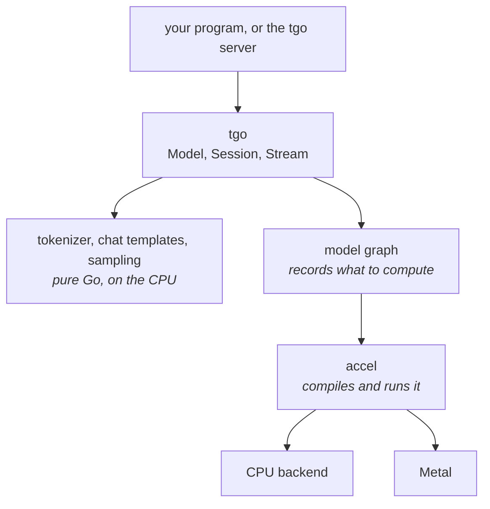

# Orientation

What tgo is, what it is made of, and what that means for you as someone running
a model.

## One binary

tgo builds with `CGO_ENABLED=0`. There is no C++ runtime, no Python, no vendor
SDK, and no shared library to match against your driver. You cross-compile it
the way you cross-compile any Go program, and the result runs on a machine with
nothing installed on it.

That is the whole reason to choose tgo over a wrapper around llama.cpp or vLLM.
If you are already running Python happily, vLLM is faster and more complete
today, and you should use it.

## What runs where

Three things are worth knowing about this picture.

**The text layer never touches a GPU.** Tokenizing, rendering a chat template
and choosing the next token are ordinary Go running on the CPU. They are exact,
they are fast enough not to matter, and they behave identically on every
platform.

**The model is a graph, not a program.** tgo describes the computation once;
accel compiles it and runs it. That is why the same model runs on the CPU
backend and on Metal with no per-backend code — and why, when a backend is added
to accel, tgo gets it without changes.

**accel decides what is possible.** tgo writes no GPU code at all. Where you see
a limit in tgo — a maximum context length, a precision that is not offered — it
is almost always accel's limit, and it is written down with the reason in
[`../specs/010-conformance.md`](../specs/010-conformance.md).

## Speaking to it

tgo serves three wire APIs on top of the same engine, so most clients work
unchanged:

| you send | route |
| --- | --- |
| OpenAI Chat Completions | `/v1/chat/completions` |
| Anthropic Messages | `/v1/messages` |
| OpenAI Responses | `/v1/responses` |

They are translated through one neutral request shape rather than handled
separately, so a feature works the same way whichever you use, and a field one
API has and another lacks is reported rather than dropped quietly.

## Backends

| backend | where | status |
| --- | --- | --- |
| CPU | everywhere | accel: working |
| Metal | Apple silicon | accel: working |
| Vulkan | Linux, Windows | accel: designed, unbuilt |
| D3D12, WebGPU | | accel: designed, unbuilt |

tgo picks the best available by default, and you can force one.

## Precision, and why it is chosen for you by default

A model has to fit in memory. Roughly:

| stored as | bytes per parameter | a 4B model |
| --- | --- | --- |
| f16 | 2 | 8 GB |
| int8 | ~1.06 | 4.3 GB |

int8 costs some accuracy, by a bounded amount that tgo measures rather than
assumes. Above about 8 GB of weights, f16 stops being an option on the machines
tgo targets, so int8 is not an optimisation there — it is the only way the model
loads.

tgo chooses by what fits and **prints which it chose**. A quietly quantized
model is a quietly different model, so it is never silent, and it is always
overridable.

## The KV cache, which is the other half of your memory

Every token you generate adds to a cache the model reads back on the next step.
It is proportional to the context length you ask for, not to the context you
use — so asking for a 32k context reserves 32k worth of memory whether or not
your conversation gets there.

tgo defaults to a modest context and **tells you what a larger one costs before
allocating it**. The arithmetic is in
[`../specs/005-kv-cache.md`](../specs/005-kv-cache.md) if you want to plan
capacity.

## What tgo will not do

- **Guess.** A model it does not recognise is refused with the list of what it
  knows, rather than run through a generic path that produces fluent nonsense.
- **Truncate your context.** If a conversation exceeds the cache, tgo says so.
  It does not silently drop the beginning.
- **Ignore a request field.** A setting that would change the answer is refused
  by name. One that cannot change the answer runs anyway, and tgo tells you it
  could not honour it, in a response header rather than in silence.

## Where to go next

- [`../specs/011-sequencing.md`](../specs/011-sequencing.md) — what is finished.
- [`../specs/000-decisions.md`](../specs/000-decisions.md) — the ten decisions
  the whole thing rests on, each with what was rejected and why.
