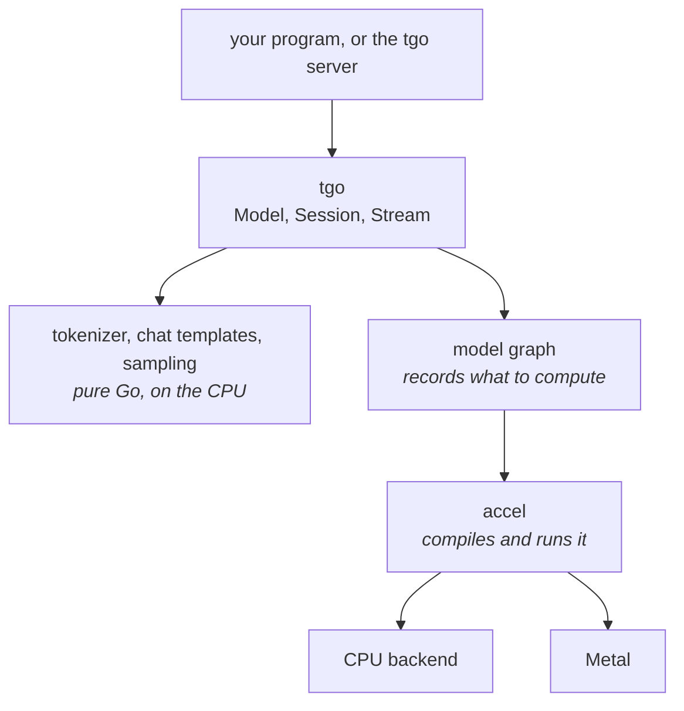

# Orientation

What tgo is, what it is made of, and what that means for you as someone running
a model.

## One binary

tgo builds with `CGO_ENABLED=0`. There is no C++ runtime, no Python, no vendor
SDK, and no shared library to match against your driver. You cross-compile it
the way you cross-compile any Go program, and the result runs on a machine with
nothing installed on it.

That is the whole reason to choose tgo over a wrapper around llama.cpp or vLLM.
If you are already running Python happily, vLLM is faster and more complete
today, and you should use it.

## What runs where

Three things are worth knowing about this picture.

**The text layer never touches a GPU.** Tokenizing, rendering a chat template
and choosing the next token are ordinary Go running on the CPU. They are exact,
they are fast enough not to matter, and they behave identically on every
platform.

**The model is a graph, not a program.** tgo describes the computation once;
accel compiles it and runs it. That is why the same model runs on the CPU
backend and on Metal with no per-backend code — and why, when a backend is added
to accel, tgo gets it without changes.

**The layer below decides what is possible.** tgo writes no GPU code at all, so
a limit you meet — a precision that is not offered, a feature that is not there
yet — is usually accel's limit rather than a shortcut tgo took. Every one of
them is written down with its reason and its cost, so a limit is something you
can plan around instead of something you discover.

## Speaking to it

tgo serves three wire APIs on top of the same engine, so most clients work
unchanged:

| you send | route |
| --- | --- |
| OpenAI Chat Completions | `/v1/chat/completions` |
| Anthropic Messages | `/v1/messages` |
| OpenAI Responses | `/v1/responses` |

They are translated through one neutral request shape rather than handled
separately, so a feature works the same way whichever you use, and a field one
API has and another lacks is reported rather than dropped quietly.

## Backends

| backend | where | status |
| --- | --- | --- |
| Metal | Apple silicon | **works.** About 18 tokens a second on a 0.6B model, with a 170ms wait for the first |
| CPU | everywhere | **works, and is currently very slow** — minutes per token rather than a fraction of a second. The compute layer below runs each piece of work in turn rather than in parallel. Use it for correctness, not for speed |
| Vulkan | Linux, Windows | accel: designed, unbuilt |
| D3D12, WebGPU | | accel: designed, unbuilt |

tgo picks the best available by default, and you can force one with
`--device cpu` or `--device metal`.

The CPU gap is in the compute layer rather than in tgo, it is reported upstream,
and nothing about how you use tgo changes when it lifts. It is stated here
because a framework that is quiet about being slow is wasting your afternoon.

## Precision, and why it is chosen for you by default

A model has to fit in memory. Roughly:

| stored as | bytes per parameter | a 4B model |
| --- | --- | --- |
| f16 | 2 | 8 GB |
| int8 | ~1.06 | 4.3 GB |

int8 costs some accuracy, by a bounded amount that tgo measures rather than
assumes. f16 sits between the two and is available for every weight, including
the embedding table. Above about 8 GB of weights, f16 stops being an option on the machines
tgo targets, so int8 is not an optimisation there — it is the only way the model
loads.

tgo chooses by what fits and **prints which it chose**. A quietly quantized
model is a quietly different model, so it is never silent, and it is always
overridable.

## The KV cache, which is the other half of your memory

Every token you generate adds to a cache the model reads back on the next step.
It is proportional to the context length you ask for, not to the context you
use — so asking for a 32k context reserves 32k worth of memory whether or not
your conversation gets there.

tgo defaults to a modest context and **tells you what a larger one costs before
allocating it**, so you find out when you ask rather than when it fails.

To plan capacity, the cache costs about **144 KB per token** for a 4B model, on
top of the weights:

| context you ask for | cache |
| --- | --- |
| 2048 | 0.3 GB |
| 4096 | 0.6 GB |
| 8192 | 1.2 GB |
| 32768 | 4.8 GB |

A larger model has proportionally more layers and heads, so scale it by the
model's size.

tgo pages this memory rather than reserving a fixed block per conversation, so a
short conversation on a server configured for long ones only costs what it
actually uses.

## Prompt caching

Most of what you send is usually the same as last time: a system prompt, tool
definitions, the earlier turns of a conversation. tgo remembers the work it
already did for that shared beginning and skips it — both within a conversation
and across separate requests that share a system prompt.

You do not ask for this and you do not annotate anything. It happens when the
beginning of your prompt matches one tgo has seen, and the saving is
proportional to how much matches — for a long system prompt and a short
question, most of the wait.

Two things worth knowing:

- **It is not a response cache.** The model still generates. Only the reading of
  your prompt is skipped, so the same question can still get a different answer.
- **Sharing has a scope, and you choose it.** By default a tgo process shares
  this work across every request it serves, which is what you want when the
  process is yours. If you put many people's conversations through one tgo, set
  the scope to `session` — a request can then only reuse work from its own
  conversation. Otherwise a fast reply tells someone that another person
  recently sent a similar prompt.

## Which models

tgo targets the **Qwen3 dense** family — 0.6B, 1.7B, 4B, 8B, 14B, 32B — read
directly from a Hugging Face safetensors checkpoint.

The newer Qwen3.5 and Qwen3.8 models are a different shape: three of every four
layers use linear attention rather than the softmax attention everything else
uses, so they need a piece the compute layer does not have yet. They are a
target and they are not close, and this page will say so until they run.

## What tgo will not do

- **Guess.** A model it does not recognise is refused with the list of what it
  knows, rather than run through a generic path that produces fluent nonsense.
- **Truncate your context.** If a conversation exceeds the cache, tgo says so.
  It does not silently drop the beginning.
- **Ignore a request field.** A setting that would change the answer is refused
  by name. One that cannot change the answer runs anyway, and tgo tells you it
  could not honour it, in a response header rather than in silence.

## Where to go next

- [The documentation index](README.md) — the guides, and when each arrives.
- If you want to know *why* tgo is built the way it is, the design lives in
  [`../specs/`](../specs/). It is written for people changing tgo rather than
  using it, and you should not need it to run a model.
