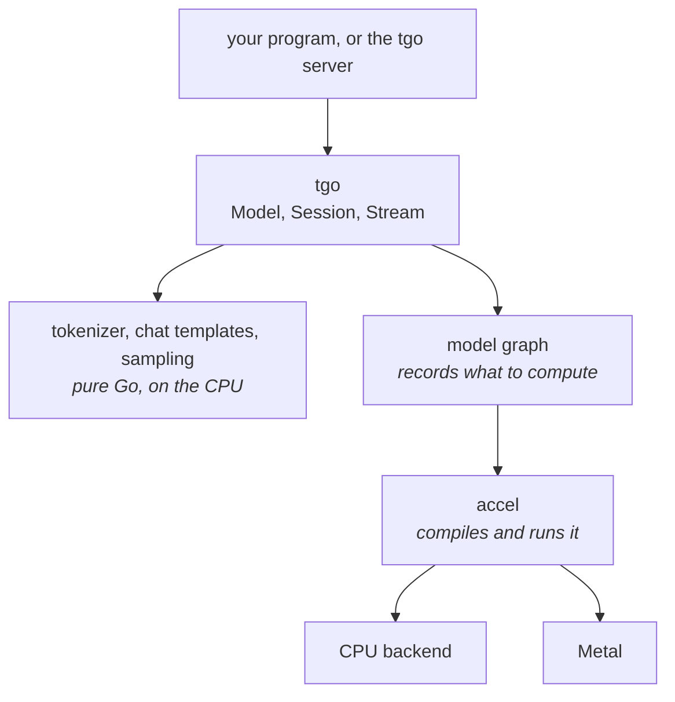

# Orientation

What tgo is, what it is made of, and what that means for you as someone running
a model.

## One binary

tgo builds with `CGO_ENABLED=0`. There is no C++ runtime, no Python, no vendor
SDK, and no shared library to match against your driver. You cross-compile it
the way you cross-compile any Go program, and the result runs on a machine with
nothing installed on it.

That is the whole reason to choose tgo over a wrapper around llama.cpp or vLLM.
If you are already running Python happily, vLLM is faster and more complete
today, and you should use it.

## What runs where

Three things are worth knowing about this picture.

**The text layer never touches a GPU.** Tokenizing, rendering a chat template
and choosing the next token are ordinary Go running on the CPU. They are exact,
they are fast enough not to matter, and they behave identically on every
platform.

**The model is a graph, not a program.** tgo describes the computation once;
accel compiles it and runs it. That is why the same model runs on the CPU
backend and on Metal with no per-backend code — and why, when a backend is added
to accel, tgo gets it without changes.

**The layer below decides what is possible.** tgo writes no GPU code at all, so
a limit you meet — a precision that is not offered, a feature that is not there
yet — is usually accel's limit rather than a shortcut tgo took. Every one of
them is written down with its reason and its cost, so a limit is something you
can plan around instead of something you discover.

## Speaking to it

tgo serves three wire APIs on top of the same engine, so most clients work
unchanged. Start it with `tgo serve <model-dir>`:

| you send | route |
| --- | --- |
| OpenAI Chat Completions | `/v1/chat/completions` |
| Anthropic Messages | `/v1/messages` |
| OpenAI Responses | `/v1/responses` |

They are translated through one neutral request shape rather than handled
separately, so a feature works the same way whichever you use.

**Ask for a JSON schema and you get one.** `response_format` on Chat
Completions, `output_format` on Messages and `text.format` on Responses all
reach the same machinery: at every step the tokens that could not continue a
document matching your schema are given probability zero, so the answer parses
and matches without a retry loop. A schema tgo cannot turn into that constraint
is refused with the keyword that stopped it and why -- a `minimum`, for
instance, is arithmetic on a value, and the machine counts characters -- so you
learn it when you send the schema rather than from output that quietly ignored
half of it.

**A setting tgo cannot honour is never dropped quietly.** One that would change
the answer — asking for four completions at once, say — is refused by name, with
the reason. One that cannot change the answer runs anyway and comes back listed
in an `X-Tgo-Loss` response header, so you can see what was ignored without
reading the source.

The server binds to localhost. Exposing it needs an explicit flag, and it says
plainly that it has no authentication when you do.

## Backends

| backend | where | status |
| --- | --- | --- |
| Metal | Apple silicon | **works.** About 18 tokens a second on a 0.6B model, with a 170ms wait for the first |
| CPU | everywhere | **works, and is currently very slow** — minutes per token rather than a fraction of a second. The compute layer below runs each piece of work in turn rather than in parallel. Use it for correctness, not for speed |
| Vulkan | Linux, Windows | accel: designed, unbuilt |
| D3D12, WebGPU | | accel: designed, unbuilt |

tgo picks the best available by default, and you can force one with
`--device cpu` or `--device metal`.

The CPU gap is in the compute layer rather than in tgo, it is reported upstream,
and nothing about how you use tgo changes when it lifts. It is stated here
because a framework that is quiet about being slow is wasting your afternoon.

## Precision, and why it is chosen for you by default

A model has to fit in memory. Roughly:

| stored as | bytes per parameter | a 4B model | a 27B model |
| --- | --- | --- | --- |
| f16 | 2 | 8 GB | 50 GB |
| int8 | ~1.06 | 4.3 GB | 27 GB |
| int4 | ~0.53 | 2.2 GB | 13 GB |

Each step down costs some accuracy, by a bounded amount tgo measures rather than
assumes. Above about 8 GB of weights f16 stops being an option on the machines
tgo targets, so int8 is not an optimisation there — it is the only way the model
loads. int4 is that same sentence one size up: a 27B model does not fit a 24 GB
card at int8 and does at int4.

**tgo will not choose int4 for you unless int8 does not fit.** Unlike the step
from f16 to int8, the step to int4 is not uniformly a small loss: it does better
than int8 on some weights and worse on others, so picking it to save memory you
were not short of is a trade you did not ask for. Ask for it deliberately when
you need it.

tgo chooses by what fits and **prints which it chose**. A quietly quantized
model is a quietly different model, so it is never silent, and it is always
overridable.

One weight does not shrink at int4: the embedding table, which the model reads a
row at a time rather than multiplying against. It stays at int8 while everything
else packs, which is what other quantizers do as well and costs little — it is
read once per token.

## The KV cache, which is the other half of your memory

Every token you generate adds to a cache the model reads back on the next step.
It is proportional to the context length you ask for, not to the context you
use — so asking for a 32k context reserves 32k worth of memory whether or not
your conversation gets there.

tgo defaults to a modest context and **tells you what a larger one costs before
allocating it**, so you find out when you ask rather than when it fails.

To plan capacity, the cache costs about **144 KB per token** for a 4B model, on
top of the weights:

| context you ask for | cache |
| --- | --- |
| 2048 | 0.3 GB |
| 4096 | 0.6 GB |
| 8192 | 1.2 GB |
| 32768 | 4.8 GB |

A larger model has proportionally more layers and heads, so scale it by the
model's size.

**`--prefix-cache process` halves it**, to about 72 KB per token, because the
shared pool stores the cache at half the width. That is not quality you are
trading away: what gets narrowed are *inputs* to the attention arithmetic, and
the arithmetic itself still adds up at full width — the same trade the weights
already make. What you get is twice the tokens in the same memory: twice the
conversations kept warm, and more room to run several at once.

Each conversation reserves a whole block of it, sized by the context you asked
for, not by the context it uses. `tgo serve` reserves that block for several
conversations at once, at startup, and holds it until the process exits: see
[Session pooling](#session-pooling-and-what-it-costs) below for the number and
what decides it.

## Prompt caching

Most of what you send is usually the same as last time: a system prompt, tool
definitions, the earlier turns of a conversation. tgo can remember the work it
already did for that shared beginning and skip it, so a follow-up question pays
for its own new tokens and not for the transcript in front of them.

The saving is proportional to how much matches. For a long conversation and a
short question, that is most of the wait before the first token.

Three things to know before you turn it on:

- **It is off unless you ask for it**, with `--prefix-cache` on `tgo serve` or
  `tgo.WithPrefixCache` in the library. Reusing the work changes the arithmetic
  slightly: floating point addition is not associative, so an answer computed
  partly from a cache is the same answer in distribution rather than the same
  bytes. That is a trade you should make deliberately.
- **It is not a response cache.** The model still generates. Only the reading of
  your prompt is skipped, so the same question can still get a different answer.
- **Sharing stops at the conversation.** A request can reuse only work done for
  a conversation it continues. Two people who send the same system prompt pay
  for it twice, which is slower and is also why one of them cannot measure that
  the other is there.

If something in front of tgo multiplexes several people through one process, put
a `cache_salt` on each request — any opaque string that identifies the caller.
A request carrying a salt can reuse only work done for requests carrying the
same one, and a request carrying none can reuse only work done for requests
carrying none. It fails closed: a caller who sets nothing shares with nobody
rather than with everybody.

## Session pooling, and what it costs

Reuse needs somewhere to keep the work. `tgo serve` keeps a fixed pool of
conversations, and routes each request to the one already holding the longest
matching beginning.

`--sessions N` sets the size. It is two numbers at once:

- **how many requests generate at the same time.** Over that, requests queue,
  and past the queue they are refused with 429 and a `Retry-After`.
- **how many conversations keep their cache between turns.** A conversation's
  next turn reuses its own work if fewer than N *other* conversations were
  served since its last turn. Below that, it starts again from nothing.

The second meaning goes away under `--prefix-cache process`. There the cached
work lives in one pool that every conversation draws from, so which slot a
request lands on stops deciding what it reuses, and `--sessions` is concurrency
alone. That is usually what you want: the pool is the same memory the per-slot
caches were, held once instead of once each, and a conversation's next turn
finds its own work in it however many others were served in between.

The cost is memory, and it is not conditional. All N conversations' caches are
reserved when the process starts and held until it exits, whether or not a
second request ever arrives. So `--sessions 8` at a 32k context on a 32B model
is eight times the table above, resident for the life of the process, and the
server can no longer run one large request that would not fit beside seven idle
peers.

`tgo serve` prints the whole calculation at startup: what one session reserves,
what N of them come to, what is left after the weights, and how many the device
would hold. If you ask for more than fits, it says so then rather than failing
under load.

## Running several conversations in one pass

Everything above gives each conversation its own forward pass. Reading a model's
weights is most of what a step costs, and a step that produces one token reads
all of them — so two conversations stepping together read those weights **once**
and produce two tokens. That is where a server's throughput comes from, and it
is why a busy server can be many times faster per token than an idle one.

The engine does this. `Model.NewScheduler` holds a fixed number of slots, admits
a conversation into one, and puts every slot's next token into a single pass. A
long prompt does not stall the conversations decoding beside it: its next chunk
rides along in the same pass.

Two things to know before you build on it.

**`tgo serve` does not use it yet.** The server pools conversations and gives
each request its own pass, so its throughput is close to what one conversation
gets. Connecting the two is the next piece of work, and it needs a decision
about where sampling runs that has a measurement attached rather than an opinion.

**A slot reserves room for its answer, not just its prompt.** A conversation
admitted on its prompt alone is one that may not be able to grow, and a server
full of those cannot finish anything. So admission asks for the prompt *and* a
reserve, together or not at all, and refuses when the two do not fit. A refusal
you can see beats a server that quietly admits fewer requests than it could.

## Which models

tgo targets the **Qwen3 dense** family — 0.6B, 1.7B, 4B, 8B, 14B, 32B — read
directly from a Hugging Face safetensors checkpoint.

The newer Qwen3.5 and Qwen3.8 models are a different shape: three of every four
layers use linear attention rather than the softmax attention everything else
uses. The compute layer has both of the pieces those layers need, and tgo can
now build each one and check it against a reference. What it cannot yet do is
assemble them into a whole model, so these do not run. This page will say so
until they do.

## What tgo will not do

- **Guess.** A model it does not recognise is refused with the list of what it
  knows, rather than run through a generic path that produces fluent nonsense.
- **Truncate your context.** If a conversation exceeds the cache, tgo says so.
  It does not silently drop the beginning.
- **Ignore a request field.** A setting that would change the answer is refused
  by name. One that cannot change the answer runs anyway, and tgo tells you it
  could not honour it, in a response header rather than in silence.

## Where to go next

- [The documentation index](README.md) — the guides, and when each arrives.
- If you want to know *why* tgo is built the way it is, the design lives in
  [`../specs/`](../specs/). It is written for people changing tgo rather than
  using it, and you should not need it to run a model.
