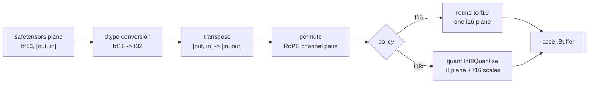
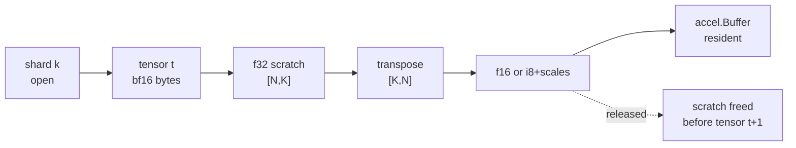

# Weights

A Hugging Face checkpoint and an accel buffer are further apart than they look.
This spec names each gap and who closes it.

## 1. What is on disk

A model directory:

```
config.json                      architecture, shapes, hyperparameters
tokenizer.json                   the BPE, see 002
tokenizer_config.json            the chat template, see 003
generation_config.json           default sampling policy, see 006
model.safetensors                one shard, or
model-00001-of-00003.safetensors + model.safetensors.index.json
```

A safetensors file is: an 8-byte little-endian header length $n$, $n$ bytes of
JSON, then the tensor bytes. The JSON maps a tensor name to `{dtype, shape,
data_offsets: [begin, end]}`, both offsets relative to the end of the header.

The format is trivially parseable and that is the point of choosing it. It is
also **untrusted input** — a checkpoint is a file someone downloaded. §6 states
what the reader refuses.

### 1.1 The header grammar

```
file    := u64le(n) json[n] data[...]
json    := { name: entry, ..., "__metadata__": {...}? }
entry   := { "dtype": D, "shape": [int...], "data_offsets": [begin, end] }
D       := "F64"|"F32"|"F16"|"BF16"|"I64"|"I32"|"I16"|"I8"|"U8"|"BOOL"
```

`begin` and `end` are relative to the end of the header, half-open, and in
bytes. `__metadata__` is a string map and is not a tensor; a reader that treats
it as one fails on every real checkpoint.

## 1.2 The Go surface

```go
package safetensors

// Open opens a file and parses its header. It reads no tensor data.
func Open(path string) (*File, error)

type File struct{ /* ... */ }

func (f *File) Names() []string
func (f *File) Entry(name string) (Entry, bool)
func (f *File) Bytes(name string) ([]byte, error)  // the raw plane, no conversion
func (f *File) Close() error

type Entry struct {
    DType DType
    Shape []int
    Begin, End int64
}

// Repo is a model directory: config, tokenizer, and one or more shards.
func OpenRepo(dir string) (*Repo, error)

type Repo struct{ /* ... */ }

func (r *Repo) Config() json.RawMessage
func (r *Repo) Tensor(name string) (Entry, *File, bool)  // resolves through the index
func (r *Repo) Names() []string
```

`Bytes` returns the raw plane. **Conversion is not here**: it belongs to the
loader, which knows the target precision and the transpose flag, and keeping
them apart means the reader is testable against a synthesised header with no
model and no accel.

The reader holds a descriptor, not a mapping. `Bytes` reads its plane with
`ReadAt` at the entry's offset, so there is no shared file offset to race on and
several tensors may be read at once. `Config` returns nil, not an error, when
`config.json` is absent: the caller that needs it reports its absence better
than the reader can.

## 1.3 The loader's surface

`safetensors` reads. `weights` converts and uploads, and this is what it
exports:

```go
package weights

// Load converts and uploads every declared tensor, shard by shard.
func Load(dev *accel.Device, repo *safetensors.Repo, decls []Tensor, opts Options) (*Set, error)

// Tensor declares one tensor: where it comes from and what happens to it.
type Tensor struct {
    Name      string     // the name in the checkpoint
    As        string     // the key it is filed under; defaults to Name
    Transpose bool       // [out, in] -> [in, out] (§4)
    HeadDim   int        // the rotary width; zero means no permutation (§2.1)
    Gathered  bool       // read a row at a time, so it caps at Int8 (§5.3)
    Precision Precision  // overrides the policy for this tensor
}

type Options struct {
    Policy        Precision  // F16, Int8, Int4 or Auto; the zero value is Auto
    Budget        int64      // what Auto compares against
    MaxSaturation float64    // the f16 overflow threshold (001-D2)
}

const DefaultMaxSaturation = 1e-5   // one element in 100,000
const RefuseAnySaturation  = -1.0   // any saturation at all fails the load

type Set struct{ /* ... */ }        // owns its device memory

func (s *Set) Get(name string) (Value, bool)
func (s *Set) Names() []string
func (s *Set) Report() Report
func (s *Set) Close() error

// Value is one loaded tensor on the device.
type Value struct{ /* ... */ }
func (v Value) Bytes() int64

// Report is what the load decided and what it cost.
type Report struct {
    Chosen                          Precision
    F16Bytes, Int8Bytes, Int4Bytes  int64  // what each policy would have cost
    Budget                          int64  // what they were compared against
    Bytes                           int64  // what was actually loaded
    Saturated                       int
    Mapped                          bool   // did the conversion write into device memory
}
```

Four of these carry a rule rather than a value:

- **`As` exists because one plane can serve two ports.** A checkpoint with
  `tie_word_embeddings` ships no `lm_head.weight`, so the LM head *is*
  `model.embed_tokens.weight` transposed while the embedding table is the same
  plane untransposed — two declarations, one name in the file, two values on the
  device ([004-D7](004-model-graph.md)).
- **`Gathered` is a property of the tensor, not a policy**
  ([§5.3](#53-the-embedding-table-cannot-pack)). It is declared here so that one
  rule decides both the footprint `tgo info` prints and the load itself; two
  callers pinning it separately is two rules that have to agree.
- **`Report` carries what was *not* chosen.** `F16Bytes`, `Int8Bytes` and
  `Int4Bytes` are the numbers `Auto` compared, so a caller can see the decision
  rather than the outcome. `Bytes` is the sum of the loaded values and is
  **not** the pool footprint, which is larger by each buffer's rounding
  ([§7.2](#72-what-the-arena-reserves)).
- **`Mapped` is a different promise, not a detail.** False means the device has
  no unified memory and every tensor was staged through the queue, which changes
  §7's peak-host claim ([001-D9](#decision-record)).

## 2. What accel wants

A `tensor.Weight` port bound to an `accel.BufferView` of a specific dtype, in
the shape the operator declared. Four things differ from the file:



Four conversions, not three. §3, §4 and §5 state the dtype, the transpose and
the precision step. The rotary channel permutation between them applies
[004-D9](004-model-graph.md)'s convention to the weight, and it runs **after the
transpose and before quantization**: `quant.Int8Quantize` blocks over the
flattened matrix, so permuting afterwards moves every weight away from the scale
computed for it. A norm gain takes none of these edges. `nn.Graph.Gain` reads
f32, which the loader has no output for, so `gains.go` widens and permutes gains
itself and uploads them f32.

### 2.1 The permutation, which nothing downstream checks

accel's RoPE rotates **adjacent** channel pairs $(2i, 2i+1)$; Hugging Face
stores a head's channels so that $i$ pairs with $i + d_h/2$
([004-D9](004-model-graph.md)). The loader rewrites each head in place:

$$\text{out}[2i] = \text{in}[i], \qquad \text{out}[2i+1] = \text{in}[i + d_h/2],
\qquad 0 \le i < d_h/2$$

`Tensor.HeadDim` carries $d_h$ and **zero means no permutation**. The head count
is not passed: the permutation runs over every $d_h$-wide segment of the plane,
so one implementation is correct for `q_proj` ($H$ segments), `k_proj` ($H_{kv}$
segments) and a `q_norm`/`k_norm` gain (one segment) with no caller telling it
which (`weights/convert.go:105`). Two things are refused rather than assumed: an
odd or non-positive $d_h$, because RoPE rotates pairs, and a last axis that is
not a multiple of $d_h$, because it does not divide into heads.

$d_h$ comes from the config's `head_dim` and is never derived. Qwen3-0.6B stores
`head_dim: 128` while `hidden_size / num_attention_heads` is 64, so a loader
that computes it is wrong on a real checkpoint ([004 §5](004-model-graph.md)).

**Set it on `q_proj`, `k_proj` and their norm gains, and nowhere else.**
`v_proj` and `o_proj` are not rotated. Attention's $q \cdot k^\top$ is invariant
under a permutation applied to both $q$ and $k$, so nothing downstream undoes
it — and nothing downstream *notices* it either. **accel refuses no mismatch**:
a permuted weight and an unpermuted one have the same shape and the same dtype,
so a graph binding either compiles and runs. Getting it wrong rotates the wrong
channel pairs and produces fluent text that loses coherence, with no error
anywhere. That is why the flag is declared per tensor by the model
([001-D4](#decision-record)) rather than matched on a name.

### 2.2 Norm gains take a different path, and it is a second copy

[004 §3](004-model-graph.md) declares a norm gain as an **f32** port —
`nn.Graph.Gain` writes `accel.F32` and takes no policy — and §2's pipeline ends
at f16 or int8. So `weights.Load` has no f32 output at all, and accel binds by
exact dtype: a gain that came through the loader fails at the first submission
with *"declared f32 and the bound view is f16"*.

The two packages therefore cannot be composed without a widening step between
them, and the engine is the first place they meet. `gains.go` widens and
permutes gains itself and uploads them f32. It carries a **second copy** of the
bf16→f32 widening and of §2.1's permutation, which is a real cost recorded here
rather than hidden: the copy that must not skip the permutation is this one,
because a `q_norm` gain scales the channels RoPE is about to rotate.

It is small — 113 gains in Qwen3-0.6B, 65536 floats, 256 KB against 1.4 GB of
projections — and it is the reason 198 tensors reach the loader rather than 311.

**Those bytes are not in `Report.Bytes`.** The report covers what `weights.Load`
uploaded, and the gains did not go through it. A reader adding up the report and
expecting the process's weight footprint is short by the gain plane.

## 3. dtype: bf16 to f32, exactly; f32 to f16, with a rule

bf16 to f32 is **exact and free**: bf16 is the top 16 bits of an f32, so the
conversion is a 16-bit left shift. No rounding, no loss, no table.

$$\texttt{f32bits} = \texttt{bf16bits} \ll 16$$

f32 to f16 is not free. f16 carries 5 exponent bits against bf16's 8, so the
representable magnitude range shrinks from about $3.4\times10^{38}$ to $65504$,
and bf16 values outside it exist. The rule:

- **Round to nearest, ties to even.** The same rule the hardware uses, so a
  weight converted here and a weight converted by a device `Cast` agree.
- **Overflow saturates to $\pm65504$ and is counted.** Not $\pm\infty$: one
  infinity in a weight matrix makes every output of that row `NaN`, and the
  failure appears many layers later as gibberish rather than as an error. A
  saturated weight is wrong by a bounded amount; an infinite one is fatal.
- **Subnormals flush to zero.** They are below $6\times10^{-8}$ and contribute
  nothing to a dot product against activations of order 1.

The loader **reports** the saturation count per tensor and fails the load if any
tensor saturates more than a threshold fraction of its weights, because that
means the checkpoint is not in the range f16 can hold and the int8 path is not a
fix for it either. Trained transformer weights are almost entirely within
$[-1, 1]$, so a nonzero count is a signal, not routine.

```
for each element w:
    f32 := bf16bits(w) << 16                    # exact
    if |f32| > 65504:  f16 := sign * 65504      # saturate, count++
    elif |f32| < 2^-14: f16 := 0                # flush subnormals
    else:              f16 := roundTiesToEven(f32)
```

The threshold is a fraction, not a count, because a 1.5-billion-element
embedding table and a 2560-element norm gain cannot share an absolute one.

**The pseudocode above has no NaN branch and the code does**, first
(`weights/convert.go:159`). Every comparison against a NaN is false, so a NaN
falling through would miss both magnitude tests and be re-encoded by the
rounding branch as a *finite* number — a weight that was undefined arriving as
an ordinary one. It returns a canonical quiet f16 NaN instead, and **does not
count against `MaxSaturation`**: saturation is a value that was too large and is
now wrong by a bounded amount, which a threshold can be set against. A NaN in
the file is a broken checkpoint and is not the thing that threshold measures.
Infinity takes the saturating branch, which is exactly the case a saturating
conversion exists to catch.

> This is the first thing to check when a converted model produces noise, and
> the reason the count is surfaced rather than logged at debug level.

## 4. Layout: every projection weight is transposed

Hugging Face stores a `nn.Linear` weight as `[out_features, in_features]` and
computes $y = x W^\top$. accel's `MatMul(x, w)` contracts `x[M, K]` against
`w[K, N]`. So every projection weight is transposed on load:

$$W_\text{file} \in \mathbb{R}^{N \times K} \;\longrightarrow\; W_\text{accel} \in \mathbb{R}^{K \times N}$$

Done once, at load, on the host. **Not** with `tensor.Transpose`: accel's view
operators reach elementwise operators only, and a strided view into `MatMul` is
refused rather than silently copied — which is the correct refusal and means the
transpose belongs on the host anyway.

Which tensors transpose is a property of the operator that consumes them, so it
is declared by the model builder ([004](004-model-graph.md)) rather than guessed
from the name. Norm gains and the embedding table do not transpose.

> The transpose changes which weights share a quantization block. In the file,
> 32 consecutive values are 32 input features of one output channel. After the
> transpose they are 32 output channels of one input feature. The error bound in
> §5 is measured after the transpose, on the blocks that actually exist.

## 5. Precision: the policy, and proving it

The policy is `f16`, `int8`, `int4`, or `auto`. `auto` takes **the widest form
that fits**, one step at a time: f16; int8 only where f16 misses the budget;
int4 only where int8 misses it as well; and the load fails where int4 misses it
too. [000 §5](000-decisions.md) states the rule for f16 and int8 only, so the
int4 step of the ladder is this spec's. The budget is `Options.Budget`, which
defaults to the device's `MaxPoolBytes` — a cap on one allocation rather than a
report of free memory, because accel exposes no such report. The choice is
**printed**, never silent.

### 5.1 Three forms, and what each costs

| form | planes | bytes/weight | 27B resident |
| --- | --- | ---: | ---: |
| f16 | the matrix | 2.0 | 50.3 GiB |
| int8 | i8 codes at `[K, N]`, one f16 scale per 32 (`quant.Int8Block`) | 1.0625 | 26.7 GiB |
| int4 | u32 codes (eight per word), an f16 scale **and an f16 zero** per 128 (`quant.Int4Group`) | 0.53125 | 13.4 GiB |

**The zero point is what makes four bits usable**, and it is why int4 is three
planes rather than two. int8 is symmetric: a scale spends 255 levels over a
block's peak and that is close enough. At four bits there are fifteen, and they
have to be spent where the weights actually *are* rather than symmetrically
about zero — so a group carries its minimum as well
(accel [048](https://github.com/golang-design/accel/blob/main/specs/048-int4.md) §1).

The group is 128 and not 32 for a reason that only appears at four bits, and it
is why the third row of that table is **exactly** half the second rather than
merely smaller.

Halving the payload doubles the metadata's *share* of it: a scale per 32 is 6.2%
at int8 and would be 12.5% at int4. So the group doubles as the payload halves,
and 2 bytes per 32 becomes 4 bytes per 128 — $0.0625 \to 0.03125$. Both terms
halve, so the total does:

$$1 + \tfrac{2}{32} = 1.0625 \quad\longrightarrow\quad \tfrac{1}{2} + \tfrac{4}{128} = 0.53125$$

### 5.2 Narrowing is a last resort, and int4 especially

`auto` reaches for int4 **only when int8 does not fit.** accel's own tests show
int4 beating int8 on a group of weights clustered away from zero and losing on
one centred on it, so it is not uniformly better: a rule that preferred it would
trade accuracy for memory nobody asked to save. The case it exists for is the
one where the alternative is not loading at all.

### 5.3 The embedding table cannot pack

It is **gathered**, a row at a time, rather than contracted against — and accel
registers no int4 gather: `QuantGatherRows` reads a quant plane and a scale
plane and has no three-plane form. So a load at int4 caps the embedding at int8.

That is declared per tensor (`weights.Tensor.Gathered`) rather than discovered
as a refusal at record time, and it is declared in the **loader** rather than by
each caller: the footprint `tgo info` prints and the load itself are computed by
two different pieces of code, and a cap applied in one of them prints a number
the device never has.

A tied checkpoint still packs its LM head, which is the same file tensor in the
other layout ([004-D7](004-model-graph.md)) and is a `MatMul`.

Per-tensor override exists for the case that matters: the embedding table and
the LM head are the largest tensors in a small model and the most sensitive to
quantization, and holding those two at f16 while everything else is int8 is a
common and defensible point.

> Until 2026-08-24 that recommendation named a configuration accel refused:
> `GatherRows` read f32 only, so an f16 embedding was not expressible and the
> choice was 1.56 GB at f32 or int8 with nothing between. tgo filed it as part
> of [accel#11](https://github.com/golang-design/accel/issues/11) and it landed
> ([C14](010-conformance.md)). The middle width now exists.

### 5.4 The bound is measured, not assumed

`quant.Int8ErrorBound` gives, for a dot product, the distance from the
unquantized result, and `quant.Int4ErrorBound` is the same statement one width
down — rounding to nearest gives at most half a step, and the step is a group's
*range* over fifteen where int8's is a peak over 127. Both take the inputs
rather than returning a constant, because a per-group figure bounds a dot
product only where the caller says which group each term came from.

Nothing calls either bound during a load. The assertion

$$\left|\hat{y} - y\right| \le \texttt{Int8ErrorBound}(x, s)$$

is made at test time, over a synthesised plane put through the loader's own conversion, and by
the conformance suite ([010](010-conformance.md)), which asserts one layer's
output against the f16 path within that bound and owns the tolerance. Asserting
against a hand-tuned tolerance would pass for the wrong reason.

**The loader does not sample blocks and check the bound at load time, and
[001-D10](#decision-record) says it should not.** The bound is a statement about
a *dot product*: it takes the inputs, because a per-group figure bounds a result
only where the caller says which group each term came from. A loader has the
weights and none of the activations, so what it could check is that quantizing
and dequantizing round-trips within half a step — which is arithmetic on the
quantizer, true by construction, and re-measured per tensor on every load for a
model of hundreds. The question worth answering is what the bound costs a
*layer's output*, and that is the conformance suite's, where the activations
are.

**What a green bound does not say.** [010 §3](010-conformance.md) asks for
quantization error on *real* blocks, and a tier-1 fixture's weights are
synthetic. `Int4Quantize` spends a group's codes over that group's range, so
weights drawn from one distribution — with no outlier channel to stretch it —
flatter the scheme, and trained transformer weights have outliers. The number
that decides whether int4 is usable *for a model* is a tier-3 measurement
against a checkpoint, and it has not been taken.

## 6. Refusals

The reader treats the file as hostile. It refuses, with the tensor name:

| condition | why |
| --- | --- |
| header length exceeds the file | truncated or crafted |
| `data_offsets` outside the data region, or `end < begin` | out-of-bounds read |
| two tensors with overlapping byte ranges | aliasing that no writer produces |
| shape product times dtype width ≠ `end - begin` | the header disagrees with itself |
| an unknown dtype string | silently misreading bytes is worse than stopping |
| a name in `index.json` with no shard, or a shard with no index entry | an incomplete download |
| the header length exceeds `maxHeaderBytes`, 100 MiB | the 8-byte length prefix is read before anything else is known, so an unbounded one over a sparse file turns one 8-byte read into an arbitrary allocation. It is a variable so a test can lower it rather than write a large file |
| the file is shorter than the 8-byte prefix | there is no header to read, and this is checked before the read rather than by it |
| an entry that is not valid JSON, `data_offsets` with other than two elements, or a negative shape dimension | a malformed entry, named rather than skipped |
| a shape whose product, or whose product times the dtype width, overflows `int` | on a 32-bit platform a crafted header otherwise wraps to a small allocation and a large read. Two checks, not one: the element count can fit and the byte count not |
| a `weight_map` value that is not a plain file name in the model directory | a path escape. `../../etc/...` in an index is a checkpoint reading a file the operator did not offer |
| `weight_map` empty or absent | an index that resolves nothing |

Every one of these is a unit test over a synthesised header, and none of them
needs a model.

## 7. Memory: what is resident and when

Weights are read shard by shard, converted, uploaded, and the host copy
released, so peak host memory is one shard plus one converted tensor rather than
the whole model. The device holds the whole model, which is the number in
[000 §5](000-decisions.md).



Peak host bytes were bounded by

$$\max_t \big(\, 4 \cdot |t| \;+\; 4 \cdot |t| \,\big) = 8 \cdot \max_t |t|$$

— the f32 scratch plus the transposed f32 scratch — which for Qwen3-4B's
embedding table is about **3.1 GB** of host scratch for a model occupying 4 GB
on the device.

**That bound is an argument, not an assertion.** It is read off the allocations
the conversion makes, and nothing measures the process's peak resident bytes
across a load. A Go heap can hold a released scratch plane until the next
collection, so the observed peak is at or above the bound and by an amount
nobody has taken. Measuring it needs a real checkpoint, which puts it with
[010 §3](010-conformance.md)'s tier-3 numbers rather than here.

### 7.1 The final copy no longer exists

tgo asked accel for a buffer *over* host memory the caller owns
([accel#7](https://github.com/golang-design/accel/issues/7)). accel declined
that shape, correctly — a buffer over caller memory is a promise about a
lifetime accel cannot see — and pointed the problem the other way:

```go
func (b *Buffer) Access(fn func([]byte) error) error
```

The caller writes **into** device memory, for the duration of the call, on a
buffer from a host-visible pool. So the converted plane is produced directly
where it will live:

```
for each tensor t:
    buf := device buffer for t
    buf.Access(func(dst []byte) error {
        return convert(shard[t], dst)   // bf16 -> f16 or int8, transposed, in place
    })
```

At f16 and int8, on a host-visible pool, the output buffer is gone from host
memory entirely and only the f32 working scratch for the transpose remains.
**This is a better answer than the one asked for**, and it is the kind of thing
worth recording: the request named a mechanism, and the mechanism it named was
the one with the hard problem in it.

Two cases still hold a host copy. At int4, `quant.Int4Quantize` returns the
codes, the scales and the zeros together, so all three exist as host slices
before they are written — one eighth of the plane plus 6.2% metadata, held once,
which is cheaper than calling the quantizer three times. On the staging path
below, the whole plane is built on the host and then re-read at the buffer's
dtype, which is exactly the copy this section removes on unified memory.

`Access` refuses on a device-local pool — reported rather than discovered — so
the loader allocates weight buffers from a shared pool and falls back to
`Queue.WriteBuffer` where it cannot, which is the honest shape on a discrete
GPU.

**The fallback carried f16 and i8 only until 2026-08-27.** An int4 load
allocates its codes as `accel.U32`, the staging path had no case for that dtype,
and nothing in the policy step stopped `auto` from choosing int4 there — so an
int4 load failed at the first tensor on every device without shared memory, which
is every discrete GPU this project targets and no machine it is tested on. It has
a `U32` case now (`weights/device.go:176`), and a test that stages every width a
weight is stored in. That second test is the one that would have caught it: its
complement said an unknown width is refused, and nothing said the known ones are
not, which "refuse everything" satisfies.

Remaining: the transpose still needs somewhere to put its output, since it is
not an in-place permutation for a non-square matrix. Tiling it would bound that
to a tile rather than a tensor. Not v0, and recorded so the number is not
mistaken for a floor.

**Open, and not resolved here:** whether accel can map a file-backed buffer
without a host copy at all. `accel.Buffer` is created from a descriptor and
written through a view; there is no import path today. It would remove the
largest transient allocation in the loader. Filed as a question against accel
001, not assumed.

### 7.2 What the arena reserves

The device side has four numbers, and each one is a consequence rather than a
tuning choice.

| | value | why |
| --- | --- | --- |
| pool chunk | 64 MiB (`weights/device.go:17`) | a pool per tensor is not an option — a device caps live allocations and a Qwen3-0.6B load is **311 buffers** — so the arena reserves a chunk and suballocates |
| granularity | 256 bytes (`:24`) | accel's suballocation granularity, from its `001-device-resources` §3.1. It is **not queryable**, so a pool sized to the exact byte total of its buffers runs out on the last one; every request is rounded to it before the arena decides whether the current pool has room |
| headroom | a sixteenth, plus one granularity (`:76`) | accel's suballocator rounds a request up to a size class *before* searching, so a request for a whole pool lands in the class above the one the pool's single free block sits in. A pool sized to exactly its contents can refuse them |
| growth | **a pool never grows** | so a tensor larger than what is left opens a new pool rather than extending one, and a pool larger than `MaxPoolBytes` is refused by name with both numbers |

Fragmentation is the allocator's business and the loader's answer to it is a
fresh pool: when a pool reports space and cannot hand it out contiguously,
`alloc` opens another rather than failing (`:88-93`).

**`Report.Bytes` is therefore not the pool footprint.** It sums the loaded
values; the pools are larger by each buffer's rounding to 256 bytes, by the
headroom, and by whatever the last chunk did not use.

**And `tgo info` states the footprint rule a second time.** `planeBytes`
(`cmd/tgo/info.go:192`) prices a norm gain at f32 under every policy, because
[§2.2](#22-norm-gains-take-a-different-path-and-it-is-a-second-copy) means a gain
never enters the quantized path — pricing one at f16 understates Qwen3-0.6B by
128 KiB. It also counts each declared **port** rather than each checkpoint
tensor, so a tied model pays for its embedding table twice
([004-D7](004-model-graph.md)); reporting parameters alone understates a tied
model by its largest tensor. Two places compute the same rule, and one test
pins that they agree.

## 8. What this spec does not do

Downloading. `tgo pull` is a Hugging Face client, and it is
[013](013-distribution.md) — cache layout, resumable range requests, and the
`.gitattributes`-shaped LFS pointers that a naive fetch returns instead of
weights. The loader here takes a local directory and nothing else.

## Outcome

Both packages this spec owns are built and tested, and every model load goes
through them (`model.go:406`). `safetensors` reads a local model directory, single-shard or index-plus-shards,
and refuses a malformed header by name; `weights` turns each plane into an accel
buffer at f16, int8, int4 or `auto`. The reader and the f16 and int8 loader
landed with Wave 2 on 2026-08-24, and int4 with Wave 10 on 2026-08-27
([011](011-sequencing.md)).

**What shipped**, section by section:

| section | what landed | where |
| --- | --- | --- |
| 1 | both directory layouts open, and the index resolves a name to a shard | `safetensors/repo.go:48` |
| 1.1 | the ten dtypes, `__metadata__` as a string map, half-open offsets past the header | `safetensors/safetensors.go:37`, `:133` |
| 1.2 | every listed signature, plus `File.Path` | `safetensors/safetensors.go:114`, `safetensors/repo.go:198` |
| 2 | the pipeline, as four conversions rather than three | `weights/weights.go:4` |
| 3 | the bf16 shift, round-ties-to-even, saturation counted per tensor, subnormals flushed, the load failed past a fraction | `weights/convert.go:40`, `:152`; `weights/weights.go:204` |
| 4 | the transpose on the host, declared per tensor and never inferred | `weights/convert.go:78`; `weights/weights.go:128` |
| 5 | the f16-int8-int4 ladder against a budget, and the choice printed | `weights/weights.go:445`, `:409` |
| 5.1 | three forms at 2.0, 1.0625 and 0.53125 bytes per weight | `weights/weights.go:268` |
| 5.2 | int4 only where int8 misses the budget | `weights/weights.go:505` |
| 5.3 | a gathered tensor caps at int8, declared in the loader and mirrored by `tgo info` | `weights/weights.go:154`, `:542`; `cmd/tgo/info.go:202` |
| 5.4 | the bound asserted by tests and by conformance, not by the loader | `weights/convert_test.go:515`; `internal/conformance/tolerance.go:101` |
| 6 | all six rows refuse by name, and eight more the table does not list | `safetensors/safetensors.go:147`, `:245`; `safetensors/repo.go:159`, `:188` |
| 7 | one tensor at a time, the raw plane dead before the transpose allocates | `weights/weights.go:551`, `:616` |
| 7.1 | `Buffer.Access` on a shared pool, `Queue.WriteBuffer` otherwise | `weights/device.go:137`, `:152` |
| 8 | the loader takes a local directory; nothing here imports `net/http` | `safetensors/repo.go:48` |

**What diverged** from the design, and why the code is right:

- **The `Auto` ladder's last rung is taken by a test since 2026-08-27.** Only
  the refusals were covered — that auto never prefers int4 to int8, and that a
  budget below every width fails by name — so the one case int4 exists for, a
  model that misses at int8 and fits at int4, never ran end to end.
  `TestAutoWalksDownToInt4AndLoads` prices the three widths through the loader
  rather than restating the arithmetic, then sets a budget between two of them.

- §1.2 said `Open` maps a file. It opens one and reads each plane with `ReadAt`.
  Positional reads carry no shared file offset, so several tensors may be read
  at once, and a mapping would have bought nothing the reader needs.
- §2 counted three conversions. There are four. The rotary channel permutation
  runs between the transpose and quantization, because quantizing first would
  scatter each weight away from its scale.
- §5's budget is the device's `MaxPoolBytes`, which caps one allocation rather
  than reporting free memory. accel exposes no free-memory report, so "the
  widest form that fits" is stated against the largest single allocation the
  device admits, and `Options.Budget` exists for a caller who knows better.
- §5.4 described a load-time sampled check. It was never written. The bound is
  asserted over a round trip in `weights/convert_test.go:515` and by
  `internal/conformance`, which is where a derived tolerance belongs.
- §7's peak-host-bytes figure is an argument, not a measurement. The
  shard-by-shard discipline is real and the arithmetic holds, but no test reads
  peak host memory back.
- §7.1 said the converted plane never exists on the host. True at f16 and int8
  on a host-visible pool. At int4 the codes, scales and zeros are host slices
  first, because `quant.Int4Quantize` returns all three together.
- Norm gains never enter §2's pipeline. `nn.Graph.Gain` reads f32 and the loader
  has no f32 output, so `gains.go:40` uploads them itself.

**Not built.** Nothing that 001 owns. `arena.stage`'s missing `U32` case, which
failed an int4 load on any device without shared memory, was fixed on
2026-08-27, with the test that stages every width a weight is stored in.

The eight documentation items left this paragraph on 2026-08-28:

| what was open | where it now lives |
| --- | --- |
| §5.4's decision: sample blocks at load, or leave the bound to conformance | [001-D10](#decision-record) and [§5.4](#54-the-bound-is-measured-not-assumed) — a loader has weights and no activations, so what it could check is true by construction |
| the `weights` surface | [§1.3](#13-the-loaders-surface), with the four fields that carry a rule rather than a value |
| the permutation as §2's fourth conversion | [§2.1](#21-the-permutation-which-nothing-downstream-checks), including that accel refuses no mismatch, which is why the flag is declared per tensor |
| the f32 gain path | [§2.2](#22-norm-gains-take-a-different-path-and-it-is-a-second-copy), including that its bytes are absent from `Report.Bytes` |
| §3's NaN rule | [§3](#3-dtype-bf16-to-f32-exactly-f32-to-f16-with-a-rule) — a NaN is returned canonically and is not counted against `MaxSaturation` |
| §6's missing rows | [§6](#6-refusals) — seven added: the header cap, the short file, malformed entries, both overflow guards, the `weight_map` path escape, and an empty index |
| peak host bytes as an argument | [§7](#7-memory-what-is-resident-and-when) says the bound is read off the allocations and nothing measures the process |
| §7's device side | [§7.2](#72-what-the-arena-reserves) — the 64 MiB chunks, the 256-byte granularity, the headroom, that a pool never grows, and `tgo info`'s second copy of the footprint rule |

Owned elsewhere: §5.4's tier-3 measurement, quantization error on real blocks
rather than a synthetic fixture, is [010 §3](010-conformance.md)'s third row. So
is measuring peak host bytes, for the same reason — both need a checkpoint.
## Decision record

| id | decision | rejected | consequence |
| --- | --- | --- | --- |
| 001-D1 | bf16→f32 by 16-bit shift, f32→f16 round-to-nearest-even | a conversion table; truncation | exact on the wide side; agrees with a device `Cast` on the narrow one |
| 001-D2 | f16 overflow saturates and is counted; load fails past a threshold | overflow to ±∞ | one ∞ makes a whole output row NaN and surfaces layers later |
| 001-D3 | transpose projections on the host at load | `tensor.Transpose` at graph time | accel refuses a strided view into `MatMul`; see [010 C9](010-conformance.md) |
| 001-D4 | which tensors transpose is declared by the model, not inferred from names | a name heuristic | a new model states its own mapping; no silent mismatch |
| 001-D5 | the int8 error bound is measured on real blocks, post-transpose | a hand-tuned tolerance | the assertion is derived and cannot be quietly raised |
| 001-D6 | the reader treats the file as hostile and refuses by name | trust the header | every §6 row is a unit test needing no model |
| 001-D7 | convert and upload shard by shard | load the model into host memory first | peak host memory is one shard plus one tensor |
| 001-D8 | convert **into** device memory via `Buffer.Access` | convert to a host slice, then upload | the converted plane never exists on the host at f16 or int8 on a host-visible pool; int4 holds its three planes once, and the staging fallback holds the whole plane. accel declined the buffer-over-caller-memory shape tgo asked for and offered this, which needs no lifetime promise ([§7.1](#71-the-final-copy-no-longer-exists)) |
| 001-D10 | the int8 bound is asserted where the **activations** are, not at load | sample blocks and check the bound during the load | a loader has weights and no activations, so what it could check is that quantize/dequantize round-trips within half a step — arithmetic on the quantizer, true by construction, re-measured per tensor on every load ([§5.4](#54-the-bound-is-measured-not-assumed)) |
| 001-D9 | allocate weight buffers from a host-visible pool, falling back to `Queue.WriteBuffer` | assume `Access` always works | `Access` refuses a device-local pool by design, so the fallback is the honest shape on a discrete GPU. It carries f16 and i8 only, so an int4 load on such a device fails today ([§7.1](#71-the-final-copy-no-longer-exists)) |
