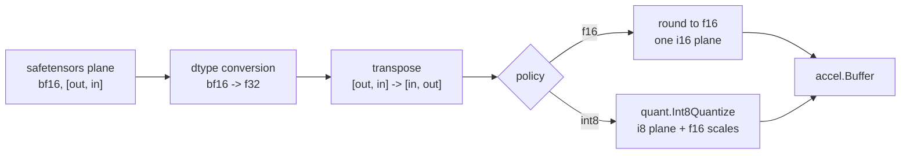
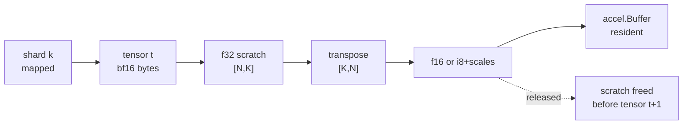

# Weights

A Hugging Face checkpoint and an accel buffer are further apart than they look.
This spec names each gap and who closes it.

## 1. What is on disk

A model directory:

```
config.json                      architecture, shapes, hyperparameters
tokenizer.json                   the BPE, see 002
tokenizer_config.json            the chat template, see 003
generation_config.json           default sampling policy, see 006
model.safetensors                one shard, or
model-00001-of-00003.safetensors + model.safetensors.index.json
```

A safetensors file is: an 8-byte little-endian header length $n$, $n$ bytes of
JSON, then the tensor bytes. The JSON maps a tensor name to `{dtype, shape,
data_offsets: [begin, end]}`, both offsets relative to the end of the header.

The format is trivially parseable and that is the point of choosing it. It is
also **untrusted input** — a checkpoint is a file someone downloaded. §6 states
what the reader refuses.

### 1.1 The header grammar

```
file    := u64le(n) json[n] data[...]
json    := { name: entry, ..., "__metadata__": {...}? }
entry   := { "dtype": D, "shape": [int...], "data_offsets": [begin, end] }
D       := "F64"|"F32"|"F16"|"BF16"|"I64"|"I32"|"I16"|"I8"|"U8"|"BOOL"
```

`begin` and `end` are relative to the end of the header, half-open, and in
bytes. `__metadata__` is a string map and is not a tensor; a reader that treats
it as one fails on every real checkpoint.

## 1.2 The Go surface

```go
package safetensors

// Open maps a file and parses its header. It reads no tensor data.
func Open(path string) (*File, error)

type File struct{ /* ... */ }

func (f *File) Names() []string
func (f *File) Entry(name string) (Entry, bool)
func (f *File) Bytes(name string) ([]byte, error)  // the raw plane, no conversion
func (f *File) Close() error

type Entry struct {
    DType DType
    Shape []int
    Begin, End int64
}

// Repo is a model directory: config, tokenizer, and one or more shards.
func OpenRepo(dir string) (*Repo, error)

type Repo struct{ /* ... */ }

func (r *Repo) Config() json.RawMessage
func (r *Repo) Tensor(name string) (Entry, *File, bool)  // resolves through the index
func (r *Repo) Names() []string
```

`Bytes` returns the raw plane. **Conversion is not here**: it belongs to the
loader, which knows the target precision and the transpose flag, and keeping
them apart means the reader is testable against a synthesised header with no
model and no accel.

## 2. What accel wants

A `tensor.Weight` port bound to an `accel.BufferView` of a specific dtype, in
the shape the operator declared. Four things differ from the file:



Each edge is a decision, and each is below.

## 3. dtype: bf16 to f32, exactly; f32 to f16, with a rule

bf16 to f32 is **exact and free**: bf16 is the top 16 bits of an f32, so the
conversion is a 16-bit left shift. No rounding, no loss, no table.

$$\texttt{f32bits} = \texttt{bf16bits} \ll 16$$

f32 to f16 is not free. f16 carries 5 exponent bits against bf16's 8, so the
representable magnitude range shrinks from about $3.4\times10^{38}$ to $65504$,
and bf16 values outside it exist. The rule:

- **Round to nearest, ties to even.** The same rule the hardware uses, so a
  weight converted here and a weight converted by a device `Cast` agree.
- **Overflow saturates to $\pm65504$ and is counted.** Not $\pm\infty$: one
  infinity in a weight matrix makes every output of that row `NaN`, and the
  failure appears many layers later as gibberish rather than as an error. A
  saturated weight is wrong by a bounded amount; an infinite one is fatal.
- **Subnormals flush to zero.** They are below $6\times10^{-8}$ and contribute
  nothing to a dot product against activations of order 1.

The loader **reports** the saturation count per tensor and fails the load if any
tensor saturates more than a threshold fraction of its weights, because that
means the checkpoint is not in the range f16 can hold and the int8 path is not a
fix for it either. Trained transformer weights are almost entirely within
$[-1, 1]$, so a nonzero count is a signal, not routine.

```
for each element w:
    f32 := bf16bits(w) << 16                    # exact
    if |f32| > 65504:  f16 := sign * 65504      # saturate, count++
    elif |f32| < 2^-14: f16 := 0                # flush subnormals
    else:              f16 := roundTiesToEven(f32)
```

The threshold is a fraction, not a count, because a 1.5-billion-element
embedding table and a 2560-element norm gain cannot share an absolute one.

> This is the first thing to check when a converted model produces noise, and
> the reason the count is surfaced rather than logged at debug level.

## 4. Layout: every projection weight is transposed

Hugging Face stores a `nn.Linear` weight as `[out_features, in_features]` and
computes $y = x W^\top$. accel's `MatMul(x, w)` contracts `x[M, K]` against
`w[K, N]`. So every projection weight is transposed on load:

$$W_\text{file} \in \mathbb{R}^{N \times K} \;\longrightarrow\; W_\text{accel} \in \mathbb{R}^{K \times N}$$

Done once, at load, on the host. **Not** with `tensor.Transpose`: accel's view
operators reach elementwise operators only, and a strided view into `MatMul` is
refused rather than silently copied — which is the correct refusal and means the
transpose belongs on the host anyway.

Which tensors transpose is a property of the operator that consumes them, so it
is declared by the model builder ([004](004-model-graph.md)) rather than guessed
from the name. Norm gains and the embedding table do not transpose.

> The transpose changes which weights share a quantization block. In the file,
> 32 consecutive values are 32 input features of one output channel. After the
> transpose they are 32 output channels of one input feature. The error bound in
> §5 is measured after the transpose, on the blocks that actually exist.

## 5. Precision: the policy, and proving it

The policy is `f16`, `int8`, `int4`, or `auto`. `auto` picks by decision 5 of
[000](000-decisions.md): **the widest form that fits** the device's usable
memory, and the choice is **printed**, never silent.

### 5.1 Three forms, and what each costs

| form | planes | bytes/weight | 27B resident |
| --- | --- | ---: | ---: |
| f16 | the matrix | 2.0 | 50.3 GiB |
| int8 | i8 codes at `[K, N]`, one f16 scale per 32 | 1.0625 | 26.7 GiB |
| int4 | u32 codes (eight per word), an f16 scale **and an f16 zero** per 128 | 0.53125 | 13.4 GiB |

**The zero point is what makes four bits usable**, and it is why int4 is three
planes rather than two. int8 is symmetric: a scale spends 255 levels over a
block's peak and that is close enough. At four bits there are fifteen, and they
have to be spent where the weights actually *are* rather than symmetrically
about zero — so a group carries its minimum as well
(accel [048](https://github.com/golang-design/accel/blob/main/specs/048-int4.md) §1).

The group is 128 and not 32 for a reason that only appears at four bits, and it
is why the third row of that table is **exactly** half the second rather than
merely smaller.

Halving the payload doubles the metadata's *share* of it: a scale per 32 is 6.2%
at int8 and would be 12.5% at int4. So the group doubles as the payload halves,
and 2 bytes per 32 becomes 4 bytes per 128 — $0.0625 \to 0.03125$. Both terms
halve, so the total does:

$$1 + \tfrac{2}{32} = 1.0625 \quad\longrightarrow\quad \tfrac{1}{2} + \tfrac{4}{128} = 0.53125$$

### 5.2 Narrowing is a last resort, and int4 especially

`auto` reaches for int4 **only when int8 does not fit.** accel's own tests show
int4 beating int8 on a group of weights clustered away from zero and losing on
one centred on it, so it is not uniformly better: a rule that preferred it would
trade accuracy for memory nobody asked to save. The case it exists for is the
one where the alternative is not loading at all.

### 5.3 The embedding table cannot pack

It is **gathered**, a row at a time, rather than contracted against — and accel
registers no int4 gather: `QuantGatherRows` reads a quant plane and a scale
plane and has no three-plane form. So a load at int4 caps the embedding at int8.

That is declared per tensor (`weights.Tensor.Gathered`) rather than discovered
as a refusal at record time, and it is declared in the **loader** rather than by
each caller: the footprint `tgo info` prints and the load itself are computed by
two different pieces of code, and a cap applied in one of them prints a number
the device never has.

A tied checkpoint still packs its LM head, which is the same file tensor in the
other layout ([004-D7](004-model-graph.md)) and is a `MatMul`.

Per-tensor override exists for the case that matters: the embedding table and
the LM head are the largest tensors in a small model and the most sensitive to
quantization, and holding those two at f16 while everything else is int8 is a
common and defensible point.

> Until 2026-08-24 that recommendation named a configuration accel refused:
> `GatherRows` read f32 only, so an f16 embedding was not expressible and the
> choice was 1.56 GB at f32 or int8 with nothing between. tgo filed it as part
> of [accel#11](https://github.com/golang-design/accel/issues/11) and it landed
> ([C14](010-conformance.md)). The middle width now exists.

### 5.4 The bound is measured, not assumed

`quant.Int8ErrorBound` gives, for a dot product, the distance from the
unquantized result, and `quant.Int4ErrorBound` is the same statement one width
down — rounding to nearest gives at most half a step, and the step is a group's
*range* over fifteen where int8's is a peak over 127. Both take the inputs
rather than returning a constant, because a per-group figure bounds a dot
product only where the caller says which group each term came from.

The load-time check runs it over sampled blocks of the real tensors:

$$\left|\hat{y} - y\right| \le \texttt{Int8ErrorBound}(x, s)$$

and the conformance suite ([010](010-conformance.md)) asserts one layer's output
against the f16 path within that bound. Asserting against a hand-tuned tolerance
would pass for the wrong reason.

**What a green bound does not say.** [010 §3](010-conformance.md) asks for
quantization error on *real* blocks, and a tier-1 fixture's weights are
synthetic. `Int4Quantize` spends a group's codes over that group's range, so
weights drawn from one distribution — with no outlier channel to stretch it —
flatter the scheme, and trained transformer weights have outliers. The number
that decides whether int4 is usable *for a model* is a tier-3 measurement
against a checkpoint, and it has not been taken.

## 6. Refusals

The reader treats the file as hostile. It refuses, with the tensor name:

| condition | why |
| --- | --- |
| header length exceeds the file | truncated or crafted |
| `data_offsets` outside the data region, or `end < begin` | out-of-bounds read |
| two tensors with overlapping byte ranges | aliasing that no writer produces |
| shape product times dtype width ≠ `end - begin` | the header disagrees with itself |
| an unknown dtype string | silently misreading bytes is worse than stopping |
| a name in `index.json` with no shard, or a shard with no index entry | an incomplete download |

Every one of these is a unit test over a synthesised header, and none of them
needs a model.

## 7. Memory: what is resident and when

Weights are read shard by shard, converted, uploaded, and the host copy
released, so peak host memory is one shard plus one converted tensor rather than
the whole model. The device holds the whole model, which is the number in
[000 §5](000-decisions.md).



Peak host bytes were bounded by

$$\max_t \big(\, 4 \cdot |t| \;+\; 4 \cdot |t| \,\big) = 8 \cdot \max_t |t|$$

— the f32 scratch plus the transposed f32 scratch — which for Qwen3-4B's
embedding table is about **3.1 GB** of host scratch for a model occupying 4 GB
on the device.

### 7.1 The final copy no longer exists

tgo asked accel for a buffer *over* host memory the caller owns
([accel#7](https://github.com/golang-design/accel/issues/7)). accel declined
that shape, correctly — a buffer over caller memory is a promise about a
lifetime accel cannot see — and pointed the problem the other way:

```go
func (b *Buffer) Access(fn func([]byte) error) error
```

The caller writes **into** device memory, for the duration of the call, on a
buffer from a host-visible pool. So the converted plane is produced directly
where it will live:

```
for each tensor t:
    buf := device buffer for t
    buf.Access(func(dst []byte) error {
        return convert(shard[t], dst)   // bf16 -> f16 or int8, transposed, in place
    })
```

The f16 or int8 output buffer is gone from host memory entirely, and only the
f32 working scratch for the transpose remains. **This is a better answer than
the one asked for**, and it is the kind of thing worth recording: the request
named a mechanism, and the mechanism it named was the one with the hard problem
in it.

`Access` refuses on a device-local pool — reported rather than discovered — so
the loader allocates weight buffers from a shared pool and falls back to
`Queue.WriteBuffer` where it cannot, which is the honest shape on a discrete
GPU.

Remaining: the transpose still needs somewhere to put its output, since it is
not an in-place permutation for a non-square matrix. Tiling it would bound that
to a tile rather than a tensor. Not v0, and recorded so the number is not
mistaken for a floor.

**Open, and not resolved here:** whether accel can map a file-backed buffer
without a host copy at all. `accel.Buffer` is created from a descriptor and
written through a view; there is no import path today. It would remove the
largest transient allocation in the loader. Filed as a question against accel
001, not assumed.

## 8. What this spec does not do

Downloading. `tgo pull` is a Hugging Face client, and it is
[013](013-distribution.md) — cache layout, resumable range requests, and the
`.gitattributes`-shaped LFS pointers that a naive fetch returns instead of
weights. The loader here takes a local directory and nothing else.

## Decision record

| id | decision | rejected | consequence |
| --- | --- | --- | --- |
| 001-D1 | bf16→f32 by 16-bit shift, f32→f16 round-to-nearest-even | a conversion table; truncation | exact on the wide side; agrees with a device `Cast` on the narrow one |
| 001-D2 | f16 overflow saturates and is counted; load fails past a threshold | overflow to ±∞ | one ∞ makes a whole output row NaN and surfaces layers later |
| 001-D3 | transpose projections on the host at load | `tensor.Transpose` at graph time | accel refuses a strided view into `MatMul`; see [010 C9](010-conformance.md) |
| 001-D4 | which tensors transpose is declared by the model, not inferred from names | a name heuristic | a new model states its own mapping; no silent mismatch |
| 001-D5 | the int8 error bound is measured on real blocks, post-transpose | a hand-tuned tolerance | the assertion is derived and cannot be quietly raised |
| 001-D6 | the reader treats the file as hostile and refuses by name | trust the header | every §6 row is a unit test needing no model |
| 001-D7 | convert and upload shard by shard | load the model into host memory first | peak host memory is one shard plus one tensor |
| 001-D8 | convert **into** device memory via `Buffer.Access` | convert to a host slice, then upload | the converted plane never exists on the host. accel declined the buffer-over-caller-memory shape tgo asked for and offered this, which needs no lifetime promise ([§7.1](#71-the-final-copy-no-longer-exists)) |
| 001-D9 | allocate weight buffers from a host-visible pool, falling back to `Queue.WriteBuffer` | assume `Access` always works | `Access` refuses a device-local pool by design, so the fallback is the honest shape on a discrete GPU |
