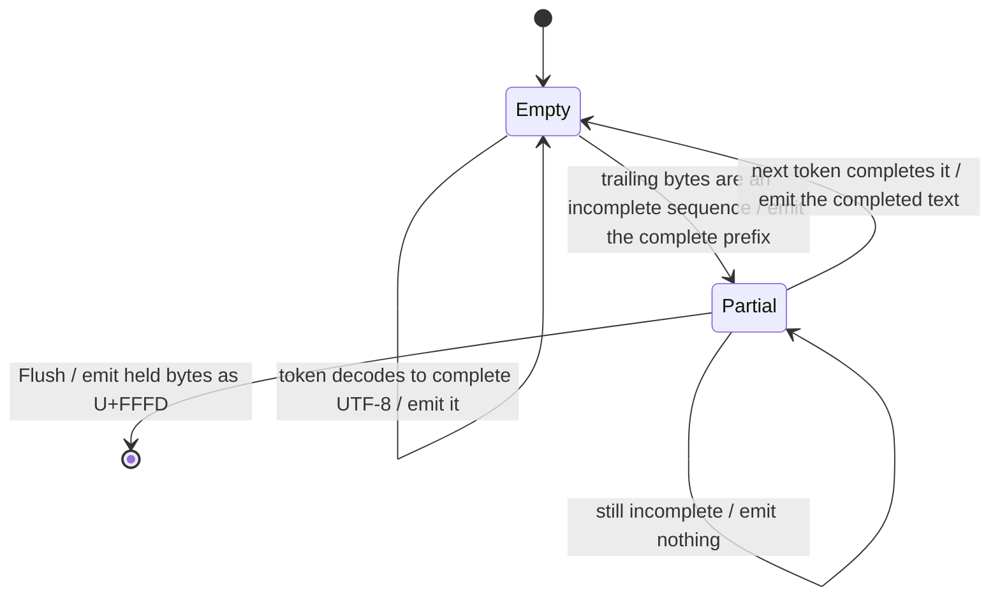

# Tokenizer

Pure Go, no device, no network. This is the package where the coverage gate is
easiest to reach and where a bug is hardest to see: a wrong tokenizer produces
fluent text that answers a slightly different question, and nothing crashes.

## 1. What is in `tokenizer.json`

The Hugging Face `tokenizers` serialisation. Four parts matter:

| part | Qwen3 | role |
| --- | --- | --- |
| `normalizer` | **NFC** | runs **before** the pre-tokenizer; omitting it gives different ids for the same visible text |
| `added_tokens` | `<\|im_start\|>`, `<\|im_end\|>`, `<\|endoftext\|>`, `<think>`, `</think>`, and the tool-call markers | matched before anything else, never merged into |
| `pre_tokenizer` | a `Split` on a regex, then `ByteLevel` | cuts the input into pieces that are BPE'd independently |
| `model.vocab` | token string → id | ~151k entries |
| `model.merges` | an **ordered** list of pairs | the algorithm |

## 2. The Go surface

```go
package tokenizer

// Load reads a tokenizer.json.
func Load(path string) (*Tokenizer, error)
func Parse(r io.Reader) (*Tokenizer, error)

type Tokenizer struct{ /* ... */ }

// Encode applies the pre-tokenizer and BPE. Special tokens are matched only
// when allowSpecial is set; see 003 section 4 for why that is a parameter.
func (t *Tokenizer) Encode(s string, allowSpecial bool) []int

// Decode is the whole-string inverse.
func (t *Tokenizer) Decode(ids []int) string

// Special resolves a control token by its literal text.
func (t *Tokenizer) Special(text string) (int, bool)

func (t *Tokenizer) VocabSize() int

// NewDecoder returns a streaming decoder that holds back partial UTF-8.
func (t *Tokenizer) NewDecoder() *Decoder

type Decoder struct{ /* ... */ }

func (d *Decoder) Push(id int) string  // the text this token completed, possibly ""
func (d *Decoder) Flush() string       // whatever is held back, at end of stream
```

## 3. The byte-level alphabet

Every input byte is mapped to a printable Unicode code point before BPE, so that
the vocabulary contains no control characters and no token can split a byte:

$$\text{map}(b) = \begin{cases}
b & b \in [33,126] \cup [161,172] \cup [174,255] \\
256 + k & \text{otherwise, } k \text{ the running index of such bytes}
\end{cases}$$

This is GPT-2's alphabet and every byte-level BPE since uses it. The important
property is that it is a **bijection on all 256 byte values**, which makes the
round trip total **over bytes** — including input that is not valid UTF-8.

It does **not** make the round trip total over strings: §1's NFC normalizer runs
first, so the pipeline is idempotent *after* normalization rather than
identity-preserving. §7 splits the test accordingly, and conflating the two is
how an implementation quietly drops NFC and still shows a green round-trip test.

Decoding inverts the map and reassembles bytes. A token is therefore a byte
string, not a character string, and that distinction is the whole of §6.

## 4. The pre-tokenizer, and the constraint Go imposes

The `Split` pattern cuts text before BPE so that, for example, a word and the
space before it stay together while a word and the punctuation after it do not.
It decides token boundaries as much as the merges do.

**Go's `regexp` cannot compile it.** Patterns of the GPT-4 family use negative
lookahead — `\s+(?!\S)`, to attach trailing whitespace to the *next* piece
rather than the current one — and Go's RE2 has no lookahead by design, because
it is what buys the linear-time guarantee.

Three options:

| option | cost |
| --- | --- |
| a backtracking regex dependency (`regexp2`) | one dependency, and a pathological-input surface RE2 exists to avoid |
| rewrite the pattern into RE2 | it is not expressible; lookahead is doing real work here |
| **a hand-written splitter per known pattern**, keyed by a checksum of the pattern string | one function per tokenizer family; an unrecognised pattern must be caught |

**Decision: the hand-written splitter, checksummed.** It is the same shape as
[003-D1](003-chat-template.md)'s per-model chat renderer and for the same
reason: the thing being interpreted is fixed per model family, and a general
interpreter is a language.

**A tokenizer whose pattern does not match a known checksum is refused at load,
naming the pattern.** Not warned — *refused*. This differs deliberately from
[003-D2](003-chat-template.md), where an unrecognised chat template warns and
renders anyway. The asymmetry is the point:

- a customised chat template is usually a trivial edit, and rendering with the
  built-in produces text a human can inspect;
- a different split pattern produces **different token ids** for the same
  string, silently, and there is nothing to inspect. The model is simply fed
  something else.

## 5. BPE, and the part that is easy to get subtly wrong

For each piece from §4:

0. **normalize the input to NFC** (§1) — this happens once, before splitting;
1. map its bytes through §3, giving a sequence of symbols;
2. repeatedly merge the adjacent pair with the **lowest merge rank**, breaking a
   rank tie by taking the **leftmost** such pair;
3. look up each remaining symbol in the vocabulary.

Step 2 is the whole algorithm. The rank is the pair's **index in the merge
list**, and it is a *global* ordering, not a local preference:

$$\text{merge } \arg\min_{i}\ \operatorname{rank}(s_i, s_{i+1}), \quad
\text{ties broken by the smallest } i, \quad
\text{stop when no adjacent pair has a rank}$$

**The tie-break is not a detail.** A scan written with `<` takes the leftmost
pair and one written with `<=` takes the rightmost, and both look like a correct
reading of "the lowest rank". They differ: measured on Qwen3's real merge table,
`'eee'` becomes `['eee']` leftmost and `['e','ee']` rightmost, and about 3.7% of
short random strings diverge. `('Ġ','Ġ')` — two spaces — is rank 0, so the tie
path is exercised constantly by ordinary whitespace. **Leftmost is correct**,
and §7 has a fixed vector that distinguishes them.

Worked, with a merge list ranking `("l","o") = 3`, `("lo","w") = 7`,
`("o","w") = 12`:

```
l o w        ranks: (l,o)=3  (o,w)=12   -> merge (l,o), the lower
lo w         ranks: (lo,w)=7             -> merge
low          no adjacent pair has a rank -> done
```

Greedy left-to-right or longest-match-first would have produced `l ow`, which is
also a valid tokenization of the same string and a **different one**. There is no
partial credit: a prompt tokenized differently puts the model in a different
state.

**Rejected: longest-match against the vocabulary.** Faster, valid-looking,
wrong.

### 5.1 Complexity

Naive scanning is $O(n^2)$ per piece for $n$ symbols. A linked list plus a heap
of candidate pairs is $O(n \log n)$.

Pieces are short — the §4 split produces mostly single words — so **v0 is naive
and correct**, and the heap is an optimisation that needs a benchmark behind it.
The one input that makes $n$ large is a long run of a repeated character with no
split point, which is worth a fuzz seed rather than an algorithm.

## 6. Streaming decode

Decoding a whole id list is a table lookup and the inverse byte map. The hard
part is decoding **one token at a time**, because a single token is frequently
an incomplete UTF-8 sequence and rendering it alone produces `U+FFFD`.

This is not an edge case. It is every CJK character, every emoji, most accented
Latin, and every emoji with a skin-tone or ZWJ modifier — in the majority of
non-English responses.

`Decoder` holds a byte buffer:



The rule: emit the longest prefix of the buffer that is valid UTF-8, hold the
rest. `Flush` at end of stream emits what is left, which is where a genuinely
malformed byte becomes `U+FFFD` — correctly, because at that point it is.

**Stop-string matching happens on the decoder's output, not on ids**
([006 §4](006-sampling.md)), so the decoder must also hold back enough emitted
text for the longest stop string. That is a second, separate buffer, and
conflating them is a bug: the UTF-8 buffer is about byte validity and the stop
buffer is about text.

## 7. Tests

| test | what it catches |
| --- | --- |
| **fixed vectors**: known strings → known id sequences, checked in as testdata | a merge-order bug, which a round trip does not catch |
| round trip `decode(encode(s)) == s` over **NFC-stable** input: CJK, emoji with ZWJ and skin tones, invalid UTF-8, empty string | the §3 bijection |
| **NFC-unstable** input round-trips to its normal form: `decode(encode(s)) == NFC(s)` | §1's normalizer. `e` + combining acute becomes `é`, and an implementation that makes the *first* row pass on this input has dropped NFC |
| a fixed vector that distinguishes leftmost from rightmost tie-breaking | §5 |
| the pre-tokenizer splitter against the reference pattern's behaviour on a corpus | §4 |
| an unknown pattern checksum is **refused**, naming the pattern | §4's decision |
| specials round-trip as single ids, and only when `allowSpecial` | §8 / [003 §4](003-chat-template.md) |
| streaming equals batch: pushing tokens one at a time gives the same string | §6 |
| `Flush` after a partial sequence emits `U+FFFD`, not nothing | §6's terminal edge |
| fuzz: `Encode` never panics, never emits an out-of-range id, on arbitrary bytes | robustness |

All of it runs on a **small checked-in tokenizer** built from a synthetic
vocabulary, plus the fixed vectors from the real one. Neither needs a model.

> The fixed vectors are the load-bearing test and the one that costs something
> to produce: they must come from the reference implementation, not from tgo.
> Generating them from tgo's own output would make the test assert that the code
> does what it does.

## Decision record

| id | decision | rejected | consequence |
| --- | --- | --- | --- |
| 002-D1 | true BPE by global merge rank, **ties broken leftmost** | greedy longest-match; an unstated tie rule | ids match the reference. The tie rule is a `<` versus `<=` coin flip that diverges on 3.7% of short strings and fires on every double space |
| 002-D9 | NFC-normalize before splitting | skip it, as the four-part table implied | the reference normalizes; skipping it gives different ids for the same visible text |
| 002-D2 | naive $O(n^2)$ merge in v0 | a heap from the start | pieces are short; the heap needs a benchmark, and a long unsplittable run is a fuzz seed |
| 002-D3 | added tokens matched before BPE, never merged into | let specials reach the BPE | turn boundaries survive; enables [003-D4](003-chat-template.md) |
| 002-D4 | a stateful streaming decoder holding back partial UTF-8 | decode each token independently | every CJK character and emoji would otherwise emit U+FFFD |
| 002-D5 | fixed vectors from the reference, checked in | round-trip tests only | a round trip passes with a wrong merge order |
| 002-D6 | hand-written pre-tokenizer per pattern, keyed by checksum | a backtracking regex dependency; rewriting into RE2 | Go's RE2 has no lookahead and the pattern needs it; no dependency, no pathological input |
| 002-D7 | an unknown split pattern is **refused**, not warned | warn and use a default, as [003-D2](003-chat-template.md) does | a different split silently produces different ids and there is nothing for a human to inspect |
| 002-D8 | the UTF-8 hold-back buffer and the stop-string hold-back buffer are separate | one buffer | one is about byte validity, the other about text; conflating them mis-holds both |
