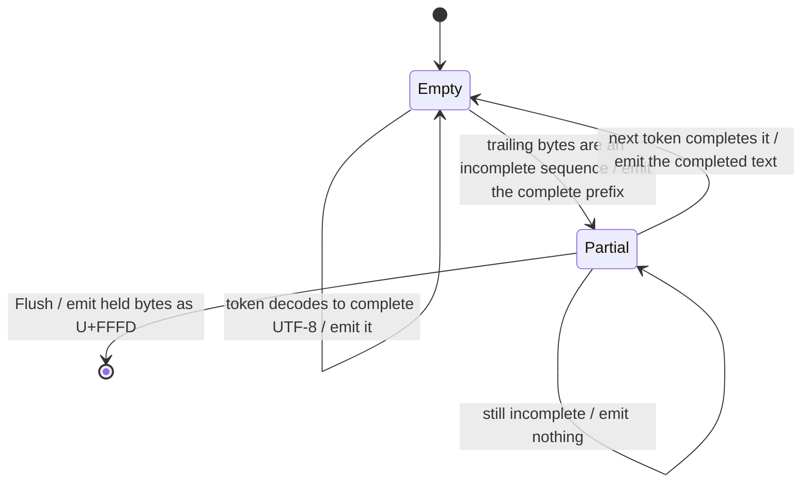

# Tokenizer

Pure Go, no device, no network. This is the package where the coverage gate is
easiest to reach and where a bug is hardest to see: a wrong tokenizer produces
fluent text that answers a slightly different question, and nothing crashes.

## 1. What is in `tokenizer.json`

The Hugging Face `tokenizers` serialisation. Four parts matter:

| part | Qwen3 | role |
| --- | --- | --- |
| `normalizer` | **NFC** | runs **before** the pre-tokenizer; omitting it gives different ids for the same visible text |
| `added_tokens` | `<\|im_start\|>`, `<\|im_end\|>`, `<\|endoftext\|>`, `<think>`, `</think>`, and the tool-call markers | matched before anything else, never merged into |
| `pre_tokenizer` | a `Split` on a regex, then `ByteLevel` | cuts the input into pieces that are BPE'd independently |
| `model.vocab` | token string → id | ~151k entries |
| `model.merges` | an **ordered** list of pairs | the algorithm |

## 2. The Go surface

```go
package tokenizer

// Load reads a tokenizer.json.
func Load(path string) (*Tokenizer, error)
func Parse(r io.Reader) (*Tokenizer, error)

type Tokenizer struct{ /* ... */ }

// Encode applies the pre-tokenizer and BPE. Special tokens are matched only
// when allowSpecial is set; see 003 section 4 for why that is a parameter.
func (t *Tokenizer) Encode(s string, allowSpecial bool) []int

// Decode is the whole-string inverse.
func (t *Tokenizer) Decode(ids []int) string

// Special resolves a control token by its literal text.
func (t *Tokenizer) Special(text string) (int, bool)

func (t *Tokenizer) VocabSize() int

// NewDecoder returns a streaming decoder that holds back partial UTF-8.
func (t *Tokenizer) NewDecoder() *Decoder

type Decoder struct{ /* ... */ }

func (d *Decoder) Push(id int) string  // the text this token completed, possibly ""
func (d *Decoder) Flush() string       // whatever is held back, at end of stream

// TextBytes returns the bytes an id contributes to decoded text, and nil for
// an id that contributes none. See 2.1.
func (t *Tokenizer) TextBytes(id int) []byte
```

### 2.1 `TextBytes`, and why it is nil for a control token

`TextBytes` is the inverse of the **byte-level alphabet**, not the vocabulary
file's spelling: the id for `" the"` comes back as the four bytes of `" the"`,
not as the five characters of `"Ġthe"`. A caller reasoning about what a token
puts in the output — a grammar masking the tokens that cannot continue a
document ([015 §2](015-structured-output.md)) — must read the bytes, because the
surface form is a different string that happens to be legal in most contexts.

It is nil in three cases, which are one case to a caller: an id out of range, an
id no table claims, and **an added token**. The third is the one worth stating.
An added token's piece holds its literal content, so `<|im_end|>` would
otherwise read as ten characters a caller could believe it is free to emit
wherever those characters are legal — and a grammar that admitted it there would
end a document with a control token in the middle of a string.

### 2.2 `VocabSize` is the id space, not the embedding

`VocabSize` is `len(piece)`: the size of the **id space**. A checkpoint commonly
pads its embedding matrix past the last real token, so Qwen3 returns 151669
against an embedding of 151936. Use it to bound an id, never to shape a tensor
— [004 §2](004-model-graph.md) reads the row count from the checkpoint.

### 2.3 The concurrency contract

One `Tokenizer` is shared; one `Decoder` belongs to one stream. A `Tokenizer` is
immutable after `Parse` and `Encode` writes nothing to it, so any number of
requests may encode at once. A `Decoder` holds a byte buffer between calls and
is not safe for concurrent use — which is also why it is a separate type rather
than a mode of `Tokenizer`, and why `Stream` makes one per request.

That buffer is **not** 006's stop-string hold-back. One holds because a byte
sequence is incomplete; the other because a text match might still extend
([002-D8](#decision-record)), and a single buffer serving both mis-holds for
both.

## 3. The byte-level alphabet

Every input byte is mapped to a printable Unicode code point before BPE, so that
the vocabulary contains no control characters and no token can split a byte:

$$\text{map}(b) = \begin{cases}
b & b \in [33,126] \cup [161,172] \cup [174,255] \\
256 + k & \text{otherwise, } k \text{ the running index of such bytes}
\end{cases}$$

This is GPT-2's alphabet and every byte-level BPE since uses it. The important
property is that it is a **bijection on all 256 byte values**, which makes the
round trip total **over bytes** — including input that is not valid UTF-8.

It does **not** make the round trip total over strings: §1's NFC normalizer runs
first, so the pipeline is idempotent *after* normalization rather than
identity-preserving. §7 splits the test accordingly, and conflating the two is
how an implementation quietly drops NFC and still shows a green round-trip test.

Decoding inverts the map and reassembles bytes. A token is therefore a byte
string, not a character string, and that distinction is the whole of §6.

## 4. The pre-tokenizer, and the constraint Go imposes

The `Split` pattern cuts text before BPE so that, for example, a word and the
space before it stay together while a word and the punctuation after it do not.
It decides token boundaries as much as the merges do.

**Go's `regexp` cannot compile it.** Patterns of the GPT-4 family use negative
lookahead — `\s+(?!\S)`, to attach trailing whitespace to the *next* piece
rather than the current one — and Go's RE2 has no lookahead by design, because
it is what buys the linear-time guarantee.

Three options:

| option | cost |
| --- | --- |
| a backtracking regex dependency (`regexp2`) | one dependency, and a pathological-input surface RE2 exists to avoid |
| rewrite the pattern into RE2 | it is not expressible; lookahead is doing real work here |
| **a hand-written splitter per known pattern**, keyed by a checksum of the pattern string | one function per tokenizer family; an unrecognised pattern must be caught |

**Decision: the hand-written splitter, checksummed.** It is the same shape as
[003-D1](003-chat-template.md)'s per-model chat renderer and for the same
reason: the thing being interpreted is fixed per model family, and a general
interpreter is a language.

**A tokenizer whose pattern does not match a known checksum is refused at load,
naming the pattern.** Not warned — *refused*. This differs deliberately from
[003-D2](003-chat-template.md), where an unrecognised chat template warns and
renders anyway. The asymmetry is the point:

- a customised chat template is usually a trivial edit, and rendering with the
  built-in produces text a human can inspect;
- a different split pattern produces **different token ids** for the same
  string, silently, and there is nothing to inspect. The model is simply fed
  something else.

### 4.1 The two registered patterns, and the one alternative between them

Two are registered, and they differ in **exactly one alternative** — the run of
digits (`tokenizer/pretokenize.go:33-52`):

| family | digit runs |
| --- | --- |
| Qwen | `\p{N}` one at a time |
| cl100k (GPT-4) | `\p{N}{1,3}`, up to three |

So one splitter serves both, parameterised by `maxDigits`. A third family is a
row here and a checksum there, not a new splitter, which is what makes
[002-D7](#decision-record)'s refusal cheap to lift for a pattern somebody has
read.

### 4.2 What is refused at load, and the invariants that make `Encode` total

[002-D7](#decision-record) refuses anything this package cannot reproduce
exactly, rather than approximating it. Every refusal is a setting that changes
the ids produced for some text, and each names itself.

| refused | why |
| --- | --- |
| a `normalizer` other than NFC | a different normalizer gives different ids for the same visible text |
| other than exactly one `ByteLevel` and one `Split` pre-tokenizer | a `ByteLevel` with `use_regex` is GPT-2's built-in pattern, which is a third split this does not implement |
| a `Split` `behavior` other than `Isolated` | the other behaviours cut the same text differently |
| an unrecognised split pattern | named with its sha256, so a new family is added deliberately ([§4](#4-the-pre-tokenizer-and-the-constraint-go-imposes)) |
| a `post_processor` other than `ByteLevel` | a `TemplateProcessing` post-processor inserts ids `Encode` would omit — a Llama-3-style file would encode every prompt **without its BOS** |
| a `decoder` other than `ByteLevel` | `Decode` inverts the byte-level alphabet and nothing else |
| a `model` type other than BPE | |
| seven BPE model options: `dropout`, `unk_token`, `continuing_subword_prefix`, `end_of_word_suffix`, `fuse_unk`, `byte_fallback`, `ignore_merges` | each changes the ids produced, and a file setting one is a file this cannot reproduce |

**Two merge-list serialisations are read.** `tokenizers` wrote `"left right"`
for years and writes `["left","right"]` now, and both are in circulation on the
hub. The pair form is unambiguous; the string form splits on the **first** space,
which is safe because a byte-mapped token never contains one — U+0020 maps to
U+0120.

**The load-time invariants are what make `Encode` total.** They are checked once
so that encoding needs no error path:

- every vocab entry has a non-negative id, and no two entries claim one id;
- every vocab entry is inside the byte-level alphabet;
- the vocab holds a symbol for **all 256 bytes**, so any input has a starting
  point;
- every merge is a pair, no pair repeats — a second rank would be unreachable —
  and every merge joins to a token that is in the vocab;
- every added token has non-empty content and a non-negative id.

With those, `Encode` cannot meet a byte it has no token for and cannot meet a
merge it cannot apply, so it returns ids and no error.

### 4.3 `add_prefix_space`, and where it is applied

`ByteLevel` carries `add_prefix_space`, and this package applies it **once to
the whole normalized string**, before the added-token matcher
(`tokenizer/tokenizer.go:366`). The reference applies it per pre-tokenizer span,
after added tokens are extracted.

**[002-D11](#decision-record): the placements are equivalent for every file this
package accepts, and the position here is the safer of the two.**

The pattern of [§4](#4-the-pre-tokenizer-and-the-constraint-go-imposes) never
splits *before* a leading space: ` ?[^\s\p{L}\p{N}]+`, `[^\r\n\p{L}\p{N}]?\p{L}+`
and `\s+` all take a leading space into the span that follows it, so the first
span of a prefixed string is the first span of the unprefixed one with the space
attached — which is what applying it per span would have produced. And the
added-token matcher is unaffected: an added token's content never begins with
the prefix space, so extracting first or last selects the same spans.

Where they could differ is a file that sets `add_prefix_space` **and** ships an
added token beginning with a space. Applying per span would prefix the text
after that token as well; applying once does not. Qwen3 sets the flag false, so
nothing in the tested set reaches either path — and the rule chosen is the one
that adds bytes in exactly one place, which is the one a reader can check
against the rendered prompt.

## 5. BPE, and the part that is easy to get subtly wrong

For each piece from §4:

0. **normalize the input to NFC** (§1) — this happens once, before splitting;
1. map its bytes through §3, giving a sequence of symbols;
2. repeatedly merge the adjacent pair with the **lowest merge rank**, breaking a
   rank tie by taking the **leftmost** such pair;
3. look up each remaining symbol in the vocabulary.

Step 2 is the whole algorithm. The rank is the pair's **index in the merge
list**, and it is a *global* ordering, not a local preference:

$$\text{merge } \arg\min_{i}\ \operatorname{rank}(s_i, s_{i+1}), \quad
\text{ties broken by the smallest } i, \quad
\text{stop when no adjacent pair has a rank}$$

**The tie-break is not a detail.** A scan written with `<` takes the leftmost
pair and one written with `<=` takes the rightmost, and both look like a correct
reading of "the lowest rank". They differ: measured on Qwen3's real merge table,
`'eee'` becomes `['eee']` leftmost and `['e','ee']` rightmost, and about 3.7% of
short random strings diverge. `('Ġ','Ġ')` — two spaces — is rank 0, so the tie
path is exercised constantly by ordinary whitespace. **Leftmost is correct**,
and §7 has a fixed vector that distinguishes them.

Worked, with a merge list ranking `("l","o") = 3`, `("lo","w") = 7`,
`("o","w") = 12`:

```
l o w        ranks: (l,o)=3  (o,w)=12   -> merge (l,o), the lower
lo w         ranks: (lo,w)=7             -> merge
low          no adjacent pair has a rank -> done
```

Greedy left-to-right or longest-match-first would have produced `l ow`, which is
also a valid tokenization of the same string and a **different one**. There is no
partial credit: a prompt tokenized differently puts the model in a different
state.

**Rejected: longest-match against the vocabulary.** Faster, valid-looking,
wrong.

### 5.1 Complexity

Naive scanning is $O(n^2)$ per piece for $n$ symbols. A linked list plus a heap
of candidate pairs is $O(n \log n)$.

Pieces are short — the §4 split produces mostly single words — so **v0 is naive
and correct**, and the heap is an optimisation that needs a benchmark behind it.
The one input that makes $n$ large is a long run of a repeated character with no
split point, which is worth a fuzz seed rather than an algorithm.

## 6. Streaming decode

Decoding a whole id list is a table lookup and the inverse byte map. The hard
part is decoding **one token at a time**, because a single token is frequently
an incomplete UTF-8 sequence and rendering it alone produces `U+FFFD`.

This is not an edge case. It is every CJK character, every emoji, most accented
Latin, and every emoji with a skin-tone or ZWJ modifier — in the majority of
non-English responses.

`Decoder` holds a byte buffer:



The rule: hold back only a trailing byte sequence that is a **valid but
incomplete** prefix of a code point, and emit everything in front of it. A byte
that can begin no code point at all — `0xFF`, or a continuation byte with
nothing before it — is emitted at once. Holding it can never pay off: no later
byte makes it valid, so it is one `U+FFFD` either way, and waiting stalls a
stream that may send nothing more. The predicate is
`utf8.FullRune` applied along the buffer, not `utf8.Valid`, so **the emitted
prefix is not necessarily valid UTF-8** — it is the prefix that nothing later
can change.

`Flush` at end of stream emits what is left, which is where a truncated sequence
becomes `U+FFFD` — correctly, because at that point it is genuinely malformed.

**Stop-string matching happens on the decoder's output, not on ids**
([006 §4](006-sampling.md)), so something must also hold back enough emitted
text for the longest stop string. That is a second, separate buffer, and it
belongs to the **stream**, not to the `Decoder`: the stream is where the stop
policy is and where text not yet handed to the caller can still be retracted.
The `Decoder` keeps no notion of text matching. Conflating the two into one
buffer mis-holds for both, because the UTF-8 buffer is about byte validity and
the stop buffer is about text.

## 7. Tests

| test | what it catches |
| --- | --- |
| **fixed vectors**: known strings → known id sequences, checked in as testdata — *not built; the test skips, see the Outcome* | a merge-order bug, which a round trip does not catch |
| round trip `decode(encode(s)) == s` over **NFC-stable** input: CJK, emoji with ZWJ and skin tones, invalid UTF-8, empty string | the §3 bijection |
| **NFC-unstable** input round-trips to its normal form: `decode(encode(s)) == NFC(s)` | §1's normalizer. `e` + combining acute becomes `é`, and an implementation that makes the *first* row pass on this input has dropped NFC |
| a fixed vector that distinguishes leftmost from rightmost tie-breaking | §5 |
| the pre-tokenizer splitter against an **oracle**, a second in-tree implementation of the same pattern, over a corpus and a fuzz target | §4 |
| an unknown pattern checksum is **refused**, naming the pattern | §4's decision |
| specials round-trip as single ids, and only when `allowSpecial` | §8 / [003 §4](003-chat-template.md) |
| streaming equals batch: pushing tokens one at a time gives the same string | §6 |
| `Flush` after a partial sequence emits `U+FFFD`, not nothing | §6's terminal edge |
| fuzz: `Encode` never panics, never emits an out-of-range id, on arbitrary bytes | robustness |

All of it runs on a **small checked-in tokenizer** built from a synthetic
vocabulary, which needs no model. The fixed vectors from the real tokenizer are
**not** checked in: that row is open work, and the Outcome says what closing it
costs.

The oracle is not the reference implementation — there is none in the tree, and
[000 D8](000-decisions.md) keeps one out of CI. It is the same pattern written a
second way, out of Go `regexp` alternatives instead of by hand, so a mistake has
to be made twice to pass. Two things Go's `regexp` cannot speak for are excluded
rather than papered over: its `\s` is ASCII only, so the whitespace class is
generated from `unicode.White_Space`; and it decodes invalid bytes to `U+FFFD`,
so the oracle runs only on valid UTF-8 and a separate test covers the rest. A
negative test proves the oracle disagrees with a splitter that mis-reads the
lookahead, because an oracle that agrees with everything catches nothing.

> The fixed vectors are the decisive test and the one that costs something
> to produce: they must come from the reference implementation, not from tgo.
> Generating them from tgo's own output would make the test assert that the code
> does what it does.

## Outcome

The tokenizer is built and every layer above it reads through it: `Encode` for
prompts, `Decoder` for streaming output, `TextBytes` for the structured-output
vocabulary. It landed in Wave 1 on 2026-08-24 at 99.1% statement coverage. The
review pass on it changed the design rather than confirming it: `post_processor`
and `decoder` were never read, so a Llama-3 file would have loaded and encoded
every prompt without its BOS token, and both are now refused by name; and NFC
was a declared normalizer running as the identity, which is what 002-D9 and
002-D10 below record.

**What shipped**, section by section:

| section | what landed | where |
| --- | --- | --- |
| 1 | the four parts read into one struct, verified against the real Qwen3 checkpoint: NFC normalizer, `Sequence[Split(Regex), ByteLevel]` pre-tokenizer, 26 added tokens, `("Ġ","Ġ")` at rank 0 | `tokenizer/jsonfile.go:16`, `tokenizer/tokenizer.go:83` |
| 2 | every signature the section lists, unchanged | `tokenizer/tokenizer.go:65`, `:83`, `:322`, `:347`, `:361`, `:420`; `tokenizer/decoder.go:31`, `:40`, `:56` |
| 3 | the GPT-2 alphabet built once at init as a bijection over all 256 byte values; `mapBytes` walks bytes and never runes, so the round trip survives invalid UTF-8, and load refuses a file missing any single-byte symbol | `tokenizer/bytelevel.go:21`, `:40`, `:47`, `:57`; `tokenizer/tokenizer.go:246` |
| 4 | the hand-written splitter of 002-D6, keyed on the SHA-256 of the pattern string, with the `\s+(?!\S)` lookahead done by hand; an unknown digest is refused at load, naming digest and pattern | `tokenizer/pretokenize.go:50`, `:69`, `:245`; `tokenizer/tokenizer.go:167` |
| 5 | NFC, split, byte map, merge, vocab lookup, in that order; the merge scan compares `rank < best`, strictly, which is the leftmost tie-break | `tokenizer/tokenizer.go:361`; `tokenizer/normalize.go:44`; `tokenizer/bpe.go:26` |
| 5.1 | the naive O(n²) scan, no heap, with the long repeated run as a fuzz seed | `tokenizer/bpe.go:26` |
| 6 | the streaming decoder of 002-D4, holding partial UTF-8 and nothing else; the stop-string buffer is the sampler's | `tokenizer/decoder.go:19`, `:71`; `stream.go:384`, `:493` |
| 7 | nine of the eleven rows, on the synthetic fixture a checked-in generator produces | `tokenizer/tokenizer_test.go`, `tokenizer/decoder_test.go`, `tokenizer/pretokenize_test.go`, `tokenizer/testdata/gen/main.go` |

**What diverged** from the design, and why the code is right:

- **§6's emit rule.** The section said "the longest prefix that is valid UTF-8".
  `emitLen` (`tokenizer/decoder.go:71`) uses `utf8.FullRune`, which holds back
  only a truncated *well-formed* sequence, so an outright-invalid byte is
  emitted at once and the emitted prefix need not be valid UTF-8. Holding
  `0xFF` could only delay a `U+FFFD` the caller sees anyway, and would stall a
  stream that sends nothing more. `TestDecoderDoesNotHoldAnImpossibleByte`
  (`tokenizer/decoder_test.go:87`) pins the behaviour. §6 now states the real
  rule.
- **§6's placement of the second buffer.** 002-D8's intent — two buffers, never
  one — shipped, but the stop-string buffer is not in the `Decoder`. It lives
  with the sampler (`stream.go:384`, `holdBack` at `:493`), which is where the
  stop policy is and the only place emitted text can still be retracted. A
  `Decoder` that knew about stop strings would need the policy passed into a
  type whose whole subject is byte validity.
- **§4's "one function per tokenizer family".** What shipped is one splitter
  parameterised over two families, `qwen2/qwen3` and `cl100k (gpt-4)`, which
  differ only in `\p{N}` against `\p{N}{1,3}` (`tokenizer/pretokenize.go:26`,
  `:40`, `:50`). A parameter set behind a digest is what a third family extends;
  a function per family is what it copies.
- **§7's splitter row.** It named the reference pattern's behaviour as the thing
  to check against, and no reference engine is in the tree. The check is against
  an in-tree oracle built a different way, with the two exclusions §7 now
  records and a negative test that proves it catches a mis-read lookahead.

**Not built.** One item, and it needs a machine this is not.

Generate the reference id vectors — for the synthetic fixture and for the real
Qwen3 checkpoint — on a machine that has huggingface `tokenizers`, check them in
under `tokenizer/testdata`, and unskip `TestReferenceVectors`
(`tokenizer/tokenizer_test.go:142`). This closes [002-D5](#decision-record), the
one decision here with no code behind it. It cannot be done in CI:
[000 D8](000-decisions.md) keeps the reference out, so the vectors are produced
once offline and committed, the way `chat/testdata/qwen3_chat_template.jinja`
was.

Three items left this paragraph on 2026-08-28.

**Where `add_prefix_space` applies is decided**, as
[002-D11](#decision-record) and [§4.3](#43-add_prefix_space-and-where-it-is-applied):
the split pattern never cuts before a leading space, so applying it once to the
whole string and applying it per span agree for every file this package accepts.

**The shipped surface §1 and §2 never mentioned has sections**:
[§2.1](#21-textbytes-and-why-it-is-nil-for-a-control-token) for `TextBytes` and
its nil-on-added-token rule, [§2.2](#22-vocabsize-is-the-id-space-not-the-embedding)
for `VocabSize`, [§2.3](#23-the-concurrency-contract) for one `Tokenizer` shared
and one `Decoder` per stream,
[§4.1](#41-the-two-registered-patterns-and-the-one-alternative-between-them) for
the cl100k family, and
[§4.2](#42-what-is-refused-at-load-and-the-invariants-that-make-encode-total)
for the `post_processor`/`decoder` and seven model-option refusals, both merge
serialisations, and the load-time invariants that make `Encode` total.

**Four stale package comments are corrected**, each of which asserted something
a test in the same package disproved: `tokenizer/tokenizer.go` claimed no
dependency beyond the standard library while [002-D10](#decision-record) takes
`golang.org/x/text`, claimed NFC was not implemented after it was, and claimed
`Decoder` output is always well-formed UTF-8 while
`TestDecoderDoesNotHoldAnImpossibleByte` shows a byte that cannot begin a code
point is emitted raw. `TestDecoderOutputIsNotAlwaysValidUTF8` now pins the real
guarantee, and `internal/depcheck` gates the x/text sentence: a second module
here fails, and x/text going away fails too.
## Decision record

| id | decision | rejected | consequence |
| --- | --- | --- | --- |
| 002-D1 | true BPE by global merge rank, **ties broken leftmost** | greedy longest-match; an unstated tie rule | ids match the reference. The tie rule is a `<` versus `<=` coin flip that diverges on 3.7% of short strings and fires on every double space |
| 002-D11 | `add_prefix_space` is applied **once**, to the whole normalized string | apply it per pre-tokenizer span, as the reference does | the split pattern never cuts before a leading space, so the two agree for every file this package accepts; the one shape that would differ is an added token beginning with a space, and the rule chosen adds bytes in exactly one place ([§4.3](#43-add_prefix_space-and-where-it-is-applied)) |
| 002-D9 | NFC-normalize before splitting | skip it, as the four-part table implied | the reference normalizes; skipping it gives different ids for the same visible text |
| 002-D10 | take `golang.org/x/text/unicode/norm` for NFC | a hand-rolled table; leave the seam as identity | NFC needs the decomposition tables, combining classes, composition exclusions and Hangul rules, none of which is in the standard library. x/text is pure Go with no cgo, so [000 D2](000-decisions.md) — which is about cgo, not dependencies — is untouched. **The state it replaced was worse than either**: the loader refused NFKC because it "changes ids" and then accepted NFC and ran the identity, so the file claimed normalization the ids did not have |
| 002-D2 | naive $O(n^2)$ merge in v0 | a heap from the start | pieces are short; the heap needs a benchmark, and a long unsplittable run is a fuzz seed |
| 002-D3 | added tokens matched before BPE, never merged into | let specials reach the BPE | turn boundaries survive; enables [003-D4](003-chat-template.md) |
| 002-D4 | a stateful streaming decoder holding back partial UTF-8 | decode each token independently | every CJK character and emoji would otherwise emit U+FFFD |
| 002-D5 | fixed vectors from the reference, checked in | round-trip tests only | a round trip passes with a wrong merge order |
| 002-D6 | hand-written pre-tokenizer per pattern, keyed by checksum | a backtracking regex dependency; rewriting into RE2 | Go's RE2 has no lookahead and the pattern needs it; no dependency, no pathological input |
| 002-D7 | an unknown split pattern is **refused**, not warned | warn and use a default, as [003-D2](003-chat-template.md) does | a different split silently produces different ids and there is nothing for a human to inspect |
| 002-D8 | the UTF-8 hold-back buffer and the stop-string hold-back buffer are separate | one buffer | one is about byte validity, the other about text; conflating them mis-holds both |
