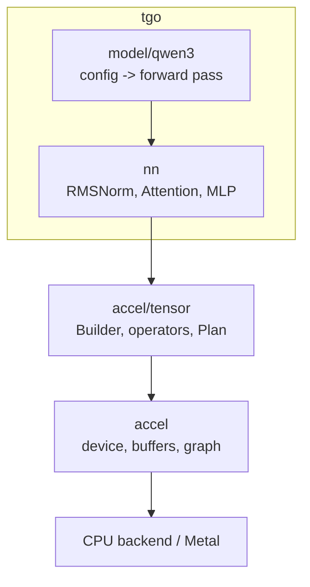

# The model graph

## 1. Where the line is

`tensor.Builder` records a DAG of operators. `nn` is a thin library of the
composites a transformer is made of, and a model is a function that calls them.
`nn` holds **no state, no device, and no weights** — a block takes tensors and
returns tensors, and the weights arrive as `tensor.Weight` ports declared by
name.



The arrow that must not exist is tgo to accel's device layer directly. If a
model needs it, that is decision 1 of [000](000-decisions.md) and it becomes a
conformance entry.

## 2. The blocks

Each is stated with the accel operators it lowers to, because that is what makes
it reviewable and what makes the dtype dance from
[000 §4](000-decisions.md#4-the-numeric-plane-is-fixed-by-accels-operator-signatures-not-chosen)
explicit.

### `Linear` — a projection

$$y = x W, \quad W \in \mathbb{R}^{K \times N}$$

f32 in, f32 out. Internally `Cast(x, F16)` then `MatMul` or `QuantMatMul`
depending on how the weight was loaded. The bias case uses `tensor.Linear`,
which fuses it; Qwen3 has no biases on its projections, and the unfused
`Add` remains the reference the fused form is checked against.

### `RMSNorm` — normalisation

$$y_i = \frac{x_i}{\sqrt{\frac{1}{n}\sum_j x_j^2 + \varepsilon}} \cdot g_i$$

One `tensor.RMSNorm`. f32 throughout.

### `SwiGLU` MLP

$$\text{MLP}(x) = \big(\text{SiLU}(x W_\text{gate}) \odot x W_\text{up}\big) W_\text{down}$$

Two `Linear`, one `tensor.SwiGLU`, one `Linear`. `SwiGLU` is a fused kernel; the
composed `SiLU`-then-`Mul` form stays as the reference.

### Attention with GQA and QK-norm

Qwen3 differs from Llama in one place that matters: **it normalises Q and K per
head before RoPE.**

$$q_h = \text{RMSNorm}(x W_Q)_h,\quad k_h = \text{RMSNorm}(x W_K)_h$$

over the head dimension, with a learned gain per head dim, then RoPE, then
attention. Getting this wrong gives a model that produces plausible tokens and
loses coherence after a few sentences.

Grouped-query attention: $H_q$ query heads share $H_{kv}$ key/value heads, with
$H_q / H_{kv}$ queries per group. accel's `Attention` takes the q tensor and the
k/v `State`, and the grouping is a property of the shapes.

$$\text{Attn}(q,K,V) = \text{softmax}\!\left(\frac{qK^\top}{\sqrt{d_h}}\right)V$$

### RoPE

$$\begin{pmatrix} x'_{2i} \\ x'_{2i+1}\end{pmatrix} =
\begin{pmatrix} \cos m\theta_i & -\sin m\theta_i \\ \sin m\theta_i & \cos m\theta_i \end{pmatrix}
\begin{pmatrix} x_{2i} \\ x_{2i+1}\end{pmatrix},\quad
\theta_i = \text{base}^{-2i/d}$$

with $m$ the absolute position and base $10^6$ for Qwen3.

`tensor.RoPE(b, x, rotaryDim, baseName, positions *Tensor)` takes the base as a
scalar — a model constant every row shares — and the **position as a u32 tensor,
one entry per row**. A prefill binds $[0..T-1]$; a decode binds $[t]$.

> This signature is one day old. It took a scalar `Offset` and computed
> `row + Offset`, which is exactly right for one sequence and silently wrong for
> a batch: the row index is the *slot*, so only one member rotates at its own
> cache length. tgo filed it as
> [accel#2](https://github.com/golang-design/accel/issues/2); accel
> [043](https://github.com/golang-design/accel/blob/main/specs/043-per-row-values.md)
> generalised it into one rule — *a scalar is a value every row shares; a value
> that differs per row is a tensor* — and changed the operator.
>
> The consequence for tgo is that **there is no batched RoPE to write later**.
> The one-row tensor a single sequence binds is the same mechanism, which is
> 043 §3's orthogonality test.

## 3. The forward pass

```
h = Embed(ids)
for each layer:
    h = h + Attention(RMSNorm(h))
    h = h + MLP(RMSNorm(h))
logits = LMHead(RMSNorm(h))
```

Pre-norm, residual around each sub-block. `LMHead` is the embedding table
transposed when `tie_word_embeddings` is set, which is true for the small Qwen3
sizes — and a tied head shares one device buffer rather than uploading it twice.

**Only the last position's logits are needed.** In prefill, computing the LM
head over all $T$ positions costs $T \times V$ where $V$ is 151936, which for a
2000-token prompt is 300M f32 values — more than the model. The builder slices
the final hidden state to its last row **before** the head. This is the single
largest avoidable cost in the whole system and it is a one-line mistake to make.

## 4. The registry

```go
model.Register("Qwen3ForCausalLM", qwen3.New)
```

`config.json`'s `architectures[0]` selects. Unknown architecture is refused with
the list of known ones.

A registered entry provides: the config type, the weight name mapping (including
which tensors transpose, per [001 §4](001-weights.md)), the graph builder, and
the chat renderer from [003](003-chat-template.md). One file, one `init`.

## 5. Two graphs, not one

**Prefill** takes $T$ tokens, writes $T$ KV rows, and produces one row of
logits. **Decode** takes 1 token, writes 1 KV row, produces one row of logits.
They are different shapes, so they are different plans, and accel's
`tensor.PlanCache` holds both.

$T$ varies per request, and a distinct plan per $T$ would recompile constantly.
`tensor.Buckets` rounds $T$ up to a fixed set, and the padding rows are computed
and discarded. [007](007-engine.md) owns the bucket choice and the cost.

## 6. Refusals

A config the builder cannot honour is refused at build time with the field
named: an unsupported `rope_scaling`, a sliding-window attention setting,
`head_dim` inconsistent with `hidden_size / num_attention_heads` when both are
given, a `num_key_value_heads` that does not divide `num_attention_heads`.

Refusing beats approximating. A model that runs with the wrong RoPE scaling
produces text that is fine for 4000 tokens and then is not.

## 7. Tests

Every one runs on a synthetic 2-layer, hidden-64, vocab-128 config with
seeded weights, on both backends:

- each block against a scalar Go reference computed on the host, within a stated
  tolerance;
- the QK-norm placement, specifically: a test that fails if the norm moves to
  after RoPE;
- the last-row slice: a prefill plan's transient memory does not scale with $V
  \times T$;
- a tied LM head binds one buffer;
- every §6 refusal.

## Decision record

| id | decision | rejected | consequence |
| --- | --- | --- | --- |
| 004-D1 | `nn` is stateless; weights arrive as named ports | blocks that own their weights | blocks are testable with no loader; the registry owns naming |
| 004-D2 | registry keyed on `architectures[0]` | filename or user-supplied flag | a wrong model is refused, not guessed |
| 004-D3 | prefill and decode are separate plans, bucketed on $T$ | one dynamic-shape plan | recompiles are bounded; padding is computed and discarded |
| 004-D4 | slice to the last row before the LM head | full-sequence logits | prefill cost stops scaling with $T \times V$ |
| 004-D5 | fused kernels keep their composed form as the reference | fused only | a fusion bug is a test failure, not a silent quality loss |
