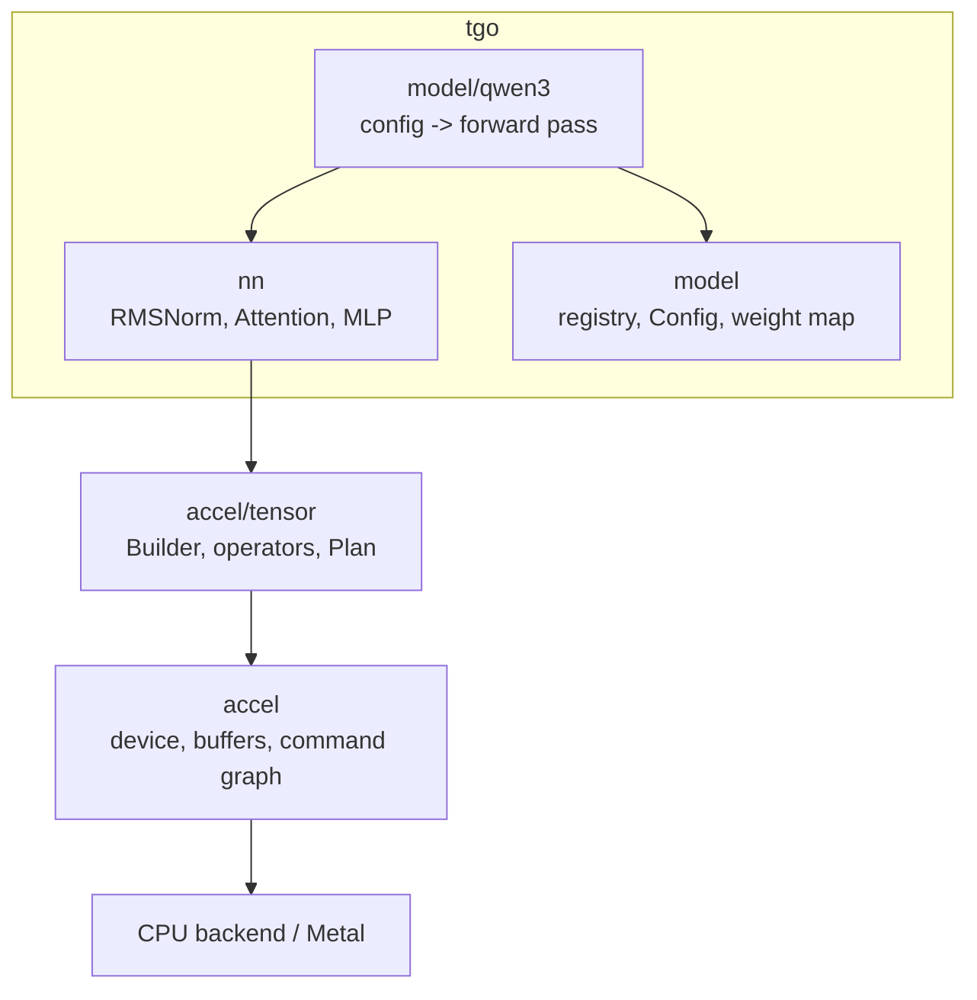

# The model graph

## 1. Where the line is

`tensor.Builder` records a DAG of operators. `nn` is a thin library of the
composites a transformer is made of, and a model is a function that calls them.
`nn` holds **no state, no device, and no weights** — a block takes tensors and
returns tensors, and weights arrive as `tensor.Weight` ports declared by name.



The arrow that must not exist is tgo → accel's device layer. If a model needs
it, that is [000 D1](000-decisions.md) and it becomes a
[010](010-conformance.md) register row.

## 2. The `nn` surface

```go
package nn

// Graph is what every block records into. It is tensor.Builder plus the
// per-model constants a block would otherwise take as six arguments.
type Graph struct {
    B      *tensor.Builder
    Eps    float32   // rms_norm_eps
    Prefix string    // weight-name prefix for the block being recorded
}

// Weight declares a f16 or quantized weight port by name, resolving which of
// the two from how the loader stored it.
func (g *Graph) Weight(name string, shape tensor.Shape) Operand

// Operand is a weight that is either f16 or int8+scales. It exists so a block
// writes one call rather than branching on precision at every projection.
type Operand struct {
    Dense *tensor.Tensor   // f16, [K, N]
    Quant tensor.Quantized // i8 quants + f16 scales
}

func Linear(g *Graph, x *tensor.Tensor, w Operand) *tensor.Tensor
func RMSNorm(g *Graph, x *tensor.Tensor, gain *tensor.Tensor) *tensor.Tensor
func SwiGLUMLP(g *Graph, x *tensor.Tensor, gate, up, down Operand) *tensor.Tensor

type AttentionConfig struct {
    QHeads, KVHeads, HeadDim int
    RoPEBase                 string // declared f32 scalar name
    QKNorm                   bool
}

func Attention(g *Graph, x *tensor.Tensor, w AttentionWeights,
    k, v *tensor.State, positions *tensor.Tensor, cfg AttentionConfig) *tensor.Tensor
```

Each block below is stated with the accel operators it lowers to. That is what
makes it reviewable, and what makes the dtype dance from
[000 §4](000-decisions.md) explicit rather than buried.

### 2.1 `Linear` — a projection

$$y = x W, \quad x \in \mathbb{R}^{M \times K},\ W \in \mathbb{R}^{K \times N}$$

| step | operator | in | out |
| --- | --- | --- | --- |
| narrow | `tensor.Cast(x, F16)` | `[M,K]` f32 | `[M,K]` f16 |
| multiply | `tensor.MatMul` or `tensor.QuantMatMul` | `[M,K]` f16 × `[K,N]` | `[M,N]` **f32** |

f32 in, f32 out; the f16 exists only between the two. `MatMul` selects the
matrix-vector kernel at $M = 1$, which is every decode step, and
`Plan.Selections()` reports which and why.

Qwen3 has no biases on its projections, so `tensor.Linear`'s fused epilogue is
unused here. It stays specified because [000 §4](000-decisions.md)'s table lists
it and because the composed `MatMul`-then-`Add` remains the reference a fused
form is checked against ([004-D5](#decision-record)).

### 2.2 `RMSNorm`

$$y_i = \frac{x_i}{\sqrt{\frac{1}{n}\sum_{j=1}^{n} x_j^2 + \varepsilon}} \cdot g_i$$

One `tensor.RMSNorm`, f32 throughout. It reduces over the **last axis** and
takes a gain of `[width]`, one value per feature — which is what makes §2.4's
per-head QK-norm a reshape rather than a different operator.

### 2.3 `SwiGLUMLP`

$$\text{MLP}(x) = \big(\text{SiLU}(x W_\text{gate}) \odot x W_\text{up}\big) W_\text{down}$$

| step | operator | in | out |
| --- | --- | --- | --- |
| gate | `Linear` | `[M,d]` | `[M,f]` |
| up | `Linear` | `[M,d]` | `[M,f]` |
| activate | `tensor.SwiGLU` | two `[M,f]` | `[M,f]` |
| down | `Linear` | `[M,f]` | `[M,d]` |

`tensor.SwiGLU` is a fused kernel. The composed `SiLU`-then-`Mul` form stays as
the reference; a fusion bug must be a test failure, not a quality loss nobody
can see.

### 2.4 Attention — GQA, QK-norm, RoPE

Qwen3 differs from Llama in one place that matters: it **normalises Q and K per
head, before RoPE**.

$$q_h = \text{RMSNorm}(x W_Q)_h,\qquad k_h = \text{RMSNorm}(x W_K)_h$$

over the head dimension $d_h$, with a learned gain of $d_h$ values shared across
heads. Getting the order wrong — normalising after RoPE, or over the full
$H\cdot d_h$ row instead of per head — gives a model that produces plausible
tokens and loses coherence after a few sentences. §7 has the test that fails if
the norm moves.

**Grouped-query attention**: $H_q$ query heads over $H_{kv}$ key/value heads,
$H_q / H_{kv}$ queries sharing each cache entry. accel derives the grouping from
the shapes and refuses a non-integer ratio.

$$\text{Attn}(q, K, V) = \text{softmax}\!\left(\frac{qK^\top}{\sqrt{d_h}}\right)V$$

with $1/\sqrt{d_h}$ bound as `AttentionOptions.ScaleName` — a model constant, so
a scalar, and one 043 explicitly leaves alone.

### 2.5 RoPE

$$\begin{pmatrix} x'_{2i} \\ x'_{2i+1}\end{pmatrix} =
\begin{pmatrix} \cos m\theta_i & -\sin m\theta_i \\ \sin m\theta_i & \cos m\theta_i \end{pmatrix}
\begin{pmatrix} x_{2i} \\ x_{2i+1}\end{pmatrix},\qquad
\theta_i = \text{base}^{-2i/d_h}$$

with $m$ the token's absolute position.

`tensor.RoPE(b, x, rotaryDim, baseName, positions *Tensor)` takes the base as a
scalar — a model constant every row shares — and the **position as a u32 tensor,
one entry per row**. It refuses a positions tensor whose length is not the row
count. Landed upstream and verified by probe.

Since `x` is reshaped to `[rows, d_h]` with `rows = T·H`, the positions tensor
repeats each token's position $H$ times:

$$\text{positions} = [\,p_0^{\times H},\ p_1^{\times H},\ \dots,\ p_{T-1}^{\times H}\,]$$

> This signature is one day old. It took a scalar `Offset` and computed
> `row + Offset`, which is exactly right for one sequence and silently wrong for
> a batch: the row index is the *slot*, so only one member rotates at its own
> cache length. tgo filed
> [accel#2](https://github.com/golang-design/accel/issues/2); accel
> [043](https://github.com/golang-design/accel/blob/main/specs/043-per-row-values.md)
> generalised it into one rule — *a scalar is a value every row shares; a value
> that differs per row is a tensor* — and changed the operator.
>
> The consequence for tgo is that **there is no batched RoPE to write later**.
> The one-row tensor a single sequence binds is the same mechanism, which is
> 043 §3's orthogonality test.

## 3. The forward pass, with every shape

Symbols: $T$ tokens this step, $d$ hidden size, $H$ query heads, $H_{kv}$
key/value heads, $d_h$ head dim, $f$ intermediate size, $V$ vocabulary, $L$
layers, $C$ cache capacity.

```
h = Embed(ids)
for ℓ in 0..L-1:
    h = h + Attention(RMSNorm(h))
    h = h + MLP(RMSNorm(h))
logits = LMHead(RMSNorm(h[-1]))
```

Pre-norm, with a residual around each sub-block. Expanded, one row per recorded
node:

| # | node | operator | inputs | output |
| --- | --- | --- | --- | --- |
| 1 | ids | `Input` u32 | — | `[T]` |
| 2 | positions | `Input` u32 | — | `[T]` |
| 3 | h | `GatherRows` / `QuantGatherRows` | table `[V,d]`, ids `[T]` | `[T,d]` f32 |
| | | **per layer ℓ** | | |
| 4 | n | `RMSNorm` | `[T,d]`, gain `[d]` | `[T,d]` |
| 5 | nf | `Cast` | `[T,d]` f32 | `[T,d]` f16 |
| 6 | q | `MatMul` | `[T,d]` × `[d, H·d_h]` | `[T, H·d_h]` f32 |
| 7 | k | `MatMul` | `[T,d]` × `[d, H_kv·d_h]` | `[T, H_kv·d_h]` f32 |
| 8 | v | `MatMul` | `[T,d]` × `[d, H_kv·d_h]` | `[T, H_kv·d_h]` f32 |
| 9 | q | `Reshape` | `[T, H·d_h]` | `[T·H, d_h]` |
| 10 | q | `RMSNorm` | `[T·H, d_h]`, gain `[d_h]` | `[T·H, d_h]` |
| 11 | k | `Reshape` → `RMSNorm` | `[T·H_kv, d_h]`, gain `[d_h]` | `[T·H_kv, d_h]` |
| 12 | q | `RoPE` | `[T·H, d_h]`, positions `[T·H]` | `[T·H, d_h]` |
| 13 | k | `RoPE` | `[T·H_kv, d_h]`, positions `[T·H_kv]` | `[T·H_kv, d_h]` |
| 14 | K_ℓ | `ScatterRows` | rows `[T, H_kv·d_h]`, ids `[T]` | `State` `[C, H_kv, d_h]` |
| 15 | V_ℓ | `ScatterRows` | rows `[T, H_kv·d_h]`, ids `[T]` | `State` `[C, H_kv, d_h]` |
| 16 | a | `Attention` | q `[T,H,d_h]`, K_ℓ, V_ℓ | `[T, H, d_h]` f32 |
| 17 | a | `Reshape` → `Cast` | `[T, H·d_h]` | `[T, H·d_h]` f16 |
| 18 | o | `MatMul` | `[T, H·d_h]` × `[H·d_h, d]` | `[T,d]` f32 |
| 19 | h | `Add` | `[T,d]`, `[T,d]` | `[T,d]` |
| 20 | n2 | `RMSNorm` → `Cast` | `[T,d]`, gain `[d]` | `[T,d]` f16 |
| 21 | g | `MatMul` | `[T,d]` × `[d,f]` | `[T,f]` f32 |
| 22 | u | `MatMul` | `[T,d]` × `[d,f]` | `[T,f]` f32 |
| 23 | s | `SwiGLU` → `Cast` | two `[T,f]` | `[T,f]` f16 |
| 24 | dn | `MatMul` | `[T,f]` × `[f,d]` | `[T,d]` f32 |
| 25 | h | `Add` | `[T,d]`, `[T,d]` | `[T,d]` |
| | | **after the loop** | | |
| 26 | last | `Slice` → `Contiguous` | `[T,d]`, axis 0, `[T-1,T)` | `[1,d]` |
| 27 | n | `RMSNorm` → `Cast` | `[1,d]`, gain `[d]` | `[1,d]` f16 |
| 28 | logits | `MatMul` | `[1,d]` × `[d,V]` | `[1,V]` f32 |
| 29 | | `Output("logits")` | | |

Roughly $22L + 7$ nodes: **799** for a 36-layer model. Seven of the per-layer
nodes are `Cast` (rows 5, 17, 20, 23 and the two inside `Linear`'s quantized
form), which is [010 C8](010-conformance.md) — 252 dispatches per forward pass
existing only to satisfy a dtype check.

> **Those casts did not go away when `MatMul` gained f32 operands.** `MatMul`
> requires its two operands to share a dtype, and this model's weights are f16
> or int8 while its activations are f32. Dropping the casts would mean f32
> weights, which doubles the model's footprint and, at $M=1$, loses the
> matrix-vector kernel — so decode would take the tiled GEMM with seven of eight
> rows idle. The table above is what tgo records at every precision anyone
> actually runs. See [010 §2.1](010-conformance.md).

### 3.1 Decode is the same graph at $T = 1$

Every shape above with a leading $T$ becomes 1. Two things change beyond that:

- `MatMul` at $M = 1$ selects the matrix-vector kernel rather than the tiled
  GEMM, reported by `Plan.Selections()`.
- `Attention` takes rank-2 `q` (`[H, d_h]`) rather than rank-3, which is how
  accel distinguishes decode from prefill — *"a rank is not a hint, it is the
  shape of the computation"*. So the builder passes `[H, d_h]` at $T=1$ and
  `[T, H, d_h]` otherwise, and this is the one place the two graphs genuinely
  diverge rather than differing by a dimension.

### 3.2 Row 26 is the single largest avoidable cost

**Only the last position's logits are needed.** Running the LM head over all $T$
positions costs $T \times V$ f32 values: for a 2000-token prompt at Qwen3's
$V = 151936$ that is 304M values, **1.2 GB** — larger than the int8 weights of
the model producing it.

Slicing to the last row *before* the head makes it $V$ values, 608 KB. It is a
one-line mistake to make and it does not fail, it just allocates. §7 has the
test.

The `Contiguous` after the `Slice` is deliberate: `Slice` returns a view with a
non-zero offset, and accel refuses a strided operand into `MatMul` rather than
copying behind the caller's back. Calling `Contiguous` is how tgo says the copy
is worth it — and at `[1,d]` it is 10 KB, which it plainly is.

## 4. The weight map

[001 §4](001-weights.md) requires each model to declare which tensors transpose.
Qwen3, with the Hugging Face names on the left:

| checkpoint tensor | shape in file | port | transpose | notes |
| --- | --- | --- | --- | --- |
| `model.embed_tokens.weight` | `[V, d]` | `embed` | **no** | rows are gathered; `[V,d]` is already row-per-token |
| `model.layers.ℓ.input_layernorm.weight` | `[d]` | `ℓ.attn_norm` | no | gain |
| `model.layers.ℓ.self_attn.q_proj.weight` | `[H·d_h, d]` | `ℓ.wq` | **yes** → `[d, H·d_h]` | |
| `model.layers.ℓ.self_attn.k_proj.weight` | `[H_kv·d_h, d]` | `ℓ.wk` | **yes** | |
| `model.layers.ℓ.self_attn.v_proj.weight` | `[H_kv·d_h, d]` | `ℓ.wv` | **yes** | |
| `model.layers.ℓ.self_attn.o_proj.weight` | `[d, H·d_h]` | `ℓ.wo` | **yes** → `[H·d_h, d]` | |
| `model.layers.ℓ.self_attn.q_norm.weight` | `[d_h]` | `ℓ.qnorm` | no | **Qwen3-specific** |
| `model.layers.ℓ.self_attn.k_norm.weight` | `[d_h]` | `ℓ.knorm` | no | **Qwen3-specific** |
| `model.layers.ℓ.post_attention_layernorm.weight` | `[d]` | `ℓ.ffn_norm` | no | gain |
| `model.layers.ℓ.mlp.gate_proj.weight` | `[f, d]` | `ℓ.wgate` | **yes** | |
| `model.layers.ℓ.mlp.up_proj.weight` | `[f, d]` | `ℓ.wup` | **yes** | |
| `model.layers.ℓ.mlp.down_proj.weight` | `[d, f]` | `ℓ.wdown` | **yes** | |
| `model.norm.weight` | `[d]` | `final_norm` | no | gain |
| `lm_head.weight` | `[V, d]` | `lm_head` | **yes** → `[d, V]` | **absent when tied** |

**Tied embeddings.** When `tie_word_embeddings` is true — which it is for the
small Qwen3 sizes — there is no `lm_head.weight`. The LM head is the embedding
table transposed. Two consequences:

- the loader uploads **two** planes from one file tensor: `[V,d]` untransposed
  for `GatherRows`, and `[d,V]` transposed for the `MatMul`. They are different
  layouts, so they cannot share a buffer, and the "tied" saving is in the file,
  not on the device;
- a checkpoint that is tied *and* ships an `lm_head.weight` is a contradiction.
  The loader refuses rather than picking one.

> That first point corrects a natural assumption. "Tied" does not mean one
> device buffer here — it means one *source* tensor. Sharing one buffer would
> need `MatMul` to read a transposed view, which is [010 C9](010-conformance.md).

**Missing or extra tensors are refused, by name.** A checkpoint with a tensor
the map does not mention is not silently ignored: it means the architecture
string was right and the weights are not the ones the map was written for.

## 5. The config

Read from `config.json`. **tgo reads these values from the file; nothing depends
on a number written in this spec.** The symbolic shapes above are what the code
uses.

| field | symbol | required | notes |
| --- | --- | --- | --- |
| `architectures[0]` | — | yes | the registry key |
| `hidden_size` | $d$ | yes | |
| `num_hidden_layers` | $L$ | yes | |
| `num_attention_heads` | $H$ | yes | |
| `num_key_value_heads` | $H_{kv}$ | no | defaults to $H$; must divide it |
| `head_dim` | $d_h$ | no | defaults to $d/H$; **Qwen3 sets it explicitly and it is not always $d/H$** |
| `intermediate_size` | $f$ | yes | |
| `vocab_size` | $V$ | yes | must match the embedding table's rows |
| `rms_norm_eps` | $\varepsilon$ | yes | |
| `rope_theta` | base | yes | $10^6$ for Qwen3, against Llama's $10^4$ |
| `tie_word_embeddings` | — | no | defaults false |
| `max_position_embeddings` | — | yes | **advisory only**; capacity is a session parameter ([005-D2](005-kv-cache.md)) |

The `head_dim` row is the one that bites. Assuming $d_h = d/H$ is correct for
Llama and wrong for several Qwen3 sizes, and the failure is a shape mismatch at
graph-build time rather than bad output — which is the good case, and only
because accel checks shapes.

## 6. The registry

```go
package model

type Builder interface {
    Config() any                                   // the parsed config.json
    Weights() []WeightSpec                         // §4's map
    Forward(g *nn.Graph, in Inputs) *tensor.Tensor // §3
    Template() chat.Renderer                       // 003
}

func Register(architecture string, new func(json.RawMessage) (Builder, error))
func Open(dir string) (Builder, error)             // reads config.json, resolves
```

`config.json`'s `architectures[0]` selects. An unknown architecture is refused
**with the list of known ones** — never guessed at, never fallen back to a
"generic Llama" path, because a model that runs with the wrong architecture
produces fluent text and nobody finds out.

Adding a model is one file and one `init`. Nothing else changes.

## 7. Refusals

A config the builder cannot honour is refused at build time, with the field
named:

| condition | why refusing beats approximating |
| --- | --- |
| `rope_scaling` present and unsupported | a wrong scaling is fine for 4000 tokens and then is not |
| sliding-window attention configured | the graph has no window; output would be silently wrong beyond it |
| `head_dim` inconsistent with $d/H$ when both given | one of the two is not what the checkpoint means |
| $H \bmod H_{kv} \ne 0$ | accel refuses it too; catching it here names the config field |
| `vocab_size` ≠ the embedding table's rows | the config and the weights are from different models |
| capacity $C > 128$ | [010 C11](010-conformance.md); refuse with accel's message and the issue |

## 8. Tests

Every one runs on a **synthetic 2-layer, $d=64$, $V=128$** config with seeded
weights, on both backends, against the [010 §5](010-conformance.md) oracle:

| test | what it catches |
| --- | --- |
| each block against the f64 oracle within a derived tolerance | any numerics error |
| **QK-norm placement**: fails if the norm moves after RoPE | the Qwen3-specific ordering |
| **QK-norm axis**: fails if it normalises over `H·d_h` instead of `d_h` | the reshape in row 9–11 |
| RoPE positions repeat per head (row 12's formula) | a positions tensor built per token instead of per row |
| prefill transient memory does not scale with $V \times T$ | §3.2's slice |
| a tied head uploads two planes and refuses a checkpoint with both | §4's tie handling |
| decode at $T=1$ equals prefill's last row | §3.1's rank-2/rank-3 split |
| every §7 refusal | each names its config field |

## Decision record

| id | decision | rejected | consequence |
| --- | --- | --- | --- |
| 004-D1 | `nn` is stateless; weights arrive as named ports | blocks that own their weights | blocks are testable with no loader; the registry owns naming |
| 004-D2 | registry keyed on `architectures[0]`, unknown is refused with the known list | a filename heuristic; a generic fallback path | a wrong model is refused, not guessed — a guess produces fluent wrong text. **Note 2026-08-24:** "additive" holds for the *graph* and not for the *cache* — a hybrid model's recurrent or sliding-window state cannot be sliced at an arbitrary position, which [016 §10.1](016-prefix-cache.md) records |
| 004-D3 | prefill and decode are separate plans, bucketed on $T$ | one dynamic-shape plan | bounded recompiles; §3.1 shows they differ only in `q`'s rank |
| 004-D4 | slice to the last row before the LM head | full-sequence logits | 1.2 GB → 608 KB for a 2000-token prompt |
| 004-D5 | fused kernels keep their composed form as the reference | fused only | a fusion bug is a test failure, not a silent quality loss |
| 004-D6 | `nn.Operand` carries f16-or-quantized, resolved once | branch on precision at each projection | one `Linear` call site; precision is a load-time decision, not a graph one |
| 004-D7 | a tied head uploads two planes | share one buffer | the two layouts differ; sharing needs [C9](010-conformance.md), which accel correctly refuses |
| 004-D8 | shapes in this spec are symbolic; values come from `config.json` | hardcode a size's constants | a spec cannot go stale against a checkpoint it does not contain |
