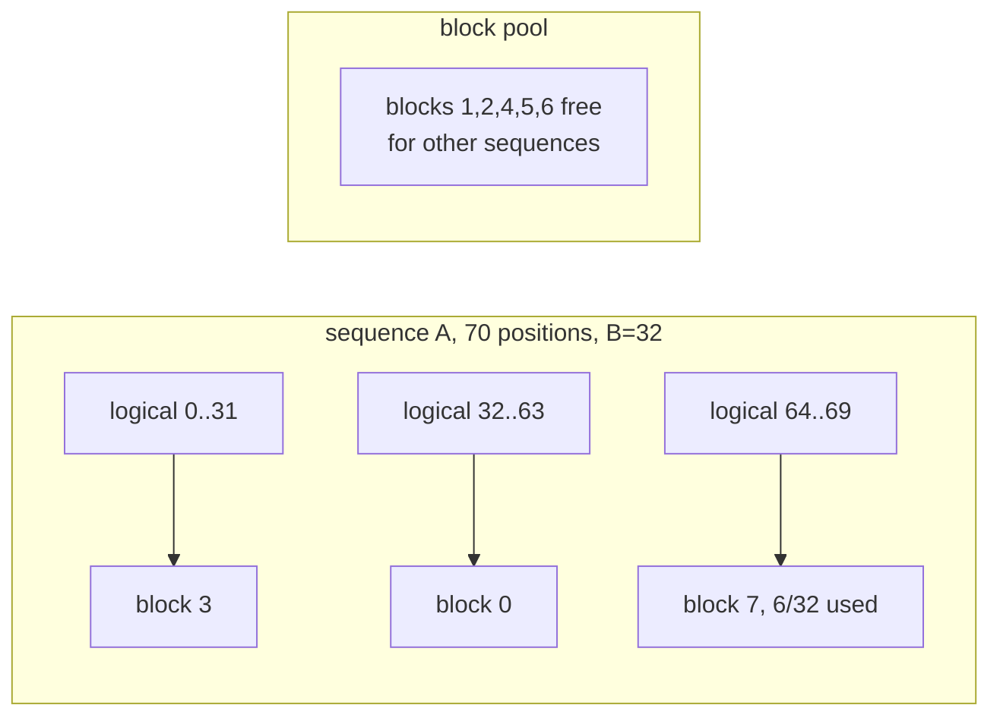

# The KV cache

The KV cache is the largest allocation in a serving process after the weights,
the only one that scales with concurrency, and the one whose shape decides
whether batching is possible at all. This spec is written twice over: what tgo
builds against accel **today**, and what accel
[043](https://github.com/golang-design/accel/blob/main/specs/043-per-row-values.md)
changes.

## 1. What accel gives, exactly

### 1.1 What is reachable today

```go
func NewState(b *Builder, d StateDesc) *State
func LayerState(b *Builder, s *State, layer int) *State
func ScatterRows(b *Builder, s *State, rows, ids *Tensor) *State

type AttentionOptions struct {
    Lengths   *Tensor // u32, one entry per sequence
    Pages     *Tensor // u32 page table, optional; nil means contiguous
    Block     int     // positions per block, required with Pages
    ScaleName string  // f32 scalar, 1/√d — a model constant, so a scalar
    BaseName  string  // u32 scalar, a prefill's first position
}
func Attention(b *Builder, q *Tensor, k, v *State, opts AttentionOptions) *Tensor
```

`State` is caller-owned mutable storage the planner never aliases. It is a
**version**, not a handle: `ScatterRows` returns the next version and reading an
earlier one is refused, which turns write-then-read into an ordinary DAG edge
rather than a rule the planner is told. tgo therefore orders nothing by hand.

Since 2026-08-24 the cache may be **f16**, and `Pages` binds a **page table** —
both asked for by tgo and both landed. What remains, verified by probe rather
than by reading commits:

| | state |
| --- | --- |
| capacity ≤ 128 positions | [C11](010-conformance.md) — **closed 2026-08-24** |
| a `LayerState` view at a non-zero offset | [C12](010-conformance.md) — **closed**; the cache is 2 states, not $2L$ |
| `q`'s rank is the *phase*, so there is no batch axis | [C1](010-conformance.md) and [C16](010-conformance.md) — both **closed**; a batch is a flat rank-3 `q` plus one `QueryExtents` entry per sequence ([accel 046](https://github.com/golang-design/accel/blob/main/specs/046-segmented-extents.md)), not a rank-4 `q` |

**Every constraint this section was written around is gone.** The table is kept
rather than deleted because the arithmetic in [§3](#3-the-number-before-and-after)
is what argued them closed, and a reader who meets that argument should be able
to see what it was arguing against.

### 1.2 Paging is a binding, not a second cache

accel 043 §4 is explicit that a `State` addressed through a page table is the
**same** `State`, and that a `PagedState` beside `State` would be the
non-orthogonal growth 043 exists to avoid. `Pages` is nil-able: nil is a
contiguous cache, which is the same thing with an identity table.

That matters to tgo more than it looks. **There is one cache type and one code
path**, and turning paging on is binding a tensor rather than choosing a
different implementation. [005-D5](#decision-record) was written expecting to
rebind, and rebinding is all it turned out to be.

## 2. Addressing

### 2.1 Contiguous, which is the degenerate case

A contiguous cache is a paged one with an identity table and a block size of
one, so this is not a second design — it is the shape tgo binds when `Pages` is
nil. **One state per role, sliced per layer** — two allocations for the whole model:

$$\text{Shape}_{K} = \text{Shape}_{V} = [\,L,\; C,\; H_{kv},\; d_h\,]$$

with $L$ layers, per-layer capacity $C$, $H_{kv}$ key/value heads and head
dimension $d_h$. Layer $\ell$'s window is `LayerState(b, s, ℓ)`, giving
`[C, H_kv, d_h]`, and position $t$ of layer $\ell$ is row $t$ of that.

> **This is the design tgo wanted, and for one milestone it could not have it.**
> `Attention` and `ScatterRows` both refused a view at a non-zero offset, with
> the instruction "use one state per layer" — 72 states, ports and bindings for a
> 36-layer model where the natural count is two. tgo filed it as
> [accel#9](https://github.com/golang-design/accel/issues/9); accel closed it,
> and a probe confirms both operators now bind a layer view.
> [C12](010-conformance.md).
>
> The prediction in the original report held: it was subsumed by the paging work,
> because a page table is inherently a ranged view into a larger allocation and
> whatever makes `Pages` bindable makes an offset bindable.

The cost is that layer windows must be *proven* disjoint rather than disjoint by
construction, which is the test in §7.

### 2.2 Paged, which is what tgo builds

The rows a sequence owns stop being contiguous. A page table maps the
sequence's logical position to a physical block:

$$\text{row}(\ell, t) = \text{pages}\!\left[\left\lfloor t/B \right\rfloor\right]\cdot B + (t \bmod B)$$

with $B$ the block size in positions. The blocks need not be adjacent, which is
the entire point: capacity is allocated per block as a sequence grows rather
than reserved per sequence at admission.



Only the **last** block of a sequence is partly used, so waste is bounded by
$B-1$ positions per sequence rather than $C - T$.

### 2.3 The ceiling that used to be here

`Attention` refused any cache longer than the decode kernel's workgroup width of
**128 positions**, and the check bound prefill too. A 128-token context is below
a system prompt's overhead, so every number in §3 described memory tgo could not
allocate.

**Closed on 2026-08-24.** accel
[044](https://github.com/golang-design/accel/blob/main/specs/044-unbounded-context.md)
replaced the lane-per-position geometry with a tiling loop carrying a running
maximum, denominator and output accumulator, so capacity left the launch geometry
entirely. A 4096-position cache is verified working. tgo asked for it in
[accel#8](https://github.com/golang-design/accel/issues/8) and wrote the design;
accel implemented it with five recorded deviations.

**What replaced it is closed too.** A paged *prefill* accepted `Pages`, dropped
it, and read the cache contiguously — an acceptance rather than a refusal,
measured at a worst absolute difference of 0.74 between an identity and a
reversed page table. accel fixed it: `model/paged_test.go:65` prefills through a
reversed table and gets the contiguous run's logits bit for bit, with the
negative control at `:131` writing contiguously and reading through the
permutation, which moves the output. [010 C13](010-conformance.md),
[accel#10](https://github.com/golang-design/accel/issues/10).

What it cost was a day of a false green. The probe asserted the `base` scalar
rather than the output, so a prefill that dropped its table recorded as working —
which is [010-D7](010-conformance.md), and which is why §7's third bullet asserts
against the host oracle. Cross-request block sharing, the consequence this
paragraph used to draw, is built: the shared block pool ships (`blocks.go`,
`internal/prefix`), and [016](016-prefix-cache.md) owns its policy.

## 3. The number, before and after

$$M_{kv} = 2 \cdot L \cdot C \cdot H_{kv} \cdot d_h \cdot w$$

with $w$ the stored width in bytes. For a Qwen3-4B-shaped model — $L=36$,
$H_{kv}=8$, $d_h=128$ — the per-position cost is $2 \cdot 36 \cdot 8 \cdot 128
= 73728$ elements, so **288 KB per position in f32** and 144 KB in f16.

| context $C$ | f32 contiguous (the default) | f16 contiguous | f16 paged, 200 real tokens |
| --- | --- | --- | --- |
| 2048 | 0.60 GB | 0.30 GB | 0.03 GB |
| 4096 | 1.21 GB | 0.60 GB | 0.03 GB |
| 8192 | 2.42 GB | 1.21 GB | 0.03 GB |
| 32768 | 9.66 GB | 4.83 GB | 0.03 GB |

The last column is the argument. A contiguous cache is billed for $C$; a paged
one is billed for what the sequence actually holds, rounded up to a block. Ten
concurrent 200-token chats on a 32k-capable server cost **96.6 GB** contiguous
in f32 and **0.3 GB** paged in f16 — a factor of 322, and it is why
[010 C4](010-conformance.md) is the register's most expensive row rather than
C5.

Two accel constraints produced the two halves of that factor. **Both are now
closed**, and neither pays yet:

- ~~**f32 only** doubles it.~~ Closed. 043 §5 accepted the argument — K and V are
  *operands*, not accumulators, and $\text{softmax}(qK^\top/\sqrt{d})V$
  accumulates in f32 whatever they are stored as.
- ~~**contiguous only** multiplies it by $C/T$.~~ Closed. `Pages` binds a page
  table.

**The last column is reachable, and one option selects it.** `WithPrefixCache(CacheProcess, n)`
binds the model's shared block pool, which is paged and f16 at any capacity
(`blocks.go:88`). Without it the scope is `CacheOff` (`options.go:117`) and a
session allocates its own contiguous f32 cache (`session.go:794-798`) — column
one, by choice: a session's own cache is sized to one conversation, so halving it
buys one conversation's memory, while the pool is the allocation that scales with
concurrency. Every constraint this spec was written around has been removed
upstream.

## 4. What tgo does now

One state pair, `LayerState` per layer, one `Session` per conversation. Prefill
scatters $T$ rows at positions $0..T-1$; each decode step scatters one row at
position $t$ and increments.

`C` is a **session parameter, not a model parameter**, and it defaults to 4096
rather than the model's `max_position_embeddings`. Qwen3 advertises 32768; a
default of that would reserve 9.66 GB before the first token, on a machine that
may not have it. Raising it **with `WithContext` prints the number from §3 at model open, before
any session allocates**, because a user who asks for 32k context should learn
what it costs at the moment they ask, not from an out-of-memory error. The print
is the model-wide option's alone: `WithSessionContext` raises one session's
capacity past the default and prints nothing (`options.go:165-174`).

## 5. Position, and the thing that stopped being true

`ScatterRows` takes ids as device data, so *where* a row lands is a runtime
value. `RoPE` — until accel's current change — took `Offset` as a scalar and
computed $\text{pos} = r + \text{Offset}$, so *what position a row is* was a
per-dispatch constant.

Those two disagreed, and the disagreement was invisible for one sequence: a
prefill's row $r$ *is* position $r$ at offset 0, and a decode's single row is
position $t$ at offset $t$.

**As of accel's current tree, `RoPE(b, x, rotaryDim, baseName, positions *Tensor)`
takes one position per row**, and refuses a positions tensor whose length does
not match the row count. tgo builds against that signature: a prefill binds
$[0..T-1]$, a decode binds $[t]$. The single-sequence case is a one-row tensor
rather than a special case — which is 043 §3's orthogonality test, and it means
tgo has no batched path to write later, only a wider binding.

## 6. The migration, and why it is small

Recorded now so it is not rediscovered:

| what changed | from | to | state |
| --- | --- | --- | --- |
| positions | scalar `Offset` | a bound u32 tensor | **done** |
| dtype | f32 states | f16 states, readable **and writable**, composing with paging | **done** |
| cache length | scalar `CurrentLengthName` | `AttentionOptions.Lengths` | **done** |
| addressing | `row = ℓC + t` | `row = pages[⌊t/B⌋]·B + t mod B` | **done** |
| prefill base | scalar `BaseName` | per row | **not moving**: a prefill is one sequence, so there is no row for it to differ across. accel corrected its own table here, and the reasoning holds until batched prefill exists |
| capacity | $C \le 128$ | unbounded | **done**, [C11](010-conformance.md); a 4096-position default runs ([accel 044](https://github.com/golang-design/accel/blob/main/specs/044-unbounded-context.md)) |
| layer views | one state per layer | a bound sub-range | **done**, [C12](010-conformance.md); bound at `model/qwen3_graph.go:88` |

**Six of seven landed within a day of being asked for, and every one was a
binding change.** That is [005-D5](#decision-record) paying off: tgo built no
second path to switch to, and there was nothing to switch.

Every row is a **binding** change. None is a structural one, because the plan's
shape does not depend on which of these it reads — and that is exactly why
[008 §5](008-scheduler.md) requires tgo to address the cache through a
`Session` rather than through a global offset, and to leave the batch dimension
present at 1 rather than absent.

**tgo does not build a second cache implementation to switch to.** It builds
one, against the signatures accel has, and rebinds.

## 7. Tests

- **Prefill then decode.** Prefill $T$ tokens, decode one, and assert the
  attention output equals a host reference over the same $T+1$ rows. This is
  accel's own `TestPrefillAndDecodeAgree` invariant, one layer up, on a real
  model's shapes.
- **Layer windows are disjoint.** Writing layer $i$ leaves every byte of layer
  $j \ne i$ unchanged. This is the test §2.1 buys its two allocations with, and
  it is no longer trivial now that the layers share one buffer.
- **A paged prefill's output matches the host oracle**, not merely its `base`
  scalar. Asserting the scalar is what let [C13](010-conformance.md) pass as
  working for a day.
- **A stale version is refused.** accel guarantees it; tgo depends on it, so the
  test lives here too.
- **The §3 arithmetic is a function**, and a table test checks it against the
  numbers above. A memory model nobody executes is a comment.
- **Capacity refusal.** Asking for a context the device cannot hold fails at
  session creation with the number, not at the first token.

## Outcome

The KV cache is built and running. A model holds one key state and one value
state of shape $[L, C, H_{kv}, d_h]$, a layer is a `LayerState` view of them, and
a position is a row addressed either contiguously or through a page table by the
one formula in §2.2. The contiguous half landed 2026-08-25 with the forward pass,
the page-table port on 2026-08-26, and the shared f16 block pool on 2026-08-27,
so every constraint this spec was written around closed inside three days of the
tree existing.

**What shipped**, section by section:

| section | what landed | where |
| --- | --- | --- |
| 1.1 | all four signatures bound as written; `State` versioning orders the writes, so tgo hand-orders nothing | `nn/attention.go:214-226` |
| 1.2 | one cache type and one code path; `Pages` is nil-able at every layer and half a paged binding is refused | `nn/attention.go:135-143`, `nn/refuse_test.go:165` |
| 2.1 | two allocations for the whole model, sliced per layer — 005-D1 as restored, 2 states and not 72 | `model/graph.go:229-231`, `model/qwen3_graph.go:88` |
| 2.2 | $\text{row}(t) = \text{pages}[\lfloor t/B \rfloor] \cdot B + t \bmod B$ implemented once, used by both the host slot fill and the page-table binding | `plan.go:160-165` |
| 2.3 | a permuted page table gives the contiguous run's logits bit for bit, with a negative control; reach past the table is refused | `model/paged_test.go:65`, `:131`, `:208` |
| 3 | the arithmetic is a function and takes the width term $w$, table-tested against §3's own numbers | `cmd/tgo/info.go:286`, `cmd/tgo/info_test.go:26` |
| 4 | one `Session` per conversation, $C$ a session parameter defaulting to 4096, and the 005-D3 cost print at model open | `options.go:96`, `session.go:117-165`, `model.go:205-214` |
| 5 | `RoPE` binds a positions tensor per row, separate for `q` and `k` because GQA makes the two row counts differ; a decode is one row of the same port | `nn/attention.go:206-207`, `model/graph.go:26-33` |
| 6 | six of the seven migration rows are binding changes that landed; the seventh is not moving | this file, §6 |
| 7 | bullets 1, 3 and half of 5: prefill/decode agreement at block and engine level, a paged prefill against a contiguous reference, and the per-position arithmetic table-tested | `nn/attention_test.go:296`, `:361`, `engine_test.go:92`, `model/paged_test.go:65`, `cmd/tgo/info_test.go:26` |

**What diverged** from the design, and why the code is right:

- **§7's two missing tests landed on 2026-08-27.** The layer-disjointness check
  was a positive control inside
  `TestPaddedPrefillLeavesCacheRowsBeyondTUntouched` that indexed `p*row` with
  no layer stride, so it read layer 0's rows again for every layer and proved
  the write for layer 0 alone. It now counts written rows per layer, and
  asserts that two layers do not hold identical bytes — the count alone cannot
  see aliased layers, because both then read as written. The stale-version
  refusal is `internal/conformance/state_test.go`, with the overlap half beside
  it: a write to one layer must **not** stale another's read, or 005's design
  of two states sliced per layer would not compile at all.

- **§3's width term reached `cacheBytes` on 2026-08-27**, and until then did
  not. The function hardcoded f32 while `cmd/tgo`'s `kvBytesPerPosition` took a
  dtype and priced it correctly, so under `--prefix-cache process` the library
  reported twice what the f16 pool costs and the command line reported the
  truth — two numbers for one quantity, neither obviously the wrong one. It now
  takes the width, chosen by the scope the way `Session.cacheDType` chooses it,
  and is table-tested against the same worked example §3 states.

- **§3's arithmetic is implemented twice and only the CLI copy takes $w$.**
  `cmd/tgo/info.go:286` is the version §3 describes; `model.go:504` hardcodes
  `const f32 = 4`. The split is not right, and it is the open item below.
- **§5 is stricter than written.** The spec asks for one position per row; the
  code binds two position ports, `posQ` and `posK`, because grouped-query
  attention gives the query rows and the key rows different counts. One port
  would have to be reshaped or refused.
- **§7's capacity refusal is at request admission, not at session creation.**
  `NewSession` validates only that the context is positive; the refusal with the
  number is `ErrContextExhausted`, raised against prompt length plus `MaxTokens`
  before any prefill (`session.go:486-499`). That is the better line: a session
  that fits at creation can still be asked for more tokens than it holds, and the
  request is where the caller can act.
- **The cost print is the model-wide option's alone.** 005-D3 reads as though any
  raise prints; `WithSessionContext` raises one session and prints nothing. A
  print per session would be noise in a server that opens thousands.
- **A session does not always own its cache.** Under `CacheProcess` it binds the
  model's shared pool, the dtype flips to f16, and addressing splits into `rows`
  and `limit`. §2 describes neither, which is open work below.

**Not built.** Deciding where §7's capacity refusal lives: today the number-carrying refusal is
the server's, in `kvAdmission` (`cmd/tgo/serve.go:329`), and the library's is
`ErrContextExhausted` at request admission — either move that arithmetic behind
`NewSession` or amend §7 and the decision record to say the server owns it. Documenting the
shared-pool addressing in §2, as addressing rather than as caching policy: the
`rows`/`limit` split and the pad-row sentinel it protects (`plan.go:139-195`),
the f16 pool binding and the two casts per layer it costs (`blocks.go:88`,
`nn/attention.go:214-226`), `CacheBlock = 32` (`blocks.go:28`), and the
`Capacity % Block` refusal (`model/graph.go:317-321`). A cache that is per layer
kind — a hybrid holding three state shapes in one forward pass — is
[023](023-cache-kinds.md)'s, not this spec's: §2's shape is one shape for every
layer, which holds for a dense transformer and not for a hybrid.

## Decision record

| id | decision | rejected | consequence |
| --- | --- | --- | --- |
| 005-D1 | **one state pair for the model, `LayerState` per layer** | one state per layer | **Amended twice on 2026-08-24, and it ends where it started.** First written as one pair; corrected to $2L$ when `Attention` was found to refuse a layer view; restored when [accel#9](https://github.com/golang-design/accel/issues/9) closed and a probe confirmed both `Attention` and `ScatterRows` bind one. 2 allocations, not 72 |
| 005-D2 | context capacity is a session parameter defaulting to 4096 | the model's `max_position_embeddings` | a 32k default would reserve 9.66 GB before the first token |
| 005-D3 | print the cache cost when capacity is raised | allocate and fail | the user learns the number when they ask, not from an OOM |
| 005-D4 | no paging, no f16 cache; both filed upstream | a private page table in tgo | forbidden by [000 D1](000-decisions.md); the arithmetic *was* the filing. **Amended 2026-08-24 (twice):** accel 043 adopted both, then landed both. tgo now builds a paged f16 cache and it pays today: the shared pool is allocated f16 (`blocks.go:88`), the projected rows are narrowed before `ScatterRows` (`nn/attention.go:214-226`), and the halving is measured by `kvBytesPerPosition` — 288 KB per position in f32 against 144 KB in f16 (`cmd/tgo/info_test.go:26-45`) |
| 005-D5 | build one cache path against today's signatures and rebind | a paged path behind a flag, switched when 043 lands | **Vindicated.** Six of the seven changes in §6 landed within a day, all as binding changes. A flagged second path would have been written and deleted without ever running |
| 005-D6 | follow the "use one state per layer" instruction rather than route around it | reshape the cache to hide the refusal | the noise was visible and filed, and the filing is what closed it. A hidden workaround would still be in the code |
| 005-D7 | do not compose attention from primitives to beat the 128 ceiling | build score-MatMul / Softmax / value-MatMul in tgo | forbidden by [000 D1](000-decisions.md); accel 007 assigns the fallback to `Attention`, and composing it here would hide the register's most important row |
