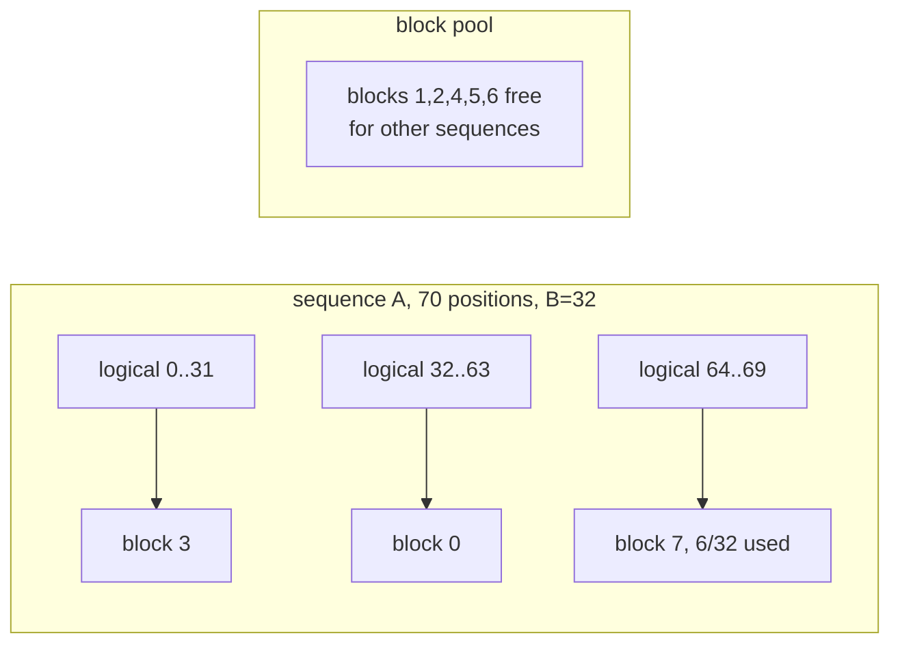

# The KV cache

The KV cache is the largest allocation in a serving process after the weights,
the only one that scales with concurrency, and the one whose shape decides
whether batching is possible at all. This spec is written twice over: what tgo
builds against accel **today**, and what accel
[043](https://github.com/golang-design/accel/blob/main/specs/043-per-row-values.md)
changes.

## 1. What accel gives, exactly

### 1.1 Today

```go
type StateDesc struct { Name string; DType DType; Shape Shape }

func NewState(b *Builder, d StateDesc) *State
func ReadState(b *Builder, s *State) *Tensor
func LayerState(b *Builder, s *State, layer int) *State
func ScatterRows(b *Builder, s *State, rows *Tensor, ids *Tensor) *State

type AttentionOptions struct {
    CurrentLengthName string  // u32 scalar: how much of the cache is real
    ScaleName         string  // f32 scalar: 1/√d
    BaseName          string  // u32 scalar: a prefill's first position
}
func Attention(b *Builder, q *Tensor, k, v *State, opts AttentionOptions) *Tensor
```

`State` is caller-owned mutable storage the planner never aliases. It is a
**version**, not a handle: `ScatterRows` returns the next version, and reading
an earlier one is refused. That is what turns write-then-read into an ordinary
DAG edge rather than a rule the planner has to be told, and it is why tgo does
not need to order anything by hand.

Three constraints follow, and each is a row in [010](010-conformance.md):

- ~~`Attention` refuses anything but f32~~ — **closed 2026-08-24**: it accepts an
  f16 cache and accumulates f32, which halves the numbers in §3;
- there is no page table binding, and `tensor/internal/pagetable` is
  **unexported** — accel 030's package comment says why: no exported operator
  accepts one;
- the per-sequence values are **scalars**, one per dispatch.

### 1.2 After accel 043

```go
type AttentionOptions struct {
    ScaleName string   // unchanged: a model constant every row shares
    Lengths   *Tensor  // u32, one per row
    Positions *Tensor  // u32, one per row
    Pages     *Tensor  // u32, the page table
}
```

`Attention` **already accepts f16 states** as of accel 701b645, so [C5](010-conformance.md)
has closed and the f16 column of §3 is now the one tgo builds against. `State`
does **not** gain a paged variant:
043 §4 is explicit that a `State` addressed through a page table is the same
`State`, and that a `PagedState` beside `State` would be exactly the
non-orthogonal growth 043 exists to avoid.

That matters to tgo more than it looks. It means **there is one cache type, not
two**, so the migration in §6 is a binding change, not a second code path.

## 2. Addressing

### 2.1 Contiguous, which is what tgo builds today

**Two states per layer**, $2L$ in total:

$$\text{Shape}_{K_\ell} = \text{Shape}_{V_\ell} = [\,C,\; H_{kv},\; d_h\,]$$

with per-layer capacity $C$, $H_{kv}$ key/value heads and head dimension $d_h$.
Position $t$ of layer $\ell$ is row $t$ of state $\ell$.

> **This is not the design tgo wanted.** One state of $[L \cdot C, H_{kv}, d_h]$
> with `LayerState(b, s, ℓ)` per layer is the natural shape, and it is what
> `LayerState` exists for. `Attention` refuses it:
>
> ```
> a layer view binds a range of a resource, which a slot cannot express yet;
> use one state per layer
> ```
>
> So a 36-layer model declares **72 states**, 72 ports, and 72 entries in
> `Bindings.Buffers`, where the natural count is two. Filed as
> [accel#9](https://github.com/golang-design/accel/issues/9) and
> [010 C12](010-conformance.md). The instruction in the refusal is followed
> rather than worked around, and it is likely subsumed by 043's `Pages` binding:
> a page table is inherently a ranged view into a larger allocation, so whatever
> makes `Pages` bindable probably makes a non-zero offset bindable too.

### 2.2 Paged, after 043

The rows a sequence owns stop being contiguous. A page table maps the
sequence's logical position to a physical block:

$$\text{row}(\ell, t) = \text{pages}\!\left[\left\lfloor t/B \right\rfloor\right]\cdot B + (t \bmod B)$$

with $B$ the block size in positions. The blocks need not be adjacent, which is
the entire point: capacity is allocated per block as a sequence grows rather
than reserved per sequence at admission.



Only the **last** block of a sequence is partly used, so waste is bounded by
$B-1$ positions per sequence rather than $C - T$.

## 2.3 The ceiling: 128 positions

`Attention` refuses any cache longer than the decode kernel's workgroup width,
and that width is **128**:

$$C \le \texttt{AttentionDecodeKernel.WorkgroupSize.X} = 128$$

The check sits above the prefill branch, so it binds prefill too. The kernel
gives each query head a workgroup and **each lane one cached position**, so
capacity is part of the launch geometry rather than a loop bound.

**This is the wall, and it is not a cost like the rest of this spec.** A
128-token context is below the chat template's overhead for a system prompt.
Every table in §3 describes memory tgo cannot currently allocate, because the
operator will not accept a $C$ large enough to need it.

Raising the workgroup does not fix it — 1024 lanes buys 1024 positions and is
still short of any real conversation. The shape has to change to an online
softmax that loops over positions with a running max and sum:

$$m_i = \max(m_{i-1}, s_i), \quad
\ell_i = \ell_{i-1}e^{m_{i-1}-m_i} + e^{s_i-m_i}, \quad
o_i = o_{i-1}e^{m_{i-1}-m_i} + e^{s_i-m_i}v_i$$

so that $C$ leaves the geometry entirely.

**This is now designed upstream** as
[accel 044](https://github.com/golang-design/accel/blob/main/specs/044-unbounded-context.md),
which also records the ordering that matters to tgo: the f16 variant and a paged
kernel are the *same* tiling loop, so three registered kernels pass through one
rewrite. Filed as [accel#8](https://github.com/golang-design/accel/issues/8) and
[010 C11](010-conformance.md). 044 §6 keeps on the table the fallback accel 007
already specifies — the composed score-`MatMul` / `Softmax` / value-`MatMul` graph, which
007 calls the correctness reference and which `Contiguous` now makes
expressible.

**tgo does not build that composition.** It is precisely the route-around that
[000 D1](000-decisions.md) forbids, accel 007 assigns the choice to `Attention`,
and a consumer that quietly composes its own attention stops reporting the gap
that matters most.

## 3. The number, before and after

$$M_{kv} = 2 \cdot L \cdot C \cdot H_{kv} \cdot d_h \cdot w$$

with $w$ the stored width in bytes. For a Qwen3-4B-shaped model — $L=36$,
$H_{kv}=8$, $d_h=128$ — the per-position cost is $2 \cdot 36 \cdot 8 \cdot 128
= 73728$ elements, so **288 KB per position in f32** and 144 KB in f16.

| context $C$ | f32 contiguous (today) | f16 contiguous | f16 paged, 200 real tokens |
| --- | --- | --- | --- |
| 2048 | 0.60 GB | 0.30 GB | 0.03 GB |
| 4096 | 1.21 GB | 0.60 GB | 0.03 GB |
| 8192 | 2.42 GB | 1.21 GB | 0.03 GB |
| 32768 | 9.66 GB | 4.83 GB | 0.03 GB |

The last column is the argument. A contiguous cache is billed for $C$; a paged
one is billed for what the sequence actually holds, rounded up to a block. Ten
concurrent 200-token chats on a 32k-capable server cost **96.6 GB** contiguous
in f32 and **0.3 GB** paged in f16 — a factor of 322, and it is why
[010 C4](010-conformance.md) is the register's most expensive row rather than
C5.

Two accel constraints produce the two halves of that factor independently:

- ~~**f32 only** doubles it.~~ **Closed.** 043 §5 accepted the argument — K and V
  are *operands*, not accumulators, and $\text{softmax}(qK^\top/\sqrt{d})V$
  accumulates in f32 whatever they are stored as — and `Attention` now takes an
  f16 cache. tgo builds against the f16 column.
- **contiguous only** multiplies it by $C/T$. 043 §4 binds `Pages`.

## 4. What tgo does now

One state pair, `LayerState` per layer, one `Session` per conversation. Prefill
scatters $T$ rows at positions $0..T-1$; each decode step scatters one row at
position $t$ and increments.

`C` is a **session parameter, not a model parameter**, and it defaults to 4096
rather than the model's `max_position_embeddings`. Qwen3 advertises 32768; a
default of that would reserve 9.66 GB before the first token, on a machine that
may not have it. Raising it **prints the number from §3 before allocating**,
because a user who asks for 32k context should learn what it costs at the moment
they ask, not from an out-of-memory error.

## 5. Position, and the thing that stopped being true

`ScatterRows` takes ids as device data, so *where* a row lands is a runtime
value. `RoPE` — until accel's current change — took `Offset` as a scalar and
computed $\text{pos} = r + \text{Offset}$, so *what position a row is* was a
per-dispatch constant.

Those two disagreed, and the disagreement was invisible for one sequence: a
prefill's row $r$ *is* position $r$ at offset 0, and a decode's single row is
position $t$ at offset $t$.

**As of accel's current tree, `RoPE(b, x, rotaryDim, baseName, positions *Tensor)`
takes one position per row**, and refuses a positions tensor whose length does
not match the row count. tgo builds against that signature: a prefill binds
$[0..T-1]$, a decode binds $[t]$. The single-sequence case is a one-row tensor
rather than a special case — which is 043 §3's orthogonality test, and it means
tgo has no batched path to write later, only a wider binding.

## 6. The migration, and why it is small

Recorded now so it is not rediscovered:

| what changes | from | to | state |
| --- | --- | --- | --- |
| positions | scalar `Offset` on the plan | a bound u32 tensor | **done** |
| dtype | f32 states | f16 states | **done** |
| cache length | scalar `CurrentLengthName` | `AttentionOptions.Lengths` | designed |
| prefill base | scalar `BaseName` | `AttentionOptions.Positions` | designed |
| addressing | `row = ℓC + t` | `row = pages[⌊t/B⌋]·B + t mod B` | designed |
| capacity | $C \le 128$ | unbounded | designed, [accel 044](https://github.com/golang-design/accel/blob/main/specs/044-unbounded-context.md) |

Every row is a **binding** change. None is a structural one, because the plan's
shape does not depend on which of these it reads — and that is exactly why
[008 §5](008-scheduler.md) requires tgo to address the cache through a
`Session` rather than through a global offset, and to leave the batch dimension
present at 1 rather than absent.

**tgo does not build a second cache implementation to switch to.** It builds
one, against the signatures accel has, and rebinds.

## 7. Tests

- **Prefill then decode.** Prefill $T$ tokens, decode one, and assert the
  attention output equals a host reference over the same $T+1$ rows. This is
  accel's own `TestPrefillAndDecodeAgree` invariant, one layer up, on a real
  model's shapes.
- **Layer states are independent.** Writing layer $i$ leaves every byte of layer
  $j \ne i$ unchanged. Trivially true with $2L$ states, and the test stays
  because it is what would break first if [accel#9](https://github.com/golang-design/accel/issues/9)
  lands and tgo collapses to one pair.
- **The capacity ceiling is a named refusal.** Asking for $C > 128$ fails with
  accel's message and a pointer to C11, rather than as an opaque compile error.
- **A stale version is refused.** accel guarantees it; tgo depends on it, so the
  test lives here too.
- **The §3 arithmetic is a function**, and a table test checks it against the
  numbers above. A memory model nobody executes is a comment.
- **Capacity refusal.** Asking for a context the device cannot hold fails at
  session creation with the number, not at the first token.

## Decision record

| id | decision | rejected | consequence |
| --- | --- | --- | --- |
| 005-D1 | ~~one state pair for the model, `LayerState` per layer~~ → **two states per layer, $2L$ total** | the one-pair design | **Amended 2026-08-24, and it was wrong as first written.** `Attention` refuses a layer view outright and says "use one state per layer". 72 states for a 36-layer model. [accel#9](https://github.com/golang-design/accel/issues/9) |
| 005-D2 | context capacity is a session parameter defaulting to 4096 | the model's `max_position_embeddings` | a 32k default would reserve 9.66 GB before the first token |
| 005-D3 | print the cache cost when capacity is raised | allocate and fail | the user learns the number when they ask, not from an OOM |
| 005-D4 | no paging, no f16 cache; both filed upstream | a private page table in tgo | forbidden by [000 D1](000-decisions.md); the arithmetic *was* the filing. **Amended 2026-08-24:** accel 043 §4 and §5 adopt both. tgo still builds neither, because 043 is designed and unbuilt. |
| 005-D5 | build one cache path against today's signatures and rebind | a paged path behind a flag, switched when 043 lands | 043 §4 makes paging a binding, not a second `State`; two paths would be two code paths for one mechanism |
| 005-D6 | follow the "use one state per layer" instruction rather than route around it | reshape the cache to hide the refusal | the noise is visible and filed; a hidden workaround would not be |
| 005-D7 | do not compose attention from primitives to beat the 128 ceiling | build score-MatMul / Softmax / value-MatMul in tgo | forbidden by [000 D1](000-decisions.md); accel 007 assigns the fallback to `Attention`, and composing it here would hide the register's most important row |
