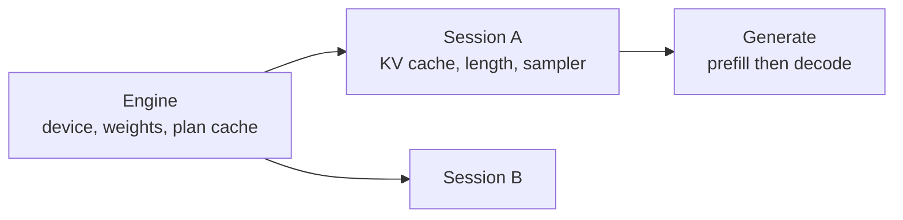

# The engine

Everything above the graph and below the API.

## 1. The objects



- **`Engine`** owns the device, the uploaded weights, and the plan cache. One
  per process per model. Weights are immutable and shared; nothing about a
  request touches it.
- **`Session`** owns a KV cache, a length, and a sampler. It is a conversation.
  Sessions are independent and do not share cache.
- **`Generate`** runs prefill then a decode loop, streaming tokens.

`Engine` is safe for concurrent use. A `Session` is not, and says so: two
goroutines decoding one session would interleave writes into one cache, and
serialising internally would hide a caller bug rather than report it.

## 2. Plans and buckets

`tensor.PlanCache` keys on the recorded graph's identity, so the same builder
function called twice returns one plan. tgo records:

- **one decode plan**, shape-fixed at $T=1$, compiled once;
- **one prefill plan per bucket**, compiled on first use.

Buckets come from `tensor.Buckets`. The default set is
$\{32, 64, 128, 256, 512, 1024, 2048, 4096\}$ — powers of two, because the
padding cost of rounding $T$ up to the next power of two is at most $T$ wasted
rows and averages half that, against a plan count that is logarithmic in the
context.

$$\text{waste} = \frac{B(T) - T}{T}, \quad \mathbb{E}[\text{waste}] \approx 0.5 \text{ for uniform } T$$

Halving the waste by doubling the bucket count doubles the compiles. The set is
configurable and the default is defensible, not optimal.

Padding rows are **computed**, and their outputs discarded — they are not
masked. A padded row attends over the same cache and produces a logit row nobody
reads; it must not write KV, so the scatter ids for padding point at a scratch
row outside the sequence's window.

> This is a correctness trap: pad rows that scatter into the real cache corrupt
> it, and the corruption appears as a quality loss much later. The test in §6
> checks the cache bytes after a padded prefill.

## 3. The decode loop

```
prefill(prompt)             -> logits[last]
loop:
  token = sample(logits)
  if stop(token): break
  logits = decode(token)
```

One submission per step. accel's `Plan.Submit` returns a fence; the loop waits
on it, reads one row of logits back, samples on the host, and submits again.

**The readback is the loop's cost floor.** Each step transfers $V$ f32 values —
608 KB for Qwen3 — plus a round trip's latency. Two things follow, and neither
is v0:

- **Sampling on the device** removes the readback entirely; only the chosen id
  comes back, 4 bytes. accel 028's kernels exist and accel 039's composition
  does not, which is [006 §1](006-sampling.md).
- **Overlapping the next submission with sampling** needs the sampled token to
  reach the device without a host round trip, which is the same dependency.

v0 measures the floor and reports it. [010](010-conformance.md) holds the
number, because "how much of a decode step is the readback" is exactly the kind
of question tgo exists to answer for accel.

## 4. Weights are uploaded once and never rebound

A `tensor.Weight` port tells the plan cache the value does not change between
submissions. Every weight is a `Weight`; the token ids, the RoPE offset, and the
cache are `Input`, `Scalar` and `State`. Getting this wrong does not produce a
wrong answer — it produces a plan cache that misses on every step.

## 5. Errors

A device failure mid-generation ends the stream with the error and leaves the
session **unusable**, not silently reset: the cache holds a partial write whose
extent is unknown, and continuing from it would produce plausible text from a
corrupt state. `Session.Reset` is explicit.

## 6. Tests

- Prefill then decode agrees with decoding token by token from empty (the same
  invariant accel's own `TestPrefillAndDecodeAgree` checks, one layer up).
- A padded prefill leaves the cache bytes beyond $T$ untouched.
- Plan cache: $N$ steps compile 1 decode plan; $N$ prefills of varying $T$
  compile at most one plan per distinct bucket.
- Two sessions decode independently: interleaving their steps gives the same two
  outputs as running them in sequence.
- Concurrent use of one `Engine` from many goroutines is race-clean.
- A mid-stream failure marks the session unusable.

## Decision record

| id | decision | rejected | consequence |
| --- | --- | --- | --- |
| 007-D1 | `Engine` concurrent-safe, `Session` not | lock the session | a caller bug is reported, not hidden |
| 007-D2 | power-of-two prefill buckets, configurable | exact-$T$ plans; fixed max shape | bounded compiles, ~50% mean pad on the bucketed dimension |
| 007-D3 | pad rows compute and scatter to scratch | mask them | accel has no mask input; the scratch row is provable |
| 007-D4 | host sampling with a logits readback in v0 | wait for device sampling | the floor is measured and reported upstream |
| 007-D5 | a failed step makes the session unusable | reset and continue | a partial cache write is not recoverable |
