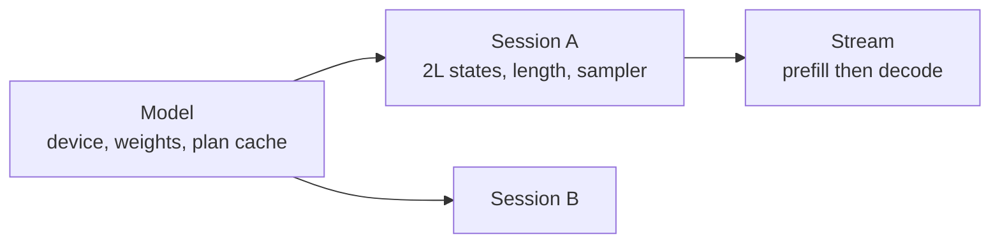

# The engine

Everything above the graph and below the API. This is also the spec that owns
**tgo's public surface**, per [000 D10](000-decisions.md): the engine is what a
caller touches, and everything under it is internal because it is where accel's
shape will move.

## 1. The public surface

```go
package tgo

// Open loads a model directory and prepares a device.
func Open(dir string, opts ...Option) (*Model, error)

type Option func(*options)

func WithDevice(d Device) Option        // CPU, Metal, or Auto (the default)
func WithPrecision(p Precision) Option  // F16, Int8, Int4, or Auto (the default).
                                        // Auto reaches for Int4 only when Int8 does not fit.
func WithContext(n int) Option          // KV capacity per session; default 4096

type Model struct{ /* ... */ }

func (m *Model) Info() Info                       // architecture, sizes, resolved device
                                                  // and precision, and the two byte counts
                                                  // 005-D3 requires before an allocation
func (m *Model) NewSession(opts ...SessionOption) (*Session, error)
func (m *Model) Close() error

type SessionOption func(*sessionOptions)

func WithSessionContext(n int) SessionOption      // this session's KV capacity; 005-D2
func WithThinking(v bool) SessionOption
func WithTools(specs ...chat.ToolSpec) SessionOption
func WithRecorder(r *bench.Recorder) SessionOption // 017
func WithCacheSalt(v string) SessionOption         // what this conversation may match; 019-D3

type Session struct{ /* ... */ }

// Chat renders messages through the model's template and generates.
// Message is chat.Message: typed blocks, not a string. See 003 section 3.1.
func (s *Session) Chat(ctx context.Context, msgs []chat.Message, p Policy) (*Stream, error)

// Complete generates from raw text, with no template.
func (s *Session) Complete(ctx context.Context, prompt string, p Policy) (*Stream, error)

func (s *Session) Reset()
func (s *Session) Close() error

// Stream yields tokens as they are produced.
type Stream struct{ /* ... */ }

func (s *Stream) Next() bool        // advances; false at end or error
func (s *Stream) Event() Event      // typed: TextDelta, ThinkingDelta, ToolArgsDelta, BlockStart/Stop
func (s *Stream) Text() string      // the text delta; empty for non-text events
func (s *Stream) Err() error
func (s *Stream) Usage() Usage      // prompt and completion token counts

type Policy struct {
    Temperature       float32
    TopK              int
    TopP              float32
    RepetitionPenalty float32
    PresencePenalty   float32
    FrequencyPenalty  float32
    PenaltyWindow     int
    Seed              uint64
    MaxTokens         int
    Stop              []string
    LogitBias         map[int]float32
    Schema            []byte   // 015: the completion parses by construction
}
```

**`Plan`, `PlanCache`, the KV block layout and the graph builders are not
exported**, because every one of them is a place accel's shape will move.

The rest of the package's surface exists and is owned elsewhere, spec by spec.
`Scheduler`, `SchedulerOptions`, `Model.NewScheduler`, `Batch`, `Model.NewBatch`,
`Work`, `Produced` and `StepResult` are [008](008-scheduler.md)'s. `Pool`,
`Model.NewPool`, `Lease` and `PoolRequest` are
[019](019-session-affinity.md)'s. `WithPrefixCache`, `CacheScope` and
`CacheBlock` are [016](016-prefix-cache.md)'s. `Policy.Schema` and
`Model.CheckSchema` are [015](015-structured-output.md)'s. §1 lists what this
spec owns and nothing else.

`Stream` is an iterator rather than a channel in the public API: a channel
obliges a caller to drain it or leak a goroutine, and an iterator makes early
return the normal case. A step is synchronous inside as well — `Stream.advance`
submits, waits, reads back and samples on the calling goroutine — and many
sequences at once arrived as the exported `Scheduler` over slots
([008](008-scheduler.md)) rather than as a channel under one `Stream`.

**`Event` is typed rather than a string** because `Text()` alone cannot tell a
caller whether the current token is inside a thinking block, which is the one
thing a chat UI must know in order to render it. `Text()` stays for callers who
do not care. The event kinds map one to one onto the IR
[009 §5](009-server.md) encodes, which is what keeps the server's adapter a
translation rather than a state machine.

## 2. The objects



- **`Model`** owns the device, the uploaded weights and the plan cache. One per
  process per model. Weights are immutable and shared; nothing about a request
  touches it.
- **`Session`** owns $2L$ KV states ([005 §2.1](005-kv-cache.md)) and a length,
  or binds the model's shared block pool and owns no states at all under
  `WithPrefixCache(CacheProcess, ...)` ([016](016-prefix-cache.md)). It is a
  conversation.
- **`Stream`** runs prefill then a decode loop, and owns the sampler and the
  grammar for one request.

`Model` is safe for concurrent use, **and that needs a lock rather than only a
claim.** `tensor.PlanCache` returns the *same* `*Plan` for an identical graph,
and `Plan.Submit` refuses a second submission while one is in flight. So two
sessions decoding at once share one decode plan and the second gets a failed
fence — not a data race, which means a `-race` test stays green while the server
returns errors under load.

**`Model` therefore holds a submission lock across submit-and-wait.** It
serialises what accel already serialises, and turns a runtime failure into
waiting.

**A `Session` is still not concurrency-safe, and says so**: two goroutines
decoding one session would interleave writes into one cache, and serialising
that internally would hide a caller's bug rather than report it. The two are not
in tension — the `Model` lock protects a resource accel shares, and the
`Session`'s absence of one reports a mistake only the caller can make.

## 3. Plans and buckets

`tensor.PlanCache` keys on the recorded graph's identity, so the same builder
function called twice returns one plan. tgo records:

- **one decode plan**, shape-fixed at $T = 1$, compiled on first use;
- **one prefill plan per bucket**, compiled on first use;
- **one batch plan per batch bucket**, compiled on first use. Its lowest rung is
  the slot count itself, because a batch's steady state is every slot decoding
  and rounding that up to 32 would run a plan far wider than the step needs
  (`batchBuckets`, `plan.go:66`; [008 §5](008-scheduler.md)).

Buckets come from `tensor.Buckets`. The default ladder is
$\{32, 64, 128, 256, 512, 1024, 2048, 4096\}$, and `bucketsFor` (`plan.go:42`)
is the set a session of capacity $C$ actually runs: **every default strictly
below $C$, then $C$ itself as the last bucket.** A graph writes every token of a
step into the cache, so `model.GraphSpec` refuses $T > C$, and a 90-token prompt
in a 100-position cache must not round up to a 128-row plan that cannot be
recorded. The ladder above is the set exactly at $C = 4096$ and nowhere else.

Powers of two, because rounding $T$ up to the next power of two wastes at most
$T$ rows and, for $T$ uniform on a bucket's span, averages

$$\mathbb{E}\!\left[\frac{B(T) - T}{T}\right] = \int_1^2 \frac{2-u}{u}\,du = 2\ln 2 - 1 \approx 0.386$$

so about 39% of the bucketed dimension is padding, against a plan count
logarithmic in the context. Halving the waste means doubling the bucket count,
and each new bucket is a compile. The set is **not configurable, and the default
is defensible rather than optimal**: nothing exposes it (`plan.go:27-31`),
because what would justify a different ladder is the compile-time-per-bucket
measurement [010 §3](010-conformance.md) asks for, and that has not been taken.

> [010 C11](010-conformance.md) closed on 2026-08-24, so every bucket is
> reachable and the measurement that would tune this set can now be taken. It is
> [011 M10](011-sequencing.md)'s job.

## 4. Padding rows, and the trap that is not one

A bucketed prefill computes $B(T) - T$ rows the completion does not come from.
**What must not happen is that they write KV**, since a pad row's key and value
are computed from a pad token and corrupt the cache for every subsequent step —
a corruption that appears as a quality loss much later and never as an error.

**A pad row is not a pad token, either.** [004 §3.2](004-model-graph.md)
computes logits for the *last row only*, and with trailing padding that row is
row $B - 1$, so a prefill that filled its pad rows with a pad token would sample
the first token of every completion from the pad token's logits. A pad row
therefore carries **the last real token at the last real position**: its causal
limit is $base + s$, which is past the last real position and clamped by
`lengths`, so it sees what the last real row sees; its query is the same token
at the same rotary angle; and every later row is elementwise in the one before.
Row $B - 1$ computes what row $T - 1$ computes (`plan.go:197-211, 250-264`).

The obvious answers are a mask input (accel has none) or a scratch row outside
the sequence's window (an extra allocation, and a row that must be proven never
read).

Neither is needed. `tensor.ScatterRows` documents its own behaviour:

> *the scatter variant; an index at or above capacity writes nothing, because a
> GPU cannot report one*

So a pad row scatters out of range and **writes nothing, by the operator's own
contract**. [010 C5](010-conformance.md) closed, so the contract now holds for
f16 as well, which is what the shared block pool stores (`blocks.go:42,88`).

The sentinel is **the bound state's row count**, `cacheLayout.rows`, and not the
session's capacity. The two were one number until a pool existed: a session's
own cache is exactly as long as its context, so "does this step fit" and "which
index does `ScatterRows` drop" had the same answer. A shared state holds every
session's blocks and a session occupies a small part of it, so keeping one
number would land a dropped pad write on a real row inside another
conversation's block (`plan.go:134-158, 257`). Real slots are page-table rows;
pad slots are `rows`. No mask, no scratch buffer, no extra allocation.

This is worth recording as a decision rather than a trick, because it depends on
a guarantee that could change, and because the "index out of range writes
nothing" behaviour is the kind of thing a reader assumes is undefined. §8 has
the test that pins it.

## 5. The decode loop

```
logits = prefill(prompt[reused:], at position reused)
publish()                       # 016: a block is offered only after it is written
loop:
  mask(logits)                  # 015's grammar, when a schema is set
  token = sample(logits)        # host: 006
  if stop(token): break
  emit(token)
  reserve(token)                # 016: a row for the step that writes its key
  logits = decode(token)
  publish(token)
```

One submission per step. `Plan.Submit` returns a fence; the loop waits, reads
one row of logits back, masks and samples on the host, and submits again.

**The prefill is the suffix only.** When a prefix matched, `reused` positions of
the prompt are already in the cache, and the suffix runs *at position* `reused`
rather than at zero: `stepData.fill` writes each row's rotary position and its
cache slot from `first + i`, and the causal mask is $pos \le base + s$, so a
suffix prefilled at zero would rotate every query by the wrong angle and let its
first token see nothing behind it ([016 §4](016-prefix-cache.md),
`stream.go:220-226`). With no prefix cache `reused` is zero and the step is the
whole prompt.

**`reserve` and `publish` bracket the step** because a shared block pool needs
them to: a generated token needs a row before the step that computes its key and
value, and that block may only be offered to another sequence once the step has
run (`stream.go:248,256`). A block published early hands another sequence
whatever was in it.

### 5.1 The readback is the floor

Each step transfers $V$ f32 values — **608 KB** for Qwen3 — plus a round trip's
latency, on a step whose useful output is 4 bytes. Two consequences, neither of
which is v0:

- **Device-side sampling** removes the readback entirely; only the chosen id
  comes back. [010 C6](010-conformance.md) **closed**: `tensor.Sample` composes
  the whole policy on the device. The upstream half is done and the outstanding
  work is tgo's own adoption of it, which is
  [020](020-device-sampling.md)'s.
- **Overlapping step $t+1$'s submission with step $t$'s sampling** needs the
  sampled id to reach the device without a host round trip — the same
  dependency, and it closed with it.

v0 measured the floor and reported it upstream, which is what closed C6. "How
much of a decode step is the readback" is exactly the question tgo exists to
answer for accel.

## 6. Weights are `Weight` ports, and getting it wrong is silent

A `tensor.Weight` port tells the plan cache the value does not change between
submissions. Every model tensor is a `Weight`; token ids and positions are
`Input`; the RoPE base and attention scale are `Scalar`; the cache is `State`.

Declaring a weight as an `Input` does not produce a wrong answer. It produces a
**plan cache that misses on every step**, which reads as "the framework is
slow". §8 asserts the hit rate rather than trusting it.

## 7. Errors

A device failure mid-generation ends the stream with the error and leaves the
session **unusable**, not silently reset: the cache holds a partial write whose
extent is unknown, and continuing from it would produce plausible text from a
corrupt state. `Session.Reset` is explicit, and a session that failed refuses
further work with the original error attached.

Context exhaustion is the same principle from the other side — it **refuses
rather than truncating** ([006 §4](006-sampling.md)), because silently dropping
a user's context is unanswerable.

## 8. Tests

| test | what it catches |
| --- | --- |
| prefill-then-decode equals decoding token by token from empty | the cache/position agreement, at the engine level |
| **a padded prefill leaves cache rows $\ge T$ byte-identical** | §4's out-of-range scatter, and pins accel's guarantee |
| $N$ decode steps compile exactly 1 plan | §6's `Weight`/`Input` mistake |
| $N$ prefills of varying $T$ compile at most one plan per distinct bucket | §3 |
| two sessions interleaved give the same outputs as run in sequence | session independence |
| **two concurrent sessions both complete**, with the same outputs as run in sequence | §2 — a `-race` test passes without this, because the failure is a refused submission rather than a race |
| a mid-stream failure marks the session unusable, with the original error | §7 |
| `Stream` abandoned early releases its resources | the iterator-vs-channel choice in §1 |
| a cancelled `context.Context` ends the stream promptly | §1 |

## Outcome

The engine is the root `tgo` package, and it runs. It landed whole in Wave 4 on
2026-08-25 — `Open`, `Model`, `Session`, `Stream`, `Policy`, `Usage`, the
submission lock, the bucketed plan cache, the pad-row scatter, the decode loop
and both error rules — and has been extended through Wave 11 with Int4, a
grammar mask, a prefix cache, a session pool and a batched step, each of which
belongs to the spec that added it. Every section of this spec has code behind
it, and every row of §8's table has a test that asserts what the row claims.

**What shipped**, section by section:

| section | what landed | where |
| --- | --- | --- |
| 1 | `Open`, `Model`, `Session`, `Stream`, `Policy`, `Usage`, `Info`, the five `SessionOption`s, and typed `Event`s the server encodes one to one | `model.go:158`, `session.go:49`, `stream.go:85`, `policy.go:24`, `options.go:136-211` |
| 2 | `Model` holds the submission lock across submit-and-wait; `Session` holds none and says so | `model.go:124-125`, `session.go:639`, `batch.go:366`, `engine_test.go:348` |
| 3 | one decode plan, one prefill plan per bucket, one batch plan per batch bucket, all through `PlanCache.Compile` | `plan.go:31,42,66,86-117`, `engine_test.go:220,256` |
| 4 | the out-of-range scatter, pinned byte for byte on every row $\ge T$ | `plan.go:197-264`, `engine_test.go:116` |
| 5 | one submission per step, a fence, a one-row readback, a host mask and a host draw | `stream.go:195-319`, `session.go:610-680`, `engine_test.go:92` |
| 5.1 | the full-$V$ readback, and the submit/device/readback/host breakdown 017 asks for | `session.go` `ReadBuffer`, `stream.go:306-318`, `engine_test.go:826` |
| 6 | one `weightBind` built from every set's names, and a hit rate measured rather than trusted | `model.go:438-478`, `engine_test.go:198` |
| 7 | `ErrContextExhausted`, `ErrSessionFailed`, `usable`, `fail`, and an injectable `submit` seam so a device fault can be tested | `session.go:29,37,423,810`, `engine_test.go:520`, `refuse_test.go:248-256` |
| 8 | nine tests, one per row | `engine_test.go:92,116,198,220,288,348,420,481,520` |

**What diverged** from the design, and why the code is right:

- **The scheduler and the session pool are exported.** §1 said neither would be.
  Continuous batching over slots and session affinity are both surfaces a caller
  drives, and neither can be driven from inside a single `Stream`, so
  `Scheduler`, `Batch` and their types are [008](008-scheduler.md)'s and `Pool`,
  `Lease` and `PoolRequest` are [019](019-session-affinity.md)'s. What §1's
  closure argument was protecting — the plan cache, the KV layout and the
  builders — is still unexported.
- **Prefill runs the suffix, not the prompt.** With a prefix cache, `reused`
  positions are already in the states, so re-running them would cost the whole
  saving the cache exists for. The suffix runs at position `reused`, which is
  what keeps the rotary angles and the causal windows the ones the full prompt
  would have had (`stream.go:220-226`).
- **A pad row carries the last real token, not a pad token.** §4 assumed the pad
  rows' logits were discarded. The graph computes logits for the last row only,
  and with trailing padding that row *is* a pad row, so §4 as written would have
  sampled the first token of every completion from a pad token. The fix is a
  fill rule, not a graph change (`plan.go:197-211`).
- **The scatter's contract is used against an f16 state.** §4 restricted itself
  to f32 while [010 C5](010-conformance.md) was open. C5 closed, the shared
  block pool is f16, and halving the largest allocation a serving process has
  after the weights is what makes the pool worth having (`blocks.go:42,88`).

**Not built.** Nothing in this spec's scope. Four things left it and are owned
elsewhere: device-side sampling is [020](020-device-sampling.md)'s now that
[C6](010-conformance.md) is closed; the compile-time-per-bucket measurement that
would justify a different bucket ladder is [010 §3](010-conformance.md)'s; the
scheduler and the session pool are [008](008-scheduler.md)'s and
[019](019-session-affinity.md)'s; and the batched serving path is
[022](022-batched-serving.md)'s. One piece of description debt remains against
this surface and is not a design gap: `doc.go:90-92` still says sharing across
sessions is refused because tgo's graph declares no page-table port, which
`Open` and `blocks.go` contradict. It is package documentation, so it is fixed
in code rather than here.

## Decision record

| id | decision | rejected | consequence |
| --- | --- | --- | --- |
| 007-D1 | `Model` concurrent-safe, `Session` not, stated | lock the session internally | a caller's bug is reported, not hidden |
| 007-D2 | ~~power-of-two prefill buckets, configurable~~ → **a fixed ladder, clamped to the session's capacity** | exact-$T$ plans; one fixed max shape | **Amended 2026-08-27.** Nothing exposes the set, because the measurement that would justify a different one ([010 §3](010-conformance.md)) has not been taken; bounded compiles; $2\ln 2 - 1 \approx 39\%$ mean padding |
| 007-D3 | ~~pad rows scatter to a scratch row~~ → **pad ids are $\ge C$ and write nothing** | a mask input; a scratch buffer | **Amended 2026-08-24.** `ScatterRows` guarantees an out-of-range index writes nothing. No extra allocation, and §8 pins the guarantee |
| 007-D4 | host sampling with a logits readback in v0 | wait for accel 039 | **Amended 2026-08-27.** The decision stands and its reason has changed: the floor was measured and reported upstream, and [C6](010-conformance.md) closed on it, so what remains is tgo adopting `tensor.Sample` ([020](020-device-sampling.md)) rather than accel building it |
| 007-D5 | a failed step makes the session unusable | reset and continue | a partial cache write is not recoverable |
| 007-D6 | ~~`Stream` is an iterator publicly, a channel internally~~ → **an iterator over synchronous steps** | a channel in the public API | **Amended 2026-08-27.** Early return does not leak, and many sequences at once arrived as [008](008-scheduler.md)'s exported `Scheduler` rather than as a channel under one `Stream` |
| 007-D7 | the plan cache, KV layout and builders stay unexported | export them for advanced users | they are where accel's shape moves; [000 D10](000-decisions.md) |
| 007-D9 | `Model` holds a submission lock across submit-and-wait | rely on "concurrent-safe" as a claim | one shared decode plan plus accel's in-flight refusal makes concurrent sessions fail, invisibly to `-race` |
| 007-D8 | `Chat` takes block-structured messages and `Stream` yields typed events | `[]Message` with `Content string`; `Text()` alone | [003-D6](003-chat-template.md) forces the request side; a UI cannot render thinking without the response side |
