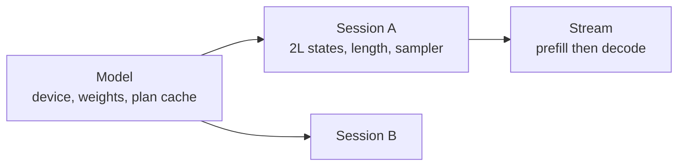

# The engine

Everything above the graph and below the API. This is also the spec that owns
**tgo's public surface**, per [000 D10](000-decisions.md): the engine is what a
caller touches, and everything under it is internal because it is where accel's
shape will move.

## 1. The public surface

```go
package tgo

// Open loads a model directory and prepares a device.
func Open(dir string, opts ...Option) (*Model, error)

type Option func(*options)

func WithDevice(d Device) Option        // CPU, Metal, or Auto (the default)
func WithPrecision(p Precision) Option  // F16, Int8, or Auto (the default)
func WithContext(n int) Option          // KV capacity per session; default 4096

type Model struct{ /* ... */ }

func (m *Model) Info() Info                       // architecture, sizes, precision chosen
func (m *Model) NewSession(opts ...SessionOption) (*Session, error)
func (m *Model) Close() error

type Session struct{ /* ... */ }

// Chat renders messages through the model's template and generates.
func (s *Session) Chat(ctx context.Context, msgs []Message, p Policy) (*Stream, error)

// Complete generates from raw text, with no template.
func (s *Session) Complete(ctx context.Context, prompt string, p Policy) (*Stream, error)

func (s *Session) Reset()
func (s *Session) Close() error

// Stream yields tokens as they are produced.
type Stream struct{ /* ... */ }

func (s *Stream) Next() bool        // advances; false at end or error
func (s *Stream) Text() string      // the incremental text of the current token
func (s *Stream) Err() error
func (s *Stream) Usage() Usage      // prompt and completion token counts

type Policy struct {
    Temperature       float32
    TopK              int
    TopP              float32
    RepetitionPenalty float32
    PresencePenalty   float32
    FrequencyPenalty  float32
    PenaltyWindow     int
    Seed              uint64
    MaxTokens         int
    Stop              []string
    LogitBias         map[int]float32
}
```

That is the whole of it. **`Plan`, `PlanCache`, the KV block layout, the graph
builders and the scheduler are not exported**, because every one of them is a
place accel's shape will move.

`Stream` is an iterator rather than a channel in the public API: a channel
obliges a caller to drain it or leak a goroutine, and an iterator makes early
return the normal case. Internally generation *is* a channel, which is
[008 §7](008-scheduler.md)'s fourth hook.

## 2. The objects



- **`Model`** owns the device, the uploaded weights and the plan cache. One per
  process per model. Weights are immutable and shared; nothing about a request
  touches it.
- **`Session`** owns $2L$ KV states ([005 §2.1](005-kv-cache.md)), a length and a
  sampler. It is a conversation.
- **`Stream`** runs prefill then a decode loop.

`Model` is safe for concurrent use. **A `Session` is not, and says so**: two
goroutines decoding one session would interleave writes into one cache, and
serialising internally would hide a caller's bug rather than report it. The race
detector runs in CI for exactly this claim.

## 3. Plans and buckets

`tensor.PlanCache` keys on the recorded graph's identity, so the same builder
function called twice returns one plan. tgo records:

- **one decode plan**, shape-fixed at $T = 1$, compiled on first use;
- **one prefill plan per bucket**, compiled on first use.

Buckets come from `tensor.Buckets`. The default set is
$\{32, 64, 128, 256, 512, 1024, 2048, 4096\}$.

Powers of two, because rounding $T$ up to the next power of two wastes at most
$T$ rows and, for $T$ uniform on a bucket's span, averages

$$\mathbb{E}\!\left[\frac{B(T) - T}{T}\right] = \int_1^2 \frac{2-u}{u}\,du = 2\ln 2 - 1 \approx 0.386$$

so about 39% of the bucketed dimension is padding, against a plan count
logarithmic in the context. Halving the waste means doubling the bucket count,
and each new bucket is a compile. The set is **configurable and the default is
defensible, not optimal** — [010 §3](010-conformance.md) measures compile time
per bucket, which is the number that would justify changing it.

> Note the interaction with [010 C11](010-conformance.md): while the cache caps
> at 128 positions, only the first three buckets are reachable. The measurement
> that would tune this set cannot be taken yet.

## 4. Padding rows, and the trap that is not one

A bucketed prefill computes $B(T) - T$ rows nobody reads. Their logits are
discarded, which is free. **What must not happen is that they write KV**, since
a pad row's key and value are computed from a pad token and corrupt the cache
for every subsequent step — a corruption that appears as a quality loss much
later and never as an error.

The obvious answers are a mask input (accel has none) or a scratch row outside
the sequence's window (an extra allocation, and a row that must be proven never
read).

Neither is needed. `tensor.ScatterRows` documents its own behaviour:

> *the scatter variant; an index at or above capacity writes nothing, because a
> GPU cannot report one*

So a pad row scatters to id $\ge C$ and **writes nothing, by the operator's own
contract**. Pad ids are set to $C$; real ids are positions. No mask, no scratch
buffer, no extra allocation.

This is worth recording as a decision rather than a trick, because it depends on
a guarantee that could change, and because the "index out of range writes
nothing" behaviour is the kind of thing a reader assumes is undefined. §7 has
the test that pins it.

## 5. The decode loop

```
prefill(prompt)                 -> logits[last]
loop:
  token = sample(logits)        # host: 006
  if stop(token): break
  emit(decode(token))
  logits = decode's output
```

One submission per step. `Plan.Submit` returns a fence; the loop waits, reads
one row of logits back, samples on the host, and submits again.

### 5.1 The readback is the floor

Each step transfers $V$ f32 values — **608 KB** for Qwen3 — plus a round trip's
latency, on a step whose useful output is 4 bytes. Two consequences, neither of
which is v0:

- **Device-side sampling** removes the readback entirely; only the chosen id
  comes back. accel 028's kernels exist and 039's composition does not, which
  is [010 C6](010-conformance.md).
- **Overlapping step $t+1$'s submission with step $t$'s sampling** needs the
  sampled id to reach the device without a host round trip — the same
  dependency.

v0 measures the floor and reports it upstream. "How much of a decode step is the
readback" is exactly the question tgo exists to answer for accel.

## 6. Weights are `Weight` ports, and getting it wrong is silent

A `tensor.Weight` port tells the plan cache the value does not change between
submissions. Every model tensor is a `Weight`; token ids and positions are
`Input`; the RoPE base and attention scale are `Scalar`; the cache is `State`.

Declaring a weight as an `Input` does not produce a wrong answer. It produces a
**plan cache that misses on every step**, which reads as "the framework is
slow". §7 asserts the hit rate rather than trusting it.

## 7. Errors

A device failure mid-generation ends the stream with the error and leaves the
session **unusable**, not silently reset: the cache holds a partial write whose
extent is unknown, and continuing from it would produce plausible text from a
corrupt state. `Session.Reset` is explicit, and a session that failed refuses
further work with the original error attached.

Context exhaustion is the same principle from the other side — it **refuses
rather than truncating** ([006 §4](006-sampling.md)), because silently dropping
a user's context is unanswerable.

## 8. Tests

| test | what it catches |
| --- | --- |
| prefill-then-decode equals decoding token by token from empty | the cache/position agreement, at the engine level |
| **a padded prefill leaves cache rows $\ge T$ byte-identical** | §4's out-of-range scatter, and pins accel's guarantee |
| $N$ decode steps compile exactly 1 plan | §6's `Weight`/`Input` mistake |
| $N$ prefills of varying $T$ compile at most one plan per distinct bucket | §3 |
| two sessions interleaved give the same outputs as run in sequence | session independence |
| one `Model` from many goroutines is race-clean | §2's concurrency claim |
| a mid-stream failure marks the session unusable, with the original error | §7 |
| `Stream` abandoned early releases its resources | the iterator-vs-channel choice in §1 |
| a cancelled `context.Context` ends the stream promptly | §1 |

## Decision record

| id | decision | rejected | consequence |
| --- | --- | --- | --- |
| 007-D1 | `Model` concurrent-safe, `Session` not, stated | lock the session internally | a caller's bug is reported, not hidden |
| 007-D2 | power-of-two prefill buckets, configurable | exact-$T$ plans; one fixed max shape | bounded compiles; $2\ln 2 - 1 \approx 39\%$ mean padding |
| 007-D3 | ~~pad rows scatter to a scratch row~~ → **pad ids are $\ge C$ and write nothing** | a mask input; a scratch buffer | **Amended 2026-08-24.** `ScatterRows` guarantees an out-of-range index writes nothing. No extra allocation, and §8 pins the guarantee |
| 007-D4 | host sampling with a logits readback in v0 | wait for accel 039 | the floor is measured and reported upstream ([C6](010-conformance.md)) |
| 007-D5 | a failed step makes the session unusable | reset and continue | a partial cache write is not recoverable |
| 007-D6 | `Stream` is an iterator publicly, a channel internally | a channel in the public API | early return does not leak; [008 §7](008-scheduler.md)'s hook survives |
| 007-D7 | the plan cache, KV layout and builders stay unexported | export them for advanced users | they are where accel's shape moves; [000 D10](000-decisions.md) |
