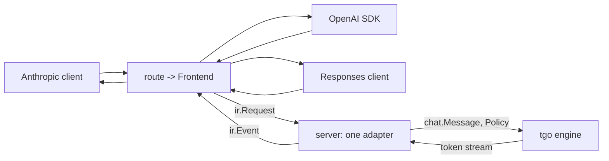

# The server

## 1. Three dialects, not one

| route | dialect |
| --- | --- |
| `POST /v1/chat/completions` | OpenAI Chat Completions |
| `POST /v1/messages` | Anthropic Messages |
| `POST /v1/responses` | OpenAI Responses |
| `POST /v1/completions` | OpenAI legacy, raw text, no template |
| `GET /v1/models`, `GET /health`, `GET /metrics` | — |

An earlier draft of this spec served OpenAI Chat only, on the reasoning that
one surface every client library already speaks is enough. That was the right
call **given the cost of writing three**. The cost turned out to be one adapter.

[`latere.ai/x/pkg/llmdialect`](https://pkg.go.dev/latere.ai/x/pkg/llmdialect)
translates between these dialects through a neutral IR, hub-and-spoke, never
pairwise. Its `Frontend` half is exactly the caller-facing side a model server
needs:

```go
type Frontend interface {
    Name() Dialect
    DecodeRequest(body []byte) (*ir.Request, error)
    EncodeResponse(resp *ir.Response) ([]byte, error)
    NewEventEncoder(w io.Writer) EventEncoder   // Encode(ir.Event) error
}
```

`Backend` is the other half — encoding a request *to* an upstream provider — and
**tgo never uses it.** tgo is the upstream. Naming that asymmetry is most of
understanding the dependency: a gateway uses both halves, a model server uses
one.

Verified rather than assumed, by decoding one request per dialect and encoding a
response back:

```
anthropic-messages   ok  msgs=1 system="be brief" temp=0.7 topK=40 thinking=[budget=1024]
openai-chat          ok  msgs=1 system="be brief" temp=0.7
openai-responses     ok  msgs=1 system="be brief" thinking=[effort="low"]
```

Three dialects reach one `ir.Request`, including the two places they genuinely
differ — Anthropic's `thinking.budget_tokens` against Responses'
`reasoning.effort`, and Anthropic's `top_k`, which OpenAI Chat has no field for.

## 2. Where the dependency lives, and where it does not



**`llmdialect` is a dependency of `tgo/server`, not of `tgo`.** A caller
embedding tgo as a library gets the engine and does not inherit the dialect
layer, its IR types, or its release cycle. The mapping `ir.Request` →
`chat.Message` + `Policy` is tgo's, in one file, and it is the only place the
two vocabularies meet.

This is [009-D1](#decision-record) unchanged in substance: **the wire is at the
edge.** What changed is that the edge now speaks three languages instead of one,
for the price of a translation table rather than three parsers.

**Rejected: making `ir.Request` the engine's argument type.** It is a neutral IR
rather than an OpenAI schema, so the original objection does not apply — but it
would put a third-party type in tgo's public API and couple every engine
decision to another module's releases.

**Rejected: reimplementing the dialects inside tgo.** Same shape, none of the
code, a second implementation of a thing that already exists one layer up, and
guaranteed drift.

## 3. Messages are blocks, not strings

`ir.Message` is `{Role, Blocks []Block}` with typed blocks — text, tool use,
tool result, thinking. tgo's `chat.Message` takes the same shape, as a **strict
subset**:

```go
type Message struct {
    Role   Role
    Blocks []Block
}

type BlockType string

const (
    BlockText       BlockType = "text"
    BlockToolUse    BlockType = "tool_use"
    BlockToolResult BlockType = "tool_result"
    BlockThinking   BlockType = "thinking"
)
```

No `Image`, no `Signature`, no `CacheHint`: Qwen3 dense is text-only, tgo issues
no replay tokens, and it has no prompt cache. [004-D2](004-model-graph.md) makes
a vision model additive, and that is when `BlockImage` arrives.

### 3.1 Why this is forced, and not a preference

[003 §3](003-chat-template.md) requires that **prior assistant turns have their
thinking stripped**. With `Content string`, the renderer receives an assistant
turn containing `<think>…</think>` and has to find it by matching text.

That is a **textual** boundary — exactly what [003-D4](003-chat-template.md)
eliminated for control tokens, on the grounds that a textual boundary can be
forged and a structural one cannot. The earlier draft committed to that
principle for user content and broke it for assistant content in the same spec.
A user who types `<think>` into a message they are asking the model to
summarise would have their text stripped from the next turn.

With blocks, the caller hands `[]Block{{Thinking, …}, {Text, …}}` and the
renderer drops the thinking blocks by **type**. It composes with
[003-D3](003-chat-template.md)'s `Prompt` parts rather than fighting them.

### 3.2 The response side has the same problem

`Stream.Text() string` cannot tell a client whether the current token is inside
a thinking block, which is the one thing a chat UI must know to render it. So
the stream yields typed events, and `Text()` remains as the convenience for
callers who do not care:

```go
func (s *Stream) Next() bool
func (s *Stream) Event() Event   // {Kind: TextDelta|ThinkingDelta|ToolArgsDelta|BlockStart|BlockStop, ...}
func (s *Stream) Text() string   // the text delta, empty for non-text events
```

These map onto `ir.Event` one to one, which is what makes §2's adapter a
translation rather than a state machine.

## 4. Unsupported fields: refuse what changes the answer, report what does not

The earlier draft refused every unsupported field. That is right for a field
whose absence changes what the model computes, and wrong for one that is
advisory — a request carrying `cache_control` would be rejected when it would
otherwise run correctly and identically.

`llmdialect` already draws this line, with a **loss report**: fields a target
cannot represent are accumulated in `ir.Request.Loss` rather than dropped
silently. tgo adopts it, with a rule for which side a field falls on:

| category | rule | examples |
| --- | --- | --- |
| **changes the answer** | **refuse**, naming the field | `n > 1` (needs batching, [008](008-scheduler.md)), `response_format: json_schema` ([015](015-structured-output.md)), a `logit_bias` id outside the vocabulary |
| **advisory** | accept, run, and **record the loss** | `cache_control`, `service_tier`, `user`, `metadata`, `citations` |

Losses are surfaced two ways, both from the same list: an `X-Tgo-Loss` response
header, and a `tgo_request_loss_total{field}` counter. A field that turns up
constantly in that counter is a feature request with evidence attached.

### 4.1 `ir.Request` is narrower than `Policy`, so the loss list must be corrected

`llmdialect`'s IR carries no `seed`, `logit_bias`, `presence_penalty`,
`frequency_penalty` or `repetition_penalty`, and its OpenAI Chat frontend adds
each to `Loss` as unrepresentable. **tgo implements every one of them**
([007 §1](007-engine.md)'s `Policy`), so emitting that list verbatim would report
as unhonoured exactly the knobs that were honoured — and §8's row "every advisory
field appears in the loss header" would pass over the bug.

So the handler parses those fields from the **raw body** alongside
`DecodeRequest`, and **subtracts** them from `Loss.Fields()` before emitting the
header. `top_k` is the same defect from the other side: it is in `ir.Request`, so
`/v1/messages` honours it, while OpenAI Chat has no such field and it must not
appear as a loss at all.

The missing IR fields are filed upstream on `latere.ai/x/pkg`. Until they land,
the subtraction list is a named constant in one place, with a test that fails if
a `Policy` field is not in it — otherwise a new sampling knob silently starts
reporting itself as lost.

**The distinction is testable, which is why it is worth having as a rule rather
than a list.** A field is advisory if a request with it and a request without it
produce the same tokens.

### 4.1 The rest of the field map

| field | tgo |
| --- | --- |
| `model` | must name the loaded model, else 404 |
| `stream` | both; SSE per §5 |
| `max_tokens` / `max_output_tokens`, `temperature`, `top_p`, `top_k`, `stop` | mapped to `Policy` |
| `seed` | honoured as a **stream** seed, [006 §4](006-sampling.md) |
| `presence_penalty`, `frequency_penalty`, `repetition_penalty` | mapped |
| `logit_bias` | applied first, [006 §3](006-sampling.md) |
| `logprobs`, `top_logprobs` | from `Sampler.Probs`, which does not move the stream |
| `thinking` / `reasoning` | maps to the template's thinking flag, [003 §3](003-chat-template.md). The **budget is advisory**: tgo does not stop the model mid-thought |
| `tools`, `tool_choice` | rendered into the prompt via the model's template; the model's text comes back as blocks. **No forced grammar** until [015](015-structured-output.md), so a malformed call is possible and is reported as text rather than as a parsed call |

`tools` is the row to read carefully. Returning what the model emitted, rather
than a parsed `tool_calls` array, is a deliberate under-promise: without
constrained decoding, a tool call is whatever the model produced, and parsing it
into a dialect's schema would assert a validity nothing checked.

## 5. Streaming

Each dialect's `EventEncoder` writes its own SSE framing from the same
`ir.Event` sequence, whose grammar is:

```
MessageStart (BlockStart (TextDelta|ArgsDelta|ThinkingDelta)* BlockStop)* MessageDelta MessageStop
```

so tgo emits one canonical sequence and three wire formats fall out. Three
things a naive implementation gets wrong, none of which the encoder can do for
us:

- **Flush per event.** Without an explicit `http.Flusher` call, Go buffers and
  the client receives the whole response at once — which passes every test that
  checks content and defeats the entire purpose.
- **A client disconnect must cancel generation.** The request's
  `context.Context` is cancelled; a handler that ignores it keeps a session and
  its KV reservation until `max_tokens`.
- **The terminal event carries `finish_reason` and usage.** A stream that ends
  without one is indistinguishable from a dropped connection.

### 5.1 Errors need a per-dialect encoder, which the Frontend half does not give

`Frontend` has four methods and none of them encodes an error; `ir` defines no
error type. So §6's 429 and §4's refusals have **no body shape**, and a
mid-generation device failure ([007 §7](007-engine.md)) can only reach the client
as an abrupt close — which a client cannot distinguish from a network drop.

The dialects genuinely differ here: Anthropic sends `event: error` mid-stream and
an `{"type":"error","error":{...}}` body; OpenAI sends an error chunk before
closing. ollama hand-writes both, which is the evidence that there is no shared
shape to borrow.

**tgo therefore owns a small per-dialect error encoder**, beside the frontend
rather than inside it, covering the pre-stream body and the mid-stream frame.
§8 tests it per dialect. This is the one place §2's "three surfaces for one
adapter" is not true, and it is worth stating rather than discovering.

## 6. Concurrency

One `Model`, one `Session` per in-flight request, and an admission semaphore
sized by KV memory, because [005](005-kv-cache.md) makes each session's cache a
fixed reservation:

$$N_{\max} = \left\lfloor \frac{M_{\text{available}} - M_{\text{weights}}}{M_{kv}(C)} \right\rfloor$$

Over the limit, requests queue. The queue is **bounded with a timeout**, and a
full queue returns **429 with `Retry-After`** rather than growing — an unbounded
queue converts a load problem into an out-of-memory one.

**Without batching, concurrent requests do not go faster.** They interleave at
submission granularity and total throughput is what one sequence gets. The
server does not pretend otherwise:

```
tgo_requests_in_flight            {dialect}
tgo_queue_depth
tgo_queue_wait_seconds            histogram
tgo_decode_step_seconds           histogram
tgo_logits_readback_seconds       histogram   # 010 C6, in one number
tgo_request_loss_total            {field}     # section 4
tgo_sessions_rejected_total       {reason}
```

`tgo_logits_readback_seconds` against `tgo_decode_step_seconds` is
[010 §3](010-conformance.md)'s readback share measured in production rather than
in a benchmark. `tgo_queue_wait_seconds` is what [008 §1](008-scheduler.md)
costs, in the units callers care about.

## 7. Not in scope

Authentication, per-key rate limiting, multi-model routing, and a model
management API. tgo serves one model; everything above belongs in front of it —
which, in this stack, is where `llmdialect` came from.

The server binds to `127.0.0.1` by default. A non-loopback bind needs an
explicit flag and prints a line saying the server has no authentication.

## 8. Tests

Handler tests run against a **fake engine** — a scripted event stream — so they
need no device and no weights:

| test | what it catches |
| --- | --- |
| one golden request and response per dialect, round-tripped | §1 |
| the same generation renders correctly in all three dialects | §2's adapter is a translation, not three code paths |
| **each event is flushed**, asserted with a client that would block | §5's first trap |
| a client disconnect cancels generation within one step | §5's second trap |
| every §4 refusal names its field; every §4 advisory field runs and appears in the loss header | §4's rule |
| **an advisory field does not change the tokens** — same seed, same output with and without it | §4's rule is testable, so it is tested |
| a thinking block streams as thinking events, not as text | §3.2 |
| a user message containing `<think>` survives into the next turn | §3.1 |
| the queue bound, its 429, and `Retry-After` | §6 |
| a non-loopback bind without the flag is refused | §7 |

One end-to-end test runs a synthetic model through the real handler, which is
what proves the fake engine's contract matches the real one.

## Decision record

| id | decision | rejected | consequence |
| --- | --- | --- | --- |
| 009-D1 | wire dialects at the edge only | an engine API shaped like a wire schema | engine decisions stay free of a schema someone else changes. **Amended 2026-08-24:** the edge now speaks three dialects; the principle is unchanged |
| 009-D2 | ~~refuse every unsupported field~~ → **refuse what changes the answer, record what does not** | refuse everything; ignore everything | **Amended 2026-08-24.** A request carrying an advisory field runs instead of being rejected, and the loss is visible in a header and a counter. The categories are distinguished by a test, not a list |
| 009-D3 | admission bounded by KV memory; 429 with `Retry-After` | unbounded goroutines or queue | [005](005-kv-cache.md)'s reservation is enforced; load stays a load problem |
| 009-D4 | handlers tested against a fake engine, plus one real end-to-end | only end-to-end | the HTTP surface is fully covered with no device |
| 009-D5 | one model, no auth, no routing | a management API | the boundary is stated rather than discovered |
| 009-D6 | `tools` returns what the model emitted | parse into a dialect's `tool_calls` | without [015](015-structured-output.md) nothing checks validity; parsing would assert what was not verified |
| 009-D7 | metrics expose the readback share, queue wait, and loss | throughput only | the numbers that name tgo's upstream costs are visible in production |
| 009-D8 | loopback by default; a public bind needs a flag | bind `0.0.0.0` by default | an unauthenticated server is not exposed by omission |
| 009-D12 | subtract the fields tgo honours from `llmdialect`'s loss list | emit `Loss.Fields()` verbatim | the IR is narrower than `Policy`, so the header would report honoured knobs as dropped ([§4.1](#41-irrequest-is-narrower-than-policy-so-the-loss-list-must-be-corrected)) |
| 009-D13 | tgo owns a per-dialect error encoder | expect `Frontend` to cover errors | `Frontend` has no error path and the dialects genuinely differ; ollama hand-writes both ([§5.1](#51-errors-need-a-per-dialect-encoder-which-the-frontend-half-does-not-give)) |
| 009-D9 | serve three dialects via `llmdialect`'s `Frontend` half | OpenAI Chat only; reimplement the dialects in tgo | three surfaces for one adapter. `Backend` is a gateway's half and tgo never uses it |
| 009-D10 | `llmdialect` is a `tgo/server` dependency, not a core one | make `ir.Request` the engine's argument | a library embedder inherits neither the IR types nor another module's release cycle |
| 009-D11 | messages and stream events are **blocks**, a strict subset of `ir.Block` | `Content string` | forced by [003-D4](003-chat-template.md): stripping prior thinking from a string is a textual boundary, and textual boundaries can be forged |
