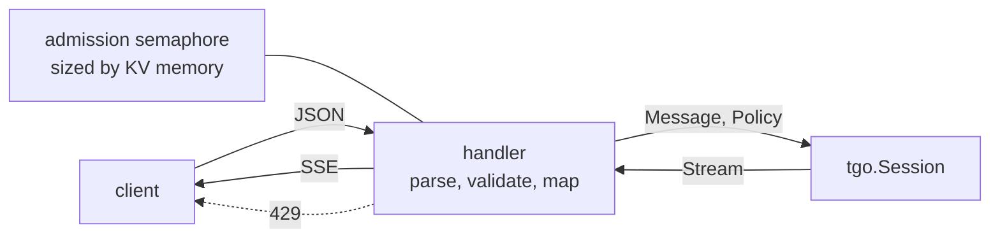

# The server

## 1. What compatibility means here

| endpoint | method | purpose |
| --- | --- | --- |
| `/v1/chat/completions` | POST | the main one; streaming and not |
| `/v1/completions` | POST | raw text, no template |
| `/v1/models` | GET | the one model this process serves |
| `/health` | GET | liveness; loaded and ready |
| `/metrics` | GET | §4 |

OpenAI's request and response JSON, streaming over server-sent events. That
surface is what every client library already speaks, and it is the entire reason
not to invent one.

Compatibility is a **serialisation decision**. The handler turns a request into
a `Session` call and a stream of tokens into SSE frames, and it holds no model
state of its own. Nothing in [007](007-engine.md) knows the server exists.

**Rejected: an engine API shaped like OpenAI's schema.** It looks like it saves
a layer. It means every future scheduler and cache decision is negotiated
against a JSON schema owned by someone else — and OpenAI changes theirs.



## 2. The field map, and where tgo differs

| field | tgo |
| --- | --- |
| `model` | must name the loaded model, else 404 |
| `messages`, `prompt` | rendered per [003](003-chat-template.md) |
| `stream` | both supported |
| `max_tokens`, `temperature`, `top_p`, `seed` | mapped to `Policy` |
| `top_k` | supported, an OpenAI extension |
| `stop` | string or array, mapped to `Policy.Stop` |
| `presence_penalty`, `frequency_penalty` | mapped |
| `repetition_penalty` | supported, an extension |
| `logit_bias` | supported, applied first ([006 §3](006-sampling.md)) |
| `logprobs`, `top_logprobs` | supported, from `Sampler.Probs`, which does not move the stream |
| `n > 1` | **refused**: it needs batching, which is [008](008-scheduler.md) |
| `response_format: json_schema` | **refused** in v0; see §5 |
| `tools`, `tool_choice` | rendered into the prompt via the model's template; the model's text is returned. **No forced grammar**, so a malformed call is possible and is reported as text rather than as a parsed call |
| `logit_bias` on a token the tokenizer does not have | refused, naming the id |

**An unsupported field is refused with a message naming it, never ignored.** A
server that ignores `n=4` and returns one choice has produced a wrong answer to
a well-formed request, and the caller has no way to tell.

> `tools` is the row to read carefully. Returning the model's raw text rather
> than a parsed `tool_calls` array is a deliberate under-promise: without §5's
> constrained decoding, a "tool call" is whatever the model emitted, and parsing
> it into OpenAI's schema would assert a validity nothing checked. The response
> says what happened.

## 3. Streaming

SSE, `data: {json}\n\n` per chunk, terminated by `data: [DONE]\n\n`. Three
things a naive implementation gets wrong:

- **Flush per chunk.** Without an explicit `http.Flusher` call, Go buffers and
  the client sees the whole response at once — which passes every test that
  checks content and defeats the entire purpose.
- **A client disconnect must cancel generation.** The request's
  `context.Context` is cancelled; if the handler ignores it, an abandoned
  request keeps a session and its KV reservation until `max_tokens`.
- **The final chunk carries `finish_reason`** — `stop`, `length`, or
  `tool_calls` — and `usage` when the caller asked for it. A stream that ends
  without one is indistinguishable from a truncated connection.

## 4. Concurrency, and being honest about it

One `Model`, one `Session` per in-flight request, and an admission semaphore
**sized by KV memory**, because [005 §3](005-kv-cache.md) makes each session's
cache a fixed reservation:

$$N_{\max} = \left\lfloor \frac{M_{\text{available}} - M_{\text{weights}}}{M_{kv}(C)} \right\rfloor$$

Requests over the limit queue. The queue is **bounded and has a timeout**; a
full queue returns **429 with `Retry-After`** rather than growing, because an
unbounded queue converts a load problem into an out-of-memory one.

**Without batching, concurrent requests do not go faster.** They interleave at
submission granularity and the total throughput is what one sequence gets. The
server does not pretend otherwise:

```
/metrics
  tgo_requests_in_flight
  tgo_queue_depth
  tgo_queue_wait_seconds        histogram
  tgo_prefill_tokens_total
  tgo_decode_tokens_total
  tgo_decode_step_seconds       histogram
  tgo_logits_readback_seconds   histogram   # 010 C6, in one number
  tgo_sessions_rejected_total   {reason}
```

`tgo_logits_readback_seconds` against `tgo_decode_step_seconds` is
[010 §3](010-conformance.md)'s readback share, measured in production rather
than in a benchmark. `tgo_queue_wait_seconds` is what [008 §1](008-scheduler.md)
costs, in the only units anyone cares about.

## 5. Structured output is specified and not built

sglang's contribution here is constrained decoding: a grammar or JSON schema
compiled to a per-step token mask, so invalid tokens have probability zero and
the output parses **by construction**.

The mask is $O(V)$ per step applied to the logits — on the host a vector add, on
the device a bound tensor and one elementwise op, which accel can express today.
So this is **not** a conformance entry. What does not exist is the compiler from
a schema to a mask, which is real work: a pushdown automaton over the
*tokenizer's vocabulary*, with a lazily-built per-state admissible token set.

It is [015](015-structured-output.md), and it is the highest-value thing after
batching.

## 6. Not in scope

Authentication, per-key rate limiting, multi-model routing, and a model
management API. tgo serves one model; everything above belongs to whatever runs
in front of it. **Stating the boundary is the decision** — each of these is
easy to add badly and hard to remove.

The server binds to `127.0.0.1` by default. Binding to `0.0.0.0` requires an
explicit flag and prints a line saying the server has no authentication.

## 7. Tests

Handler tests run against a **fake engine** — a scripted token stream — so they
need no device and no weights:

| test | what it catches |
| --- | --- |
| SSE framing, including the terminal `[DONE]` and `finish_reason` | §3 |
| **each chunk is flushed**, asserted by reading with a client that would block | §3's first trap |
| a client disconnect cancels generation within one step | §3's second trap |
| every §2 refusal, each naming its field | §2 |
| the queue bound, its 429, and `Retry-After` | §4 |
| malformed JSON, wrong types, missing `model` | robustness |
| `logprobs` do not change the completion | [006-D7](006-sampling.md) |
| a non-loopback bind without the flag is refused | §6 |

One end-to-end test runs a real synthetic model through the real handler, which
is what proves the fake engine's contract matches the real one.

## Decision record

| id | decision | rejected | consequence |
| --- | --- | --- | --- |
| 009-D1 | OpenAI JSON at the edge only | an OpenAI-shaped engine API | engine decisions stay free of a schema someone else changes |
| 009-D2 | refuse unsupported fields by name | ignore them | a well-formed request never gets a quietly wrong answer |
| 009-D3 | admission bounded by KV memory; 429 with `Retry-After` over it | unbounded goroutines; an unbounded queue | [005](005-kv-cache.md)'s reservation is enforced; load stays a load problem |
| 009-D4 | handlers tested against a fake engine, plus one real end-to-end | only end-to-end | the HTTP surface is fully covered with no device |
| 009-D5 | one model, no auth, no routing | a management API | the boundary is stated rather than discovered |
| 009-D6 | `tools` returns the model's text, not a parsed call | parse into `tool_calls` | without [015](015-structured-output.md) nothing checks validity; parsing would assert what was not verified |
| 009-D7 | metrics expose the readback share and queue wait | report throughput only | the two numbers that name tgo's upstream costs are visible in production |
| 009-D8 | loopback by default; a public bind needs a flag and prints the warning | bind `0.0.0.0` by default | an unauthenticated server is not exposed by omission |
