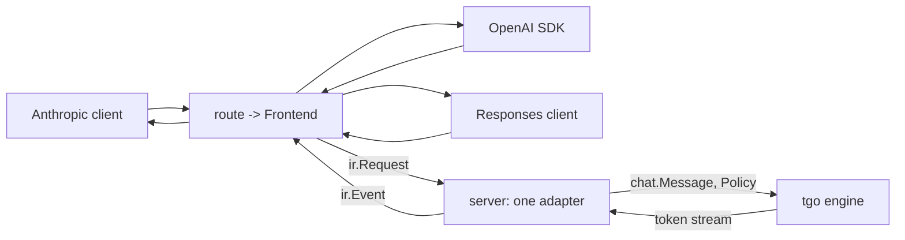

# The server

## 1. Three dialects, not one

| route | dialect |
| --- | --- |
| `POST /v1/chat/completions` | OpenAI Chat Completions |
| `POST /v1/messages` | Anthropic Messages |
| `POST /v1/responses` | OpenAI Responses |
| `POST /v1/completions` | OpenAI legacy, raw text, no template |
| `GET /v1/models`, `GET /health`, `GET /metrics` | — |

An earlier draft of this spec served OpenAI Chat only, on the reasoning that
one surface every client library already speaks is enough. That was the right
call **given the cost of writing three**. The cost turned out to be one adapter.

[`latere.ai/x/pkg/llmdialect`](https://pkg.go.dev/latere.ai/x/pkg/llmdialect)
translates between these dialects through a neutral IR, hub-and-spoke, never
pairwise. Its `Frontend` half is exactly the caller-facing side a model server
needs:

```go
type Frontend interface {
    Name() Dialect
    DecodeRequest(body []byte) (*ir.Request, error)
    EncodeResponse(resp *ir.Response) ([]byte, error)
    NewEventEncoder(w io.Writer) EventEncoder   // Encode(ir.Event) error
}
```

`Backend` is the other half — encoding a request *to* an upstream provider — and
**tgo never uses it.** tgo is the upstream. Naming that asymmetry is most of
understanding the dependency: a gateway uses both halves, a model server uses
one.

Verified rather than assumed, by decoding one request per dialect and encoding a
response back:

```
anthropic-messages   ok  msgs=1 system="be brief" temp=0.7 topK=40 thinking=[budget=1024]
openai-chat          ok  msgs=1 system="be brief" temp=0.7
openai-responses     ok  msgs=1 system="be brief" thinking=[effort="low"]
```

Three dialects reach one `ir.Request`, including the two places they genuinely
differ — Anthropic's `thinking.budget_tokens` against Responses'
`reasoning.effort`, and Anthropic's `top_k`, which OpenAI Chat has no field for.

## 2. Where the dependency lives, and where it does not



### 2.1 What the dependency actually costs

Measured, because the module it lives in looks alarming: `latere.ai/x/pkg`
requires golang-migrate, the full OpenTelemetry SDK and its OTLP exporters,
goldmark, `go-yaml` and `oauth2`.

**None of it reaches a consumer.** Importing `llmdialect` and its three frontends
gives:

```
$ cat go.mod
require latere.ai/x/pkg v0.41.0        # one require

$ wc -l go.sum
2                                       # the module and its go.mod

$ go list -deps .   # non-stdlib only
latere.ai/x/pkg/llmdialect
latere.ai/x/pkg/llmdialect/ir
latere.ai/x/pkg/llmdialect/{anthropic,openaichat,openairesp}
latere.ai/x/pkg/llmdialect/internal/sse
```

Go's module graph pruning carries only the requirements of the packages actually
imported, and llmdialect's subtree is **stdlib-only**. It also cannot break
[000 D2](000-decisions.md): nothing there imports `C`.

**That is a property of llmdialect's current imports, not a promise it makes.**
One OTEL import added upstream would arrive in tgo on the next `go get`, and the
first symptom would be a slower build rather than an error. So
[009-D14](#decision-record) puts a footprint check in CI from M9: the non-stdlib
build list must match an allowlist, and growing it is a decision someone makes on
purpose.

**`llmdialect` is a dependency of `tgo/server`, not of `tgo`.** A caller
embedding tgo as a library gets the engine and does not inherit the dialect
layer, its IR types, or its release cycle. The mapping `ir.Request` →
`chat.Message` + `Policy` is tgo's, in one file, and it is the only place the
two vocabularies meet.

This is [009-D1](#decision-record) unchanged in substance: **the wire is at the
edge.** What changed is that the edge now speaks three languages instead of one,
for the price of a translation table rather than three parsers.

**Rejected: making `ir.Request` the engine's argument type.** It is a neutral IR
rather than an OpenAI schema, so the original objection does not apply — but it
would put a third-party type in tgo's public API and couple every engine
decision to another module's releases.

**Rejected: reimplementing the dialects inside tgo.** Same shape, none of the
code, a second implementation of a thing that already exists one layer up, and
guaranteed drift.

## 3. Messages are blocks, not strings

`ir.Message` is `{Role, Blocks []Block}` with typed blocks — text, tool use,
tool result, thinking. tgo's `chat.Message` takes the same shape, as a **strict
subset**:

```go
type Message struct {
    Role   Role
    Blocks []Block
}

type BlockType string

const (
    BlockText       BlockType = "text"
    BlockToolUse    BlockType = "tool_use"
    BlockToolResult BlockType = "tool_result"
    BlockThinking   BlockType = "thinking"
)
```

No `Image`, no `Signature`, no `CacheHint`: Qwen3 dense is text-only, tgo issues
no replay tokens, and it has no prompt cache. [004-D2](004-model-graph.md) makes
a vision model additive, and that is when `BlockImage` arrives.

### 3.1 Why this is forced, and not a preference

[003 §3](003-chat-template.md) requires that **prior assistant turns have their
thinking stripped**. With `Content string`, the renderer receives an assistant
turn containing `<think>…</think>` and has to find it by matching text.

That is a **textual** boundary — exactly what [003-D4](003-chat-template.md)
eliminated for control tokens, on the grounds that a textual boundary can be
forged and a structural one cannot. The earlier draft committed to that
principle for user content and broke it for assistant content in the same spec.
A user who types `<think>` into a message they are asking the model to
summarise would have their text stripped from the next turn.

With blocks, the caller hands `[]Block{{Thinking, …}, {Text, …}}` and the
renderer drops the thinking blocks by **type**. It composes with
[003-D3](003-chat-template.md)'s `Prompt` parts rather than fighting them.

### 3.2 The response side has the same problem

`Stream.Text() string` cannot tell a client whether the current token is inside
a thinking block, which is the one thing a chat UI must know to render it. So
the stream yields typed events, and `Text()` remains as the convenience for
callers who do not care:

```go
func (s *Stream) Next() bool
func (s *Stream) Event() Event   // {Kind: TextDelta|ThinkingDelta|ToolArgsDelta|BlockStart|BlockStop, ...}
func (s *Stream) Text() string   // the text delta, empty for non-text events
```

These map onto `ir.Event` one to one, which is what makes §2's adapter a
translation rather than a state machine.

### 3.3 `/v1/completions` is a fourth Frontend, written here

§1 attributes every dialect to `llmdialect`, which carries three. The legacy
completions surface is the fourth and it is tgo's: `dialectLegacy`, the value
`"openai-completions"`, is an `ir.Dialect` of the same type so that everything
keyed by dialect keeps working, and it is not one of `ir`'s own
(`server/legacy.go:27`).

Writing it as a `Frontend` rather than as a fifth handler is what keeps it on
one pipeline, one pair of loss tables and one error encoder instead of a fourth
copy of each.

**`legacyKeys` is the loss input.** The decoder holds an allowlist of the
members it understands; anything else lands in the loss report, which is where
the sampling knobs land too — they are subtracted back out by `lossReport`,
exactly as on the other three surfaces ([§4.1](#41-irrequest-is-narrower-than-policy-so-the-loss-list-must-be-corrected)).
`logprobs` is deliberately **absent** from the list, which is what puts it in
the loss: the encoder answers `logprobs: null` on every choice, so the member is
accepted and not acted on.

**`prompt` is a string or an array, and the array is narrow.** An array of more
than one prompt is `n > 1` under another name, and an array of token ids is a
prompt this server cannot render back to the text `Session.Complete` takes. Both
are refused rather than approximated (`server/legacy.go:111`). `stop` takes the
same string-or-array shape and needs no such rule.

**Three members are refused, not reported.** They change the answer, which is
[009-D2](#decision-record)'s line:

| member | why it cannot be advisory |
| --- | --- |
| `suffix` | filling in the middle is a different decode, not a knob |
| `echo` | the response would carry text the model did not produce |
| `best_of` | it asks for $n$ completions and a choice among them |

## 4. Unsupported fields: refuse what changes the answer, report what does not

The earlier draft refused every unsupported field. That is right for a field
whose absence changes what the model computes, and wrong for one that is
advisory — a request carrying `cache_control` would be rejected when it would
otherwise run correctly and identically.

`llmdialect` already draws this line, with a **loss report**: fields a target
cannot represent are accumulated in `ir.Request.Loss` rather than dropped
silently. tgo adopts it, with a rule for which side a field falls on:

| category | rule | examples |
| --- | --- | --- |
| **changes the answer** | **refuse**, naming the field | `n > 1` (needs batching, [008](008-scheduler.md)), a schema the grammar compiler cannot compile ([015](015-structured-output.md)), a `logit_bias` id outside the vocabulary |
| **advisory** | accept, run, and **record the loss** | `cache_control`, `service_tier`, `user`, `metadata`, `citations` |

Losses are surfaced two ways, both from the same list: an `X-Tgo-Loss` response
header, and a `tgo_request_loss_total{field}` counter. A field that turns up
constantly in that counter is a feature request with evidence attached.

### 4.1 `ir.Request` is narrower than `Policy`, so the loss list must be corrected

`llmdialect`'s IR carries no `seed`, `logit_bias`, `presence_penalty`,
`frequency_penalty` or `repetition_penalty`, and its OpenAI Chat frontend adds
each to `Loss` as unrepresentable. **tgo implements every one of them**
([007 §1](007-engine.md)'s `Policy`), so emitting that list verbatim would report
as unhonoured exactly the knobs that were honoured — and §8's row "every advisory
field appears in the loss header" would pass over the bug.

So the handler parses those fields from the **raw body** alongside
`DecodeRequest`, and **subtracts** them from `Loss.Fields()` before emitting the
header.

**The subtraction is per dialect, and getting that wrong is a real defect rather
than a tidiness issue.** The set of names tgo honours is a *union* across four
surfaces — `max_tokens`, `max_completion_tokens`, `max_output_tokens`, `stop`,
`stop_sequences` — and subtracting the union everywhere reports a knob that set
nothing as though it were honoured. Measured: `max_output_tokens` on
`/v1/chat/completions` applied no bound, `X-Tgo-Loss` came back empty, and the
completion ran to context exhaustion **with nothing saying so**. False in 12 of
56 name-by-route cells.

So each route subtracts the names *that route* applies, and §8's test is the
whole matrix: every honoured wire name against every route, applied if and only
if it is not reported. `top_k` is the same defect from the other side: it is in `ir.Request`, so
`/v1/messages` honours it, while OpenAI Chat has no such field and it must not
appear as a loss at all.

The missing IR fields are filed upstream on `latere.ai/x/pkg`. Until they land,
the subtraction list is a named constant in one place, with a test that fails if
a `Policy` field is not in it — otherwise a new sampling knob silently starts
reporting itself as lost.

**The distinction is testable, which is why it is worth having as a rule rather
than a list.** A field is advisory if a request with it and a request without it
produce the same tokens.

### 4.2 The rest of the field map

| field | tgo |
| --- | --- |
| `model` | must name the loaded model, else 404 |
| `stream` | both; SSE per §5 |
| `max_tokens` / `max_output_tokens`, `temperature`, `top_p`, `top_k`, `stop` | mapped to `Policy` |
| `seed` | honoured as a **stream** seed, [006 §4](006-sampling.md) |
| `presence_penalty`, `frequency_penalty`, `repetition_penalty` | mapped |
| `logit_bias` | applied first, [006 §3](006-sampling.md) |
| `logprobs`, `top_logprobs` | **advisory**: accepted, not served, and reported in `X-Tgo-Loss` (`server/loss_test.go:273`). `sample.Sampler.Probs` does not move the stream and nothing in `server/` calls it; the legacy encoder answers `logprobs: null` on every choice |
| `thinking` / `reasoning` | maps to the template's thinking flag, [003 §3](003-chat-template.md). The **budget is advisory**: tgo does not stop the model mid-thought |
| `tools`, `tool_choice` | rendered into the prompt via the model's template; the model's text comes back as blocks. **No forced grammar** until [015](015-structured-output.md), so a malformed call is possible and is reported as text rather than as a parsed call |

**Amended 2026-08-26:** `response_format: json_schema` was in that row when
[015](015-structured-output.md) had no implementation, and a schema that changes
the answer had to be refused whole. It is now honoured: `response_format`,
`output_format` and `text.format` each map onto `Policy.Schema`, and the
refusal narrowed to a schema the compiler will not compile, answered with the
keyword and the obstruction it named (015-D4). The reasoning is unchanged --
enforcing part of a schema is the silent failure the rule exists to prevent --
and only what tgo can enforce moved.

`tools` is the row to read carefully. Returning what the model emitted, rather
than a parsed `tool_calls` array, is a deliberate under-promise: without
constrained decoding, a tool call is whatever the model produced, and parsing it
into a dialect's schema would assert a validity nothing checked.

## 5. Streaming

Each dialect's `EventEncoder` writes its own SSE framing from the same
`ir.Event` sequence, whose grammar is:

```
MessageStart (BlockStart (TextDelta|ArgsDelta|ThinkingDelta)* BlockStop)* MessageDelta MessageStop
```

so tgo emits one canonical sequence and three wire formats fall out. Three
things a naive implementation gets wrong, none of which the encoder can do for
us:

- **Flush per event.** Without an explicit `http.Flusher` call, Go buffers and
  the client receives the whole response at once — which passes every test that
  checks content and defeats the entire purpose.
- **A client disconnect must cancel generation.** The request's
  `context.Context` is cancelled; a handler that ignores it keeps a session and
  its KV reservation until `max_tokens`.
- **The terminal event carries `finish_reason` and usage.** A stream that ends
  without one is indistinguishable from a dropped connection.

### 5.1 Errors need a per-dialect encoder, which the Frontend half does not give

`Frontend` has four methods and none of them encodes an error; `ir` defines no
error type. So §6's 429 and §4's refusals have **no body shape**, and a
mid-generation device failure ([007 §7](007-engine.md)) can only reach the client
as an abrupt close — which a client cannot distinguish from a network drop.

The dialects genuinely differ here: Anthropic sends `event: error` mid-stream and
an `{"type":"error","error":{...}}` body; OpenAI sends an error chunk before
closing. ollama hand-writes both, which is the evidence that there is no shared
shape to borrow.

**tgo therefore owns a small per-dialect error encoder**, beside the frontend
rather than inside it, covering the pre-stream body and the mid-stream frame.
§8 tests it per dialect. This is one of **two** places §2's "three surfaces for
one adapter" is not true. The other is `/v1/completions`: `llmdialect` carries
three dialects and §1's fourth route is a `Frontend` tgo wrote itself
(`server/legacy.go`), so the legacy surface costs a whole codec rather than a
table row.

## 6. Concurrency

One `Model`, one `Session` per in-flight request, and an admission semaphore
sized by KV memory, because [005](005-kv-cache.md) makes each session's cache a
fixed reservation:

$$N_{\max} = \left\lfloor \frac{M_{\text{available}} - M_{\text{weights}}}{M_{kv}(C)} \right\rfloor$$

Over the limit, requests queue. The queue is **bounded with a timeout**, and a
full queue returns **429 with `Retry-After`** rather than growing — an unbounded
queue converts a load problem into an out-of-memory one.

**Without batching, concurrent requests do not go faster.** They interleave at
submission granularity and total throughput is what one sequence gets. The
server does not pretend otherwise:

```
tgo_requests_in_flight            {dialect}
tgo_queue_depth
tgo_queue_wait_seconds            histogram
tgo_decode_step_seconds           histogram
tgo_logits_readback_seconds       histogram   # 010 C6, in one number
tgo_request_loss_total            {field}     # section 4
tgo_sessions_rejected_total       {reason}
```

`tgo_logits_readback_seconds` against `tgo_decode_step_seconds` is
[010 §3](010-conformance.md)'s readback share measured in production rather than
in a benchmark. `tgo_queue_wait_seconds` is what [008 §1](008-scheduler.md)
costs, in the units callers care about.

### 6.1 The exported seam, and its two constructors

`server` takes an `Engine`, not a `*tgo.Model`. Four interfaces are the seam —
`Engine`, `Session`, `Stream` and the `SessionSpec` that opens one — and
[009-D4](#decision-record) is what they are for: every handler is tested against
a fake engine with no device, and one end-to-end run covers the real one.

Two constructors adapt a loaded model to it:

| | what a request gets | when |
| --- | --- | --- |
| `Wrap(m, name)` | a session of its own, closed at the end of the request | `--prefix-cache session` and `off` |
| `WrapPool(m, name, n)` | a session from a pool of $n$, returned with its history intact | `--prefix-cache process`, which is what lets the next request reuse it ([019-D2](019-session-affinity.md)) |

`SessionSpec` carries what a session is opened with rather than what a request
is: the tools rendered into the system turn, the thinking flag, the request's
`Recorder`, and `Key` — the `cache_salt` that bounds what this request may reuse
of another's key/value blocks ([016 §7.1](016-prefix-cache.md)).

**Seven options configure the server**, and each one is a bound rather than a
preference: `WithConcurrency`, `WithKVBudget`, `WithQueue`, `WithQueueWait`,
`WithMaxBodyBytes`, `WithPublicBind` and `WithNotice` (`server/options.go`).

### 6.2 Three operational numbers

| | value | why |
| --- | --- | --- |
| `DefaultAddr` | `127.0.0.1:11434` | [009-D8](#decision-record): a server with no authentication is not exposed by omission, and the port is the one an ollama client already sends to |
| `DefaultMaxBodyBytes` | 8 MiB | a prompt that does not fit the context is refused by §4 with a number; a body that does not fit memory has to be refused before it is read |
| `maxLossLabels` | 256 (`server/metrics.go:40`) | a loss field name is **any top-level member a client sent**, so an unbounded map is a client-controlled memory series on a public bind. Past the bound, further names count under `other`: the counter's job is to say which field turns up constantly, and that survives folding the long tail |

**A cancelled request answers 499, and writes nothing** (`server/errors.go:85`).
499 is nginx's code and not RFC 9110's, and it is what every log pipeline
already reads for a client that hung up. The alternative is an empty 200, which
a proxy records as a success and a client cannot distinguish from a completion
with no text.

## 7. Not in scope

Authentication, per-key rate limiting, multi-model routing, and a model
management API. tgo serves one model; everything above belongs in front of it —
which, in this stack, is where `llmdialect` came from.

The server binds to `127.0.0.1` by default. A non-loopback bind needs an
explicit flag and prints a line saying the server has no authentication.

## 8. Tests

Handler tests run against a **fake engine** — a scripted event stream — so they
need no device and no weights:

| test | what it catches |
| --- | --- |
| one golden request and response per dialect, round-tripped | §1 |
| the same generation renders correctly in all three dialects | §2's adapter is a translation, not three code paths |
| **each event is flushed**, asserted with a client that would block | §5's first trap |
| a client disconnect cancels generation within one step | §5's second trap |
| every §4 refusal names its field; every §4 advisory field runs and appears in the loss header | §4's rule |
| **an advisory field does not change the tokens** — same seed, same output with and without it | §4's rule is testable, so it is tested |
| a thinking block streams as thinking events, not as text | §3.2 |
| a user message containing `<think>` survives into the next turn | §3.1 |
| the queue bound, its 429, and `Retry-After` | §6 |
| a non-loopback bind without the flag is refused | §7 |

One end-to-end test runs a synthetic model through the real handler, which is
what proves the fake engine's contract matches the real one.

## Outcome

The server is built and serving. It shipped in Wave 5 (`e6f2cfe`, 2026-08-26)
and grew over the seven commits since, the last on 2026-08-27: `server/` is
7229 lines across 13 production files and 13 test files, `go test ./server
-cover` reports 96.0% of statements, and [011](011-sequencing.md) records the
wave against a real Qwen3-0.6B checkpoint. All four POST routes and the three
GET routes are live.

**What shipped**, section by section:

| section | what landed | where |
| --- | --- | --- |
| 1 | the four POST routes and the three GET routes, each POST round-tripping one golden request | `server/server.go:87-93`, `server/dialect_test.go:20` |
| 2 | `ir` meets `chat.Message` and `Policy` in one file, and the root module imports no `llmdialect` package | `server/adapt.go:16-19` |
| 2.1 | the measurement still holds at `latere.ai/x/pkg v0.41.0`: one require, `go.sum` at two lines, a stdlib-only build list | `go.mod`, `go.sum` |
| 2.1 | [009-D14](#decision-record)'s footprint gate: `go list -deps` on the server against an allowlist that carries a reason per prefix, taken on all ten GOOS/GOARCH pairs `cross` builds and unioned, run in CI and pinned both ways -- a module no decision allows fails, and an allowance no platform reaches fails too | `internal/depcheck/main.go:56,68`, `internal/depcheck/main_test.go:17,52`, `.github/workflows/ci.yml:108` |
| 3 | blocks as a strict subset: `ir.BlockImage` is refused rather than dropped, redacted thinking is dropped with the reason stated | `chat/chat.go:49-67`, `server/adapt.go:162-228` |
| 3.1 | thinking is dropped by block type, so the forgeable textual boundary does not exist | `chat/qwen3.go:261-266`, `server/dialect_test.go:121` |
| 3.2 | typed stream events, one to one with `ir.Event` | `stream.go:20-70,163-192`, `server/generate.go:247-268` |
| 4 | refusals name their field; advisory fields run and come back in `X-Tgo-Loss` and the counter | `server/refuse.go:37-53`, `server/loss.go:155-213`, `server/server.go:123-126` |
| 4.1 | the subtraction is per dialect, and the whole name-by-route matrix is tested | `server/loss.go:104-126`, `server/loss_test.go:136,183` |
| 4.2 | the field map, including the 2026-08-26 schema amendment | `server/adapt.go:86-123,272-325`, `server/extras.go:150-175` |
| 5 | a flush per event, cancellation on disconnect, and a terminal `MessageDelta`+`MessageStop` | `server/generate.go:107-173`, `server/stream_test.go:174,380,413` |
| 5.1 | the per-dialect error encoder, pre-stream body and mid-stream frame | `server/errors.go:51-71,129-149,179-193` |
| 6 | the semaphore, the bounded queue with its timeout, the 429 with `Retry-After`, and all seven series under the names §6 gives | `server/admit.go:54-117`, `server/metrics.go:155-192` |
| 7 | loopback by default, a flag for a public bind, and the printed no-authentication line | `server/options.go:18`, `server/server.go:246-296` |
| 8 | all ten rows, and an end-to-end set larger than the one row asked for | `server/e2e_test.go:195,259,286,340` |

**What diverged** from the design, and why the code is right:

- §1 attributes every dialect to `llmdialect`, which carries three.
  `/v1/completions` is a fourth `Frontend` tgo wrote itself, 277 lines of
  decode, encode and SSE (`server/legacy.go`). Writing it as a `Frontend`
  rather than as a fifth handler is what keeps it on one pipeline, one pair of
  loss tables and one error encoder instead of a fourth copy of each.
- §4.1 asks for the subtraction list as one named constant. It is four tables
  in `server/loss.go`: `honoured` (:41), keyed by `Policy` field and pinned by
  the reflect test at `server/loss_test.go:136`, `honouredEverywhere` (:86) and
  `honouredHere` (:104) for the per-dialect split, and `honouredSession` (:67)
  for `cache_salt`, which is honoured and reaches no `Policy` field at all. One
  table cannot hold a name that configures the session rather than the sampler.
- 009-D14 asked for "the non-stdlib build list", and there is no such thing:
  the build list is per platform. `purego` is in it on darwin, where accel loads
  Metal, and not on linux. A gate that asks the host is a gate that sees
  whatever the developer runs, so it asks all ten pairs `cross` builds and takes
  the union — which is what caught this, on the gate's own first CI run.
- `stopReason` reached two of the IR's five values until 2026-08-28, so a
  completion that ended on a stop string was answered as `end_turn`. It needed
  `Stream.StopReason`, which [007 §1](007-engine.md) now exports: the server
  translates rather than recomputes, because the matched text is never emitted
  and the difference is not visible out here. `stop_sequence` and the matched
  string are carried on `/v1/messages`, and the OpenAI routes still say `stop`
  because their vocabulary has no other value — which is why the gap was
  invisible on three routes of four (`server/generate.go:309`,
  `server/stream_test.go:262`). `StopToolUse` and `StopRefusal` stay
  unreachable and neither is a gap: tgo emits a tool call as text
  ([009-D6](#decision-record)) and has no refusal classifier.
- §5's flush uses `http.NewResponseController` rather than an `http.Flusher`
  type assertion. It reports the failure a wrapped `ResponseWriter` would
  otherwise swallow, which is the trap the section names.

**Not built.** Nothing that 009 owns. Four items left this paragraph on
2026-08-28. `stopReason` reaching two of
five values is closed: [007 §1](007-engine.md) exports `Stream.StopReason` and
`StopSequence`, and §3.2's vocabulary is served. And six pieces of shipped
surface that had no section have one — [§3.3](#33-v1completions-is-a-fourth-frontend-written-here)
for the legacy codec's internals,
[§6.1](#61-the-exported-seam-and-its-two-constructors) for the exported seam and
its two constructors and the seven options, and
[§6.2](#62-three-operational-numbers) for the defaults, the 499 rule and the
loss counter's cardinality bound.

Owned elsewhere. `logprobs` and `top_logprobs` are accepted and reported as an
advisory loss, and serving them is [030](030-logprobs.md)'s. Writing this
paragraph out is what found why: the obstruction is [007 §1](007-engine.md)'s
surface, not this one. A logprob is **per token** and `tgo.Event` carries
**decoded text** — the tokenizer holds back an incomplete UTF-8 prefix, so one
delta can be zero tokens, one, or several — and there is no field on an `Event`
for a token id or a probability. 030 puts the accessor on `Stream` and §4 of it
says what each dialect does with the result; this spec consumes it.

[022](022-batched-serving.md) makes a scheduler engine the
default and leaves `WrapPool` behind `--prefix-cache session` and `off`, which
is what makes concurrent requests go faster rather than interleave (§6). And
[021](021-admission-queue.md) gives `tgo_queue_wait_seconds` a real number,
counting the wait for cache blocks as well as the wait for a session slot.
## Decision record

| id | decision | rejected | consequence |
| --- | --- | --- | --- |
| 009-D1 | wire dialects at the edge only | an engine API shaped like a wire schema | engine decisions stay free of a schema someone else changes. **Amended 2026-08-24:** the edge now speaks three dialects; the principle is unchanged |
| 009-D2 | ~~refuse every unsupported field~~ → **refuse what changes the answer, record what does not** | refuse everything; ignore everything | **Amended 2026-08-24.** A request carrying an advisory field runs instead of being rejected, and the loss is visible in a header and a counter. The categories are distinguished by a test, not a list |
| 009-D3 | admission bounded by KV memory; 429 with `Retry-After` | unbounded goroutines or queue | [005](005-kv-cache.md)'s reservation is enforced; load stays a load problem |
| 009-D4 | handlers tested against a fake engine, plus one real end-to-end | only end-to-end | the HTTP surface is fully covered with no device |
| 009-D5 | one model, no auth, no routing | a management API | the boundary is stated rather than discovered |
| 009-D6 | `tools` returns what the model emitted | parse into a dialect's `tool_calls` | without [015](015-structured-output.md) nothing checks validity; parsing would assert what was not verified |
| 009-D7 | metrics expose the readback share, queue wait, and loss | throughput only | the numbers that name tgo's upstream costs are visible in production |
| 009-D8 | loopback by default; a public bind needs a flag | bind `0.0.0.0` by default | an unauthenticated server is not exposed by omission |
| 009-D12 | subtract the fields tgo honours from `llmdialect`'s loss list, **per dialect** | emit `Loss.Fields()` verbatim; subtract the union everywhere | the IR is narrower than `Policy`, so the header would report honoured knobs as dropped. **Amended 2026-08-26:** the first wording was dialect-blind and shipped a defect — a name honoured on *some* route was subtracted on *every* route, so a request that set nothing ran to context exhaustion reporting no loss ([§4.1](#41-irrequest-is-narrower-than-policy-so-the-loss-list-must-be-corrected)) |
| 009-D13 | tgo owns a per-dialect error encoder | expect `Frontend` to cover errors | `Frontend` has no error path and the dialects genuinely differ; ollama hand-writes both ([§5.1](#51-errors-need-a-per-dialect-encoder-which-the-frontend-half-does-not-give)) |
| 009-D9 | serve three dialects via `llmdialect`'s `Frontend` half | OpenAI Chat only; reimplement the dialects in tgo | three surfaces for one adapter. `Backend` is a gateway's half and tgo never uses it |
| 009-D10 | `llmdialect` is a `tgo/server` dependency, not a core one | make `ir.Request` the engine's argument | a library embedder inherits neither the IR types nor the dialect layer. **Verified 2026-08-24:** `latere.ai/x/pkg` is one module carrying golang-migrate, the OTEL SDK, goldmark and oauth2 — and none of it reaches a consumer. Go's module graph pruning keeps a consumer's `go.sum` at two lines and links **stdlib only** beside llmdialect's own packages ([§2.1](#21-what-the-dependency-actually-costs)) |
| 009-D14 | gate the dependency footprint in CI from M9 | trust that llmdialect stays stdlib-only | the property that makes D10 true is a property of llmdialect's *current* imports, not a promise; one OTEL import upstream would land in tgo silently on the next upgrade |
| 009-D11 | messages and stream events are **blocks**, a strict subset of `ir.Block` | `Content string` | forced by [003-D4](003-chat-template.md): stripping prior thinking from a string is a textual boundary, and textual boundaries can be forged |
