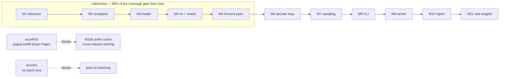

# Sequencing

The other specs say what. This one says **when**, and afterwards, **what really
happened**. It is the only file here that is edited after its subject ships.

## 1. The rule that fixes the order

Nothing that can be wrong silently is built on top of something unverified. So
the order is: the pieces with a checkable ground truth first (a tokenizer has
fixed vectors; a template has a golden string), then numerics against an oracle,
then the loop, then the surfaces.

Writing the server early is the tempting mistake. A `framework` request invites
an API surface, and an API over logits that are subtly wrong is a working demo
of a broken model.

## 2. Milestones

| M | scope | done means |
| --- | --- | --- |
| M0 | module, CI, spec tree, docs | CI green on an empty build; every gate from accel's `ci.yml` present |
| M1 | tokenizer ([002](002-tokenizer.md)) | fixed vectors pass; fuzz clean; streaming equals batch |
| M2 | chat template ([003](003-chat-template.md)) | goldens match; the injection case is structural |
| M3 | safetensors + conversion ([001](001-weights.md)) | every §6 refusal is a test; bf16→f16 saturation counted |
| M4 | `nn` blocks + oracle ([004](004-model-graph.md), [010 §5](010-conformance.md)) | each block matches the f64 oracle within a derived tolerance, both backends |
| M5 | Qwen3 forward pass | a synthetic 2-layer config produces logits matching the oracle |
| M6 | KV cache + decode loop ([005](005-kv-cache.md), [007](007-engine.md)) | prefill-then-decode equals token-by-token; padded prefill leaves the cache clean. **Capped at 128 positions until [010 C11](010-conformance.md) closes** |
| M7 | sampling ([006](006-sampling.md)) | order tests pass; stream reproducibility holds across a policy change |
| M8 | CLI | `tgo run` generates from a local checkpoint |
| M9 | server ([009](009-server.md)) | handler suite against the fake engine; one golden per dialect; one real end-to-end |
| M10 | conformance report ([010](010-conformance.md)) | the register table is generated from the tests; §3 numbers measured |
| M10b | prefix caching ([016](016-prefix-cache.md)) | warm equals cold greedy; the evicted-hash test passes; cold-vs-warm divergence measured. Single-session reuse is unblocked; **cross-request sharing waits on [C13](010-conformance.md)** |
| M11 | real weights | a Qwen3 dense checkpoint is coherent at f16 and int8, on both backends |

M11 is the gate in [000](000-decisions.md)'s "what v0 is". Everything before it
runs on synthetic configs.

### 2.1 What is gated upstream, and what is not

M1–M5 are entirely unblocked and are where the work goes now. They are also
where [000 D8](000-decisions.md) puts the device-free packages, so they carry
almost all of the coverage gate: a tree that reaches M5 with the gate green is a
tree whose remaining risk is concentrated in the parts a device decides.

**M6 through M11 are unblocked.** [C11](010-conformance.md), the 128-position
cache cap that gated everything, closed on 2026-08-24 when accel shipped
[044](https://github.com/golang-design/accel/blob/main/specs/044-unbounded-context.md).
A 4096-position cache is verified. Nothing between here and serving a real model
is waiting on accel.

What remains blocked is post-v0 and narrower:

| | blocked on |
| --- | --- |
| M10b's **cross-request** prefix sharing | [C13](010-conformance.md) — a paged prefill drops its page table |
| continuous batching ([008](008-scheduler.md)) | [C1](010-conformance.md) — `q`'s rank is the phase, so a batch has no axis |

M10b's **single-session** reuse — the $1 - 1/n$ multi-turn win, which is most of
the value — is not blocked.

### 2026-08-24 — M0 — **done**

Module, CI, and the spec tree. CI mirrors accel's gates — build, vet, test,
race, cgo-free, cross-compile, gofmt — with two additions: a **per-package**
coverage floor rather than a repository average, and `speclint`, which checks
frontmatter shape, that dependency edges resolve, that the tree is acyclic, that
a `blocked` spec names what blocks it, that every spec carries a decision
record, and that the index cannot go stale.

**Deviation from plan:** none in scope, but the tree was written twice. It was
first written against accel's signatures as they stood, and then reconciled
against accel
[043](https://github.com/golang-design/accel/blob/main/specs/043-per-row-values.md),
which landed mid-drafting in answer to seven reports tgo filed. Five register
rows changed state in one commit.

**Findings, which are the actual output of M0:** nine issues on accel. Seven
before the reconciliation, two after — and the two found last are the ones that
matter most. [accel#8](https://github.com/golang-design/accel/issues/8) caps the
KV cache at 128 positions — since closed by accel 044, which tgo also designed.
[accel#9](https://github.com/golang-design/accel/issues/9) refuses a
`LayerState` view, which corrected a decision this tree had already recorded
([005-D1](005-kv-cache.md)).

That last point is worth keeping. **A spec written against a library's
documentation was wrong about that library within a day.** Reading the
signatures is not the same as reading the refusals, and the refusals are where
the design actually lives.

**Two gates found their own bugs before any product code existed**, which is the
argument for building them first:

- The coverage gate reported *"every package at or above 90%"* over a tree whose
  only measured package was the one exempt from the check. It now fails when no
  non-exempt package was measured, and `speclint` moved from a test-only package
  into real code so the floor has something to stand on — 97.9%, measured.
- `speclint`'s negative tests immediately found a bug in its own citation regex,
  which captured the digits without the `C` and would have reported every valid
  register citation as dangling.
- CI's Windows row found that a CRLF checkout made **every spec in the tree**
  fail to parse. Nothing local would have.

CI is green on both workflows: `ci` across Linux, macOS and Windows with the
race detector, the fuzz seed corpus, the per-package coverage floor, the
cgo-free grep, ten cross-compile targets, gofmt and `speclint`; and `ci-metal`
on Apple silicon.

**M1 is next and is unblocked.**
