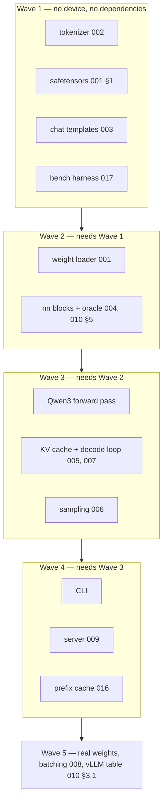
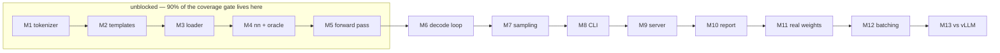

# Sequencing

The other specs say what. This one says **when**, and afterwards, **what really
happened**. It is the only file here that is edited after its subject ships.

## 1. The rule that fixes the order

Nothing that can be wrong silently is built on top of something unverified. So
the order is: the pieces with a checkable ground truth first (a tokenizer has
fixed vectors; a template has a golden string), then numerics against an oracle,
then the loop, then the surfaces.

Writing the server early is the tempting mistake. A `framework` request invites
an API surface, and an API over logits that are subtly wrong is a working demo
of a broken model.

## 2. Readiness: build now, and what the targets actually are

**Verdict, 2026-08-24: ready to build the dense path.** The whole Qwen3-4B graph
compiles against accel, nothing in M1–M11 is blocked upstream, and further spec
polish would be writing against a design that has stopped moving.

**But one of the two named target models is not a dense transformer**, and that
was discovered by reading its config rather than assuming.

### 2.1 The two targets, corrected

| named | actual | status |
| --- | --- | --- |
| "Qwen3 3B" | **Qwen3-4B**. There is no 3B; the dense line is 0.6B, 1.7B, 4B, 8B, 14B, 32B | **buildable now** |
| "Qwen3.8 27B" | **Qwen3.8-27B**, Apache 2.0, released August 2026 | **blocked**, [018](018-hybrid-models.md) |

Qwen3-4B: `Qwen3ForCausalLM`, $d=2560$, $L=36$, 32 query heads over 8 KV heads,
$d_h=128$, $f=9728$, $V=151936$, `rope_theta` $10^6$, tied embeddings. This is
exactly what [004](004-model-graph.md) specifies.

Qwen3.8-27B is a **different architecture family**:

```json
"architectures": ["Qwen3_5ForConditionalGeneration"],
"layer_types": ["linear_attention", "full_attention"],
"full_attention_interval": 4,
"num_hidden_layers": 64, "hidden_size": 5120, "head_dim": 256,
"num_attention_heads": 24, "num_key_value_heads": 4,
"partial_rotary_factor": 0.25, "attn_output_gate": true,
"linear_num_key_heads": 16, "linear_num_value_heads": 48,
"max_position_embeddings": 262144, "vocab_size": 248320
```

**Three of every four layers are linear attention** — a gated-delta recurrence,
not softmax attention — and it carries vision tokens. accel has no
linear-attention operator, so 48 of its 64 layers are inexpressible. Filed as
[accel#17](https://github.com/golang-design/accel/issues/17), and
[018](018-hybrid-models.md) is the design.

Two things about it that *do* work, checked rather than assumed:
`partial_rotary_factor: 0.25` is `RoPE(x, 64, …)` because `rotaryDim` was always
a parameter, and `attn_output_gate` is an elementwise multiply.

> **This is why the answer is "build now" rather than "spec more".** The dense
> path is fully specified and unblocked; the hybrid path is blocked on a kernel
> nobody has written, and no amount of tgo spec work moves it. Building the
> dense path is also what produces the evidence that makes the hybrid ask
> concrete.

### 2.2 Waves

Work is grouped by what can proceed in parallel. A wave starts when the one
before it is green.



**Wave 1 is four independent packages with no device and no network**, which is
where [000 D8](000-decisions.md) puts the coverage gate, and it is the wave that
parallelises cleanly. Wave 3 is the one that must be sequential: the forward
pass, the cache and the loop are one dependency chain.

## 3. Milestones

### 3.1 What is gated upstream, and what is not



M1–M5 are entirely unblocked and are where the work goes now. They are also
where [000 D8](000-decisions.md) puts the device-free packages, so they carry
almost all of the coverage gate: a tree that reaches M5 with the gate green is a
tree whose remaining risk is concentrated in the parts a device decides.

**M6 through M11 are unblocked.** [C11](010-conformance.md), the 128-position
cache cap that gated everything, closed on 2026-08-24 when accel shipped
[044](https://github.com/golang-design/accel/blob/main/specs/044-unbounded-context.md).
A 4096-position cache is verified. Nothing between here and serving a real model
is waiting on accel.

What remains blocked is post-v0 and narrower:

| | blocked on |
| --- | --- |
| chunked prefill recovering throughput | [C16](010-conformance.md) — a batched step takes one token per sequence, so a prefill runs alone |

**Nothing is blocked upstream any more.** Batching was the last one and accel
closed it: a batched decode is expressible and verified, two sequences of
different lengths matching two single runs exactly. What remains open is
narrower — no sampling operator at the tensor layer, no batched *prefill*, and
GGUF — and none of it blocks a milestone.

### 2026-08-24 — Wave 1 shipped, Wave 2 started

**Verdict at the start of the wave: build.** [§2](#2-readiness-build-now-and-what-the-targets-actually-are)
has the evidence. Re-checked before Wave 2: accel has moved on to graphics work
so the tensor layer is stable, tgo builds and tests clean against it, and the
four open upstream issues
([#6](https://github.com/golang-design/accel/issues/6),
[#16](https://github.com/golang-design/accel/issues/16),
[#17](https://github.com/golang-design/accel/issues/17),
[#18](https://github.com/golang-design/accel/issues/18)) block neither Wave 2
nor Wave 3.

**What the field survey found**, since the targets turned out to be misnamed:
the Qwen3 dense line has no 3B (the target is 4B); Qwen3.8-27B is real and is
**not dense** — 48 of its 64 layers are linear attention ([018](018-hybrid-models.md),
[accel#17](https://github.com/golang-design/accel/issues/17)); and MoE is most of
what ships at single-machine sizes, which accel has no routed GEMM for
([accel#18](https://github.com/golang-design/accel/issues/18)). Both were filed
as questions rather than proposals.

**Wave 1 shipped**: `bench` 100.0%, `chat` 100.0%, `tokenizer` 99.1%,
`safetensors` 97.7%. Every gate green including `-race`, and the coverage floor
now measures five packages.

**What the parallel review pass earned**, since it doubles the cost and has to
pay for itself:

- `chat`'s reviewer mutation-tested fourteen edits, found three blind spots, and
  verified the goldens came from the reference by rendering the real Qwen3
  template with Jinja2 over 47 cases — all byte-identical.
- `tokenizer`'s reviewer found `post_processor` and `decoder` were never read. A
  Llama-3-style file would have loaded and encoded every prompt **without its
  BOS token**, silently. Both are now refused by name.
- One real defect, escalated rather than hidden: NFC was an identity seam while
  the loader *refused* NFKC because it "changes ids". Accepting a declared
  normalizer and not running it is the same silent divergence that refusal
  exists to prevent. Resolved by taking `x/text/unicode/norm`
  ([002-D10](002-tokenizer.md)) — pure Go, no cgo, so
  [000 D2](000-decisions.md) is untouched.

**A real checkpoint is on disk**: Qwen3-0.6B at `~/.cache/openllms-e2e/model`,
1.5 GB of bf16 safetensors. It carries `head_dim: 128` against
`hidden_size/num_attention_heads` of 64 — exactly the case
[004 §5](004-model-graph.md) says never to infer, now testable rather than
argued. Tests that read it are gated behind `TGO_MODEL` and never run in CI
([000 D8](000-decisions.md)).

**Wave 2 started**: `weights`, `nn`, `internal/oracle`, `model`.

### 2026-08-24 — the forward pass compiles, and the casts are gone

Not a milestone; a measurement, taken because the README claimed "nothing between
here and serving a model is waiting on accel" and nothing had checked it.

The whole Qwen3-4B graph from [004 §3](004-model-graph.md) — $d=2560$, $H=32$,
$H_{kv}=8$, $d_h=128$, $f=9728$, $V=151936$, $L=36$, a 4096-position cache —
compiles against accel HEAD:

| plan | selections | transients |
| --- | --- | --- |
| prefill 512, f16 weights | 760 | 62.0 MB |
| decode 1, f16 weights | 759 | 0.1 MB |
| prefill 512, int8 weights | 760 | 62.0 MB |
| decode 1, int8 weights | 759 | 0.1 MB |

**It was 1013 selections a day earlier.** The difference is 253 `Cast` nodes
that existed only because `MatMul` required both operands to share a dtype;
[010 C8](010-conformance.md) closed and they are gone.

Two things the numbers show that the specs only argued:

- **[004 §3.2](004-model-graph.md)'s last-row slice is worth what it claimed.**
  Prefill transients are 62 MB. Running the LM head over all 512 positions would
  add $512 \times 151936 \times 4 = 311$ MB of logits alone.
- **The cast cost was real and is now zero**, which is the first upstream change
  tgo can price exactly rather than estimate.

**What this does not show** is that the numbers are *correct* — that needs
[010 §5](010-conformance.md)'s oracle, which needs implementation. Compiling
proves the graph is expressible, not that tgo would build it right. The
[§2.5.1](004-model-graph.md) rotary permutation is exactly the kind of error
that compiles cleanly.

### 2026-08-24 — M0 — **done**

Module, CI, and the spec tree. CI mirrors accel's gates — build, vet, test,
race, cgo-free, cross-compile, gofmt — with two additions: a **per-package**
coverage floor rather than a repository average, and `speclint`, which checks
frontmatter shape, that dependency edges resolve, that the tree is acyclic, that
a `blocked` spec names what blocks it, that every spec carries a decision
record, and that the index cannot go stale.

**Deviation from plan:** none in scope, but the tree was written twice. It was
first written against accel's signatures as they stood, and then reconciled
against accel
[043](https://github.com/golang-design/accel/blob/main/specs/043-per-row-values.md),
which landed mid-drafting in answer to seven reports tgo filed. Five register
rows changed state in one commit.

**Findings, which are the actual output of M0:** nine issues on accel. Seven
before the reconciliation, two after — and the two found last are the ones that
matter most. [accel#8](https://github.com/golang-design/accel/issues/8) caps the
KV cache at 128 positions — since closed by accel 044, which tgo also designed.
[accel#9](https://github.com/golang-design/accel/issues/9) refuses a
`LayerState` view, which corrected a decision this tree had already recorded
([005-D1](005-kv-cache.md)).

That last point is worth keeping. **A spec written against a library's
documentation was wrong about that library within a day.** Reading the
signatures is not the same as reading the refusals, and the refusals are where
the design actually lives.

**Two gates found their own bugs before any product code existed**, which is the
argument for building them first:

- The coverage gate reported *"every package at or above 90%"* over a tree whose
  only measured package was the one exempt from the check. It now fails when no
  non-exempt package was measured, and `speclint` moved from a test-only package
  into real code so the floor has something to stand on — 97.9%, measured.
- `speclint`'s negative tests immediately found a bug in its own citation regex,
  which captured the digits without the `C` and would have reported every valid
  register citation as dangling.
- CI's Windows row found that a CRLF checkout made **every spec in the tree**
  fail to parse. Nothing local would have.

CI is green on both workflows: `ci` across Linux, macOS and Windows with the
race detector, the fuzz seed corpus, the per-package coverage floor, the
cgo-free grep, ten cross-compile targets, gofmt and `speclint`; and `ci-metal`
on Apple silicon.

**M1 is next and is unblocked.**
