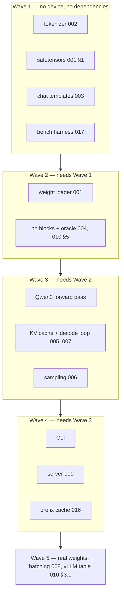
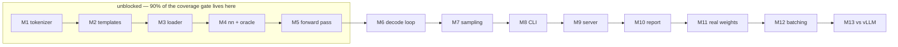

# Sequencing

The other specs say what. This one says **when**, and afterwards, **what really
happened**. It is the only file here that is edited after its subject ships.

## 1. The rule that fixes the order

Nothing that can be wrong silently is built on top of something unverified. So
the order is: the pieces with a checkable ground truth first (a tokenizer has
fixed vectors; a template has a golden string), then numerics against an oracle,
then the loop, then the surfaces.

Writing the server early is the tempting mistake. A `framework` request invites
an API surface, and an API over logits that are subtly wrong is a working demo
of a broken model.

## 2. Readiness: build now, and what the targets actually are

**Verdict, 2026-08-24: ready to build the dense path.** The whole Qwen3-4B graph
compiles against accel, nothing in M1–M11 is blocked upstream, and further spec
polish would be writing against a design that has stopped moving.

**But one of the two named target models is not a dense transformer**, and that
was discovered by reading its config rather than assuming.

### 2.1 The two targets, corrected

| named | actual | status |
| --- | --- | --- |
| "Qwen3 3B" | **Qwen3-4B**. There is no 3B; the dense line is 0.6B, 1.7B, 4B, 8B, 14B, 32B | **buildable now** |
| "Qwen3.8 27B" | **Qwen3.8-27B**, Apache 2.0, released August 2026 | **blocked**, [018](018-hybrid-models.md) |

### 2.1.1 What "well tested" means for each, and what it cannot mean

The two targets are at different distances, and saying so precisely matters more
than restating the goal.

| | Qwen3 dense | Qwen3.8-27B |
| --- | --- | --- |
| architecture expressible | **yes** — the graph compiles at 36 layers and $V=151936$ | **no** — 48 of 64 layers need an operator accel does not have |
| numerics verified | **yes** — against the f64 oracle, per block and end to end | not reachable |
| real weights loaded | **yes** — Qwen3-0.6B, 311 tensors, 1.40 GiB at f16 | not reachable |
| generation verified | **Wave 4** | not reachable |
| blocked by | nothing | [accel#17](https://github.com/golang-design/accel/issues/17) |

**Two honest qualifications on the dense side.** The checkpoint on hand is
**0.6B**, not 4B — same architecture, same code path, one twelfth the
parameters. What that proves is the loader, the graph and the numerics; what it
does not prove is behaviour at 4B's memory footprint. And the 4B graph is
verified to *compile and to agree with the oracle*, not to have generated text,
until Wave 4 lands.

**On the 27B, the position is not "not yet" but "not by tgo".** 018 states it,
accel has [scoped the operator](https://github.com/golang-design/accel/issues/17)
as in-scope-not-scheduled, and [000 D1](000-decisions.md) forbids tgo from
writing the kernel itself. Testing it is downstream of an upstream decision this
project deliberately does not control. Claiming otherwise would be the
overclaiming this tree exists to prevent.

Qwen3-4B: `Qwen3ForCausalLM`, $d=2560$, $L=36$, 32 query heads over 8 KV heads,
$d_h=128$, $f=9728$, $V=151936$, `rope_theta` $10^6$, tied embeddings. This is
exactly what [004](004-model-graph.md) specifies.

Qwen3.8-27B is a **different architecture family**:

```json
"architectures": ["Qwen3_5ForConditionalGeneration"],
"layer_types": ["linear_attention", "full_attention"],
"full_attention_interval": 4,
"num_hidden_layers": 64, "hidden_size": 5120, "head_dim": 256,
"num_attention_heads": 24, "num_key_value_heads": 4,
"partial_rotary_factor": 0.25, "attn_output_gate": true,
"linear_num_key_heads": 16, "linear_num_value_heads": 48,
"max_position_embeddings": 262144, "vocab_size": 248320
```

**Three of every four layers are linear attention** — a gated-delta recurrence,
not softmax attention — and it carries vision tokens. accel has no
linear-attention operator, so 48 of its 64 layers are inexpressible. Filed as
[accel#17](https://github.com/golang-design/accel/issues/17), and
[018](018-hybrid-models.md) is the design.

Two things about it that *do* work, checked rather than assumed:
`partial_rotary_factor: 0.25` is `RoPE(x, 64, …)` because `rotaryDim` was always
a parameter, and `attn_output_gate` is an elementwise multiply.

> **This is why the answer is "build now" rather than "spec more".** The dense
> path is fully specified and unblocked; the hybrid path is blocked on a kernel
> nobody has written, and no amount of tgo spec work moves it. Building the
> dense path is also what produces the evidence that makes the hybrid ask
> concrete.

### 2.2 Waves

Work is grouped by what can proceed in parallel. A wave starts when the one
before it is green.



**Wave 1 is four independent packages with no device and no network**, which is
where [000 D8](000-decisions.md) puts the coverage gate, and it is the wave that
parallelises cleanly. Wave 3 is the one that must be sequential: the forward
pass, the cache and the loop are one dependency chain.

## 2.3 What is missing that no spec covers

The waves above are the *known* work. This section is the other list: what an
inference framework has that this tree has never written down. It exists because
a spec tree makes its own gaps invisible — everything in `specs/` is accounted
for, so the absent things are absent from the accounting too.

**Ranked by what decides whether tgo is usable, not by effort.**

### 1. Four-bit weights — decides which models are reachable at all

accel's `quant` registers one representation: int8, one fp16 scale per 32. There
is no 4-bit path, and the arithmetic on the 27B target is decisive:

| stored as | resident | fits |
| --- | ---: | --- |
| bf16 | 50.3 GiB | a large workstation |
| **int8, all tgo has** | **25.1 GiB** | not a 24 GiB card |
| int4 | 12.6 GiB | hardware people own |

**This is a second blocker on Qwen3.8-27B that has nothing to do with
[accel#17](https://github.com/golang-design/accel/issues/17)'s linear attention.**
Even if that operator lands tomorrow, the model does not fit.

And [001](001-weights.md) reads *full-precision safetensors and quantizes at
load*, so running a 27B means downloading **50 GiB** to produce 25 GiB, when the
file the ecosystem publishes for it is a 13 GiB 4-bit checkpoint. Filed as
[accel#22](https://github.com/golang-design/accel/issues/22).

### 2. Reading pre-quantized checkpoints — AWQ, GPTQ, GGUF

Distinct from the above: even with 4-bit kernels, tgo would still quantize from
full precision at load. AWQ and GPTQ dominate what is published for open weights
and both use a group size of 128 with a **zero point**, which is a different
shape from accel's symmetric per-32 int8. [012](012-gguf.md) covers GGUF's
K-quants and is blocked; AWQ and GPTQ have no spec at all.

### 3. `rope_scaling` — decides context length

[004 §7](004-model-graph.md) **refuses** any `rope_scaling` it does not
implement, which is the right refusal and means tgo is capped at a checkpoint's
trained context. Qwen3 reaches its long-context modes through YaRN. Refusing is
correct; not having it is a gap, and it is entirely tgo's rather than accel's —
YaRN is a change to how $\theta_i$ is computed, and [004 §2.5](004-model-graph.md)
already binds the base as a scalar.

### 4. Multi-device — a permanent ceiling on model size

accel opens one device. There is no tensor or pipeline parallelism anywhere in
either project, so **the largest model tgo can ever run is the largest that fits
one accelerator**. That is a legitimate scope decision and it should be a stated
one rather than an omission.

### 5. Things with no spec and no blocker

| | why it matters |
| --- | --- |
| **speculative decoding** | the standard 2–3× decode win, and [017 §4.1](017-benchmarks.md) shows decode is 94.62% device — exactly the shape speculation attacks |
| **embedding models** | a large share of what inference frameworks actually serve; tgo has no `/v1/embeddings` and no pooling |
| **multimodal input** | [018 §1](018-hybrid-models.md) notes Qwen3.8 carries vision tokens and text-only is a coherent subset, but there is no path to images |
| **LoRA adapters** | [011 §3](#3-what-is-deliberately-not-in-v0) lists it as not-v0; note [016 §10.3](016-prefix-cache.md) already records that an adapter must reach the prefix cache key |

### What this section is not

A backlog. Several of these are correct things to *not* do — multi-device may
never be in scope, and refusing an unimplemented `rope_scaling` beats
approximating it. The point is that each should be a decision somebody made
rather than a question nobody asked.

## 3. Milestones

### 3.1 What is gated upstream, and what is not



M1–M5 are entirely unblocked and are where the work goes now. They are also
where [000 D8](000-decisions.md) puts the device-free packages, so they carry
almost all of the coverage gate: a tree that reaches M5 with the gate green is a
tree whose remaining risk is concentrated in the parts a device decides.

**M6 through M11 are unblocked.** [C11](010-conformance.md), the 128-position
cache cap that gated everything, closed on 2026-08-24 when accel shipped
[044](https://github.com/golang-design/accel/blob/main/specs/044-unbounded-context.md).
A 4096-position cache is verified. Nothing between here and serving a real model
is waiting on accel.

What remains blocked is post-v0 and narrower:

| | blocked on |
| --- | --- |
| chunked prefill recovering throughput | [C16](010-conformance.md) — a batched step takes one token per sequence, so a prefill runs alone |

**Nothing is blocked upstream any more.** Batching was the last one and accel
closed it: a batched decode is expressible and verified, two sequences of
different lengths matching two single runs exactly. What remains open is
narrower — no sampling operator at the tensor layer, no batched *prefill*, and
GGUF — and none of it blocks a milestone.

### 2026-08-26 — Wave 7: the server reuses a conversation's prefix

[019](019-session-affinity.md), and it closes what Wave 6 opened: the prefix
cache worked and `tgo serve` could not reach it, because `generate.go` opened
one session per request and closed it on the way out.

`Model.NewPool(n)` holds N sessions' key/value cache for the process's life and
routes a request to the session already holding the longest matching prefix.
**It needs nothing from accel.** The refusal `CacheProcess` returns names a
missing page table, and that is the blocker for block-level sharing, not for
cross-request reuse: a session's cache is contiguous and single-owner, so a
row's index is its position. What 016 §4's pool would add over this is dedup
across *different* conversations, which affinity cannot do at any size.

**Measured, through the recorder rather than a clock.** Two turns of one
conversation, pool of two, 80-position context, greedy:

| | prompt | prefilled | prefill steps |
| --- | --- | --- | --- |
| turn 1 | 18 | 18 | 1 |
| turn 2 | 32 | **9** | 1 |
| turn 2, on a pool that never saw turn 1 | 32 | 32 | 1 |

The cold row is what makes 9 a number rather than a small integer. The 23
positions skipped are turn 1's 18-token prompt and the 5 tokens it generated.

**Three mutants survived the first suite**, all of them missing tests rather
than defects, and two are worth recording:

- **The unkeyed direction of the fail-closed rule.** Letting an unkeyed request
  match a *keyed* session passed everything. The table test established the
  unkeyed conversation first, so its later request always had its own session to
  hit and read the same reuse count either way. This is the security direction:
  a probe with no `cache_salt` could measure whether a salted caller's prompt
  exists.
- **The history truncation**, which no request can observe. `reusable` takes
  `min(s.length, len(s.history), ...)`, so a history longer than the length is
  invisible to routing; it reaches the sampler's repetition penalties instead.
  It needed a postcondition test that desynchronises the two the one way a
  caller cannot.

**A rule paid for twice.** The race step timed out on ubuntu and windows and
named a test that was not at fault -- `go test` reports whichever test was
running when the clock ran out. The root package runs a forward pass on the CPU
and the race detector costs about an order of magnitude on that arithmetic: 362s
wall but 1297s of CPU, so a runner with fewer, slower cores goes past the
ten-minute default. CONTRIBUTING now says to measure CPU time, because the wall
clock is what made it look green locally.

**Remaining**: [008](008-scheduler.md) continuous batching, which is the one
that turns "several conversations at once" into "several conversations in one
step", and [§2.3](#23-what-is-missing-that-no-spec-covers)'s unspecced gaps.

### 2026-08-27 — Wave 8: the cache is addressed through a page table

Two probes and two commits of code, in that order, because
[010 §2](010-conformance.md) says a row's state is decided by a value and not by
a commit message.

**The probes first.** accel closed [#16](https://github.com/golang-design/accel/issues/16)
with a ragged step and shipped `tensor.LinearAttention`. Both were checked by
binding real buffers rather than by reading `tensor/attention.go`:

| probe | what it asserts |
| --- | --- |
| [C16](010-conformance.md) | a mixed step — a 3-token chunk, a decode, and a sequence contributing nothing — matches a float64 reference that walks the page table itself, selects `AttentionRagged`, is **bit-identical** to the same tokens run as separate dispatches, and changes its output when the extents are re-split 2/1/1 |
| the gated delta scan ([018](018-hybrid-models.md)) | it matches a float64 reference, halving every $\alpha$ moves the output, and a state with `valueDim` and `keyDim` transposed is refused. Not a register row: the register is what tgo *cannot* do, and this it can |

Both closed. [008](008-scheduler.md) and [018](018-hybrid-models.md) are
therefore unblocked upstream, and **no spec in this tree is blocked upstream any
more.**

**And the probe found what it was not looking for.** The ragged kernel reads an
**f32** cache. [C5](010-conformance.md) closed on the argument that an f16 cache
halves the largest allocation a serving process has, and the operator that makes
batching possible gives that halving back — which by [008 §1](008-scheduler.md)
halves both the batch size worth reaching and the throughput ceiling. Filed as
[accel#23](https://github.com/golang-design/accel/issues/23) and recorded as
[C22](010-conformance.md). A consumer that reports the capability it wanted and
not the one it lost is reporting half.

**Then the port.** [016 §9](016-prefix-cache.md)'s third constraint was tgo's
own: the kernels honoured a page table and
[004 §3](004-model-graph.md)'s port table had none, so nothing here could pass
one. `GraphSpec.Block` declares `PortPages` and `NewPagedStep` maps a logical
position through it. The value test is a prefill over a **permuted** table
required to agree bit for bit with a contiguous run — an identity table would
pass whether the kernels read it or not, which is how
[accel#10](https://github.com/golang-design/accel/issues/10) stayed invisible —
with a negative control that writes contiguously and reads through the
permutation and requires the two to *disagree*.

**Then the pool.** `WithPrefixCache(CacheProcess, positions)` is available and
`internal/prefix` has an importer after two waves of having none. The key and
value states moved from the session to the model, which is what makes sharing
possible and also what bounds a server's memory: the cost is the pool, not
sessions times context. Measured on the fixture, a second conversation reused
**96 of 106** prompt tokens it never computed, and generated what a cold run
generates.

**One defect, found by the test written to find it.** `NewSession` sized the
page table and then replaced the whole step struct below it, dropping the slice.
`WriteBuffer` over an empty slice writes nothing and reports nothing, so the
port held whatever the allocation held and every step attended to blocks nobody
chose — fluent text, no error, and a pooled session generating different tokens
from a contiguous one at *identical* addressing.

Isolating it is the part worth keeping. A probe at the tensor layer proved
accel's paged prefill is bit-identical to the contiguous one at these shapes; a
second at the model layer proved the recorded graph is; which left the session,
and a diff of its bound ports showed the page table was empty. **Three layers,
each ruled out by a value.** The fix is one line in the constructor, so the
check at the seam is what makes the class visible next time.

**And one decision the shared pool forced that no per-session cache ever had
to make: how long a lease lives.** It was released at the next request, so an
idle conversation held a reference to blocks no live one could have — over $B$
blocks and $N$ sessions, [008 §3](008-scheduler.md)'s deadlock. The third
request of a four-request server test failed with six of eight blocks
referenced, which is the value of an end-to-end test over one that stubs the
engine: the flag-layer test could not have found it because it never serves a
request. [016-D12](016-prefix-cache.md) is the rule and the tail is its cost.

Over the wire, two different conversations sharing an opening turn: the second
reuses what the first paid for, and a third under a `cache_salt` reuses nothing.
No session-scoped cache produces that at any pool size.

**Remaining after Wave 8**: [008](008-scheduler.md), which Wave 9 built. One
smaller debt is named rather than hidden: `Pool.route` still asks
`Session.reusable`, which returns zero outside the session scope, so under a
process pool a request goes to the coldest session and the blocks do the
sharing. Nothing is lost, and [008-D9](008-scheduler.md) is where routing learns
to ask the pool.

### 2026-08-27 — Wave 9: several conversations in one step

[008](008-scheduler.md), which was `blocked` from the day it was written and is
`implemented`. [§8](008-scheduler.md) is what shipped, section by section;
what is worth recording here is the shape of the work and what it cost.

**The order was the page-table port, the shared pool, the batched graph, then
the policy** — the order 008 §8 planned, and each step's test was the same
shape: a batch of N must produce what N single steps produce, bit for bit, and
the page tables are permutations because an identity table passes whether the
kernel reads it or not.

**The mix is the deliverable.** A chunked prefill and the decodes beside it are
one dispatch, measured at 8 prompt tokens and 2 decodes in one step. That is
what makes chunking recover throughput rather than only bound latency: the
weights are read once for the chunk and its passengers together.

**The policy is a pure function and is tested without a device.** `nextStep` and
`victim` decide from slot state alone, so the cases are the ones that matter
rather than the ones a forward-pass fixture can afford. It is the first part of
this tree where the cheap test and the thorough test are the same test.

**Three defects, and none of them had a symptom a value test would catch.** A
batched step padded rows belonging to no sequence, which on a GPU is another
sequence's cache read back fluently — [C23](010-conformance.md), filed as
[accel#24](https://github.com/golang-design/accel/issues/24). `Admit` leased the
prompt and `Step` leased it again, chaining block hashes over `prompt+prompt`
while the step's own logits stayed correct. And a returned logits slice outlived
what it described, which the author's own test broke within minutes — a lifetime
nobody can keep is not a lifetime.

**Remaining**: [008 §9](008-scheduler.md)'s three — sampling on the batched
path, a queue in front of admission, and the server actually using it — and
[§2.3](#23-what-is-missing-that-no-spec-covers)'s unspecced gaps.

### 2026-08-26 — Wave 6: structured output is reachable from a request

`internal/grammar` shipped with 97.8% coverage and **no caller**, which the
per-package gate cannot see: a package nothing imports reads green. This wave is
the wiring, and [015 §5](015-structured-output.md) is the shape of it.

`Policy.Schema` carries a schema, `Model.CheckSchema` compiles one on its own,
`Stream.advance` masks before the draw and advances after it, and `adapt.go`
accepts `response_format`, `output_format` and `text.format` instead of refusing
them. A schema the compiler will not compile is a 400 carrying the keyword and
the obstruction, answered before a session is allocated.

**Three joins the grammar package could not test, because it never sees a real
tokenizer**, and each one fails silently:

- **The bytes.** `Vocab.Bytes` is `Tokenizer.TextBytes`, new here: the decoded
  bytes, not the vocabulary file's spelling. A byte-level BPE stores `" the"` as
  `"Ġthe"`, and a mask built from the surface form constrains a different
  language and reports nothing.
- **The width.** The mask is applied to a logits row, so the vocabulary is the
  checkpoint's `vocab_size` and not the tokenizer's id space. The fixture pads
  640 over 582, which is what makes the confusion visible in a test.
- **The stop set.** `Options.Stop` is exactly what `Stream.isStop` ends on. Empty,
  `Mask` returns `ErrNoToken` the moment the document is complete -- so every
  constrained generation would fail on its last step with the right answer in
  hand. The test that catches it is a generation that runs to a complete
  document and *stops*, asserted as `finish_reason: stop` rather than as text.

**A fixture hazard worth writing down.** JSON admits whitespace before every
token, so the grammar does too, and a synthetic checkpoint's weights draw a
space as readily as a brace: an object schema ran a 600-token budget out on
indentation. Both end-to-end tests therefore use a schema whose language is
finite and ban whitespace through `logit_bias`, so the budget is a bound rather
than a hope. An `"integer"` property is not finite -- a magnitude bound is
`"maximum"`, which the compiler refuses as arithmetic on the value -- and that
narrowing is the package's, documented, not the mask failing.

**The other half of this wave was [016](016-prefix-cache.md), and it landed
short of the product.** `WithPrefixCache(CacheSession, n)` reuses a session's
own prefix and is tested at the library surface. It reuses nothing from `tgo
serve`, because the server opens one session per request and closes it on the
way out, so a session never sees a second turn. `CacheProcess` is refused: it
needs a page table, and [004 §3](004-model-graph.md) declares no port for one.
[016 §7.2](016-prefix-cache.md) carries the correction and the three options;
the decision taken was **session affinity** — pool the sessions and route a
request to the one already holding the longest matching prefix, which needs no
page table at all.

**Two packages have no importer, and the coverage gate cannot say so.**
`internal/prefix` is 100% covered and called by nothing: it is the block pool
for the sharing the missing port blocks, so it waits. `internal/grammar` was in
the same state until this wave, which is what the wave was. A per-package floor
measures the packages that exist, not the ones that are reached, so "15
packages at or above 90%" is true of code no request can run.

**Remaining**: session affinity for [016](016-prefix-cache.md),
[008](008-scheduler.md) continuous batching, and
[§2.3](#23-what-is-missing-that-no-spec-covers)'s unspecced gaps.

### 2026-08-26 — Wave 5 shipped: tgo serves

`server`, `internal/prefix`, `internal/hub`, and `serve`/`pull` in `cmd/tgo`.
**Seventeen packages**, every gate green, the coverage floor measuring fourteen.

**Verified against the real model, not against a fake.** `tgo serve` on
Qwen3-0.6B, Metal, 217 admitted sessions at 256 positions:

| | |
| --- | --- |
| OpenAI Chat | answers, `finish_reason`, usage |
| Anthropic Messages | answers, thinking typed as a `thinking` block |
| OpenAI Responses | answers, reasoning as a `summary_text` |
| SSE | streams token by token, `reasoning_content` deltas |
| `X-Tgo-Loss` | `service_tier, user` — advisory fields ran and were reported |
| `n=4` | refused by name, with the reason and a remedy |
| `/metrics` | in-flight per dialect, queue depth, wait histogram |
| SIGINT | graceful, in-flight requests given 30s |

That is [009-D2](009-server.md)'s rule working end to end: refuse what changes
the answer, report what cannot.

**What the reviews found, and none of it was in production code.** Every defect
this wave was a *test* that appeared to cover a property and did not:

- **`internal/hub`**: the lock suite proved the lock was *acquired* and never
  that it was *held while bytes landed* — which is the entirety of
  [013 §3](013-distribution.md)'s claim. The parallel bound was unproven because
  the fake released its barrier before the held handlers could be counted. And
  `openPart`'s truncate guarded a real corruption the fixture masked: a partial
  longer than the body leaves stale bytes on the end, and the rename publishes
  them.
- **`internal/prefix`**: the chained-hash test — the one named for
  [016-D2](016-prefix-cache.md) — was **insensitive to an unchained hash**. A
  match loop stops at the first miss, so an interior block is never looked up;
  the collision does its damage at **publish**, where the second prompt adopts
  the first's physical block. 016 §8 now names publish.
- **`server`**: [009-D12](009-server.md) was dialect-blind and shipped the
  defect it caused. Amended.
- **`cmd/tgo`**: the exactly-one-session admission boundary, where a machine
  that can *just* run the model would be turned away by a message telling it to
  lower a context that already fits.

**The header drop was proved by mutation rather than by reading**, and the kill
is not deleting the `Header.Del` line — it is changing the host comparison to
Go's own `Hostname()`, which strips the port. Both test servers sit on
127.0.0.1, so a port-stripped comparison sees one domain and forwards the token
to the CDN, which 403s.

**And a fourth degenerate fixture**, after three earlier waves: a page table that
was the identity, so `Row` could be replaced by `return t` and everything passed
— `Row` being the only consumer-facing arithmetic in that package.

**Remaining**: [008](008-scheduler.md) continuous batching,
[015](015-structured-output.md) structured output, and
[§2.3](#23-what-is-missing-that-no-spec-covers)'s unspecced gaps — of which
4-bit weights is the one that decides whether a 27B-class model is reachable.

### 2026-08-25 — Wave 4 shipped: the framework runs, and measures itself

`tgo` (the public API and decode loop), `cmd/tgo`, and the conformance
register. Twelve packages, every gate green, the coverage floor measuring
eleven.

**`tgo run`, `tgo bench` and `tgo info` work against the real 596M-parameter
Qwen3-0.6B checkpoint.** The first benchmark, and the reason
[017-D1](017-benchmarks.md) exists:

| batch | tokens/s | steps | p50 | host | submit | device | readback |
| ---: | ---: | ---: | ---: | ---: | ---: | ---: | ---: |
| 1 | 0.00 | 1 | 3560.8s | 0.00% | 0.01% | **99.99%** | 0.00% |

**99.99% device.** A throughput number alone could not have said that; the
breakdown attributes the cost to accel's kernels rather than to tgo's loop,
which is the question [010 §1](010-conformance.md) says this project exists to
answer. The JSON record carries [017-D4](017-benchmarks.md)'s full conditions
and **names what it cannot measure as missing rather than printing zeros** —
plan compile time, the batch curve, the vLLM comparison.

**Two upstream findings, both from running a real model rather than reading
one.** This is the second time that method has beaten inspection:

- [accel#19](https://github.com/golang-design/accel/issues/19) — `Contiguous`
  was the **only kernel in the corpus with no MSL artifact**, so any graph that
  slices could not run on Metal, and [004 §3.2](004-model-graph.md) *requires*
  slicing before the LM head. **Filed and fixed upstream the same day**, which
  is what turned this wave from a CPU-only result into a working model.
- [accel#20](https://github.com/golang-design/accel/issues/20) — accel's CPU
  backend dispatches workgroups **serially**, by its own documentation. 32
  minutes for a 4-token prefill of 596M parameters. Not a bug; the serial loop
  is simply now on the critical path of a real workload.

**One gap closed by hand.** The engine recorded all four terms and exported no
way to set or read a recorder, so `tgo bench` printed the breakdown as *missing*.
The implementer reported that rather than printing zeros, which was right;
`WithRecorder` now threads it through, and the table above is the result.

**And a rule, now written where it will be read: no two dimensions in a test
config may be equal.** The root package had `synthLayers` and `synthKVHeads`
both 2 — the identity for every confusion between them. That exact shape cost
[Wave 2](#2026-08-24--wave-2-shipped-and-the-target-checkpoint-corrected-a-spec)
twelve surviving mutants and Wave 3 its whole f16 permutation path.

**tgo generates coherent text on Metal.** After
[accel#19](https://github.com/golang-design/accel/issues/19) closed:

```
$ tgo run --prompt "The capital of France is" --max-tokens 12 --temp 0
Okay, the user is asking about the capital of
13 prompt tokens, 12 generated, 4.17 tokens/second
```

Byte-identical across runs, which is [006-D3](006-sampling.md)'s greedy
determinism holding on a real model. Measured properly at 64 prompt tokens and
32 decode steps: **12.57 tokens/s decode, 379 tokens/s prefill**, 169ms warm
time to first token. [017 §4.1](017-benchmarks.md) has the breakdown and the
three findings it produced — the sharpest being that **submit is 15.61% of a
decode step**, which is the largest non-kernel cost tgo has and the first one
that is not upstream.

**Two gates caught their author, which is the point of having them.** The Metal
test written to assert *"this cannot work"* began failing because it works; its
own comment said to delete it, and it was replaced by its positive form instead,
since a backend that worked once and quietly stopped is what tier 2 exists to
catch. And the register generator rejected a hand-edit of
[010 §2](010-conformance.md) — including a row-order difference no reader would
have flagged — which is [010-D6](010-conformance.md) doing exactly its job.

**And one class of bug that only CI could find.** Five tests passed on macOS and
Linux and failed on Windows, whose timer granularity is about 15ms: a fake that
returned instantly made the wall clock around it zero, and an assertion that a
readback duration was positive was too strong for a 2-layer fixture whose real
readback is a few hundred microseconds. Both now assert **observation counts
rather than durations**, and `CONTRIBUTING.md` carries the rule. Worth recording
because the failure mode is invisible on the two platforms most of this was
developed on.

**Wave 5 next**: the OpenAI/Anthropic/Responses server ([009](009-server.md)),
prefix caching ([016](016-prefix-cache.md)), and the submit overhead above —
which is the axis [000 §11](000-decisions.md) says tgo should win and the thing
that would make a vLLM comparison worth publishing.

### 2026-08-25 — Wave 3 shipped: the forward pass agrees with the oracle

`model`'s Qwen3 graph and KV cache, `sample`, and `internal/conformance`. Ten
packages, every gate green including `-race`, coverage floor measuring all ten.

**The forward pass runs on the CPU backend and matches a float64 reference**
derived from the mathematics rather than from the graph code
([010-D2](010-conformance.md)). That is the check that proves the model rather
than proving it compiles.

**Each of the three tests that prove the model was mutation-tested**, because a passing
test proves nothing until it has been shown it can fail:

- moving QK-norm to after RoPE kills two tests by a factor of **15,000 over
  tolerance** — the silent-coherence bug [004 §2.4](004-model-graph.md) warns
  about, which nothing downstream would report;
- decode at $T=1$ against prefill's last row, over one cache both plans bind;
- the last-row slice — see below.

**Writing the §3.2 test found that the obvious test does not work.** Transient
bytes do *not* catch an LM head running over every position, because
`PortLogits` is an **output** port: its buffer is the caller's and never appears
in `Plan.Memory()`. Measured by mutation — slicing `[0,t)` instead of
`[t-1,t)` left transients identical at 38912 bytes across a 36× vocabulary
change. The claim is now checked where it lives, on the declared shape of the
port, with the reason in the comment so the next reader does not "fix" it back.

**The conformance harness is what makes the rest checkable**, and its tolerances
are a **type rather than a number** — [010-D3](010-conformance.md) enforced by
the compiler instead of by discipline. A caller composes the stages its
computation actually has and the bound falls out, so widening one means adding a
term somebody has to argue for out loud. Six parity tests exercise it: RMSNorm,
SwiGLU, MatMul at f32 and at f16, int8, and RoPE.

**Two things this session got wrong and corrected.** `PrimitiveAbs` enters the
budget *relatively*, not absolutely — a cosine's absolute error becomes relative
to whatever that cosine multiplies — and the first test asserted the opposite.
And the tier rule's device branches are exempted from the coverage floor with a
stated reason rather than covered by a mock, because a mock device would cover
the statements and prove nothing about accel.

> **Wave 3 was interrupted.** All three agents hit an account limit mid-write.
> The partial work was salvaged rather than rerun: the packages were
> substantially complete and needed one API fix (`Float16.F32`, not
> `.Float32`), the parity tests, and the conformance tests. Recorded because
> "the wave was rebuilt from scratch" and "the wave was finished by hand" are
> different provenances and the second is this one.

**Wave 4 next**: the engine and the decode loop ([007](007-engine.md)), then the
CLI and the server.

### 2026-08-24 — Wave 2 shipped, and the target checkpoint corrected a spec

`weights`, `nn`, `internal/oracle` and `model`. Nine packages now, every gate
green including `-race`, and the coverage floor measures all nine: `bench`,
`chat`, `internal/oracle`, `model` and `nn` at 100.0%, `tokenizer` 99.1%,
`speclint` 98.0%, `safetensors` 97.7%, `weights` 93.7%.

**The real checkpoint loads.** Qwen3-0.6B onto an accel device: *311 tensors,
0.75e9 parameters, 1.40 GiB resident at f16*.

**A spec was wrong, and the checkpoint is what proved it.**
[004 §4](004-model-graph.md) said a checkpoint that is tied *and* ships an
`lm_head.weight` is a contradiction to refuse. Qwen3-0.6B does exactly that —
and both planes hash to `8f29acf5…` over their full 311 MB. The rule refused the
model tgo exists to run.

Corrected as [004-D10](004-model-graph.md): **redundancy is not a
contradiction.** Identical planes load; differing planes are the real
contradiction and stay refused; and because a safetensors header carries shapes
and shapes cannot tell the two apart, the comparison takes a
`WithPlaneComparator` and belongs to whoever holds the file. Writing the test
then exposed the second half — an accepted alias was still reported as a tensor
the map does not name.

**What the review pass earned this time**, all found by mutation rather than by
reading:

- `model`: forty-five mutants, **twelve survived**, from one root cause — the
  synthetic fixture had `d = H_kv·d_h` and `V = f`, so six wrong weight maps
  passed. Renumbered so no two dimensions collide, and the fixture now documents
  the rule.
- `weights`: every f16 test used `head_dim = 2`, where the rotary permutation
  **is the identity** — so the whole f16 path's permutation rested on a single
  int8 test. Widened to 8, with a degeneracy floor that fails if the expectation
  stops being sensitive to the permutation.
- `internal/oracle`: `mustPanic` accepted *any* panic, so nine deleted guards
  still "passed" by panicking one statement later out of a slice bound. Now
  asserts the message.
- `oracle` also settled a question the implementer left open, by reading accel's
  kernel: RoPE's theta divides by `rotaryDim`, not by the row width. Dividing by
  width would put the oracle out of parity with the device on every partial
  rotation — which is exactly what Qwen3.8-27B's `partial_rotary_factor` needs.

**Wave 3 next**: the Qwen3 forward pass, the KV cache and the decode loop —
[§2.2](#22-waves)'s one sequential chain.

### 2026-08-24 — Wave 1 shipped, Wave 2 started

**Verdict at the start of the wave: build.** [§2](#2-readiness-build-now-and-what-the-targets-actually-are)
has the evidence. Re-checked before Wave 2: accel has moved on to graphics work
so the tensor layer is stable, tgo builds and tests clean against it, and the
four open upstream issues
([#6](https://github.com/golang-design/accel/issues/6),
[#16](https://github.com/golang-design/accel/issues/16),
[#17](https://github.com/golang-design/accel/issues/17),
[#18](https://github.com/golang-design/accel/issues/18)) block neither Wave 2
nor Wave 3.

**What the field survey found**, since the targets turned out to be misnamed:
the Qwen3 dense line has no 3B (the target is 4B); Qwen3.8-27B is real and is
**not dense** — 48 of its 64 layers are linear attention ([018](018-hybrid-models.md),
[accel#17](https://github.com/golang-design/accel/issues/17)); and MoE is most of
what ships at single-machine sizes, which accel has no routed GEMM for
([accel#18](https://github.com/golang-design/accel/issues/18)). Both were filed
as questions rather than proposals.

**Wave 1 shipped**: `bench` 100.0%, `chat` 100.0%, `tokenizer` 99.1%,
`safetensors` 97.7%. Every gate green including `-race`, and the coverage floor
now measures five packages.

**What the parallel review pass earned**, since it doubles the cost and has to
pay for itself:

- `chat`'s reviewer mutation-tested fourteen edits, found three blind spots, and
  verified the goldens came from the reference by rendering the real Qwen3
  template with Jinja2 over 47 cases — all byte-identical.
- `tokenizer`'s reviewer found `post_processor` and `decoder` were never read. A
  Llama-3-style file would have loaded and encoded every prompt **without its
  BOS token**, silently. Both are now refused by name.
- One real defect, escalated rather than hidden: NFC was an identity seam while
  the loader *refused* NFKC because it "changes ids". Accepting a declared
  normalizer and not running it is the same silent divergence that refusal
  exists to prevent. Resolved by taking `x/text/unicode/norm`
  ([002-D10](002-tokenizer.md)) — pure Go, no cgo, so
  [000 D2](000-decisions.md) is untouched.

**A real checkpoint is on disk**: Qwen3-0.6B at `~/.cache/openllms-e2e/model`,
1.5 GB of bf16 safetensors. It carries `head_dim: 128` against
`hidden_size/num_attention_heads` of 64 — exactly the case
[004 §5](004-model-graph.md) says never to infer, now testable rather than
argued. Tests that read it are gated behind `TGO_MODEL` and never run in CI
([000 D8](000-decisions.md)).

**Wave 2 started**: `weights`, `nn`, `internal/oracle`, `model`.

### 2026-08-24 — the forward pass compiles, and the casts are gone

Not a milestone; a measurement, taken because the README claimed "nothing between
here and serving a model is waiting on accel" and nothing had checked it.

The whole Qwen3-4B graph from [004 §3](004-model-graph.md) — $d=2560$, $H=32$,
$H_{kv}=8$, $d_h=128$, $f=9728$, $V=151936$, $L=36$, a 4096-position cache —
compiles against accel HEAD:

| plan | selections | transients |
| --- | --- | --- |
| prefill 512, f16 weights | 760 | 62.0 MB |
| decode 1, f16 weights | 759 | 0.1 MB |
| prefill 512, int8 weights | 760 | 62.0 MB |
| decode 1, int8 weights | 759 | 0.1 MB |

**It was 1013 selections a day earlier.** The difference is 253 `Cast` nodes
that existed only because `MatMul` required both operands to share a dtype;
[010 C8](010-conformance.md) closed and they are gone.

Two things the numbers show that the specs only argued:

- **[004 §3.2](004-model-graph.md)'s last-row slice is worth what it claimed.**
  Prefill transients are 62 MB. Running the LM head over all 512 positions would
  add $512 \times 151936 \times 4 = 311$ MB of logits alone.
- **The cast cost was real and is now zero**, which is the first upstream change
  tgo can price exactly rather than estimate.

**What this does not show** is that the numbers are *correct* — that needs
[010 §5](010-conformance.md)'s oracle, which needs implementation. Compiling
proves the graph is expressible, not that tgo would build it right. The
[§2.5.1](004-model-graph.md) rotary permutation is exactly the kind of error
that compiles cleanly.

### 2026-08-24 — M0 — **done**

Module, CI, and the spec tree. CI mirrors accel's gates — build, vet, test,
race, cgo-free, cross-compile, gofmt — with two additions: a **per-package**
coverage floor rather than a repository average, and `speclint`, which checks
frontmatter shape, that dependency edges resolve, that the tree is acyclic, that
a `blocked` spec names what blocks it, that every spec carries a decision
record, and that the index cannot go stale.

**Deviation from plan:** none in scope, but the tree was written twice. It was
first written against accel's signatures as they stood, and then reconciled
against accel
[043](https://github.com/golang-design/accel/blob/main/specs/043-per-row-values.md),
which landed mid-drafting in answer to seven reports tgo filed. Five register
rows changed state in one commit.

**Findings, which are the actual output of M0:** nine issues on accel. Seven
before the reconciliation, two after — and the two found last are the ones that
matter most. [accel#8](https://github.com/golang-design/accel/issues/8) caps the
KV cache at 128 positions — since closed by accel 044, which tgo also designed.
[accel#9](https://github.com/golang-design/accel/issues/9) refuses a
`LayerState` view, which corrected a decision this tree had already recorded
([005-D1](005-kv-cache.md)).

That last point is worth keeping. **A spec written against a library's
documentation was wrong about that library within a day.** Reading the
signatures is not the same as reading the refusals, and the refusals are where
the design actually lives.

**Two gates found their own bugs before any product code existed**, which is the
argument for building them first:

- The coverage gate reported *"every package at or above 90%"* over a tree whose
  only measured package was the one exempt from the check. It now fails when no
  non-exempt package was measured, and `speclint` moved from a test-only package
  into real code so the floor has something to stand on — 97.9%, measured.
- `speclint`'s negative tests immediately found a bug in its own citation regex,
  which captured the digits without the `C` and would have reported every valid
  register citation as dangling.
- CI's Windows row found that a CRLF checkout made **every spec in the tree**
  fail to parse. Nothing local would have.

CI is green on both workflows: `ci` across Linux, macOS and Windows with the
race detector, the fuzz seed corpus, the per-package coverage floor, the
cgo-free grep, ten cross-compile targets, gofmt and `speclint`; and `ci-metal`
on Apple silicon.

**M1 is next and is unblocked.**
