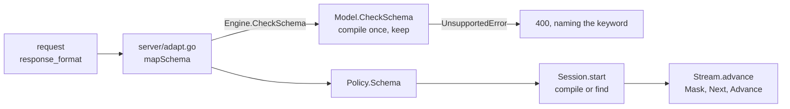

# Structured output

Not blocked on accel. It shipped in Wave 6 on 2026-08-26, before
[008](008-scheduler.md)'s continuous batching in Wave 9 on 2026-08-27; the wave
log is [011](011-sequencing.md).

## 1. The idea

Prompting a model to emit JSON gives JSON most of the time. Constrained
decoding gives it every time: at each step, the tokens that cannot continue a
valid document are given probability zero, so the output parses **by
construction** and a retry loop is unnecessary.

Formally, with $G$ a grammar and $y_{<t}$ the tokens so far:

$$p'(v \mid y_{<t}) \propto p(v \mid y_{<t}) \cdot \mathbb{1}\!\left[y_{<t} v \text{ is a viable prefix of } G\right]$$

**"Parses" is the guarantee, and it is not "fits in your struct".** $G$ admits
every JSON number RFC 8259 admits, and RFC 8259 bounds no magnitude — a bound is
spelled `minimum` or `maximum` in JSON Schema, and [§4.1](#41-what-the-language-narrows-and-the-one-thing-it-does-not)
says why those are refused rather than compiled. So `1e999` is admissible: valid
JSON that `json.Valid` accepts and that a Go consumer decoding into a `float64`
field cannot hold. A caller who needs a magnitude bound checks it after
decoding, and the property test decodes with `UseNumber` for exactly this reason
(`internal/grammar/property_test.go:208`).

## 2. The hard part

The mask is over the **tokenizer's vocabulary**, not over characters. A single
BPE token spans several characters and may cross a grammar boundary — `":` is
one token, and it is a string terminator followed by a structural character. So
the automaton advances by a token's worth of characters, and a token is
admissible only if every intermediate character is.

Computing that per step over 152k tokens is too slow to do naively. The standard
answer, from outlines and xgrammar, is to precompute per automaton state the set
of admissible tokens, cached across requests because states repeat heavily. The
cache is the design, and building it lazily on first visit is what keeps
startup from paying for the whole vocabulary cross product.

## 3. Where the mask is applied

Before penalties, as an additive $-\infty$ on the logits — so it composes with
[006 §2](006-sampling.md)'s order without a special case, and a masked token
cannot be resurrected by a penalty or a temperature.

Host in v0, alongside the rest of [006](006-sampling.md)'s host stages. It is a
bound tensor and one elementwise multiply on the device, which accel can express
today, so this does not become a conformance entry.

## 4. Scope

JSON Schema first — it is what `response_format` sends and what most callers
want. A general EBNF surface is the same machinery with a different front end
and comes second. Regex is a special case of the EBNF path.

**Refuse a schema that cannot be compiled**, naming the construct. Unsupported
keywords silently ignored produce a document that validates against a schema the
caller did not write.

### 4.1 What the language narrows, and the one thing it does not

The compiled language is **regular**, which is what makes a byte-level NFA with
lazy subset determinization enough and a pushdown stack unnecessary. A JSON
Schema with no recursive `$ref` generates documents of bounded nesting, so that
holds — and every construct that would break it is refused rather than
approximated: a subschema with no `"type"`, an array with no `"items"`, an open
object, a `$ref` cycle. Each of those admits any JSON value, which may nest
without bound.

Three further narrowings are deliberate. Each **shrinks** the admitted language,
so a document this accepts still validates against the caller's schema, and the
direction is the point: a narrowing costs a caller a document the model might
have written, while a widening costs them a document that does not validate.

| narrowing | what it excludes | why |
| --- | --- | --- |
| properties appear in the order the schema declares them | `{"age":36,"name":"Ada"}` under `{name, age}` (`grammar_test.go:190`) | admitting every permutation needs a state per subset already emitted, $2^n$ of them |
| objects are closed | any property outside the schema (`grammar_test.go:191`) | an explicit `"additionalProperties": true` is **refused** rather than narrowed (`schema_test.go:90`): that one is the caller stating something this cannot honour |
| `"integer"` admits the plain spelling | `1e2`, which JSON Schema counts as an integer (`grammar_test.go:132`) | the automaton counts characters and cannot evaluate an exponent |

**One thing is not narrowed, and a caller has to know it**: a number's
magnitude, for the reason [§1](#1-the-idea) gives.

## 5. Where it is wired

The compiler is `internal/grammar` and depends on no tokenizer and no sampler.
Three joins are the engine's, and each one fails silently if it is made wrong:

**The vocabulary is the model's and the bytes are the tokenizer's.** `Vocab.Size`
is the logits row's width, which is the checkpoint's `vocab_size` and not
`Tokenizer.VocabSize` -- Qwen3 pads its embedding matrix to 151936 rows over
151669 tokens, and a grammar compiled at the narrower width refuses every step.
`Vocab.Bytes` is `Tokenizer.TextBytes`, which undoes the byte-level alphabet: a
vocabulary file spells `" the"` as `"Ġthe"`, and a mask built from the surface
form constrains a different language and says nothing about it. An added token
carries no text, so its bytes are nil -- otherwise `<|im_end|>` would be ten
characters the model may type inside a string.

**The stop set is the decode loop's.** `Options.Stop` carries exactly the ids
`Stream.isStop` ends on. With it empty, `Mask` returns `ErrNoToken` the instant
the document is complete, because the language has no trailing whitespace and
nothing else is admissible -- so every constrained generation would fail on its
last step, having produced the right answer.

**The order in the loop is mask, draw, advance.** The mask goes on before
`sample.Sampler.Next`, which is where the penalties and the temperature live, so
015-D2 is satisfied with no special case. `Advance` consumes only a token the
document contains: a stop id ends the stream instead, and the grammar admits one
exactly where the document is already complete.

**A schema and a stop string are refused together.** They end a completion by
different rules: the grammar ends one where the document is complete, and
`Policy.Stop` ends one where a substring appeared in the decoded text, cutting
the text at the match and finishing with a nil error. A stop that fires inside a
document therefore hands the caller half of one and reports it as a finished
answer, which is the failure this whole spec exists to make impossible. Refused
rather than ignored, in `Policy.check` and again in `server/adapt.go` -- the
server needs its own, because `Policy.check` runs inside `Session.start`, after
the session and its KV reservation exist, and its error carries no field name
(015-D9). `MaxTokens` is not refused: a budget that runs out is reported,
through `CompletionTokens` and through a length finish on every dialect.

The public surface is one field. `Policy.Schema` carries the schema body;
`Model.CheckSchema` is the same compilation on its own, so a server can refuse
before it allocates a session, and it keeps what it compiled so the request that
follows finds it.

## Outcome

Structured output is the JSON Schema front end of `internal/grammar`, compiled
once per schema body and applied as a per-step token mask on the host. It landed
in Wave 6 on 2026-08-26: the compiler, the three engine joins, both refusal
sites, and the wire mapping for three dialects.

**What shipped**, section by section:

| section | what landed | where |
| --- | --- | --- |
| 1 | the indicator of the formula, as an in-place mask on the logits row, with a property test that every document the machine generates validates against its schema | `internal/grammar/grammar.go:244`, `internal/grammar/property_test.go:27` |
| 2 | a token is admissible only if every intermediate byte is, and the per-state admissible set is built on first visit and kept; `Builds` makes 015-D1 measurable | `internal/grammar/dfa.go:109`, `internal/grammar/grammar.go:196`, `internal/grammar/grammar_test.go:649` |
| 3 | additive $-\infty$ before the penalties and the temperature, host-side, with no conformance entry opened for a device-side mask | `stream.go:274`, `internal/grammar/grammar.go:244`, `schema_test.go:483` |
| 4 | JSON Schema first, and refusal by construct: every refused keyword names its obstruction, and a keyword on no allowlist is an error rather than a silent drop | `internal/grammar/schema.go:56`, `internal/grammar/schema.go:296`, `internal/grammar/schema_test.go:17` |
| 5 | all three joins plus the two refusals: the model's vocabulary width and the tokenizer's text bytes, the decode loop's stop ids, mask-draw-advance, and `Schema` with `Stop` refused at the wire and again in the policy | `schema.go:47`, `schema.go:68`, `session.go:473`, `stream.go:274`, `policy.go:182`, `server/adapt.go:86`, `server/e2e_test.go:340` |

**What diverged** from the design, and why the code is right:

- Two hard bounds the spec did not name: `maxRepeat` = 1024 on
  `minLength`/`maxLength`/`minItems`/`maxItems`, and `maxStates` = `1<<16` on the
  whole automaton, checked at the single recursion point
  (`internal/grammar/schema.go:22`, `:38`, enforced at `:191`). The schema body
  arrives over HTTP, so an unbounded compilation is an out-of-memory a caller
  can ask for in a few hundred bytes. Recorded as 015-D10.
- Three narrowings of JSON Schema, each of which shrinks the admitted language
  rather than widening it, so a produced document still validates against the
  caller's schema (`internal/grammar/doc.go:71-83`): object properties appear in
  the schema's declared order, because admitting every permutation needs a state
  per subset already emitted; objects are closed, and an explicit
  `"additionalProperties": true` is refused rather than narrowed
  (`internal/grammar/schema.go:466`); and `"integer"` admits only the plain
  spelling, so `1e2` is not admitted (`internal/grammar/schema.go:281`).
- A number's magnitude is deliberately not bounded
  (`internal/grammar/doc.go:84-92`). RFC 8259 bounds none, and JSON Schema
  spells the bound as `minimum` or `maximum`, which the compiler refuses as
  arithmetic on the value (`internal/grammar/schema.go:59`). So `1e999` is
  admissible: valid JSON that a Go consumer decoding into a `float64` cannot
  hold. It is the one hole in §1's "parses by construction", and a caller who
  needs the bound checks it after decoding.

**Not built.** Nothing that 015 owns. The four behaviours that lived only in
`internal/grammar/doc.go` are described here as of 2026-08-28:
[§4.1](#41-what-the-language-narrows-and-the-one-thing-it-does-not) gives the
three narrowings with the test that pins each, and
[§1](#1-the-idea) gives the unbounded magnitude, which is the one behaviour that
widens rather than narrows and therefore the one a caller has to know.

Owned elsewhere: `json_object` mode. `response_format: {"type":"json_object"}`
is accepted, reaches no grammar, and is reported as a subtraction through the
`X-Tgo-Loss` header rather than refused (`server/adapt.go:87`,
`server/schema_test.go:140`). It is the one `response_format` path §5 draws
straight to a compiled grammar and that enforces nothing, and
[029 §7](029-grammar-front-ends.md) owns the answer — which is that it keeps the
loss entry and gets no grammar, because "any JSON value" is not a regular
language and the only regular approximation is a nesting depth the caller never
wrote. §4's EBNF front end, and regex as a special case of it, is 015-D3's
second half, deliberately sequenced after the JSON Schema path and now owned by
[029](029-grammar-front-ends.md).

## Decision record

| id | decision | rejected | consequence |
| --- | --- | --- | --- |
| 015-D1 | mask over vocabulary via a lazily-built per-state token set | per-step grammar walk over 152k tokens | startup stays cheap; the cache is the design |
| 015-D2 | applied as additive $-\infty$ before penalties | multiply after truncation | composes with 006's order with no special case |
| 015-D3 | JSON Schema first, EBNF second | EBNF only | matches `response_format`; regex falls out of EBNF |
| 015-D4 | refuse uncompilable schemas by construct | ignore unknown keywords | the caller's schema is the one enforced |
| 015-D5 | the public surface is `Policy.Schema` plus `Model.CheckSchema` | an exported compiled-grammar type; a session option | 000-D10 keeps the surface small, and a schema is per request, like `Stop` and `MaxTokens` |
| 015-D6 | the grammar is compiled against the **model's** vocabulary width | the tokenizer's width | the mask is applied to a logits row, and a checkpoint pads its embedding past the last token |
| 015-D7 | `Options.Stop` is exactly what `Stream.isStop` ends on | leave it empty and read `Accepting` in the loop | an empty stop set makes the last step of every constrained request a dead end |
| 015-D8 | compiled grammars are cached on the `Model`, bounded and dropped whole on overflow | an unbounded map; no cache | 015-D1's per-state sets pay only if a later request finds them, and the key is a body that arrived over HTTP |
| 015-D9 | `Schema` with `Stop` is refused | ignore `Stop`; let the stop win | a stop string cuts the text where it matched, so it ends a constrained request on half a document with a nil error, and a stop dropped in silence is a different request answered |
| 015-D10 | `maxRepeat` bounds a declared length or item count at 1024, and `maxStates` bounds the whole automaton at `1<<16`, checked on the state count at the single recursion point `value` goes through | counting alone, which cannot see `$ref` fan-out because there is no count to read: `c.seen` is a cycle detector and not a memo, so a `$defs` entry two siblings reference compiles twice and a chain doubles per level, 315,333 states at depth 12 | the schema body arrives over HTTP, and every construct that nests -- `$ref`, arrays, `anyOf`, and any not yet written -- is bounded without the bound knowing it exists |
