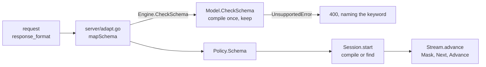

# Structured output

Not blocked on accel. It is real work, and [011 §3](011-sequencing.md) places it
after batching.

## 1. The idea

Prompting a model to emit JSON gives JSON most of the time. Constrained
decoding gives it every time: at each step, the tokens that cannot continue a
valid document are given probability zero, so the output parses **by
construction** and a retry loop is unnecessary.

Formally, with $G$ a grammar and $y_{<t}$ the tokens so far:

$$p'(v \mid y_{<t}) \propto p(v \mid y_{<t}) \cdot \mathbb{1}\!\left[y_{<t} v \text{ is a viable prefix of } G\right]$$

## 2. The hard part

The mask is over the **tokenizer's vocabulary**, not over characters. A single
BPE token spans several characters and may cross a grammar boundary — `":` is
one token, and it is a string terminator followed by a structural character. So
the automaton advances by a token's worth of characters, and a token is
admissible only if every intermediate character is.

Computing that per step over 152k tokens is too slow to do naively. The standard
answer, from outlines and xgrammar, is to precompute per automaton state the set
of admissible tokens, cached across requests because states repeat heavily. The
cache is the design, and building it lazily on first visit is what keeps
startup from paying for the whole vocabulary cross product.

## 3. Where the mask is applied

Before penalties, as an additive $-\infty$ on the logits — so it composes with
[006 §2](006-sampling.md)'s order without a special case, and a masked token
cannot be resurrected by a penalty or a temperature.

Host in v0, alongside the rest of [006](006-sampling.md)'s host stages. It is a
bound tensor and one elementwise multiply on the device, which accel can express
today, so this does not become a conformance entry.

## 4. Scope

JSON Schema first — it is what `response_format` sends and what most callers
want. A general EBNF surface is the same machinery with a different front end
and comes second. Regex is a special case of the EBNF path.

**Refuse a schema that cannot be compiled**, naming the construct. Unsupported
keywords silently ignored produce a document that validates against a schema the
caller did not write.

## 5. Where it is wired

The compiler is `internal/grammar` and depends on no tokenizer and no sampler.
Three joins are the engine's, and each one fails silently if it is made wrong:

**The vocabulary is the model's and the bytes are the tokenizer's.** `Vocab.Size`
is the logits row's width, which is the checkpoint's `vocab_size` and not
`Tokenizer.VocabSize` -- Qwen3 pads its embedding matrix to 151936 rows over
151669 tokens, and a grammar compiled at the narrower width refuses every step.
`Vocab.Bytes` is `Tokenizer.TextBytes`, which undoes the byte-level alphabet: a
vocabulary file spells `" the"` as `"Ġthe"`, and a mask built from the surface
form constrains a different language and says nothing about it. An added token
carries no text, so its bytes are nil -- otherwise `<|im_end|>` would be ten
characters the model may type inside a string.

**The stop set is the decode loop's.** `Options.Stop` carries exactly the ids
`Stream.isStop` ends on. With it empty, `Mask` returns `ErrNoToken` the instant
the document is complete, because the language has no trailing whitespace and
nothing else is admissible -- so every constrained generation would fail on its
last step, having produced the right answer.

**The order in the loop is mask, draw, advance.** The mask goes on before
`sample.Sampler.Next`, which is where the penalties and the temperature live, so
015-D2 is satisfied with no special case. `Advance` consumes only a token the
document contains: a stop id ends the stream instead, and the grammar admits one
exactly where the document is already complete.

**A schema and a stop string are refused together.** They end a completion by
different rules: the grammar ends one where the document is complete, and
`Policy.Stop` ends one where a substring appeared in the decoded text, cutting
the text at the match and finishing with a nil error. A stop that fires inside a
document therefore hands the caller half of one and reports it as a finished
answer, which is the failure this whole spec exists to make impossible. Refused
rather than ignored, in `Policy.check` and again in `server/adapt.go` -- the
server needs its own, because `Policy.check` runs inside `Session.start`, after
the session and its KV reservation exist, and its error carries no field name
(015-D9). `MaxTokens` is not refused: a budget that runs out is reported,
through `CompletionTokens` and through a length finish on every dialect.

The public surface is one field. `Policy.Schema` carries the schema body;
`Model.CheckSchema` is the same compilation on its own, so a server can refuse
before it allocates a session, and it keeps what it compiled so the request that
follows finds it.

## Decision record

| id | decision | rejected | consequence |
| --- | --- | --- | --- |
| 015-D1 | mask over vocabulary via a lazily-built per-state token set | per-step grammar walk over 152k tokens | startup stays cheap; the cache is the design |
| 015-D2 | applied as additive $-\infty$ before penalties | multiply after truncation | composes with 006's order with no special case |
| 015-D3 | JSON Schema first, EBNF second | EBNF only | matches `response_format`; regex falls out of EBNF |
| 015-D4 | refuse uncompilable schemas by construct | ignore unknown keywords | the caller's schema is the one enforced |
| 015-D5 | the public surface is `Policy.Schema` plus `Model.CheckSchema` | an exported compiled-grammar type; a session option | 000-D10 keeps the surface small, and a schema is per request, like `Stop` and `MaxTokens` |
| 015-D6 | the grammar is compiled against the **model's** vocabulary width | the tokenizer's width | the mask is applied to a logits row, and a checkpoint pads its embedding past the last token |
| 015-D7 | `Options.Stop` is exactly what `Stream.isStop` ends on | leave it empty and read `Accepting` in the loop | an empty stop set makes the last step of every constrained request a dead end |
| 015-D8 | compiled grammars are cached on the `Model`, bounded and dropped whole on overflow | an unbounded map; no cache | 015-D1's per-state sets pay only if a later request finds them, and the key is a body that arrived over HTTP |
| 015-D9 | `Schema` with `Stop` is refused | ignore `Stop`; let the stop win | a stop string cuts the text where it matched, so it ends a constrained request on half a document with a nil error, and a stop dropped in silence is a different request answered |
