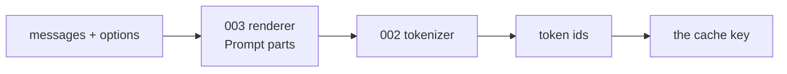
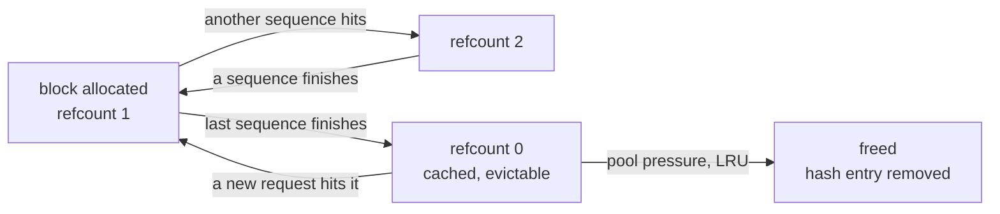

# Prefix caching

**This is tgo's job, not accel's**, and it is the largest single win available
to the framework. [005 §5](005-kv-cache.md) and [008 §6](008-scheduler.md) both
deferred it on the grounds that it depends on paging. Paging landed on
2026-08-24, so this spec exists and those two are corrected.

## 1. The observation

A prefill costs $O(T)$ forward passes' worth of arithmetic, and in an agent or
chat workload most of $T$ is **the same every time**. A system prompt with tool
definitions is 500–2000 tokens and is byte-identical across every request in a
session. A multi-turn conversation re-sends its entire history on every turn, so
turn $n$ re-prefills everything turns $1..n-1$ already prefilled.

$$\text{work saved} = \frac{|\text{shared prefix}|}{T_\text{prompt}}$$

For a 900-token system prompt and a 30-token question that is **97% of the
prefill**, every request after the first. For turn $n$ of a conversation it
approaches $1 - 1/n$.

**Nothing about this is an approximation.** The KV for position $t$ is a
function of tokens $0..t$ and the weights alone. Two requests with the same
token prefix have the same KV over that prefix, so reusing it is not a cache in
the lossy sense — it is not recomputing a pure function. §6 states the one place
that "same" needs care.

## 2. Where the key comes from, and why it is token ids

The cache is keyed on **token ids, not text**.

Text is the wrong key in both directions. Two different strings can tokenize to
the same ids (they cannot, for a bijective byte-level BPE — but two *renderings*
differing in whitespace the template normalises can), and more importantly one
string can be rendered into different ids by different template options. What
the model consumed is the id sequence, so that is what identifies the state.



This falls out of [003-D3](003-chat-template.md) — render to parts, tokenize
separately — for free. The key is taken *after* tokenization, so it cannot
disagree with what the model was fed.

### 2.1 What the chat template guarantees

A generic radix trie **discovers** that requests share a prefix. tgo **knows**
it, structurally: [003 §3](003-chat-template.md) renders the system turn first
and never injects a default one, so two requests with the same system message
and tools produce the same leading ids by construction.

That is worth stating because it decides the block size in §3: the shared prefix
has a natural boundary at the end of the system turn, and a block size that
makes that boundary reachable matters more than one tuned for a synthetic
benchmark.

## 3. Blocks are the unit, so the key is block-aligned

A page table maps logical blocks to physical ones, and a block is the smallest
thing that can be shared. So the cache matches **whole blocks**:

$$\text{shared blocks} = \left\lfloor \frac{\text{common prefix length}}{B} \right\rfloor$$

and up to $B-1$ tokens of a genuine common prefix are re-prefilled. With
$B = 32$ that is at most 31 tokens against a prefix of hundreds — a rounding
error against the win, and the alternative (sharing partial blocks) would mean
two sequences writing into one block at different offsets, which is a
correctness problem rather than an optimisation.

Each block gets a hash chained over its predecessor, so a block's identity
includes everything before it:

$$h_0 = H(\text{ids}[0{:}B]), \qquad h_i = H(h_{i-1} \parallel \text{ids}[iB{:}(i{+}1)B])$$

**The chain is what makes the hash a prefix key rather than a content key.** Two
different prompts that happen to contain the same 32 tokens in the middle have
different $h_i$ there, because their $h_{i-1}$ differ. Without the chain they
would collide and the second request would silently attend to the first's
context.

### 3.1 The hash is a security boundary, so $H$ is not free choice

A hash collision here does not corrupt data — it hands one request **another
request's KV**, and the output stays fluent. So $H$ must be chosen adversarially,
not for speed:

- **$H$ is SHA-256**, and the chain input includes the salt of §7.
- A fast non-cryptographic hash is permitted **only with a per-process random
  seed**, because a predictable one lets an attacker compute a colliding block
  offline and then submit a prompt that reads somebody else's cache. vLLM hit
  exactly this ([vllm#12621](https://github.com/vllm-project/vllm/issues/12621))
  and now keeps a per-process seed for non-cryptographic algorithms while
  deriving a fixed one for SHA-256, so that separate processes can share a cache
  without weakening collision resistance.

tgo takes the same split and the same reasoning. The earlier draft of this spec
wrote $H$ and said nothing about it, which is how the property gets lost.

## 4. The structure: a hash map, not a trie

vLLM hashes chained blocks into a map; sglang keeps a radix trie of token
sequences. Both work. tgo takes the map.

| | hash map | radix trie |
| --- | --- | --- |
| lookup | $O(\text{blocks})$ map probes | $O(\text{blocks})$ node walks |
| memory | one entry per cached block | nodes plus edges |
| partial-prefix match | falls out: walk until a probe misses | falls out |
| **eviction** | LRU over unreferenced entries; each is independent | evicting an interior node orphans its children |
| implementation | a map and a refcount | a tree with splitting and merging on insert |

The deciding row is eviction. A trie's nodes are entangled — freeing one must
consider its descendants — while chained hashes make each block independently
evictable, and correctness does not depend on getting the tree surgery right.
The trie's advantage is enumerating what shares a given prefix, which is a
scheduling question ([008](008-scheduler.md)) rather than a caching one.

**Rejected: a trie, for now.** If [008](008-scheduler.md) later wants
"which waiting requests share a prefix with this one", the trie earns its
complexity. Nothing today asks that.

## 5. Lifetime: refcounts, then LRU



A block at refcount 0 is **not freed** — it is the cache. It is freed only under
pool pressure, least-recently-used first, and its hash entry is removed in the
same step. The invariant that must not break: **a hash entry never outlives the
block it names**, or a later request maps a hash to a physical block that now
holds another sequence's KV, and attends to somebody else's context.

That is the single most dangerous bug in this design, and it is silent: the
output stays fluent. §8 tests it directly rather than by exercising the paths
that would happen to produce it.

## 6. Correctness: two subtleties, one of which is real

**A reused prefix was computed under a different prefill shape.** A fresh
request prefills $T$ tokens in one dispatch; a hit prefills only the suffix. The
KV for the shared prefix was produced by a differently-shaped GEMM, and floating
point is not associative, so the bits can differ from what this request would
have computed alone.

This is the same class as the CPU/Metal divergence [006 §4.1](006-sampling.md)
already refuses to bound and instead measures. It is handled the same way:
[010 §3](010-conformance.md) gains a measurement — greedy, same prompt, cold
against warm, the first differing token index — rather than an assertion nobody
verified.

> It is worth saying plainly that this makes a cache hit **observable**, and
> therefore that "prefix caching is transparent" is not quite true. It is
> transparent in distribution and not bit-for-bit.

**Sampling reproducibility is unaffected.** A prefill consumes no draws
([006-D2](006-sampling.md) draws once per *step*), so a seeded stream produces
the same completion whether or not the prompt was cached. That is worth a test,
because it is the property a user checks and it would be easy to break by
threading the cache through the sampler.

## 7. Isolation: sharing KV across tenants is a side channel

**A cache hit is faster than a miss, and that timing is observable.** If tgo
shares blocks across users, a user can learn whether *somebody else* has
recently submitted a given prefix, by measuring their own first-token latency
against a prompt they construct. That is a membership oracle over other users'
prompts.

This is not hypothetical and it is not specific to tgo; it is inherent to
cross-request KV reuse, and most published inference stacks share by default.

### 7.1 Two mechanisms, and tgo takes both

vLLM and sglang both solve this with a **caller-supplied `cache_salt`**: an
opaque string mixed into the first block's hash, which the chain then propagates
to every block after it. Blocks match only within the same salt.

That is more expressive than a server-side scope and it is the right primitive
for the layer that knows who the caller is — a gateway can salt by tenant id,
which tgo cannot do because [009 §7](009-server.md) says tgo has no notion of a
tenant. But it **fails open**: a caller who sets no salt shares globally, so the
default is the unsafe one.

So tgo takes both, and they compose:

- **`cache_salt`** on the request, mixed into $h_0$ exactly as vLLM does. The
  layer with tenant identity supplies it.
- **scope** on the server, which bounds what a *missing* salt can reach.

The scope is what makes the default safe; the salt is what makes it precise.
Neither alone is enough: a scope cannot express "these two sessions are the same
customer", and a salt cannot protect a caller who forgot it.

**The decision: the cache is scoped, the default scope is the process, and a
request may narrow further with a salt.** [009 §7](009-server.md) says tgo serves one model with no
authentication and no tenancy — so within one tgo process there is no tenant
boundary to cross, and sharing is correct. The moment something in front of it
multiplexes users, the operator must scope the cache, and tgo makes that
possible rather than deciding it:

| scope | when |
| --- | --- |
| `process` (default) | single-tenant: a CLI, one team's server, an agent runtime |
| `session` | share within a conversation only; safe under multi-tenancy, and still captures the $1 - 1/n$ multi-turn win, which is most of the value |
| `off` | measurement, and comparison against a cold baseline |

**`session` is the important row.** It is the scope that keeps the largest share
of the benefit with no cross-user leak at all, so an operator who cannot reason
about the risk has a safe setting that is not "off".

The documentation states the trade rather than burying it. An inference
framework that silently makes one user's prompts detectable by another has made
a security decision on the operator's behalf.

## 8. Tests

Every one is host-side logic — the trie, the refcounts, the eviction — plus a
small device test for the reuse itself. No weights.

| test | what it catches |
| --- | --- |
| a warm request produces the same tokens as a cold one (greedy) | the whole point |
| hit length is block-aligned and never exceeds the true common prefix | §3 |
| **the chained hash**: two prompts sharing an interior 32-token run do **not** share a block | §3's chain, the silent-collision bug |
| **a freed block's hash entry is gone**: force eviction, then request the evicted prefix, and assert a miss rather than a hit | §5's invariant, tested directly |
| refcount: a block shared by two sequences survives one of them finishing | §5 |
| eviction never frees a block at refcount > 0 | §5 |
| a seeded completion is identical cold and warm | §6 |
| `session` scope: two sessions with the same prefix do not share | §7 |
| a partial hit prefills exactly the suffix, at `base` = hit length | §9 |

## 9. What accel gives, verified

Probed against accel as checked out, because [010 §2](010-conformance.md)'s rule
is that a state is decided by what the operator refuses, not by what a commit
says:

```
ok       paged prefill at a base, f32 cache
ok       scatter a suffix, f32 cache
```

So a partial hit — reuse $n$ positions, prefill the suffix at `base = n`, over a
paged cache whose early blocks belong to another sequence — **is expressible
today**. `BaseName` is what makes it so: it is the position of the first query
token, and it decides what the causal mask hides.

Two things it does not give:

- **the block pool is tgo's.** `tensor/internal/pagetable` is still unexported,
  and that is right: accel 030 declines to evict because choosing a victim is a
  policy question, and §5 is that policy. tgo owns the pool, the refcounts and
  the LRU, all of it host-side logic inside the coverage gate.
- **an f16 cache cannot be written**, so this is an f32 design until
  [010 C5](010-conformance.md) reopens — `ScatterRows` writes f32 only, and
  prefill over an f16 cache is refused.

And the ceiling still applies: with [010 C11](010-conformance.md) capping a
cache at 128 positions, a "900-token system prompt" cannot be held at all. **The
design is buildable and the benefit is zero until C11 closes**, which is the
same sentence as [005 §2.3](005-kv-cache.md) and the reason C11 is first in
priority.

## 10. Against vLLM and sglang

Read from their source rather than from their papers, at the versions checked
out on 2026-08-24.

| | vLLM | sglang | tgo |
| --- | --- | --- | --- |
| structure | chained block hashes → map | radix trie of token sequences | chained block hashes → map |
| chained hash | yes | yes | yes |
| granularity | block-aligned | page-aligned | block-aligned |
| refcount | yes | `lock_ref` per node | yes |
| eviction | LRU over unreferenced blocks | pluggable — LRU, LFU — over a heap of evictable **leaves** | LRU over unreferenced blocks |
| isolation | `cache_salt` per request | `cache_salt` per request | **salt *and* server scope** |
| batch-shape determinism | opt-in `VLLM_BATCH_INVARIANT`, beta, needs SM 8.0+ | — | measured, not eliminated |
| preemption | recompute | retract (recompute) | recompute |

**Where tgo agrees, it agrees for the same reasons**, and that is worth saying:
chaining, block alignment, refcounting and recompute-over-swap are not
independent inventions here. Two mature systems converged on them, and a design
that differed would need an argument this one does not have.

**Where it differs, three times:**

1. **Map over trie.** sglang's trie earns its complexity by answering "what
   shares this prefix", which a scheduler wants. Its cost is visible in its own
   eviction: the heap must re-examine a parent when its last child is freed
   (`if len(x.parent.children) == 0 and x.parent.lock_ref == 0`), because
   interior nodes are entangled. vLLM chose the map and tgo follows.
   [016-D3](#decision-record) records the trie as the answer if
   [008](008-scheduler.md) ever needs the query.

2. **Isolation defaults.** Both of them make isolation a caller's job and share
   globally when the caller says nothing. tgo adds a server scope *underneath*
   the salt, so the unsafe case requires a decision rather than an omission
   ([§7.1](#71-two-mechanisms-and-tgo-takes-both)). This is the one place tgo
   thinks the prior art has the default the wrong way round.

3. **Batch-shape determinism.** vLLM built a batch-invariant mode to *eliminate*
   the divergence a cache hit introduces. tgo **measures** it instead
   ([§6](#6-correctness-two-subtleties-one-of-which-is-real)). Not because
   measuring is better — invariance is strictly more useful — but because
   vLLM's mode is beta, hardware-gated, and costs performance, and tgo has no
   basis for a bound it has not taken. If accel later offers reduction-order
   guarantees, this becomes a real option rather than an aspiration.

**What tgo does not have that both of them do**: multimodal and LoRA identity in
the hash key. vLLM mixes image hashes and the LoRA id into `extra_keys` for the
obvious reason — the same tokens under a different adapter are different KV.
tgo has neither feature, and [004-D2](004-model-graph.md) makes both additive.
**Recorded here so that whoever adds one remembers this key exists**, because
forgetting it is silent: an adapter's KV would be served to a request that did
not ask for it.

## 11. What this is not

**Not Anthropic's `cache_control`.** That is an explicit, caller-declared
breakpoint. tgo's caching is automatic and needs no annotation, so
[009 §4](009-server.md) keeps `cache_control` in the advisory-loss category:
the request runs, the caching happens anyway, and the field is reported as
unhonoured because tgo did not do what the caller literally asked — it did
something that makes the request faster regardless.

**Not a response cache.** Identical prompts still generate; only the prefill is
skipped. A response cache would change what the model does, and
[006 §4](006-sampling.md)'s seeded stream is the mechanism for a caller who
wants determinism.

## Decision record

| id | decision | rejected | consequence |
| --- | --- | --- | --- |
| 016-D1 | key on token ids, taken after tokenization | key on rendered text, or on messages | the key cannot disagree with what the model was fed; falls out of [003-D3](003-chat-template.md) |
| 016-D2 | chained block hashes | hash each block's contents alone | an unchained hash collides on a shared interior run and silently attends to another prompt's context |
| 016-D3 | a hash map with refcounts and LRU | a radix trie | chained hashes are independently evictable; a trie's interior nodes are entangled. Revisit if [008](008-scheduler.md) needs prefix-sharing queries |
| 016-D4 | block-aligned sharing only | share partial blocks | two sequences writing one block at different offsets is a correctness problem; the cost is ≤ 31 tokens |
| 016-D5 | a refcount-0 block is cached, not freed; freed LRU under pressure, hash entry removed in the same step | free at refcount 0 | the cache *is* the retained blocks. The paired removal is the invariant §8 tests directly |
| 016-D6 | measure cold-vs-warm divergence; do not claim bit-exactness | assert transparency | a reused prefix was computed under a different prefill shape, and floating point is not associative |
| 016-D7 | **both** a server-side scope (default `process`) and a request `cache_salt` | share globally and silently; a salt alone, as vLLM and sglang do | a salt is precise but fails open when omitted; a scope makes the default safe but cannot say "same customer". They compose ([§7.1](#71-two-mechanisms-and-tgo-takes-both)) |
| 016-D9 | $H$ is SHA-256; a fast hash needs a per-process random seed | any fast hash | a collision hands one request another's KV. vLLM shipped a predictable non-crypto hash and had to fix it ([§3.1](#31-the-hash-is-a-security-boundary-so-h-is-not-free-choice)) |
| 016-D8 | tgo owns the block pool | ask accel to export `pagetable` | accel 030 declines to evict because eviction is policy, and it is right; the policy is §5 |
