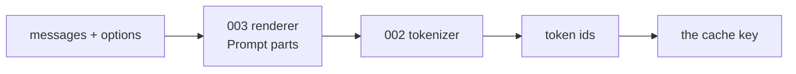
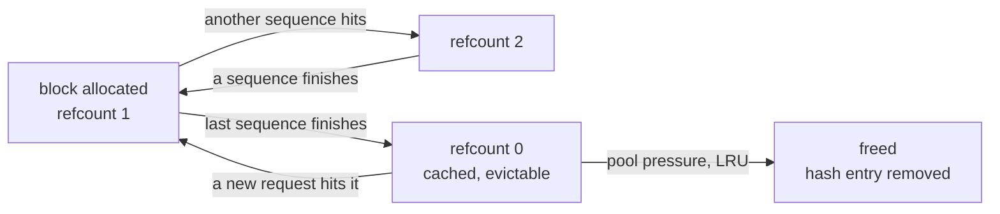

# Prefix caching

**This is tgo's job, not accel's**, and it is the largest single win available
to the framework. [005 §5](005-kv-cache.md) and [008 §6](008-scheduler.md) both
deferred it on the grounds that it depends on paging. Paging landed on
2026-08-24, so this spec exists and those two are corrected.

## 1. The observation

A prefill costs $O(T)$ forward passes' worth of arithmetic, and in an agent or
chat workload most of $T$ is **the same every time**. A system prompt with tool
definitions is 500–2000 tokens and is byte-identical across every request in a
session. A multi-turn conversation re-sends its entire history on every turn, so
turn $n$ re-prefills everything turns $1..n-1$ already prefilled.

$$\text{work saved} = \frac{|\text{shared prefix}|}{T_\text{prompt}}$$

For a 900-token system prompt and a 30-token question that is **97% of the
prefill**, every request after the first. For turn $n$ of a conversation it
approaches $1 - 1/n$.

**Nothing about this is an approximation.** The KV for position $t$ is a
function of tokens $0..t$ and the weights alone. Two requests with the same
token prefix have the same KV over that prefix, so reusing it is not a cache in
the lossy sense — it is not recomputing a pure function. §6 states the one place
that "same" needs care.

## 2. Where the key comes from, and why it is token ids

The cache is keyed on **token ids, not text**.

Text is the wrong key in both directions. Two different strings can tokenize to
the same ids (they cannot, for a bijective byte-level BPE — but two *renderings*
differing in whitespace the template normalises can), and more importantly one
string can be rendered into different ids by different template options. What
the model consumed is the id sequence, so that is what identifies the state.



This falls out of [003-D3](003-chat-template.md) — render to parts, tokenize
separately — for free. The key is taken *after* tokenization, so it cannot
disagree with what the model was fed.

### 2.1 What the chat template guarantees

A generic radix trie **discovers** that requests share a prefix. tgo **knows**
it, structurally: [003 §3](003-chat-template.md) renders the system turn first
and never injects a default one, so two requests with the same system message
and tools produce the same leading ids by construction.

That is worth stating because it decides the block size in §3: the shared prefix
has a natural boundary at the end of the system turn, and a block size that
makes that boundary reachable matters more than one tuned for a synthetic
benchmark.

## 3. Blocks are the unit, so the key is block-aligned

A page table maps logical blocks to physical ones, and a block is the smallest
thing that can be shared. So the cache matches **whole blocks**:

$$\text{shared blocks} = \left\lfloor \frac{\text{common prefix length}}{B} \right\rfloor$$

and up to $B-1$ tokens of a genuine common prefix are re-prefilled. With
$B = 32$ that is at most 31 tokens against a prefix of hundreds — a rounding
error against the win, and the alternative (sharing partial blocks) would mean
two sequences writing into one block at different offsets, which is a
correctness problem rather than an optimisation.

Each block gets a hash chained over its predecessor, so a block's identity
includes everything before it:

$$h_0 = H(\text{ids}[0{:}B]), \qquad h_i = H(h_{i-1} \parallel \text{ids}[iB{:}(i{+}1)B])$$

**The chain is what makes the hash a prefix key rather than a content key.** Two
different prompts that happen to contain the same 32 tokens in the middle have
different $h_i$ there, because their $h_{i-1}$ differ. Without the chain they
would collide and the second request would silently attend to the first's
context.

### 3.1 A full hit must still prefill one token

**The reusable prefix is capped at $T-1$, never $T$.**

$$\text{reused} = \min\!\big(\text{hit}, \; T - 1\big)$$

The cache holds **KV, not logits**. Sampling the next token needs the logits at
the last prompt position, and those come from a forward pass over it
([004 §3](004-model-graph.md) rows 26–28 slice the last hidden state and run the
LM head). Reuse everything and there is no hidden state to slice — the request
has a warm cache and nothing to sample from.

This is not a rare path. An exact resubmission is a retry, an agent loop
re-sending an unchanged prompt, or `/v1/completions` called twice. In *chat* it
hides, because [003 §3](003-chat-template.md)'s rendered prompt always ends with
a fresh `<|im_start|>assistant\n`, so the suffix is naturally non-empty and the
bug never fires in the obvious test.

Taken from ollama, which does exactly this and says why:

```go
// Always keep at least one token to re-evaluate so the
// pipeline can seed token generation from it.
if matched == len(inputs) && matched > 0 {
    matchPath, matched = findBestMatch(c.root, keys[:matched-1])
}
```

§8 tests it with an identical prompt submitted twice, which is the case the
chat path cannot produce.

### 3.2 The hash is a security boundary, so $H$ is not free choice

A hash collision here does not corrupt data — it hands one request **another
request's KV**, and the output stays fluent. So $H$ must be chosen adversarially,
not for speed:

- **$H$ is SHA-256**, and the chain input includes the salt of §7.
- A fast non-cryptographic hash is permitted **only with a per-process random
  seed**, because a predictable one lets an attacker compute a colliding block
  offline and then submit a prompt that reads somebody else's cache. vLLM hit
  exactly this ([vllm#12621](https://github.com/vllm-project/vllm/issues/12621))
  and now keeps a per-process seed for non-cryptographic algorithms while
  deriving a fixed one for SHA-256, so that separate processes can share a cache
  without weakening collision resistance.

tgo takes the same split and the same reasoning. The earlier draft of this spec
wrote $H$ and said nothing about it, which is how the property gets lost.

## 4. The structure: a hash map, not a trie

vLLM hashes chained blocks into a map; sglang keeps a radix trie of token
sequences. Both work. tgo takes the map.

| | hash map | radix trie |
| --- | --- | --- |
| lookup | $O(\text{blocks})$ map probes | $O(\text{blocks})$ node walks |
| memory | one entry per cached block | nodes plus edges |
| partial-prefix match | falls out: walk until a probe misses | falls out |
| **eviction** | LRU over unreferenced entries; each is independent | evicting an interior node orphans its children |
| implementation | a map and a refcount | a tree with splitting and merging on insert |

The deciding row is eviction. A trie's nodes are entangled — freeing one must
consider its descendants — while chained hashes make each block independently
evictable, and correctness does not depend on getting the tree surgery right.
The trie's advantage is enumerating what shares a given prefix, which is a
scheduling question ([008](008-scheduler.md)) rather than a caching one.

**Rejected: a trie, for now.** If [008](008-scheduler.md) later wants
"which waiting requests share a prefix with this one", the trie earns its
complexity. Nothing today asks that.

## 5. Lifetime: refcounts, then LRU



A block at refcount 0 is **not freed** — it is the cache. It is freed only under
pool pressure, least-recently-used first, and its hash entry is removed in the
same step. The invariant that must not break: **a hash entry never outlives the
block it names**, or a later request maps a hash to a physical block that now
holds another sequence's KV, and attends to somebody else's context.

That is the single most dangerous bug in this design, and it is silent: the
output stays fluent. §8 tests it directly rather than by exercising the paths
that would happen to produce it.

## 6. Correctness: two subtleties, one of which is real

**A reused prefix was computed under a different prefill shape.** A fresh
request prefills $T$ tokens in one dispatch; a hit prefills only the suffix. The
KV for the shared prefix was produced by a differently-shaped GEMM, and floating
point is not associative, so the bits can differ from what this request would
have computed alone.

This is the same class as the CPU/Metal divergence [006 §4.1](006-sampling.md)
already refuses to bound and instead measures. What shipped **asserts** it
rather than reporting it: `prefixcache_test.go:153` runs one greedy prompt cold
and warm and names the first differing token index on a mismatch.

**Settled 2026-08-28: it stays asserted, and [010 §3](010-conformance.md) gets no
cold-against-warm row.** Every row in that table measures something accel
asserts or provides — its two backends agreeing, `Int8ErrorBound`, its planner's
compile time, `Plan.Memory()`'s aliasing claim. A prefill reshaped by a cache
hit is a consequence of *this* design under non-associative float, not a
property accel claims and not a defect accel could fix, so reporting it upstream
would tell accel nothing it could act on. That is the line §3's own column asks
about: whether accel can answer the question about itself.

**What would falsify the assertion, and where it goes.** The test runs at
fixture scale, where 24 layers of accumulation are not enough to separate two
GEMM shapes. A tier-3 run ([010 §4](010-conformance.md)) on a real checkpoint is
where a first differing token index would appear, and it turns the assertion
into a failure with a number rather than into a widened tolerance
([010-D3](010-conformance.md)). If that happens, the fix is not to loosen the
test: it is to record the divergence in [011 §4](011-sequencing.md) beside the
other dated tier-3 results, and to amend the note below, because the claim the
note makes is the thing that would have been falsified.

> It is worth saying plainly that this makes a cache hit **observable**, and
> therefore that "prefix caching is transparent" is not quite true. It is
> transparent in distribution and not bit-for-bit.

**Sampling reproducibility is unaffected.** A prefill consumes no draws
([006-D2](006-sampling.md) draws once per *step*), so a seeded stream produces
the same completion whether or not the prompt was cached. That is worth a test,
because it is the property a user checks and it would be easy to break by
threading the cache through the sampler.

## 7. Isolation: sharing KV across tenants is a side channel

**A cache hit is faster than a miss, and that timing is observable.** If tgo
shares blocks across users, a user can learn whether *somebody else* has
recently submitted a given prefix, by measuring their own first-token latency
against a prompt they construct. That is a membership oracle over other users'
prompts.

This is not hypothetical and it is not specific to tgo; it is inherent to
cross-request KV reuse, and most published inference stacks share by default.

### 7.1 Two mechanisms, and tgo takes both

vLLM and sglang both solve this with a **caller-supplied `cache_salt`**: an
opaque string mixed into the first block's hash, which the chain then propagates
to every block after it. Blocks match only within the same salt.

That is more expressive than a server-side scope and it is the right primitive
for the layer that knows who the caller is — a gateway can salt by tenant id,
which tgo cannot do because [009 §7](009-server.md) says tgo has no notion of a
tenant. But it **fails open**: a caller who sets no salt shares globally, so the
default is the unsafe one.

So tgo takes both, and they compose:

- **`cache_salt`** on the request, mixed into $h_0$ exactly as vLLM does. The
  layer with tenant identity supplies it.
- **scope** on the server, which bounds what a *missing* salt can reach.

The scope is what makes the default safe; the salt is what makes it precise.
Neither alone is enough: a scope cannot express "these two sessions are the same
customer", and a salt cannot protect a caller who forgot it.

**The decision: the cache is scoped, a request may narrow further with a salt,
and the shipped default is `off`.** [009 §7](009-server.md) says tgo serves one
model with no authentication and no tenancy — so within one tgo process there is
no tenant boundary to cross, and sharing is correct. `process` is therefore
*permitted* by this argument, and it is still not the default, for a reason that
is not isolation: any scope changes what an answer costs and, in the last
decimal places, what it says ([016-D6](#decision-record)), and `process`
additionally allocates a block pool at startup sized from `--sessions`. Changing
an answer's bits and taking device memory are the operator's decisions, so
`defaults()` returns `CacheOff` (`options.go:117`) and the reason is recorded
where the flag is read (`cmd/tgo/engine.go:115`). The moment something in front
of tgo multiplexes users, the operator must also scope the cache, and tgo makes
that possible rather than deciding it:

| scope | when |
| --- | --- |
| `process` | single-tenant: a CLI, one team's server, an agent runtime. `tgo serve --prefix-cache process` |
| `session` | share within a conversation only; safe under multi-tenancy. Reachable from the server since [019](019-session-affinity.md) pooled the sessions; bare `tgo serve --prefix-cache` |
| `off` (default) | measurement, and comparison against a cold baseline |

**`session` is the important row.** It is the scope that keeps the largest share
of the benefit with no cross-user leak at all, so an operator who cannot reason
about the risk has a safe setting that is not "off".

The documentation states the trade rather than burying it. An inference
framework that silently makes one user's prompts detectable by another has made
a security decision on the operator's behalf.

### 7.2 What shipped

**Both scopes ship and both reach the server.** `WithPrefixCache` takes
`CacheSession` and `CacheProcess` (`options.go:302`), and `--prefix-cache off |
session | process` maps onto all three (`cmd/tgo/scope.go:43,47`); bare
`--prefix-cache` is `session`. `session` keeps every block inside one
conversation, `process` shares one pool between conversations
(`server/pool_test.go:502`). The page-table port that `process` needs landed on
2026-08-26 ([§9](#9-what-accel-gives-verified-by-value)), so `CacheProcess` is
refused only for a pool smaller than one block (`options.go:317`). The default
is `off` by the decision in
[§7](#7-isolation-sharing-kv-across-tenants-is-a-side-channel), not by an
obstruction.

Reaching the server took [019](019-session-affinity.md), 2026-08-26. One session
opened per request and closed on the way out never sees a second turn, so for a
week there was no own-prefix for `session` to reuse and the feature was real
only at the library surface. `tgo serve` now keeps a pool of sessions and routes
a request to the one already holding the longest matching prefix; `--sessions N`
is the pool, and 019 §8.1 has the measurement.

## 8. Tests

Every one is host-side logic — the map, the refcounts, the eviction — plus a
small device test for the reuse itself. No weights. Each row names the test that
covers it, and every row has one.

| test | what it catches | covered by |
| --- | --- | --- |
| a warm request produces the same tokens as a cold one (greedy) | the whole point | `prefixcache_test.go:153` |
| hit length is block-aligned and never exceeds the true common prefix | §3 | `internal/prefix/prefix_test.go:247` |
| **the chained hash**: two prompts sharing an interior run do **not** share a block, asserted **at `Publish`** | §3's chain. The collision does its damage at publish, not at acquire: a match loop stops at the first miss, so an interior block is never looked up, and the second prompt instead *adopts* the first's physical block when it publishes. A test written against "they do not share" without publishing passes under an unchained hash | `internal/prefix/prefix_test.go:125` |
| **a freed block's hash entry is gone**: force eviction, then request the evicted prefix, and assert a miss rather than a hit | §5's invariant, tested directly | `internal/prefix/prefix_test.go:269` |
| refcount: a block shared by two sequences survives one of them finishing | §5 | `internal/prefix/prefix_test.go:297` |
| eviction never frees a block at refcount > 0 | §5 | `internal/prefix/prefix_test.go:330` |
| a seeded completion is identical cold and warm | §6 | `prefixcache_test.go:460` |
| `session` scope: two sessions with the same prefix do not share | §7 | `internal/prefix/scope_test.go:8` |
| a partial hit's attention **output** matches the host oracle, not merely its `base` value | §9 — asserting the base is what let C13 pass | `internal/conformance/prefixbase_test.go:53` |
| concurrent identical-prefix inserts keep one block, under `-race` | §10.4 | `internal/prefix/concurrent_test.go:12` |
| **the identical prompt submitted twice** returns the same completion, and the second prefills exactly one token | §3.1 — the case the chat path cannot produce | `prefixcache_test.go:197` |
| **a request refused after the rewind leaves the session's history intact** | a rejected request must not silently truncate the conversation it was rejected from | `prefixcache_test.go:430` |

**Every row is covered, and the last one to be was the one that would catch the
failure §9 records.** Until 2026-08-28 the only `oracle.Attention` call in the
tree was `model/graph_rig_test.go:360` at causal base 0, and
`internal/conformance/parity_test.go:334` bound base 0 and asserted only that the
graph compiled — which is the failure mode the row exists to warn about.

`TestPartialHitAttentionAtANonzeroBase` binds the shape a partial hit produces:
a cache holding all 14 rows of the prompt, queries for the last 5 only, and
`BaseName` at 9. It asserts twice. Against a float64 reference at
`causalBase = 9`, which is what catches a mask taken against the query index
instead — binding the base at 0 and leaving everything else alone makes it fail
at 160 elements of 160, worst case 2.7 against a budget of 3.6e-06. And against
the same rows of a **cold** prefill of the whole prompt, which is "a warm
request produces the same tokens as a cold one" one layer below the tokens.

The prefix and suffix lengths are 9 and 5: coprime, and neither a multiple of
the head count or the head dimension, so a kernel that confused one length for
another is caught rather than agreeing by arithmetic accident.

## 9. What accel gives, verified by value

Re-audited at accel HEAD by asserting outputs, not by reading refusals —
[010-D7](010-conformance.md), a rule this section is the reason for.

**Everything this spec needs is now reachable.** A cache of any capacity
([C11](010-conformance.md)), a paged decode ([C4](010-conformance.md)), per-row
positions ([C2](010-conformance.md)), `BaseName` to prefill a suffix at a
non-zero base, and — as of 2026-08-24 — a **paged prefill**
([C13](010-conformance.md)):

```
selection: Attention -- the paged causal prefill kernel: blocks of 32
           addressed through a page table, one workgroup per query position
reversing the page table moves the output, max diff 0.6057
```

The value test is the point. **For one day this section said the opposite, on
the strength of a probe that only checked the graph compiled.** `Attention`
accepted `Pages` on a prefill, dropped it, and read the cache contiguously;
tgo's probe recorded it as working and this spec claimed cross-request sharing
was expressible when it was not. tgo filed it as
[accel#10](https://github.com/golang-design/accel/issues/10), accel shipped the
kernel, and the same test now shows the table being honoured.

That episode is why [010-D7](010-conformance.md) exists, and it is left visible
rather than tidied away: **the spec was confidently wrong because its evidence
was the absence of an error.**

Three constraints remain, and the third is tgo's own.

- **tgo's graph declared no page-table port, and does now.** This section
  audits accel's kernels; for a week it did not audit the graph that would have
  to call them, and [004 §3](004-model-graph.md)'s port table had no page table
  in it while `nn.Attention` bound no `tensor.AttentionOptions.Pages` or
  `Block`. Nothing in tgo could pass a page table however capable C13 was.
  **That was the same defect as the one this section records below, one layer
  in**: the evidence was accel's behaviour and the question was about tgo's.

  `PortPages` landed on 2026-08-26, verified by a prefill over a *permuted*
  table required to agree bit for bit with a contiguous run, with a negative
  control that writes the key/value state contiguously and reads it through the
  permutation and requires the two to disagree. `CacheProcess` is available and
  §4's pool has an importer.
- **the block pool is tgo's.** `tensor/internal/pagetable` is unexported, and
  that is right: accel 030 declines to evict because choosing a victim is
  policy, and [§5](#5-lifetime-refcounts-then-lru) is that policy.
- **The pool is f16, and it took three rows to get there.**
  [C5](010-conformance.md) closed on "`ScatterRows`, prefill and paged decode
  all take f16", and each of those is true. Twice more the *combination* was
  not: [C22](010-conformance.md) was the ragged kernel reading f32, and
  [C24](010-conformance.md) was `Attention` selecting the f16 prefill kernel and
  then overwriting that selection whenever `Pages` was set. Both are closed.

  C24 is the one worth keeping, because it was not a configuration a deployment
  could avoid. **A pool is addressed through a page table by construction**
  ([§3](#3-blocks-are-the-unit-so-the-key-is-block-aligned)) and every
  conversation begins with a prefill, so the narrow cache was available to a
  contiguous single sequence and to nobody who shares blocks — the opposite of
  who wants it, since concurrency is what forces paging in the first place.
  Filed as [accel#25](https://github.com/golang-design/accel/issues/25) and
  fixed the same day, on the *pair* rather than as a fourth kernel name.

  What that buys: half the bytes per position, so twice the blocks, twice the
  prefixes worth keeping, and by [008 §1](008-scheduler.md) — where the
  throughput ceiling is proportional to $1/A$ — twice the batch size worth
  reaching.

  tgo's half is `nn.Attention` casting the scattered rows, because one kernel
  reads them and writes the state and accel refuses the pair split apart. A
  session that owns its cache keeps f32: it is sized to one conversation, so
  halving it buys one conversation's memory rather than the allocation that
  grows with concurrency.

## 10. Against vLLM and sglang

Read from their source rather than from their papers, at the versions checked
out on 2026-08-24.

| | vLLM | sglang | ollama | tgo |
| --- | --- | --- | --- | --- |
| structure | chained block hashes → map | radix trie | compressed prefix trie | chained block hashes → map |
| concurrent sharing | many sequences attend shared blocks | same | **one active path**; others live as snapshots | many |
| reclaim | LRU over unreferenced blocks | pluggable (LRU, LFU) over evictable leaves | **page out to host**, 8 GiB threshold | LRU over unreferenced blocks |
| isolation | `cache_salt` | `cache_salt` | — (single user) | **salt *and* server scope** |
| full-hit rule | — | — | **re-evaluate one token** | re-evaluate one token ([§3.1](#31-a-full-hit-must-still-prefill-one-token)) |
| non-sliceable state | — | — | **whole-state layers handled** | not yet ([§10.1](#101-what-tgo-does-not-have)) |
| batch determinism | opt-in `VLLM_BATCH_INVARIANT`, beta, SM 8.0+ | — | — | measured, not eliminated |
| preemption | recompute | retract (recompute) | page out | recompute |

**Where tgo agrees, it agrees for the same reasons**, and that is worth saying:
chaining, block alignment, refcounting and recompute-over-swap are not
independent inventions here. Two mature systems converged on them, and a design
that differed would need an argument this one does not have.

**Where it differs, three times:**

1. **Map over trie.** sglang's trie earns its complexity by answering "what
   shares this prefix", which a scheduler wants. Its cost is visible in its own
   eviction: the heap must re-examine a parent when its last child is freed
   (`if len(x.parent.children) == 0 and x.parent.lock_ref == 0`), because
   interior nodes are entangled. vLLM chose the map and tgo follows.
   [016-D3](#decision-record) records the trie as the answer if
   [008](008-scheduler.md) ever needs the query.

2. **Isolation defaults.** Both of them make isolation a caller's job and share
   globally when the caller says nothing. tgo adds a server scope *underneath*
   the salt, so the unsafe case requires a decision rather than an omission
   ([§7.1](#71-two-mechanisms-and-tgo-takes-both)). This is the one place tgo
   thinks the prior art has the default the wrong way round.

3. **Batch-shape determinism.** vLLM built a batch-invariant mode to *eliminate*
   the divergence a cache hit introduces. tgo **measures** it instead
   ([§6](#6-correctness-two-subtleties-one-of-which-is-real)). Not because
   measuring is better — invariance is strictly more useful — but because
   vLLM's mode is beta, hardware-gated, and costs performance, and tgo has no
   basis for a bound it has not taken. If accel later offers reduction-order
   guarantees, this becomes a real option rather than an aspiration.

### 10.1 ollama is the closest comparison and the least similar design

It is Go, single-binary and cgo-averse, so its constraints are tgo's. Its cache
is not.

**One active path.** Only one root-to-leaf path is backed by live cache arrays;
switching to another pages the new one in from snapshots. vLLM, sglang and tgo
instead let many sequences attend shared blocks concurrently. ollama's shape
follows from its workload — one user, one conversation at a time — and it buys
something the block designs cannot have: a cached branch costs *host* memory
rather than device memory, so the cache can far exceed the KV pool.

**It pages out rather than recomputing.** `maxPagedOutBytes = 8 GiB` of
snapshots before eviction. That is the opposite of
[008-D2](008-scheduler.md), and it is right *for a desktop*: host RAM is
plentiful, a memcpy is cheap against a prefill, and there is no second request
whose latency the transfer would hurt. Under concurrency the calculus inverts,
which is why vLLM and sglang both recompute. **The difference is workload, not
correctness**, and tgo serving concurrent requests puts it on their side.

**It handles state that cannot be sliced.** Its trie distinguishes sliceable KV
layers, which span a node's edge exactly, from *whole-state* layers — recurrent
and rotating (sliding-window) — which keep entries only at node ends. tgo's
design assumes every layer is sliceable KV, which is true for Qwen3 dense and
**false for the hybrid-attention successors**. [011 §2.1](011-sequencing.md)
names Qwen3.8-27B as a target and [018](018-hybrid-models.md) designs its graph:
48 gated-delta layers beside 16 softmax ones. A recurrent state has no meaning
at an arbitrary position, so it cannot be resumed mid-edge, and this spec's
block design does not extend to those 48 layers as written.

That is worth recording now: [004-D2](004-model-graph.md) says a new
architecture is additive at the registry, and for a hybrid model **that is not
true of the cache**. ollama had to generalise its trie; tgo does the same in
[025](025-recurrent-snapshot.md), which reuses such a state by copying a
snapshot back rather than by addressing it.

### 10.2 Dialect translation: three positions

ollama also answers [009](009-server.md)'s question, differently:
`FromChatRequest` and `FromMessagesRequest` both convert into **`api.ChatRequest`
— ollama's own public API**. Hub-and-spoke, like llmdialect, but the hub is the
product's native surface rather than a neutral IR.

| | hub | cost |
| --- | --- | --- |
| ollama | its own public API | every dialect feature must be expressible in ollama's API, so the API accretes other people's fields |
| llmdialect / tgo | a neutral IR, separate from both | one more type to maintain; the engine API stays free |

That accretion is precisely what [009-D1](009-server.md) rejects, and ollama is
the evidence that it happens rather than a hypothetical.

### 10.3 What tgo does not have

Multimodal and LoRA identity in the hash key. vLLM mixes image hashes and the LoRA id into `extra_keys` for the
obvious reason — the same tokens under a different adapter are different KV.
tgo has neither feature, and [004-D2](004-model-graph.md) makes both additive.
**Recorded here so that whoever adds one remembers this key exists**, because
forgetting it is silent: an adapter's KV would be served to a request that did
not ask for it.

### 10.4 Concurrency, which neither reference will warn you about

Under `CacheProcess`
([§7](#7-isolation-sharing-kv-across-tenants-is-a-side-channel)) every session's
goroutine reaches one pool — while
[007-D1](007-engine.md) deliberately leaves a `Session` unlocked. The pool is
therefore internally locked, and **lookup → allocate → insert is atomic**: two
concurrent misses on the same prefix must keep one block and drop the other's
refcount, or the loser leaks a block and the winner's refcount is short by one.

vLLM and sglang give no guidance here because both schedulers are
single-threaded loops; the question does not arise for them. It arises for tgo
because [007](007-engine.md) serves sessions from independent goroutines. A
`-race` test over concurrent identical-prefix inserts is in §8.

## 11. What this is not

**Not Anthropic's `cache_control`.** That is an explicit, caller-declared
breakpoint. tgo's caching is automatic and needs no annotation, so
[009 §4](009-server.md) keeps `cache_control` in the advisory-loss category:
the request runs, the caching happens anyway, and the field is reported as
unhonoured because tgo did not do what the caller literally asked — it did
something that makes the request faster regardless.

**Not a response cache.** Identical prompts still generate; only the prefill is
skipped. A response cache would change what the model does, and
[006 §4](006-sampling.md)'s seeded stream is the mechanism for a caller who
wants determinism.

## Outcome

Prefix caching ships. `internal/prefix` is the pool — chained SHA-256 block
hashes, a hash map with refcounts and LRU, a scope and a salt — and `blocks.go`
gives it device memory, reached from
`WithPrefixCache(CacheSession|CacheProcess, n)` and from
`tgo serve --prefix-cache`. The session scope landed on 2026-08-26 with
[019](019-session-affinity.md)'s session pool ([011](011-sequencing.md) Wave 7);
the process scope followed on 2026-08-27, once accel's paged prefill and tgo's
`PortPages` made a block addressable from more than one sequence (Wave 8). About
a hundred tests cover it across `internal/prefix`, `prefixcache_test.go`,
`blocks_test.go`, `batch_test.go` and `server/pool_test.go`, green under
`-race`.

**What shipped**, section by section:

| section | what landed | where |
| --- | --- | --- |
| 2 | the key is the encoded token ids, taken after tokenization | `internal/prefix/prefix.go:119`, `session.go:510` |
| 3 | 32-position blocks, and only a complete block is hashed | `blocks.go:28`, `internal/prefix/hash.go:70` |
| 3.1 | the hit is capped at $T-1$, so a full hit still prefills one token | `internal/prefix/prefix.go:310` |
| 3.2 | SHA-256, chained, seeded from scope, domain and salt | `internal/prefix/hash.go:28,54` |
| 4 | a hash map with a refcount per block; no trie anywhere in the package | `internal/prefix/prefix.go:187` |
| 5 | a refcount-0 block stays cached; LRU frees it and its hash entry in one step | `internal/prefix/prefix.go:384,410` |
| 6 | warm equals cold in distribution, checked greedily | `prefixcache_test.go:153` |
| 7.1 | `cache_salt` on the request and a scope on the server, composed in one seed | `options.go:199`, `server/extras.go:98` |
| 7.2 | `off`, `session` and `process` all reach `tgo serve` | `options.go:302`, `cmd/tgo/scope.go:43,47` |
| 9 | the graph binds a page table, and the shared pool is f16 | `model/graph.go:49`, `blocks.go:88` |
| 10.4 | lookup, allocate and insert under one mutex | `internal/prefix/prefix.go:185,298` |
| 11 | `cache_control` stays advisory-loss | `server/loss.go:67` |

**What diverged** from the design, and why the code is right:

- **The default scope is `off`, not `process`** (`options.go:117`). §7's
  isolation argument permits `process` and does not require it as a default, and
  two other costs decide it: any scope changes an answer's last decimal places
  ([016-D6](#decision-record)), and `process` allocates a block pool at startup
  sized from `--sessions`. A framework that changes what an answer says and
  takes device memory without being asked has made the operator's decision.
  §7, §7.2, §10.4 and [016-D7](#decision-record) are corrected to match.
- **§6's divergence is asserted, not reported.** `prefixcache_test.go:153` fails
  on a mismatch and names the first differing token index, which is stricter
  than a number in a table and cheaper to keep green — but
  [010 §3](010-conformance.md) has no cold-against-warm row, so the measurement
  §6 promised does not exist.
- **Four mechanisms carry the design and no section names them.**
  `Request.Reserve` holds blocks for the answer at admission and rounds once
  over prompt plus reserve (`internal/prefix/prefix.go:131,274`), which is what
  stops [008 §3](008-scheduler.md)'s deadlock. The `Grow`/`Commit`/
  `Publish(written)` split bounds publication by what a step actually wrote
  (`internal/prefix/lease.go:77,110,162`), without which a chunked prefill
  offers another sequence blocks holding nothing. `Batch` lets several sequences
  lease and publish independently inside one forward pass
  (`batch.go:45,233,263`), which is [016-D11](#decision-record)'s consumer.
  The hash seed is length-prefixed under the version label `tgo/prefix/v1`
  (`internal/prefix/hash.go:14,28`), which is what makes the scope boundary
  real: an unprefixed concatenation would let session "a" with salt "b" collide
  with session "ab" and no salt. Each is built and tested; each is undocumented
  here.

**Not built.** One thing, and it is not the pool: sections in this spec for the
four undocumented mechanisms above — `Reserve`, the `Grow`/`Commit`/`Publish(written)` split,
`Batch`, and the hash encoding — which is what stands between this status and
`complete`.

Two items left this paragraph on 2026-08-28. §8's uncovered row is covered:
`TestPartialHitAttentionAtANonzeroBase` asserts a partial hit's attention
**output** against `internal/oracle.Attention` at causal base 9, and against a
cold prefill of the whole prompt. And §6's cold-against-warm divergence is
decided rather than open — it stays asserted here and does not become a row in
[010 §3](010-conformance.md), for the reason §6 now gives.

Owned elsewhere: [025](025-recurrent-snapshot.md) extends this
design to a state that has no positions, which the hybrid model of
[018](018-hybrid-models.md) needs — a gated delta layer's state is identified by
how many tokens it absorbed rather than by an address, so it is snapshotted and
copied back rather than paged, and without it 016 covers 16 of Qwen3.8-27B's 64
layers.

## Decision record

| id | decision | rejected | consequence |
| --- | --- | --- | --- |
| 016-D1 | key on token ids, taken after tokenization | key on rendered text, or on messages | the key cannot disagree with what the model was fed; falls out of [003-D3](003-chat-template.md) |
| 016-D2 | chained block hashes | hash each block's contents alone | an unchained hash collides on a shared interior run and silently attends to another prompt's context |
| 016-D3 | a hash map with refcounts and LRU | a radix trie | chained hashes are independently evictable; a trie's interior nodes are entangled. Revisit if [008](008-scheduler.md) needs prefix-sharing queries |
| 016-D4 | block-aligned sharing only | share partial blocks | two sequences writing one block at different offsets is a correctness problem; the cost is ≤ 31 tokens |
| 016-D5 | a refcount-0 block is cached, not freed; freed LRU under pressure, hash entry removed in the same step | free at refcount 0 | the cache *is* the retained blocks. The paired removal is the invariant §8 tests directly |
| 016-D6 | measure cold-vs-warm divergence; do not claim bit-exactness | assert transparency | a reused prefix was computed under a different prefill shape, and floating point is not associative |
| 016-D7 | **both** a server-side scope and a request `cache_salt`; the shipped default is `off`, with `session` and `process` opt-in | share globally and silently; a salt alone, as vLLM and sglang do; a `process` default, which the first draft of §7 chose | a salt is precise but fails open when omitted; a scope makes the default safe but cannot say "same customer". They compose ([§7.1](#71-two-mechanisms-and-tgo-takes-both)). `process` was dropped as the default not for isolation — §7 argues one tgo process has no tenant boundary — but because any scope changes an answer's last decimal places ([016-D6](#decision-record)) and `process` allocates a block pool at startup, and neither is a change to make on the operator's behalf (`options.go:117`) |
| 016-D9 | $H$ is SHA-256; a fast hash needs a per-process random seed | any fast hash | a collision hands one request another's KV. vLLM shipped a predictable non-crypto hash and had to fix it ([§3.1](#32-the-hash-is-a-security-boundary-so-h-is-not-free-choice)) |
| 016-D8 | tgo owns the block pool | ask accel to export `pagetable` | accel 030 declines to evict because eviction is policy, and it is right; the policy is §5 |
| 016-D10 | reuse at most $T-1$ positions; a full hit still prefills one token | reuse the whole match | the cache holds KV, not logits, so a full reuse has nothing to sample from. Taken from ollama; the chat path hides it because the rendered prompt always ends with a fresh assistant opener ([§3.1](#31-a-full-hit-must-still-prefill-one-token)) |
| 016-D11 | many sequences share blocks concurrently; reclaim by recompute | ollama's single active path with snapshots paged to host | ollama's shape is right for one user and inverts under concurrency, which is what tgo serves. Recorded because the difference is workload, not correctness |
| 016-D12 | a lease lives for **one request** and is released when the stream ends | hold it for the conversation, so a turn keeps its own tail | a lease is a refcount, not the state: complete blocks are published as they are computed, so releasing keeps them and the next turn finds them by hash. Holding one makes an *idle* conversation compete with running ones for the single resource the process shares, which over $B$ blocks and $N$ sessions is [008 §3](008-scheduler.md)'s deadlock. It cost the tail — at most $B_\text{block}-1$ positions, which is [016-D4](#decision-record)'s rounding rather than a new loss — and it was found by the third request of a four-request server test failing with six of eight blocks referenced |
| 016-D13 | one **salt** bounds both the session a request is routed to and the blocks it may match | let [019](019-session-affinity.md)'s affinity key stop at the session boundary | two keys for one question is two answers to it. A request excluded from a session's history would otherwise reach the same tokens through the pool one layer down |
