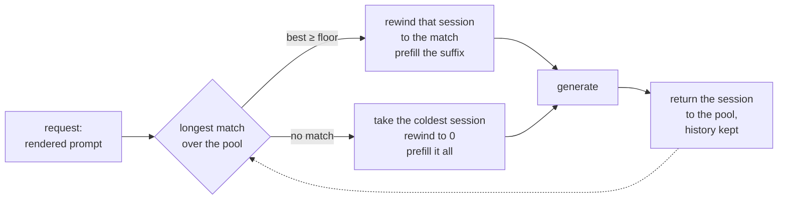

# Session affinity

[016](016-prefix-cache.md) is the largest single win available to the framework
and the server collects none of it. This spec is why, and what to do instead of
waiting.

## 1. The gap this closes

`server/generate.go` opens one session per request and closes it on the way out.
That is what returns the KV reservation [009 §6](009-server.md) admits against,
and it means a session **never sees a second turn**. Session-local reuse
therefore has nothing to reuse: the history it would match against was destroyed
with the session that held it.

So [016 §7](016-prefix-cache.md)'s table credited `session` with the multi-turn
win, and from the server that row is empty. Both scopes are unreachable, for two
different reasons, and only one of them is upstream.

## 2. Why this needs nothing from accel

The refusal `CacheProcess` returns names a missing page table. That is the
obstruction for **block-level** sharing — arbitrary requests sharing arbitrary
physical blocks, which is [016 §4](016-prefix-cache.md)'s pool and what
`internal/prefix` implements. It is not the obstruction for cross-request reuse
as such.

`Session.reusable` compares token ids against that session's own history and
returns how many agree. The cache behind it is contiguous and single-owner, and
a row's index is its position — exactly the shape the kernels already read. So a
request that lands on a session **already holding a matching prefix** reuses it
with no page table, no `AttentionOptions.Pages`, and no change to
[004 §3](004-model-graph.md)'s port table.

The unit of sharing is the session, not the block. That is strictly weaker than
016 — two conversations with the same system prompt still pay for it twice —
and it is available now rather than after two layers of work.

The one structural change is the dashed edge: a session goes **back to the
pool** with its history intact instead of being closed.

## 3. The pool, and what a hit costs

The pool holds $N$ sessions, each with its KV reserved for the process's life.
Routing compares the request's token ids against every pooled session's history
and takes the longest agreement.

Matching is $O(N \cdot L)$ integer comparisons on the host, where $L$ is the
prompt length, against a prefill of $O(L)$ **forward passes**. At $N = 8$ and
$L = 2000$ that is 16k comparisons to decide whether to skip up to 2000
transformer steps, so the routing cost is not a term worth modelling.

### 3.1 When a conversation keeps its session

A conversation reuses its own prefix if its session survived to its next turn.
With $N$ sessions and least-recently-used eviction, that is the classic
condition: **a turn hits if the number of distinct other conversations served
since that conversation's last turn is below $N$.**

$$\text{hit} \iff d < N, \quad d = \text{reuse distance}$$

So the pool is sized against **concurrent conversations**, not against request
rate. $N$ below the number of live conversations does not degrade smoothly for
everyone; it degrades completely for whichever conversations lose the race, and
those are the long-idle ones, which are the ones with the most to reuse.

### 3.2 Choosing the victim destroys history

Rewinding a session to the matched prefix throws away everything after it. So
routing is not only a choice of what to gain — it is a choice of what to
destroy. A request that matches 40 tokens of a session holding 8000 discards
7960 tokens another conversation would have hit on.

**The rule: prefer the session whose match is longest, and among equal matches
prefer the one whose history is shortest.** A session with no match at all is
routed to the coldest by last use, not to the emptiest — an empty session is
usually empty because it was just evicted, and the coldest is the one whose
owner is least likely to return.

## 4. Admission changes, and this is the real cost

[009 §6](009-server.md) admits a request when there is KV for a session, and
gives it back on close. With a pool, the KV is reserved once at startup and
never returned, so:

- **admission becomes "is a pooled session free"**, a counting semaphore of $N$,
  rather than arithmetic over free device memory;
- $N$ is chosen at startup from `CacheBytesPerSession` and the device budget,
  and it is the concurrency limit as well as the reuse depth;
- a process that served one request now holds $N$ sessions' KV for its life.
  For a 32B model at f16 that is the dominant resident cost, and it is paid
  whether or not a second request ever arrives.

This is a real trade, not an optimisation with no downside: **the server stops
being able to run one large request that would not fit alongside $N-1$ idle
peers.**

## 5. Isolation: the pool is now the boundary

016 §7's argument survives, with the unit changed. A cache hit is faster than a
miss, so a request landing on another conversation's session can measure whether
that conversation exists. The pool, not the block, is what a scope has to bound.

**The decision: affinity is keyed, and an unkeyed request never matches another
request's session.** The key is whatever the layer in front supplies — 016 §7.1
already puts `cache_salt` on the request for exactly this, and
[009 §7](009-server.md) says tgo has no notion of a tenant, so tgo must not
invent one. Concretely:

| the request carries | it may match |
| --- | --- |
| a key | a session whose last key is equal |
| no key | a session with no key, and never one with a key |

That fails **closed**: the caller who supplies nothing shares with nobody rather
than with everybody, which is the opposite of vLLM's default and is the whole
reason 016 §7.1 took a scope as well as a salt.

A single-tenant deployment sets no key and gets full sharing among its own
unkeyed requests, which is correct: there is one tenant.

## 6. Correctness

Unchanged from [016 §6](016-prefix-cache.md). The reused prefix was computed
under a different prefill shape, floating point is not associative, so a warm
answer equals a cold one **in distribution rather than bit for bit**
([016-D6](016-prefix-cache.md)). The reuse is capped at $L-1$ for the same
reason as [016 §3.1](016-prefix-cache.md): sampling needs logits at the last
prompt position, and the cache holds no logits.

One new hazard. A session returned to the pool after a **failed or cancelled**
request holds history for tokens whose generation did not finish. Its history
must record exactly the positions whose KV is actually valid, or the next
request matching against it reuses state that was never written. A request that
ends early truncates its session's history to the last position it completed.

## 7. Tests

| test | what it catches |
| --- | --- |
| two requests continuing one conversation: the second prefills only the suffix, asserted through the recorder's prefill token count, not through timing | §1 — the win this spec exists for |
| the answer is the same as an unpooled server's, greedy | §6 |
| $N+1$ distinct conversations round-robin: the one evicted is the coldest, and it prefills whole | §3.1's reuse distance |
| a request matching 40 tokens does **not** evict a session holding 8000 when an equal match exists on a shorter one | §3.2 |
| a keyed request never matches an unkeyed session's history, and vice versa | §5 — asserted on reuse count, which is the thing the oracle would read |
| a cancelled request's session, reused by the next request, produces the same answer as a cold one | §6's truncation hazard: without it the next request attends to KV that was never written |
| $N$ concurrent requests all get a session and the $N+1$th waits rather than failing | §4's semaphore |
| under `-race`, concurrent routing over the pool keeps one owner per session | §4 |

The first row is the one that must be measured rather than asserted structurally
— [010-D7](010-conformance.md): a probe that only checks the code path was taken
is what let [016 §9](016-prefix-cache.md) be confidently wrong.

## 8. What shipped

Shipped 2026-08-26. `tgo.Pool` holds N sessions; `Pool.Acquire` returns a
`Lease`; `Lease.Chat` and `Lease.Complete` render, tokenize, route and generate;
`Lease.Release` returns the session with its history. `server.WrapPool` is
`server.Wrap` with that pool behind it, and `tgo serve` builds one.

### 8.1 The win, measured

`TestPoolSecondTurnPrefillsOnlyTheSuffix` reads the recorder rather than a
clock, which is what [010-D7](010-conformance.md) asks for. Two turns of one
conversation on a pool of two, at a 80-position context:

| | prompt | prefilled | steps |
| --- | --- | --- | --- |
| turn 1 | 18 | 18 | 1 |
| turn 2 | 32 | **9** | 1 |
| turn 2, on a pool that never saw turn 1 | 32 | 32 | 1 |

The 23 positions turn 2 did not prefill are turn 1's prompt and the tokens it
generated. The third row is in the same test: a suffix of 9 is a number only
beside the 32 a cold request pays.

Every cell above is read from the recorder and asserted, turn 1's included. A
table half measured and half reasoned is the same half-probe
[010-D7](010-conformance.md) names, one row further down.

The answers agree. `sameGeneration` holds the warm turn against a cold
`Session`'s, greedy, and reports the first differing token id if it ever stops
holding — [016-D6](016-prefix-cache.md)'s distributional claim tested as the
property a caller checks rather than as a tolerance.

### 8.2 Where the pool lives, and why it is not in `server`

In package `tgo`, next to the session and the tokenizer. Routing compares
rendered token ids, and the server cannot produce them: `Session.Chat` renders
the chat template and tokenizes inside the session, and the route has to be
chosen *before* a session exists. `Session.encode` therefore moved to
`Model.encode`, and the pool renders, encodes, routes, and only then generates.

A pooled session's tools and thinking flag are reassigned on the lease rather
than through a new `SessionOption`, which keeps
[000-D10](000-decisions.md)'s surface closed. That is sound because routing
compares the rendered ids: tools render into the system turn, which is the head
of the prompt, so a changed tool set diverges early and the match collapses on
its own. Nothing detects the change.
`TestPoolARenderThatDivergesEarlyCollapsesTheMatch` asserts the collapse and the
answer; `TestPoolALeaseReassignsTheSessionsRenderOptions` asserts the
reassignment, so a session's fields cannot say one thing while its history says
another.

### 8.3 The truncation is a no-op for a cancellation, and not for a failure

[§6](#6-correctness) asks a request that ends early to truncate its session's
history. Two invariants decide what that costs:

- `Stream.advance` appends to the history and advances the length in the same
  branch, and only after the step returned. So a request cancelled *between*
  steps already leaves the two agreeing, and the truncation moves nothing.
- `stepData.fill` gives real row $i$ the slot $\text{first}+i$ and every pad row
  a slot at the capacity, which `tensor.ScatterRows` drops. So a step that
  failed on the device wrote nothing below the length it started from: the
  extent of a partial write is **known**, not unknown.

What the truncation therefore does, and nothing else does, is clear the failure
[007-D5](007-engine.md) poisons a session with. That refusal is right for a
session a caller owns and wrong for one the pool is about to hand to somebody
else, where it would take a session out of the pool for the life of the process.
`TestPoolFailedRequestReturnsAUsableSession` injects a device fault through the
session's submit seam and fails without it;
`TestPoolCancelledRequestLeavesOnlyValidPositions` is the regression guard for
the first invariant, and says in its comment that it holds by invariant rather
than by the truncation.

The truncation itself is asserted as a postcondition and not through a request,
because no request can read past it: `Session.reusable` is bounded by the length
as well as by the history, so a history longer than the length is invisible to
routing and reaches only the sampler's repetition penalties.
`TestPoolReleaseLeavesTheHistoryAtTheValidLength` desynchronises the two the one
way a caller cannot -- appending to the history without advancing the length,
which is what a refactor of `Stream.advance` would do by accident -- and asserts
that `Lease.Release` puts them back. Without it, dropping the truncation and
keeping the clearing of the failure leaves the whole suite green.

### 8.4 What `tgo serve` does with it

`--sessions N` is the pool, and `--prefix-cache` is whether it reuses anything.
Two flags rather than one, because they are two costs:

| flag | default | what it costs |
| --- | --- | --- |
| `--sessions N` | 4, or what the device holds if that is less | N sessions' cache, reserved at startup, held until the process exits |
| `--prefix-cache` | off | a warm answer equals a cold one in distribution rather than bit for bit ([016-D6](016-prefix-cache.md)) |

The pool size is **not** the device's whole capacity, which is what
[§4](#4-admission-changes-and-this-is-the-real-cost) reads as. `N_max` was a
limit on sessions that might exist; it is now a quantity that is allocated, and
allocating every byte the device would hold to idle conversations is not a
default. The report prints both: what N reserves, and how many the device would
hold. An explicit `--sessions` above that is refused at startup, naming both
numbers.

`--prefix-cache` is off because turning it on changes what an answer says, and
`tgo serve` should not change its answers on an upgrade. This is a deviation
from the framing of [§1](#1-the-gap-this-closes), which reads as though the win
should be automatic: what shipped makes it reachable and one flag away rather
than default. The pool itself is not optional, because it is also the admission
semaphore.

### 8.5 `cache_salt` was not on the request, and is now

[§5](#5-isolation-the-pool-is-now-the-boundary) says
"[016 §7.1](016-prefix-cache.md) already puts `cache_salt` on the request".
It did not: 016 §7.1 decided it and `internal/prefix` carries a `Salt` field
that nothing reaches from the server. `server` now parses `cache_salt` from the
raw body beside the other members `ir.Request` has no room for, and it becomes
`SessionSpec.Key` and then the pool's affinity key.

It is honoured without being a `Policy` field, so it is subtracted from the loss
report by a second table, `honouredSession`, rather than by `honoured` — whose
invariant is that its keys are exactly `tgo.Policy`'s, checked by reflection.
Without the subtraction a caller who isolated their cache would be told the
field was dropped, which is the 009-D12 failure from the quiet side.

[§7](#7-tests)'s fifth row asks for both directions of the key, and only one of
them is reachable from a single sequence. Once an unkeyed conversation exists,
an unkeyed request has its own session to hit and reads the same number whether
or not the comparison is one-sided, so the second direction needs a pool where
the *only* session holding the prompt is a keyed one.
`TestPoolAnUnkeyedRequestNeverReadsAKeyedSession` and, over the wire,
`TestAnUnsaltedRequestDoesNotReadASaltedSession` are that setup: the keyed
conversation runs first, the unkeyed request must be cold, and the keyed one
must still find its own session afterwards so the miss is isolation rather than
an emptied pool.

### 8.6 The pool is a second semaphore, and two of them must agree

[§4](#4-admission-changes-and-this-is-the-real-cost) reads as though the
admitter becomes the pool. It does not: `server/admit.go`'s semaphore stayed
where it was, and `Pool.Acquire` is a second one behind it. Two semaphores of
the same size behave as one; two of different sizes do not behave as the larger.

With a concurrency $C$ above the pool's $N$, the admitter's slots are taken
first, so $C-N$ requests are admitted and then block inside `Engine.NewSession`
waiting for a pooled session. The overflow is **bounded** — at $C-N$, and each
waiter ends when its own request context does — and the requests behind them
still queue and still get their 429. This is not an unbounded queue.

It is instead a wait the admitter does not describe. Those $C-N$ requests are
not in `queue`, so `WithQueueWait` does not time them out and the queue-depth
metric does not count them; what their caller gets is a request that waits past
the `Retry-After` budget instead of the 429 that budget promises. The admitter's
two guarantees — a bounded number of waiters and a bounded wait — survive
separately and stop describing the same request.

So `server.New` refuses a concurrency above the engine's pool size, naming both
numbers. It is a startup check on a number that is knowable at startup rather
than a correctness fix: nothing is lost or corrupted, and what is prevented is a
deployment whose queue metrics and `Retry-After` no longer mean what they say.
`tgo serve` cannot reach it, because it passes `WithConcurrency(adm.Sessions)` —
but `WrapPool` is public and `WithKVBudget` divides device memory without
knowing what the pool reserved. Below the pool size is allowed: that is a
deployment asking for a reuse depth larger than its concurrency, which
[§3.1](#31-when-a-conversation-keeps-its-session) makes a real thing to want.
`TestAdmissionAboveThePoolIsRefused` covers both directions and both ways of
arriving at the number, and `TestServePoolSizeIsTheAdmissionLimit` reads the
size `tgo serve` actually built the pool with rather than trusting the one call
to `kvAdmission`: a pool built wider than the limit is memory the report never
named, and neither size shows in the report.

## 9. What this is not

It is not [016](016-prefix-cache.md), and it does not make 016 unnecessary.
Block sharing dedups a system prompt across *different* conversations, which
affinity cannot do at any pool size: two conversations are two sessions, and two
sessions hold two copies. When the page-table port lands, the two compose —
affinity picks the session, blocks dedup across them — and this spec's pool
becomes the allocator the block pool hands memory to.

It is also not a scheduler. [008](008-scheduler.md) runs many conversations in
one step; this runs one conversation per session and only changes when the
session dies.

## Decision record

**019-D1. The pool is sessions, not blocks.** The block is the better unit and
needs a port tgo does not have. A session is the unit the kernels already
address, so it ships now. See [§2](#2-why-this-needs-nothing-from-accel).

**019-D2. KV is reserved at startup, not per request.** It is what makes a hit
possible, and it costs a process $N$ sessions' memory for its life. Admission
becomes a semaphore — a second one, in front of the pool's, and a wider one
makes the queue's `Retry-After` stop describing what a request waits, which is
why `server.New` refuses it
([§8.6](#86-the-pool-is-a-second-semaphore-and-two-of-them-must-agree)). See
[§4](#4-admission-changes-and-this-is-the-real-cost).

**019-D3. Affinity is keyed and fails closed.** An unkeyed request matches only
unkeyed sessions. vLLM's `cache_salt` fails open; a framework whose default
makes one user's conversation detectable by another has made a security decision
for the operator. See [§5](#5-isolation-the-pool-is-now-the-boundary).

**019-D4. Longest match wins, shortest history breaks the tie.** Routing chooses
what to destroy as much as what to reuse, and the tie-break is what stops a
40-token match from discarding an 8000-token history. See
[§3.2](#32-choosing-the-victim-destroys-history).

**019-D5. A request that ends early truncates its session's history.** The
alternative is a session advertising positions whose KV was never written, which
is silent wrong output on the *next* request rather than a failure on this one.
See [§6](#6-correctness) and [§8.3](#83-the-truncation-is-a-no-op-for-a-cancellation-and-not-for-a-failure),
which records what it turned out to cost: nothing for a cancellation, and a
session back in service after a device failure.

**019-D6. The pool is in package `tgo`, not in `server`.** Routing compares
rendered token ids and the server cannot produce them: rendering and tokenizing
happen inside `Session.Chat`, and the route must be chosen before a session
exists. The alternative — exporting the renderer and the tokenizer so the server
could pre-render — would put the prompt-forging rule of
[003-D4](003-chat-template.md) in two places. See
[§8.2](#82-where-the-pool-lives-and-why-it-is-not-in-server).

**019-D7. A lease reassigns its session's tools and thinking flag rather than
taking a new option.** The alternative is a public `SessionOption` for a
per-request value, which [000-D10](000-decisions.md) closed the surface against.
It is sound only because routing compares rendered ids, so a changed tool set
shortens its own match; the tests assert both halves rather than the claim.

**019-D8. `tgo serve` pools by default and reuses only when asked.** The pool is
not optional, because it is the admission semaphore; the reuse is, because
turning it on changes what an answer says
([016-D6](016-prefix-cache.md)). The rejected alternative is reuse on by
default, which would change every answer a deployment gets on an upgrade with no
line in the release notes that an operator could act on. The pool's default size
is 4 rather than the device's capacity for the same reason from the other side:
`N_max` used to bound sessions that might exist and now bounds memory that is
allocated. See [§8.4](#84-what-tgo-serve-does-with-it).
