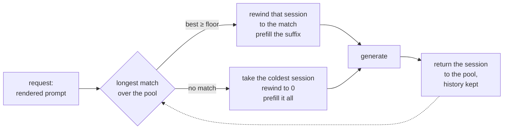

# Session affinity

[016](016-prefix-cache.md) is the largest single win available to the framework
and the server collects none of it. This spec is why, and what to do instead of
waiting.

## 1. The gap this closes

`server/generate.go` opens one session per request and closes it on the way out.
That is what returns the KV reservation [009 §6](009-server.md) admits against,
and it means a session **never sees a second turn**. Session-local reuse
therefore has nothing to reuse: the history it would match against was destroyed
with the session that held it.

So [016 §7](016-prefix-cache.md)'s table credited `session` with the multi-turn
win, and from the server that row is empty. Both scopes are unreachable, for two
different reasons, and only one of them is upstream.

## 2. Why this needs nothing from accel

The refusal `CacheProcess` returns names a missing page table. That is the
obstruction for **block-level** sharing — arbitrary requests sharing arbitrary
physical blocks, which is [016 §4](016-prefix-cache.md)'s pool and what
`internal/prefix` implements. It is not the obstruction for cross-request reuse
as such.

`Session.reusable` compares token ids against that session's own history and
returns how many agree. The cache behind it is contiguous and single-owner, and
a row's index is its position — exactly the shape the kernels already read. So a
request that lands on a session **already holding a matching prefix** reuses it
with no page table, no `AttentionOptions.Pages`, and no change to
[004 §3](004-model-graph.md)'s port table.

The unit of sharing is the session, not the block. That is strictly weaker than
016 — two conversations with the same system prompt still pay for it twice —
and it is available now rather than after two layers of work.

The one structural change is the dashed edge: a session goes **back to the
pool** with its history intact instead of being closed.

## 3. The pool, and what a hit costs

The pool holds $N$ sessions, each with its KV reserved for the process's life.
Routing compares the request's token ids against every pooled session's history
and takes the longest agreement.

Matching is $O(N \cdot L)$ integer comparisons on the host, where $L$ is the
prompt length, against a prefill of $O(L)$ **forward passes**. At $N = 8$ and
$L = 2000$ that is 16k comparisons to decide whether to skip up to 2000
transformer steps, so the routing cost is not a term worth modelling.

### 3.1 When a conversation keeps its session

A conversation reuses its own prefix if its session survived to its next turn.
With $N$ sessions and least-recently-used eviction, that is the classic
condition: **a turn hits if the number of distinct other conversations served
since that conversation's last turn is below $N$.**

$$\text{hit} \iff d < N, \quad d = \text{reuse distance}$$

So the pool is sized against **concurrent conversations**, not against request
rate. $N$ below the number of live conversations does not degrade smoothly for
everyone; it degrades completely for whichever conversations lose the race, and
those are the long-idle ones, which are the ones with the most to reuse.

### 3.2 Choosing the victim destroys history

Rewinding a session to the matched prefix throws away everything after it. So
routing is not only a choice of what to gain — it is a choice of what to
destroy. A request that matches 40 tokens of a session holding 8000 discards
7960 tokens another conversation would have hit on.

**The rule: prefer the session whose match is longest, and among equal matches
prefer the one whose history is shortest.** A session with no match at all is
routed to the coldest by last use, not to the emptiest — an empty session is
usually empty because it was just evicted, and the coldest is the one whose
owner is least likely to return.

## 4. Admission changes, and this is the real cost

[009 §6](009-server.md) admits a request when there is KV for a session, and
gives it back on close. With a pool, the KV is reserved once at startup and
never returned, so:

- **admission becomes "is a pooled session free"**, a counting semaphore of $N$,
  rather than arithmetic over free device memory;
- $N$ is chosen at startup from `CacheBytesPerSession` and the device budget,
  and it is the concurrency limit as well as the reuse depth;
- a process that served one request now holds $N$ sessions' KV for its life.
  For a 32B model at f16 that is the dominant resident cost, and it is paid
  whether or not a second request ever arrives.

This is a real trade, not an optimisation with no downside: **the server stops
being able to run one large request that would not fit alongside $N-1$ idle
peers.**

## 5. Isolation: the pool is now the boundary

016 §7's argument survives, with the unit changed. A cache hit is faster than a
miss, so a request landing on another conversation's session can measure whether
that conversation exists. The pool, not the block, is what a scope has to bound.

**The decision: affinity is keyed, and an unkeyed request never matches another
request's session.** The key is whatever the layer in front supplies — 016 §7.1
already puts `cache_salt` on the request for exactly this, and
[009 §7](009-server.md) says tgo has no notion of a tenant, so tgo must not
invent one. Concretely:

| the request carries | it may match |
| --- | --- |
| a key | a session whose last key is equal |
| no key | a session with no key, and never one with a key |

That fails **closed**: the caller who supplies nothing shares with nobody rather
than with everybody, which is the opposite of vLLM's default and is the whole
reason 016 §7.1 took a scope as well as a salt.

A single-tenant deployment sets no key and gets full sharing among its own
unkeyed requests, which is correct: there is one tenant.

## 6. Correctness

Unchanged from [016 §6](016-prefix-cache.md). The reused prefix was computed
under a different prefill shape, floating point is not associative, so a warm
answer equals a cold one **in distribution rather than bit for bit**
([016-D6](016-prefix-cache.md)). The reuse is capped at $L-1$ for the same
reason as [016 §3.1](016-prefix-cache.md): sampling needs logits at the last
prompt position, and the cache holds no logits.

One new hazard. A session returned to the pool after a **failed or cancelled**
request holds history for tokens whose generation did not finish. Its history
must record exactly the positions whose KV is actually valid, or the next
request matching against it reuses state that was never written. A request that
ends early truncates its session's history to the last position it completed.

## 7. Tests

| test | what it catches |
| --- | --- |
| two requests continuing one conversation: the second prefills only the suffix, asserted through the recorder's prefill token count, not through timing | §1 — the win this spec exists for |
| the answer is the same as an unpooled server's, greedy | §6 |
| $N+1$ distinct conversations round-robin: the one evicted is the coldest, and it prefills whole | §3.1's reuse distance |
| a request matching 40 tokens does **not** evict a session holding 8000 when an equal match exists on a shorter one | §3.2 |
| a keyed request never matches an unkeyed session's history, and vice versa | §5 — asserted on reuse count, which is the thing the oracle would read |
| a cancelled request's session, reused by the next request, produces the same answer as a cold one | §6's truncation hazard: without it the next request attends to KV that was never written |
| $N$ concurrent requests all get a session and the $N+1$th waits rather than failing | §4's semaphore |
| under `-race`, concurrent routing over the pool keeps one owner per session | §4 |

The first row is the one that must be measured rather than asserted structurally
— [010-D7](010-conformance.md): a probe that only checks the code path was taken
is what let [016 §9](016-prefix-cache.md) be confidently wrong.

## 8. What this is not

It is not [016](016-prefix-cache.md), and it does not make 016 unnecessary.
Block sharing dedups a system prompt across *different* conversations, which
affinity cannot do at any pool size: two conversations are two sessions, and two
sessions hold two copies. When the page-table port lands, the two compose —
affinity picks the session, blocks dedup across them — and this spec's pool
becomes the allocator the block pool hands memory to.

It is also not a scheduler. [008](008-scheduler.md) runs many conversations in
one step; this runs one conversation per session and only changes when the
session dies.

## Decision record

**019-D1. The pool is sessions, not blocks.** The block is the better unit and
needs a port tgo does not have. A session is the unit the kernels already
address, so it ships now. See [§2](#2-why-this-needs-nothing-from-accel).

**019-D2. KV is reserved at startup, not per request.** It is what makes a hit
possible, and it costs a process $N$ sessions' memory for its life. Admission
becomes a semaphore. See [§4](#4-admission-changes-and-this-is-the-real-cost).

**019-D3. Affinity is keyed and fails closed.** An unkeyed request matches only
unkeyed sessions. vLLM's `cache_salt` fails open; a framework whose default
makes one user's conversation detectable by another has made a security decision
for the operator. See [§5](#5-isolation-the-pool-is-now-the-boundary).

**019-D4. Longest match wins, shortest history breaks the tie.** Routing chooses
what to destroy as much as what to reuse, and the tie-break is what stops a
40-token match from discarding an 8000-token history. See
[§3.2](#32-choosing-the-victim-destroys-history).

**019-D5. A request that ends early truncates its session's history.** The
alternative is a session advertising positions whose KV was never written, which
is silent wrong output on the *next* request rather than a failure on this one.
See [§6](#6-correctness).
