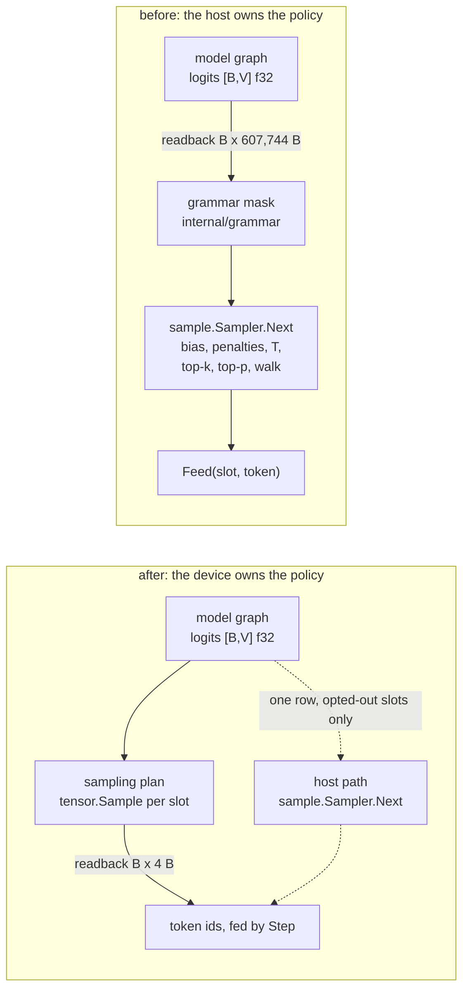

# Sampling on the device

## 1. What this spec is, and why it is one spec

It is the residue of two audited specs.

[006 §1](006-sampling.md) put the whole policy on the host and said the stages
move down when accel builds them. They are built: `tensor.Sample`
(accel `tensor/policy.go:224`) composes penalties, temperature, softmax, top-k,
top-p and the categorical walk and returns a token id, which is what closed
[C3](010-conformance.md) and [C6](010-conformance.md) together.

[008 §9](008-scheduler.md) named the same move as the first of three things the
batched path lacks, and attached a condition to it: which of the two paths the
batched loop runs "is a decision with a measurement attached and not a detail".

They are one design. The stages that move, the seed's meaning after they move,
what a step returns once a token id replaces a logits row, and how eight
requests with eight policies reach one dispatch are the same four questions
asked once for `Session` and once for `Scheduler`. Answering them twice would
produce two answers.

**What does not change**: [006-D1](006-sampling.md) keeps the `sample` package
as the reference the device path is checked against. Nothing here deletes it.

## 2. The number this spec is about

$V$ is not a tgo constant. `model/config.go:52` reads `VocabSize` from the
checkpoint's `vocab_size`, and for Qwen3 it is **151936**, which is the value
`model/qwen3_real_test.go:47` pins and `batch.go:396` quotes.

One row of logits is therefore

$$151936 \times 4\ \text{B} = 607{,}744\ \text{B}$$

per token — 593.5 KiB in `batch.go`'s units, 608 kB in
[C6](010-conformance.md)'s, the same number. A token id is 4 bytes, so the
readback carries $151936\times$ more traffic than the answer it retrieves.

At batch $B$ the step reads back $B$ of them. `batch.go:413` already narrows the
read to the span the working slots occupy, because reading the whole buffer
charged an eight-slot scheduler with one live decoder 4.86 MB to learn one
token. Narrowing bounds the waste; it does not remove it. At $B = 8$ fully
occupied a step still moves **4.86 MB** to produce 32 bytes.

What that costs as a *share* of a step is [§8](#8-the-measurement-that-gates-this)
and is not asserted here.

## 3. Where the boundary sits



The dotted edge is [020-D2](#decision-record) and is not a fallback for
failure. It is the path a slot takes when its policy names something the device
chain cannot express, and it costs exactly that slot's row.

## 4. Which stages cross, and which do not

The argument is the **shape of the state each stage reads**, not its cost.

| stage | after | why |
| --- | --- | --- |
| repetition, presence, frequency penalties | device | the state is a token-id history and a per-id count. `PenaltyCount` (accel `internal/testkernels/accel_kernels.go:7072`) counts a `[cap]u32` ring with an integer atomic and `PenaltyApply` (`:7143`) reads a `[V]u32` count. Both are device-shaped, and the host holds the same data as `[]int` |
| temperature | device | one scalar per row |
| softmax, top-k, top-p, categorical, argmax | device | already there since [C3](010-conformance.md) |
| **logit bias** | **host** | `tensor.SamplingOptions` (accel `tensor/policy.go:36`) has no bias field. It is a caller-supplied sparse map over ids, applied before everything else ([006 §3](006-sampling.md)), so expressing it on the device means either a per-slot `[V]` f32 addend — 4.86 MB at $B=8$, uploaded to save a readback of the same size — or a scatter-add operator that does not exist |
| **grammar mask** | **host** | `internal/grammar.State.Mask` (`internal/grammar/grammar.go:244`) writes $-\infty$ over the complement of `Allowed()` across 151936 entries, and the admissible set is recomputed by a DFA walk on the host every step. Uploading it per step trades a 607,744 B download for a 607,744 B upload |
| **stop strings** | **host**, and never anywhere else | a stop string is a property of *decoded text*, not of a logits row. [006-D4](006-sampling.md) matches it against the detokenizer's hold-back buffer because a stop string need not align to a token boundary. Nothing about it is expressible over a distribution |
| EOS ids, token budget | host | counters over a sequence, which the package that sees one row of logits does not have |

**`PenaltyWindow` becomes the history state's capacity.** `penaltyCountFlat`
counts `history[i]` for `i < d.Count` with no wraparound offset, so a ring works
— counting is order-independent, and a full ring passes `n = cap` while a
partial one passes the tokens so far, as
`SamplingOptions.Scalars` (accel `tensor/policy.go:148`) requires. What it
cannot do is count only the last $W$ of a larger ring. So $W$ is structural, and
it joins the plan key in [§6](#6-eight-policies-one-dispatch). The upside is
that a step appends four bytes per slot instead of rewriting a window.

## 5. The sampling plan is a second plan

`plan.go:86` keys the model plan on `model.GraphSpec` — tokens, capacity, block,
batch, cache dtype, stored weights. Recording the sampling nodes into that graph
would put the policy's *shape* into that key, so changing one slot's top-$k$
would recompile a graph of some 790 nodes.
[010 §3](010-conformance.md) already lists plan compile time per bucket as a
number tgo measures, and [017 §4.1](017-benchmarks.md) puts cold start at 27.6s.
A policy change at admission cannot cost that.

So the boundary is a second plan over the same buffer.

- The model plan writes `model.PortLogits` and stops, unchanged.
- The sampling plan declares that buffer as an input, records one
  `tensor.Sample` chain per slot, and writes a `[B]u32` token port and reads a
  `[B]f32` draws port.
- `Batch` binds `b.logits` into both. The buffer never leaves the device between
  them.

The cost is a second submission per step. [017 §4.1](017-benchmarks.md) measures
submit at 3.34% of a decode step for the whole model graph after
[accel#21](https://github.com/golang-design/accel/issues/21), and the sampling
plan is tens of nodes rather than 790 — but per-dispatch cost is roughly fixed,
so this is a term in [§8](#8-the-measurement-that-gates-this)'s gate and not an
assumption.

## 6. Eight policies, one dispatch

**accel shares one policy across the batch deliberately.** `tensor/sample.go`
states it: "a truncation parameter is a property of the request's policy and a
draw is a property of the sequence's position in its own random stream, so only
the draw has to differ per row", and closes "moving k and p to bindings later
adds an operand and removes nothing, so it is not a decision this forecloses."

Three things follow, and together they decide the shape.

1. `TopKMask` and `TopPMask` record $k$ and $p$ as `attrs`, so they are part of
   what a plan *is* rather than what a step binds.
2. `Sample` refuses `draws != nil` when the policy is greedy and refuses
   `draws == nil` when it is not (accel `tensor/policy.go:224`), so a batch
   mixing $T=0$ and $T=0.7$ cannot be one call whatever the bindings.
3. `penaltyApplyFlat` is indexed by `i < d.Vocab` with no row axis, and the
   counts state is `[V]u32` for one row. A penalised `Sample` over `[B,V]`
   would penalise row 0 and leave the rest as whatever the buffer held.

So the batch axis is **unrolled in the graph**: slot $r$'s row is
`GatherRows(logits, [r])`, and each row gets its own `tensor.Sample` with its
own `prefix` — which is what the `prefix string` argument is for — its own
history and counts states, and its own recorded $k$ and $p$. $B$ is fixed for
the life of a batch ([008-D1](008-scheduler.md)), so unrolling costs no
generality.

What is *bound* per step, and therefore free: `prefix.invT`, `prefix.n`,
`prefix.rep`, `prefix.pres`, `prefix.freq`, and the draws.

What is *structural*, and therefore the sampling plan's cache key: the
$B$-tuple of

$$\big(\text{greedy}, \text{penalised}, k, p, W\big)_r, \quad r \in [0, B)$$

A slot's entry changes at admission, not per step, so the cache is hit on every
step of a stable batch and missed once per admission that introduces a new
tuple. A sampling plan is tens of nodes, so that miss is a compile a server can
afford where the model graph's is not.

**Rejected**: grouping slots into policy classes so a batch shares one tuple.
It makes admission depend on a request's temperature, which is the opposite of
what [008 §5](008-scheduler.md)'s mix is for.

**The upstream ask this produces** is per-row $k$ and $p$ bindings and a row axis
on the three penalty kernels. Both belong in a row [010 §2](010-conformance.md)
must gain, filed against accel with this spec cited, per
[000 D1](000-decisions.md).

## 7. What a step returns

### 7.1 One rule with three triggers

A slot whose policy the device chain cannot express **reads back its own row and
samples on the host**. The triggers are exactly the host rows of
[§4](#4-which-stages-cross-and-which-do-not), plus one more:

- the request has a non-empty `LogitBias`;
- the request is schema-constrained, so `internal/grammar` holds a mask;
- the caller asked for `Probs` — logprobs need the distribution, and
  [006-D7](006-sampling.md) makes observing it something that must not disturb
  the draw.

One mechanism, one lifetime rule, one test. `batch.go:413` already reads a span
rather than the whole buffer, so the mechanism is a narrower span and not new
code.

### 7.2 The surface

`Produced` (`scheduler.go:164`) gains a token and stops always carrying a row:

```go
type Produced struct {
    Slot     int
    Prefill  bool
    Done     bool

    // Token is the id the device sampled. Valid when Sampleable() and
    // Sampled; the slot has already been fed it.
    Token   int
    Sampled bool

    // Logits is nil unless the slot opted out of device sampling. When it is
    // non-nil the caller owes a Feed.
    Logits []float32
}
```

`Sampleable()` (`scheduler.go:188`) is unchanged: it still answers "is this row
the last of the prompt", which is a question about prefill progress and not
about where sampling ran.

`Feed` (`scheduler.go:239`) stays for opted-out slots and **refuses a slot the
step already fed**, because a double feed appends two tokens to `st.prompt` and
the sequence silently decodes from a position it never scored. Its existing
validation — the slot is live, the prompt is scored, the id is inside the
vocabulary, and the copy that stops an append aliasing the caller's prompt array
(`scheduler.go:115`) — moves into `Step` for the self-fed path rather than being
written twice.

The single-session path (`stream.go:279`) drops `st.sampler.Next` for a token
the step already carries. `stream.go:274`'s grammar mask stays exactly where it
is and puts that stream on the opted-out path.

### 7.3 Rows sampled and discarded

Sampling runs for every row the step carries, and a slot mid-prefill produces a
token from a distribution over the middle of its own prompt — which
`Sampleable()` already tells a caller to throw away. On the host that waste was
free. On the device it is `TopMaxRounds` rounds of a top-$p$ walk that runs in
full whatever $p$ is (accel `tensor/sample.go`, `TopPMask`), plus two passes over
$V$ for the penalties.

So the sampling plan is submitted over the **sampleable** slots only, and a slot
that is not done contributes no entry to §6's tuple.

That makes the key depend on the done-set as well as on the policies, and the
done-set changes on every step of a chunked prefill — so a batch admitting
requests continuously misses the cache more often than a stable one. It is
still a plan of tens of nodes, which is why the alternative in
[020-D3](#decision-record) is the one that could not be paid for. If the
measurement in §8 shows the compile is not free at this size, the fallback is a
plan over **all** $B$ slots with the discarded rows' work accepted, and §8 is
where that number would come from.

## 8. The measurement that gates this

[008 §9](008-scheduler.md) requires the number before the choice. The gate is
**two-sided**, and a one-sided one would approve a regression: the readback this
removes is 1.39% of a decode step today ([017 §4.1](017-benchmarks.md)), which is
smaller than what the sampling chain can add.

**Measure, per decode step, at each batch size:**

| term | how |
| --- | --- |
| readback share removed | `bench.Step.Readback` over the narrowed span, before and after |
| device time added | the sampling plan's own submission, timed as its own `bench.Step` |
| submit added | the second dispatch's fixed cost, which [017 §4.1](017-benchmarks.md) shows is per-dispatch and per-node rather than per-token |
| host time removed | `sample.Sampler.Next` over $V$, plus the copy at `batch.go:413` |

**Conditions:** Qwen3-0.6B at f16, the model
[017 §4.1](017-benchmarks.md) already measured, on the same 8-core Apple
machine; Metal and the CPU backend; $B \in \{1, 2, 4, 8\}$; 64 prompt tokens and
32 decode steps after 4 warm-up steps, matching the existing run so the rows are
comparable. Policies: greedy, and $T=0.7,\ k=40,\ p=0.95$ with a repetition
penalty, so both branches of `Sample` are measured.

**The rule:** the device path is taken at a batch size only where

$$\Delta t_{\text{readback}} + \Delta t_{\text{host}} \;>\; \Delta t_{\text{device}} + \Delta t_{\text{submit}}$$

at that size. A curve, not a point — [017 §4](017-benchmarks.md) rule 5 forbids a
cherry-picked batch size, and the expected shape is that the readback term grows
with $B$ while the submit term does not.

**Where it is recorded:** `conformance.Readback` (`internal/conformance/measure.go:128`)
already carries vocab, bytes, share, median and step count, and gains a batch
size — a share at $B=1$ and a share at $B=8$ are different measurements and a
struct that cannot tell them apart records the second over the first. The
outcome goes in [017 §4.1](017-benchmarks.md) as a row beside the existing one,
losses included ([010-D9](010-conformance.md)).

## 9. Reproducibility

### 9.1 The seed after the draw moves

[006 §4](006-sampling.md) promises a **stream**, not a device-independent byte,
and [006-D3](006-sampling.md) keeps cross-device divergence measured rather than
bounded. Neither promise changes. What changes is where the draw comes from.

`sample.Sampler` seeds a `math/rand/v2` PCG (`sample/sample.go:185`:
`float32(s.rng.Float64())`, clamped). accel owns a generator instead:
`tensor.Stream` (accel `tensor/stream.go`) is a `uint64` and

$$u_{i} = \frac{\big(\mathrm{finalize}(\text{seed} + i \cdot \varphi^{-1}2^{64})\big) \gg 40}{2^{24}}$$

with `Draw(step)` indexed by the **token position** rather than by a draw
counter (accel `tensor/stream.go:85`).

tgo adopts it, and three things follow.

- **[006-D2](006-sampling.md) becomes structural.** "One draw per step whatever
  the policy" was a discipline the host sampler kept by taking the draw before
  every branch. With `Draw(step)` there is no stream position to shift, so a
  caller changing temperature mid-request cannot move a later token even in
  principle. 006-D2's row should be amended in place to say so; this spec cannot
  edit 006.
- **The seed is the request's, never the slot's.** `Derive(root, seq)` exists for
  a batch sharing one root seed. tgo's `Policy.Seed` (`policy.go`) is per
  request, so tgo uses `Stream{Seed: p.Seed}` directly and reaches for `Derive`
  only to synthesise seeds for requests that gave none. Deriving by slot index
  would make a completion depend on **which slot the scheduler happened to
  admit it into**, which is reproducibility destroyed by the thing it was meant
  to survive.
- **Every pinned-token test changes once, deliberately.** The two generators
  produce different values for the same seed, so a test asserting a token id for
  seed 42 asserts a different id afterwards. accel's own reason for owning the
  generator is that the alternative pins the standard library, which "will not
  hold still".

### 9.2 What is still not promised

Greedy is bit-exact across runs on one device and is not promised bit-exact
between backends ([006 §4.1](006-sampling.md)). Moving the argmax onto the
device does not change that: `Argmax`'s tie rule is the lowest index, which is
`sample`'s strict upward scan (`sample/stages.go:182`), and what differs between
backends is reduction order and not the rule.

## 10. The host path stays as the oracle

### 10.1 What is compared

The parity test binds the **same draw** to both paths and compares:

1. the kept set after truncation, asserted **identical**;
2. the token id, asserted identical, with disagreements **reported** rather than
   bounded;
3. the post-policy distribution, within a `conformance.Terms` budget.

The tie rules already agree by construction, which is why (1) is an equality and
not a tolerance: `Argmax` and `sample/stages.go:182` both take the lowest index;
`TopKMask`'s lexicographic (value, index) is `topN`/`above`
(`sample/stages.go:202`); the crossing entry is kept in both `TopPMask` and
`nucleus` (`sample/stages.go:277`); and both walks compare strictly against
$u \times \text{total}$ in index order (`sample/stages.go:36`).

**The one divergence source is the softmax total's summation order.**
`weightsAll` (`sample/stages.go:237`) sums ascending by id and says so; accel
reduces over 128 lanes and then a tree. The totals differ in their last bits,
$u \times \text{total}$ moves, and a draw landing within that distance of a
cumulative boundary can select the neighbour. So (2) is a measurement with a
margin attached — the same instrument [006-D3](006-sampling.md) already applies
to cross-device greedy divergence — and a token disagreement whose boundary
margin exceeds the budget is a **failure**, not a tolerance to widen
([010-D3](010-conformance.md)).

### 10.2 One thing the oracle must be fixed for first

`sample`'s top-$k$ selects on **logits**: `policyDist` calls
`topN(logits, ...)` (`sample/stages.go:74`), and the comment there says "the
selection is on the logits, per section 3". [006 §3](006-sampling.md) was
amended on 2026-08-25 to truncate after the softmax, and accel truncates after
the softmax. Exponentiation is monotone, so the two agree except where two
distinct logits round to one f32 probability — which is precisely the case
accel's argument names, and precisely where the kept sets differ by one boundary
entry.

The oracle must be brought into line before it can be one. This is a `sample`
package change, it is small, and it is the first item of the first pass.

### 10.3 Where it lives

`internal/conformance` is the register and holds the parity test, as
`parity_test.go` already does for other rows. `internal/oracle` is a float64
reference for attention and RoPE and gains **nothing** here:
[006-D1](006-sampling.md) designates the `sample` package as sampling's oracle,
and a third implementation would be a third thing to keep in agreement.

## 11. Tests

| test | asserts |
| --- | --- |
| `TestTopKSelectsOnProbabilitiesNotLogits` | §10.2: two distinct logits that round to one f32 probability give `sample` and `tensor.Sample` the same kept set |
| `TestDeviceAndHostAgreeOnTheSameDraw` | §10.1 (1) and (2): identical kept set and identical token, over a corpus of policies and draws |
| `TestDeviceGreedyIsTheHostArgmax` | the tie rule survives the move: an exactly-tied maximum gives the lowest index on both |
| `TestDeviceProbsWithinBudget` | §10.1 (3): the post-policy distribution inside a `conformance.Terms` budget, with no float literal in the test |
| `TestPenaltyWindowIsTheHistoryCapacity` | §4: a window of $W$ over a ring of capacity $W$ counts what `sample.penalize` counts, full ring and partial |
| `TestPerSlotPoliciesInOneStep` | §6: eight slots with eight different $(T, k, p)$ in one dispatch each get the token their own policy implies |
| `TestGreedyAndStochasticSlotsInOneStep` | §6 item 2: a batch mixing $T=0$ and $T>0$ steps, since one `Sample` call cannot express it |
| `TestSamplingPlanCacheHitsOnAStableBatch` | §6: no compile after admission settles; one miss per new policy tuple |
| `TestModelPlanIsNotRecompiledByAPolicyChange` | §5: changing a slot's top-$k$ does not touch the model plan's cache |
| `TestConstrainedSlotOptsOut` | §7.1: a schema-constrained slot returns `Logits` and no token, and its neighbours in the same step return tokens and no logits |
| `TestLogitBiasOptsOut` | §7.1: a non-empty `LogitBias` takes the host path |
| `TestProbsOptsOut` | §7.1: a request wanting logprobs takes the host path and does not disturb its own draw ([006-D7](006-sampling.md)) |
| `TestFeedRefusesADeviceSampledSlot` | **negative**: `Feed` on a slot the step already fed returns an error rather than appending a second token to `st.prompt` |
| `TestMidPrefillSlotIsNotSampled` | §7.3: a slot that is not `Done` carries no sampling work |
| `TestSeedDoesNotDependOnSlot` | §9.1: the same request seeded the same way gives the same completion from slot 0 and from slot 5 |
| `TestPolicyChangeMidRequestDoesNotShiftTheStream` | §9.1: [006-D2](006-sampling.md), now structural |
| `TestReadbackMeasuredAtEachBatchSize` | §8: `conformance.Readback` carries the batch size, and a share at $B=8$ does not overwrite one at $B=1$ |

Every row except the last three is device-backed and belongs to
[010 §4](010-conformance.md)'s tier 2, which fails rather than skips when no
device is present.

## 12. What this spec does not own

- **The composition order.** [006 §3](006-sampling.md) owns it, and this spec
  changes nothing about it except §10.2's correction to the oracle.
- **Stop strings, EOS ids, the token budget, context exhaustion.**
  [006 §5](006-sampling.md).
- **The grammar itself.** [015](015-structured-output.md) owns the mask; this
  spec owns only the fact that a masked slot opts out.
- **Admission, eviction, the prefill mix, the queue in front of `Admit`.**
  [008](008-scheduler.md), including the other two items of its §9.
- **Writing kernels.** [000 D1](000-decisions.md). The per-row $k$ and $p$
  bindings and the penalty kernels' row axis are an issue on accel and a row
  [010 §2](010-conformance.md) must gain, not device code here.
- **The benchmark harness.** [017](017-benchmarks.md) owns `bench` and the
  publication rules; §8 uses them.

## 13. Scope

**This is not one pass, and saying so is part of the design.** The single
session and the batch share the four questions but not the code: one is a
`Session` with one policy and one buffer, the other is a plan cache over a
$B$-tuple, a self-feeding `Step`, and a mixed opt-out path.

Split it:

| pass | contents | done when |
| --- | --- | --- |
| **1 — the single session** | §10.2's oracle fix; `tensor.Stream` adopted; one `tensor.Sample` chain over one row; the sampling plan split from the model plan (§5); `stream.go:279` fed from the device; the parity test; the §8 measurement at $B=1$ | 006's half of the residue is closed, and the pinned-token tests have moved once |
| **2 — the batched path** | $B$ unrolled chains with per-slot prefixes (§6); the sampling plan cache keyed on the $B$-tuple; `Produced.Token` and the self-feed (§7.2); the opt-out span (§7.1); the §8 measurement at $B \in \{1,2,4,8\}$ | 008 §9's first item is closed |

Pass 1 is executable by one person in one pass and is worth landing alone: it
removes the readback from the decode loop [007 §5.1](007-engine.md) calls the
floor on a step. Pass 2 depends on pass 1 and on nothing else here.

**Named as gaps rather than built**: per-row $k$ and $p$ bindings and a row axis
on the penalty kernels (§6); a device path for grammar-constrained slots, which
needs either a scatter-add mask or a sample over a gathered sub-vocabulary
(§4); a device-side `LogitBias` (§4).

## Decision record

| id | decision | rejected | consequence |
| --- | --- | --- | --- |
| 020-D1 | the penalties, temperature, softmax, both truncations and the draw move to the device; logit bias, the grammar mask and stop strings stay on the host | move every stage; keep every stage | the split follows the shape of the state each stage reads, so it is decidable from the code rather than argued per stage. Two host stages are named as gaps rather than accepted as permanent |
| 020-D2 | one opt-out rule with three triggers: a slot the device chain cannot express reads back its own row and samples on the host | three mechanisms — a `[B,V]` bias buffer, a per-step mask upload, a separate logprobs path | one lifetime rule and one test. The `[B,V]` bias buffer is 4.86 MB at $B=8$ uploaded to save a readback of the same size on the same slot |
| 020-D3 | sampling is a **second plan** over the logits buffer | record the sampling nodes into the model graph | a policy change would otherwise join `model.GraphSpec` (`plan.go:86`) and recompile ~790 nodes; [017 §4.1](017-benchmarks.md) puts cold start at 27.6s. The price is a second submission per step, which §8 measures rather than assumes |
| 020-D4 | the batch axis is unrolled: one `tensor.Sample` chain per slot with its own prefix, and the sampling plan is cached on the $B$-tuple of $(\text{greedy}, \text{penalised}, k, p, W)$ | one `Sample` over `[B,V]`; group slots into policy classes at admission | accel shares $k$ and $p$ across a batch by design and refuses a mixed greedy/stochastic call, and the penalty kernels have no row axis — so one call cannot carry eight policies. Grouping would make admission depend on a request's temperature, which is what §5's mix exists to avoid |
| 020-D5 | a step returns a token id per sampleable slot and feeds it itself; `Logits` is nil except on opted-out slots, and `Feed` refuses an already-fed slot | return both a token and a row always; keep `Feed` mandatory | a caller cannot read a row that was not read back, and a double feed cannot append a second token to a slot's prompt. `Sampleable()` keeps its meaning, which is about prefill progress |
| 020-D6 | the draw is accel's `tensor.Stream`, indexed by token position, seeded from the **request** | keep `math/rand/v2` PCG on the host and upload the draw; derive the stream from the slot index | [006-D2](006-sampling.md) becomes structural rather than disciplinary; a completion stops depending on which slot admitted it. Every pinned-token test changes once, deliberately |
| 020-D7 | parity asserts set identity and **measures** token disagreement with its boundary margin | assert bit equality on the token; widen a tolerance until it passes | the tie rules agree by construction, so the only divergence source is the softmax total's summation order — and a disagreement outside the `conformance.Terms` budget is a finding, per [010-D3](010-conformance.md) |
| 020-D8 | the gate is two-sided: readback and host time removed against device and submit time added, as a curve over $B$ | gate on the readback share alone; gate at one batch size | a one-sided gate approves a regression, because the readback is 1.39% of a decode step today and `TopPMask` runs all 128 rounds whatever $p$ is. [017 §4](017-benchmarks.md) rule 5 forbids a single batch size |
| 020-D9 | the work is two passes, the single session first | build the single session and the batch together | pass 1 closes [006](006-sampling.md)'s half alone and is one person's pass; building both at once makes a policy-composition bug and a per-slot-binding bug indistinguishable, which is [008-D8](008-scheduler.md)'s argument applied again |
