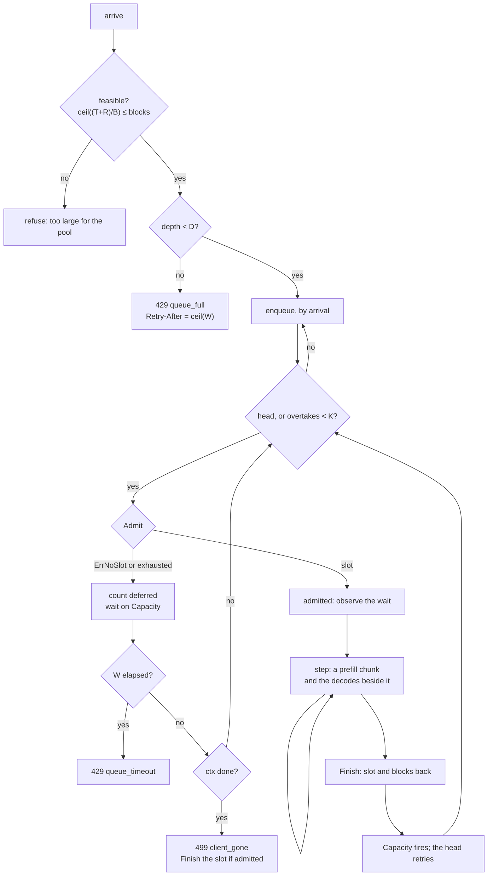

# The admission queue

[008 §9](008-scheduler.md) names three things the scheduler does not have, and
this spec is one of them. `Scheduler.Admit` refuses when every slot is live
(`scheduler.go:103`) or when the block pool cannot hold the prompt and its
reserve (`scheduler.go:105`). A refusal is the right answer to a caller who can
retry and the wrong answer to an HTTP request, which is why `server` grew its
own semaphore and its own queue in front of a pool it does not share with the
scheduler (`server/admit.go:40`).

This spec designs the one queue that sits in front of admission, so a request
that cannot be admitted now waits instead of failing, and so
`tgo_queue_wait_seconds` reports a number that includes both reasons a request
waits rather than one of them.

## 1. What is there today, and what each half measures

Three surfaces gate admission today. None of them makes a request **wait** on
the condition [008 §3](008-scheduler.md) states.

| gate | where | what it counts | what it cannot see |
| --- | --- | --- | --- |
| the server's semaphore and queue | `server/admit.go:40-106` | requests waiting for a *pooled session* | blocks; there is no block pool behind `Pool` |
| `Pool.Acquire` | `pool.go:181-201` | a token per free session, taken before the prompt is rendered | how large the prompt is |
| `Scheduler.Admit` | `scheduler.go:92-125` | a free slot **and** the blocks for $T + R$ | nothing waits on it; it returns `ErrNoSlot` |

The gap is the third row. Admission under a batch has two conditions
([008 §3](008-scheduler.md)):

$$\text{admissible} \iff (\exists\, \text{free slot}) \;\wedge\; \left\lceil \frac{T_\text{prompt} + R}{B_\text{block}} \right\rceil \le \text{blocks free}$$

and only the scheduler can evaluate the conjunction, because only it holds both
the slot table (`scheduler.go:38`) and the block pool the batch leases from
(`batch.go:244`).

$R$ is one number for the whole deployment, not one per request:
`SchedulerOptions.Reserve` (`scheduler.go:49-52`) is set once at
`NewScheduler` and every `Admit` passes the same value (`scheduler.go:105`).
The arithmetic below uses that single $R$. A per-request reserve is a different
design and is not this one.

## 2. Where the queue lives

**A third object, in package `tgo`, over `Scheduler`. This overrules
[008-D9](008-scheduler.md)'s placement and keeps its conclusion.**

008-D9 says [019](019-session-affinity.md)'s `Pool` becomes the queue, on the
argument that the scheduler inherits the *waiting* and not the routing. The
waiting is the right thing to inherit. `Pool` is the wrong place to inherit it
from, for three reasons that are visible in the code rather than in the
argument:

- **`Pool` waits on the wrong predicate.** `Pool.sem` is a counting semaphore of
  $N$ tokens (`pool.go:55`, `pool.go:188`). A token says a session is idle. It
  cannot say that $\lceil (T+R)/B \rceil$ blocks are free, which is half of
  §1's conjunction, and the token is taken *before* the prompt exists —
  `Pool.Acquire` returns a `Lease` and routing happens at the first
  `Lease.Chat` (`pool.go:172-176`), by which time the request is already past
  admission.
- **`Pool` owns sessions, and a scheduler has none.** A pooled session is a
  contiguous single-owner cache (019-D1); a batch slot is a page table over a
  shared pool and `NewBatch` refuses a model without one
  (`batch.go:119-124`). 019 §9 already says the pool is not a scheduler. Making
  it the queue would give one type two cache models.
- **`Pool` is what the scheduler replaces**, not what it extends
  ([008 §9](008-scheduler.md), third bullet). A queue built inside `Pool` would
  be deleted with it.

**Not `Batch` either.** `Batch` is mechanism and the scheduler is policy over it
(008-D8, `batch.go:26-30`). A queue is policy: it decides *which* request is
admitted next, which is the same class of decision as `victim`
(`schedule.go:128`).

**Not inside `Scheduler` either**, and this one is a lock argument rather than a
taste argument. `Scheduler.Step` holds `s.mu` for the whole device dispatch
(`scheduler.go:206-207`). A blocking `Admit` under that mutex would hold the
lock while waiting for the step that releases it. So the queue has its own lock
and drives the scheduler through its existing non-blocking surface.

The shape:

```go
// Admitter is what a queue needs of a scheduler. Scheduler satisfies it.
type Admitter interface {
    // Feasible reports whether a prompt of this length could ever be
    // admitted: ceil((T+R)/B_block) against the pool's total blocks.
    Feasible(prompt int) error

    // Admit takes a slot or refuses with ErrNoSlot or a wrapped
    // prefix.ErrExhausted. It never waits, which is the point.
    Admit(prompt []int, salt string) (int, error)

    // Capacity fires when a slot or a block was released, so a waiter wakes
    // on an event rather than on a timer.
    Capacity() <-chan struct{}
}

// Queue is FIFO admission over an Admitter.
type Queue struct { /* §3 */ }

func NewQueue(a Admitter, o QueueOptions) *Queue
func (q *Queue) Admit(ctx context.Context, prompt []int, salt string) (int, error)
func (q *Queue) Stats() QueueStats
func (q *Queue) Close() error
```

`Scheduler` gains two things and no behaviour change: `Feasible`, and a capacity
channel of capacity 1 that `Finish`, `Evict` and `Step` send to without
blocking. `Admit` keeps its name and its refusal contract, so the interface is
satisfied by the method already there and the nine call sites in
`scheduler_test.go` and `leak_test.go` do not move.

**The interface is what makes this testable without a device.** [008
§8](008-scheduler.md) records that `nextStep` and `victim` are pure functions
over integers and are tested in microseconds. The queue is the same class of
policy, and a fake `Admitter` that returns `ErrNoSlot` on demand exercises every
ordering, bound and cancellation case in §3 to §6 with no weights loaded.

## 3. Ordering: FIFO, with a bounded overtake

**The unsatisfiable request is refused at the door, not queued.**
`prefix.Pool.Acquire` returns `prefix.ErrExhausted` for two situations this
queue must tell apart, and the error does not distinguish them:

| `internal/prefix` | means | resolves when |
| --- | --- | --- |
| `prefix.go:275-278`, `need > p.blocks` | the pool is too small for this prompt | never |
| `prefix.go:352`, no free block | live sequences hold them | a sequence finishes |

`Scheduler.Admit` returns whichever it got, unwrapped (`scheduler.go:105-107`).
So the queue does not
classify by inspecting the error: `Admitter.Feasible` computes
$\lceil (T+R)/B \rceil$ against the pool's total block count before enqueueing
anything, and a prompt that fails it is refused immediately with the numbers in
the message. `CacheBlock` (`blocks.go:16`) is $B$ and `blockPool.maxPages()`
(`blocks.go:139`) is the total. Nothing exposes them today, which is why
`Feasible` is on the interface.

With that check at the door, head-of-line blocking is bounded by the remaining
lifetime of the sequences already running: every waiter at the head is
admissible eventually, because blocks come back when a slot finishes.

**The rule.** Waiters are ordered by arrival. The head is always tried first. A
later waiter may be admitted ahead of the head only while the head has been
overtaken fewer than $K$ times. On the $K$-th overtake the head becomes
**reserving**: no waiter is admitted until the head is. The reserving flag is
monotone for that waiter, so it is set and never cleared until the waiter
leaves.

Why the overtake exists at all: strict FIFO leaves a free slot idle while the
head waits for blocks a 1-block request behind it does not need, and a free slot
carries a decode at the cost of one row (`schedule.go:101-109`). Why it is
bounded: an unbounded overtake is a rule that says arrival order is advisory,
and a large prompt on a busy server would never be admitted.

**Worst case, stated plainly.** A waiter is overtaken at most $K$ times. After
that it waits only on the sequences already running, which are bounded by their
own `max_tokens`. If neither happens inside the wait budget $W$ it is refused
with 429 (§4). Starvation is therefore impossible and the latency bound is $W$,
not "eventually".

$K$ defaults to the slot count. That number is a throughput choice and the
stated bound is the contract; a deployment that sets $K = 0$ gets strict FIFO.

**The queue never evicts.** [008-D5](008-scheduler.md) makes eviction
last-arrived-first, and `Scheduler.Evict` (`scheduler.go:149`) is the answer to
a pool that cannot grow under a *live* sequence, which is [008
§4](008-scheduler.md). A waiter that could preempt would make the
last-admitted sequence's latency unbounded, which is exactly the quantity
008-D5 bounds. A sequence the scheduler evicts and its caller resubmits
re-enters the queue **at its original arrival stamp**, so an eviction cannot
push a request behind the waiters that arrived after it and cannot livelock
against the queue.

## 4. Bounds, and what a refusal says

An unbounded queue converts a refusal into an unbounded latency, which is
[009-D3](009-server.md)'s argument one layer down.

| bound | default | past it |
| --- | --- | --- |
| depth $D$ | $8N$, for $N$ slots | 429, `reason="queue_full"` |
| wait $W$ | 30s | 429, `reason="queue_timeout"` |

$D = 8N$ reproduces today's number where today's number is: `DefaultQueue` is
32 (`server/options.go:30`) and `tgo serve` defaults to four sessions
(`cmd/tgo/main.go:135`), so $8 \times 4 = 32$. Stating it as a multiple of $N$
is what makes it scale with a `--sessions` a deployment raises, which the
constant does not. $W$ keeps `DefaultQueueWait` (`server/options.go:33`).

**`Retry-After` is derived from $W$ and from nothing else**: $W$ rounded up to a
whole second with a floor of one, which is `retryAfter`
(`server/admit.go:121-130`) unchanged. It is not an estimate of the service
time. $W$ is the only interval the queue can promise — it is the longest a
request that *was* queued would have waited — and a queue that guessed a service
time would guess low under exactly the load that produced the refusal, which is
how a 429 becomes a retry storm.

**How $D$ relates to `--sessions N`.** They are independent quantities: $N$ is
how many sequences generate at once and $D$ is how many wait. What changes is
that they are now counted in one place. [019 §8.6](019-session-affinity.md)
records the current failure — the server's semaphore and `Pool.sem` are two
semaphores, and a concurrency above the pool size makes $C-N$ requests wait
inside the engine where the queue neither counts nor times them out, so
`server.New` refuses that configuration. Under this spec `N` is the scheduler's
slot count, there is one queue in front of it, and every waiter is inside it.
The startup refusal 019 §8.6 added stops being necessary; removing it is 022's
work, not this spec's.

## 5. Cancellation

`Queue.Admit` takes the request's `context.Context`. In the server that is
`r.Context()` (`server/server.go:128`), which HTTP cancels when the client hangs
up; it carries cancellation and the caller's own deadline and nothing else. The
queue's wait budget $W$ is a `time.Timer` beside it and **not** a derived
context, because the two produce different answers — 429 for the budget, 499 for
the client (`server/errors.go:82-85`) — and `context.WithTimeout` would collapse
both into one `DeadlineExceeded`. `server/admit.go:91-105` already makes this
split and it is kept.

A waiter is a single-winner state machine. Its entry holds `waiting`, and
exactly one of three transitions happens under the queue's lock:

- **admitted** — the entry carries a slot index and `Admit` returns it;
- **cancelled** — `ctx.Done()` fired first; the entry is unlinked, the depth
  decremented, and `ctx.Err()` returned. No slot was taken.
- **timed out** — $W$ elapsed; 429.

The race that matters is cancel-after-admit. If the admitting side wins, the
waiter **holds a slot** and the caller is returning an error. The queue calls
`Admitter.Finish` on that slot before returning `ctx.Err()`. Without it the slot
is out of the batch for the life of the process, which is the failure
`pool.go:178-180` warns about one layer up, and it is worse here because a slot
also holds blocks.

## 6. Fairness against affinity

**Arrival order wins. Affinity is not an input to the queue.**

019 routes a request to the session holding its prefix (`pool.go:397`), and a
queue that reordered for that would defeat FIFO. Under a scheduler it has
nothing to defeat: 008-D9's own amendment records that `Session.reusable`
returns 0 unless the scope is `CacheSession`, that a `Batch` requires
`CacheProcess` (`batch.go:119-124`), and that `route` therefore scores zero for
every entry in every configuration a scheduler can run in. Reuse moved one layer
down, to the chained block hashes: `Batch.Admit` passes the request's salt into
`prefix.Request` (`batch.go:244-246`) and the pool seeds the hash chain with it,
so which slot a request lands in does not change what it reuses.

What survives of 019 is the **key**, and it survives intact. 019-D3's closed
failure — an unkeyed request never reads a keyed one's state — is enforced by
the hash seed rather than by the routing, so the queue neither reads the key nor
orders by it, and it passes it through to `Admit` as the salt.

**Rejected: batching queued requests that share a prefix so they are admitted
adjacently.** It needs the queue to hash every waiting prompt, it reorders
arrival for a benefit the block pool's LRU already gives — a released block
stays cached, so the second request hits whenever it is admitted rather than
only when it is adjacent — and it makes admission latency depend on what other
tenants sent.

## 7. What the queue measures

The queue is in package `tgo` and the exposition is in `server`, whose `metrics`
type is package-private (`server/metrics.go:75`). So the queue exports a
snapshot and 022 wires it to the series that already exist:

```go
type QueueStats struct {
    Depth     int             // waiters right now
    Waits     []time.Duration // completed waits since the last read
    Deferred  map[string]int  // "no_slot" | "block_pool"
    Refused   map[string]int  // "queue_full" | "queue_timeout" | "client_gone"
}
```

| series | today | under this spec |
| --- | --- | --- |
| `tgo_queue_depth` | `metrics.go:165-167`, waiters for a session slot | waiters for a slot **and** its blocks |
| `tgo_queue_wait_seconds` | `metrics.go:169-171` | same name, real number: it now includes the block wait |
| `tgo_sessions_rejected_total{reason}` | `metrics.go:188-191` | the same three reasons `server/admit.go` already emits: `queue_full`, `queue_timeout`, `client_gone` |

`metrics.go:169`'s help text says "waiting for a session slot" and becomes wrong
when the denominator changes. That, and adding the new series to
[009 §6](009-server.md)'s exported list, are 022's — named here so the drift has
an owner rather than a discoverer.

**One new series, and it is the one [008 §3](008-scheduler.md) asks for:**
`tgo_admission_deferred_total{reason}`, counting `no_slot` against
`block_pool`. §3 requires that a rejection for "no slot" and a rejection for
"the pool cannot hold this" are distinguishable, because a server that reports
one number for both is indistinguishable from a slow one, and `Scheduler.Admit`
already separates them at the door (`scheduler.go:86-91`). Without this counter
the distinction exists in the code and reaches nobody.

**A no-wait admission observes zero rather than nothing.** `server/admit.go:74`
states the reason and it holds unchanged: the histogram's count is then
admissions, and its shape says what share of them waited at all.

## 8. A request's path



Three exits are refusals: **infeasible** at the door, which 021-D3 exists to
create; **`queue_full`** at the depth bound, still before anything waits; and
**`queue_timeout`** from inside, past $W$. The fourth exit, 499, is a departure
rather than a refusal, and nothing is written to the client on it
(`server/errors.go:83-85`).

## 9. Tests

Every row below runs against a fake `Admitter` unless it says otherwise, so the
suite needs no device (§2, and [008 §8](008-scheduler.md)'s reason).

| test | what it asserts |
| --- | --- |
| `TestQueueAdmitsImmediatelyWhenASlotIsFree` | no waiting, and the wait observation is `0` rather than absent |
| `TestQueueWaitsRatherThanRefusing` | `Admit` returning `ErrNoSlot` puts the request in the queue; a capacity signal admits it |
| `TestQueueIsFIFO` | three waiters admit in arrival order when capacity arrives one slot at a time |
| `TestQueueOvertakesTheHeadAtMostKTimes` | a 6-block head and 1-block followers: the head is overtaken exactly `K` times, then nothing is admitted before it |
| `TestQueueRefusesAnEmptyPrompt` | **negative**: an empty prompt is refused before it is enqueued, matching `batch.go:239` rather than reaching it |
| `TestQueueRefusesAnInfeasiblePromptAtTheDoor` | **negative**: a prompt needing more blocks than the pool holds is refused without being enqueued, and the depth never moves |
| `TestQueueFullIsRefusedWithRetryAfter` | past `D`, 429 with `reason="queue_full"` and `Retry-After` = `ceil(W)` |
| `TestQueueTimeoutIsNotClientGone` | past `W`, `reason="queue_timeout"`; the context is untouched, so the two are distinguishable |
| `TestQueueCancelledWaiterLeaves` | `ctx` cancelled while queued: `ctx.Err()` returned, depth decremented, no slot taken |
| `TestQueueCancelAfterAdmitReleasesTheSlot` | the admit side wins the race: `Admit` returns `ctx.Err()` **and** the slot was finished, so the next waiter gets it |
| `TestQueueClosedWithWaiters` | `Close` drains every waiter with an error rather than hanging; `Batch` refuses after close (`batch.go:440`) |
| `TestQueueEvictedSequenceKeepsItsArrivalStamp` | a resubmitted evicted request is admitted before waiters that arrived after it |
| `TestQueueUnderRace` | `-race`, 64 goroutines admitting and finishing against 4 slots: no slot admitted twice, every slot released, depth returns to zero |
| `TestQueueStatsCountBothDeferralReasons` | `no_slot` and `block_pool` are counted separately ([008 §3](008-scheduler.md)) |
| `TestSchedulerCapacityFiresOnFinish` | against a real `Scheduler`: `Finish`, `Evict` and `Step` each make `Capacity()` readable, and a full channel does not block them |

## 10. What this spec does not own

- **The server rewrite.** Replacing `server/admit.go`'s semaphore with this
  queue, deleting the second semaphore [019 §8.6](019-session-affinity.md)
  describes, wiring `QueueStats` into `metrics`, fixing `metrics.go:169`'s help
  text, and adding the new series to [009 §6](009-server.md)'s list are
  **spec 022**.
- **Sampling on the batched path.** [008 §9](008-scheduler.md)'s first bullet: a
  decision with a measurement attached ([C3/C6](010-conformance.md)), not this.
- **Eviction policy.** 008-D5 and `victim` (`schedule.go:128`) are decided and
  unchanged. §3 says only how the queue interacts with them.
- **Per-request reserve.** $R$ stays one deployment number (§1).
- **Priorities, tenants, or per-key fairness.** [009 §7](009-server.md): tgo has
  no notion of a tenant, and a queue that ranked by one would invent it.

## 11. Scope

One pass, one person. `queue.go` and `queue_test.go` are new; `scheduler.go`
gains `Feasible` and a capacity channel touched in `Finish`, `Evict` and
`Step`; `Admit` is unchanged, so no call site moves. `batch.go` is unchanged. `server` is
unchanged, because 022 owns it. Every test in §9 but the last runs against a
fake.

## Decision record

| id | decision | rejected | consequence |
| --- | --- | --- | --- |
| 021-D1 | the queue is a third object over `Scheduler`, in package `tgo` | put it in [019](019-session-affinity.md)'s `Pool`, as [008-D9](008-scheduler.md) says; or in `Batch` | `Pool.sem` waits on an idle session and takes its token before the prompt exists (`pool.go:188`), so it cannot express §1's second condition; `Batch` is mechanism (008-D8). 008-D9's conclusion — the scheduler inherits the waiting — is kept and its placement is superseded |
| 021-D2 | the queue drives the scheduler through an `Admitter` interface, not by holding `Scheduler.mu` | a blocking `Scheduler.Admit` | `Step` holds `s.mu` for the whole dispatch (`scheduler.go:206`), so a blocking admit under it would wait on the lock it needs released. The interface also makes every ordering and cancellation case testable with no device, which is [008 §8](008-scheduler.md)'s principle |
| 021-D3 | feasibility is arithmetic at the door, not error classification | queue everything and let `Admit` sort it out | `prefix.ErrExhausted` means "the pool is too small" (`prefix.go:275-278`) and "the blocks are busy" (`prefix.go:352`), and `Scheduler.Admit` returns both unwrapped (`scheduler.go:105-107`). Refusing the first at the door is what makes §3's head-of-line bound finite |
| 021-D4 | FIFO with a bounded overtake of $K$; the head becomes reserving on the $K$-th | strict FIFO; or best-fit over the whole queue | strict FIFO idles a free slot behind a head waiting for blocks; best-fit starves large prompts, and a starving admission is a refusal that never says so. The bound makes the worst case $K$ overtakes and then $W$ |
| 021-D5 | a waiter never evicts | let a starving head preempt with [008-D5](008-scheduler.md)'s victim | a waiter that preempts makes the last-admitted sequence's latency unbounded, which is the quantity 008-D5 exists to bound. An evicted sequence re-enters at its original arrival stamp, so eviction cannot livelock against the queue |
| 021-D6 | $D = 8N$ and $W$ stay a bound, and `Retry-After` is $\lceil W \rceil$ | an unbounded queue; or a `Retry-After` estimated from service time | an unbounded queue converts a refusal into an unbounded latency ([009-D3](009-server.md)). $W$ is the only interval the queue can promise; a service-time estimate guesses low under the load that produced the 429, which is a retry storm |
| 021-D7 | the wait budget is a timer beside the context, not a context derived from it | `context.WithTimeout(ctx, W)` | a derived context reports `DeadlineExceeded` for both a full budget and a caller's own deadline, and the two answer 429 and 499 (`server/errors.go:82-85`). `server/admit.go:91` already splits them |
| 021-D8 | arrival order wins over affinity, and the queue does not read the key | reorder so requests sharing a prefix are admitted adjacently | under `CacheProcess` reuse is keyed on chained block hashes seeded with the salt (`batch.go:244`), so the slot a request lands in does not change what it reuses — 008-D9's own amendment. Reordering would cost FIFO and buy what the pool's LRU already gives |
| 021-D9 | the queue exports a stats snapshot; `server` keeps the series names | write Prometheus text from package `tgo` | `server.metrics` is package-private (`server/metrics.go:75`) and the exposition is [009 §6](009-server.md)'s. `tgo_queue_depth` and `tgo_queue_wait_seconds` keep their names and change denominator, and `tgo_admission_deferred_total{reason}` is added because [008 §3](008-scheduler.md) requires the two deferral reasons to be distinguishable |
| 021-D10 | a waiter cancelled after the admit side won is **finished** by the queue before `Admit` returns `ctx.Err()` | return the error and let the caller's `defer` sort it out; or refuse to admit an entry whose context is already done | the caller is returning an error and holds no slot index, so nothing would call `Finish` and the slot is out of the batch for the life of the process — `pool.go:177-180`'s failure, worse here because a slot also holds blocks. Checking the context first does not help: the check and the win are two moments, so the race survives it |
