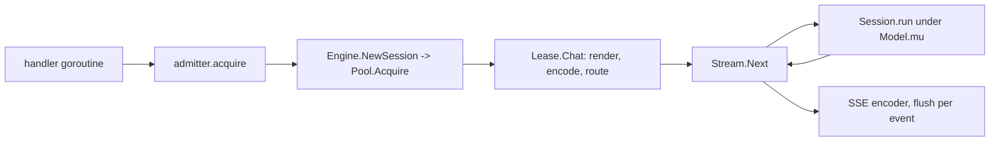
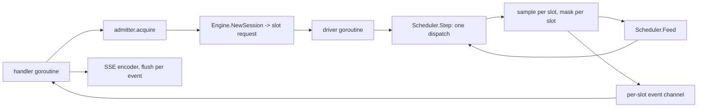

# Batched serving

[008 §9](008-scheduler.md) names three things that are not built, and the third
is this one: **the server does not use the scheduler.** `Model.NewScheduler`
puts a chunked prefill and the decodes beside it in one dispatch
(`scheduler.go:205`, `schedule.go:76`), and nothing under `server/` or `cmd/`
imports it. `grep -rl NewScheduler` finds `scheduler.go`, `scheduler_test.go`
and `leak_test.go`.

What `tgo serve` runs instead is [019](019-session-affinity.md)'s pool: one
`Session` per in-flight request, taken from N reserved sessions
(`server/engine.go:225`, `pool.go:181`), each request running its own forward
pass under the submission lock `Model.mu` (`session.go:639`, 007-D9). So B
concurrent requests read the weights B times per token produced. 008 §1's
arithmetic says what that costs: one step over B sequences moves
$(W + B \cdot A)/\beta$ bytes for weight bytes $W$, per-sequence traffic $A$ and
bandwidth $\beta$, so B separate steps move $B \cdot W$ where one step moves
$W$. Throughput today is what one sequence gets, and
`cmd/tgo/serve.go:534` prints that fact at startup as a note.

This spec replaces the pooled engine with a scheduler engine, and makes a
batched step the default path a request takes.

## 1. What is there now, and what each piece already guarantees

Read this before the design. Every claim below is checked against the code, and
three of them decide the design on their own.

| fact | where | why it decides something |
| --- | --- | --- |
| `NewBatch` refuses a model with no shared block pool | `batch.go:119`, `ErrNoBlockPool` | a scheduler cannot be constructed under `--prefix-cache session` or `off` |
| `m.blocks` is non-nil exactly under `CacheProcess` | `model.go:122` | the batched path and the process scope are the same configuration |
| a step's logits are one buffer per slot, valid until **that slot** steps again | `batch.go:290`, `batchSlot.out` | no per-token copy is needed to feed a stream |
| `Scheduler.Step` is serial under its own lock, and `Batch.Step` takes `Model.mu` | `scheduler.go:205`, `batch.go:366` | there is one driver, and it is a goroutine |
| `Scheduler.Admit` refuses with `ErrNoSlot` rather than waiting | `scheduler.go:92` | admission stays [021](021-admission-queue.md)'s |
| `Batch.Admit` takes the prompt's blocks **and** a reserve, or neither | `batch.go:233` | admission is a memory promise, not a slot count |
| `Batch.Evict` releases the lease and empties the slot's history | `batch.go:263` | a freed slot carries nothing to route to |
| under `ScopeProcess` the seed is `H(scope ‖ "" ‖ salt)` | `internal/prefix/hash.go:28`, `prefix.go:293` | two requests with no `cache_salt` share one domain |
| the sampler is per stream and seeded per request | `stream.go:148`, `sample.New(p.Seed)` | one device RNG for B slots is not the same thing |
| penalties read that slot's own history | `stream.go:279`, `sample/stages.go:138` | a penalty is per slot, whatever runs it |
| the grammar mask is applied before the draw | `stream.go:273`, 015-D2 | the mask is per slot and per position |

## 2. What replaces the pool, and what happens to affinity

The unit a request is routed to becomes a **scheduler slot**: an index in
$[0, B)$ that `Scheduler.Admit` returns and `Scheduler.Finish` gives back
(`scheduler.go:92`, `scheduler.go:128`). A slot is not a conversation. It holds
a prompt, a prefill cursor and a lease on the shared block pool, and
`Batch.Evict` empties all three (`batch.go:263`, `schedule.go:29`).

Affinity has two different answers, and one rule that covered both would be
wrong in one of them.

### 2.1 Under `--prefix-cache process`, affinity stops mattering

Reuse comes from the block pool, which is keyed on chained block hashes and
shared across every slot. `Batch.Admit`'s own comment states the consequence: a
slot "that has never seen these tokens can still find most of them"
(`batch.go:231`). What 019 routed **to** — a session that already held the
prefix — is no longer a place. The prefix is in the pool, and any free slot
reaches it.

So there is no route to choose. A request takes the first free slot, and
`Scheduler.Admit` already does exactly that (`scheduler.go:95`). 019's
`Pool.route` (`pool.go:397`) has nothing to compare: a released slot's history
is `s.history[:0]`.

The salt survives, with its other job. It is not an affinity key here; it is the
isolation domain the block hashes are seeded with, and [§7](#7-the-empty-salt-means-the-opposite-thing-under-a-block-pool)
is what that costs.

### 2.2 Under `--prefix-cache session` or `off`, affinity is all there is

`NewBatch` refuses without a block pool (`batch.go:119`). There is no scheduler
to build, so `WrapPool` stays the engine and 019 is unchanged: a request is
routed to the pooled session holding the longest matching prefix, and the reuse
is that session's own history.

This is not a fallback that was chosen. It is the shape of the dependency:
sequences that step together have different lengths, so a contiguous cache would
pad each of them to the longest, which is the allocation paging exists to avoid
(`batch.go:43`).

## 3. The request path, before and after

Before:

One goroutine per request, and it owns a forward pass.

After:

One goroutine per request, and it owns no forward pass. It reads events.

## 4. Feeding a per-request stream from a shared step

`StepResult.Produced` is one entry per slot that contributed, in slot order,
each carrying that slot's own logits buffer (`scheduler.go:190`, `batch.go:86`).
The lifetime is "until that slot steps again", which `batch.go:290` records as a
rule the author's own test broke within minutes.

That lifetime is exactly long enough. The driver goroutine, between
`Scheduler.Step` returning and the next `Scheduler.Step`, does for each entry:
mask, sample, decode the token to text, and send events on that slot's channel.
The logits are read once, on the goroutine that received them, before the buffer
can be reused. **Nothing per token is copied**: what crosses the channel is a
`tgo.Event`, which is a kind, a block type and a string
(`stream.go:62`) — the same value `Stream.Next` yields today.

The driver owns the loop. It has to: `Scheduler.Step` serializes on the
scheduler's mutex, and `Batch.Step` takes `Model.mu` (007-D9's submission lock),
so a second goroutine calling `Step` would block rather than batch, and the
batching would silently become interleaving again. One goroutine, started when
the engine is built and stopped when it is closed.

The per-request `Stream` becomes a receiver over a buffered channel. The
existing `server.Stream` interface (`server/engine.go:109`) is `Next`, `Event`,
`Usage`, `Err`, and a channel-backed implementation satisfies it without
changing `server/generate.go` at all. That is the seam that makes
[§12](#12-this-is-not-one-pass)'s first sub-scope shippable on its own.

The channel is bounded. A client that stops reading must not let its slot
accumulate an unbounded queue on the driver, so a full channel is a slow
consumer, and a slow consumer is treated as [§6](#6-cancellation-inside-a-dispatch)'s
disconnect after the request's context deadline rather than as backpressure on
every other slot in the batch.

## 5. Per-request sampling into one batched step

Six things are per request and they are not the same kind of thing.

| parameter | where it is today | where it runs after |
| --- | --- | --- |
| temperature, top-k, top-p | `sample/stages.go:74`, host | candidate for the device ([020](020-device-sampling.md)); host until 020 measures it |
| seed | `sample.New(p.Seed)` per stream, `stream.go:148` | host, per slot, always |
| repetition, presence, frequency penalties | `sample/stages.go:138`, over that slot's history | host, per slot, always |
| grammar mask | `stream.go:273`, before the draw (015-D2) | host, per slot, always |
| stop strings and `max_tokens` | `stream.go:301`, `stream.go:322` | host, per slot, always |

The line between the two columns is drawn by one constraint, and it is not
performance. [000 §9](000-decisions.md) and [006 §4](006-sampling.md) make
reproducibility a **stream** property: a seed fixes the sequence of draws for one
request. One device sampler drawing for B slots from one generator makes each
request's draws depend on which other requests were in the batch, which is a
different guarantee with the same name. So whatever 020 puts on the device, the
draw stays per slot and per seed, and what may move is the transform of the
logits before the draw.

The readback is what makes this a decision with a measurement attached rather
than a detail: `Step` returns $B \times V$ floats per step, and
[C3](010-conformance.md) and [C6](010-conformance.md) are `tensor.Sample` and
on-device penalties, both closed. [008 §9](008-scheduler.md) says which of the
two the batched loop runs is 020's to measure. This spec takes the host path,
because the host path is [006-D1](006-sampling.md)'s reference and it is what
exists, and it names the seam so 020 can replace one function.

The grammar mask does not move at all. It is a per-request, per-position
`[]float32` write over the vocabulary derived from that request's position in
its own grammar (`stream.go:273`, `grammar.State`), and there is no batched
form of it upstream. A batched step with four constrained requests applies four
masks, one per slot, on the host.

## 6. Cancellation inside a dispatch

A client disconnects while its slot is inside `Batch.Step`. Three things happen
and they happen at three different times.

1. **The handler answers immediately.** `server/generate.go:56` and
   `server/generate.go:189` already write `errClientGone`'s status when the
   request context is done, and `server/generate.go:143` returns from the SSE
   loop. None of that waits for the device. The 499 rule is unchanged.
2. **The slot is marked, not aborted.** A dispatch in flight holds `Model.mu`
   and cannot be cancelled: accel has no cancel on a submitted queue, and 007-D9
   records that a second submission against a queue mid-flight gets a failed
   fence rather than a race. So the driver marks the slot dead and lets the step
   it is in finish. The tokens that step produces for the dead slot are dropped:
   nothing reads them, and `Scheduler.Feed` is not called for it.
3. **The slot is released at the step boundary.** After `Step` returns, the
   driver calls `Scheduler.Finish(slot)` (`scheduler.go:128`), which calls
   `Batch.Evict` (`batch.go:263`), which releases the prefix lease and empties
   the slot. **The KV blocks go back to the shared pool**, refcounted, so a
   block another live slot still holds is not freed and a block nobody holds
   becomes available to the next admission ([016 §5](016-prefix-cache.md)).

The worst-case hold is therefore one step, not one completion. That is the
difference from today, where 019 §8.3 has the same shape one layer up: a
cancelled request leaves the session's history and length already agreeing,
because they advance together and only after the step returned.

The admission slot ([021](021-admission-queue.md)'s) is released by the
handler's `defer release()` (`server/server.go:133`) as it always was, so the
two releases are independent and neither waits for the other.

## 7. The empty salt means the opposite thing under a block pool

019-D3 and [016 §7.1](016-prefix-cache.md) both say a request carrying no key
"shares with nobody rather than with everybody". Under `Pool.route` that is
true by construction: `e.key != key` skips the entry (`pool.go:404`).

Under the block pool it is false. The seed is `H(label ‖ scope ‖ domain ‖ salt)`
and `domain` is empty for `ScopeProcess` (`internal/prefix/prefix.go:290`), so
every request with no `cache_salt` hashes into one shared domain and two tenants
with the same system prompt seed identically. `server/engine.go:148` already
forwards the request's salt, and the comment there names this case exactly.
`internal/prefix/prefix.go:262` refuses the analogous hole under `ScopeSession`
and there is no matching refusal for the process scope, because there the empty
string is a legitimate single-tenant configuration.

So the server, which does have a per-request identity to hand, supplies one: a
request with no `cache_salt` gets a salt unique to that request, and shares with
nothing. A request that sends `cache_salt` shares with the other requests that
sent the same one, which is what the field is for. That keeps the documented
meaning of "no salt" and keeps [016-D7](016-prefix-cache.md)'s rule that
cross-conversation sharing is a deployment's decision, while still letting the
batched path be the default.

## 8. `--sessions` means two things today and neither of them afterwards

Today `--sessions N` is the pool size, and `cmd/tgo/serve.go:52` states it is
two numbers at once: how many requests may generate at the same time, and how
many conversations keep their key/value cache between turns. `kvAdmission`
(`cmd/tgo/serve.go:329`) divides device memory by `CacheBytesPerSession` to
bound it, and `openServable` (`cmd/tgo/serve.go:260`) sizes a process-scoped
block pool at `sessions * context` positions when the scope asks for one.

Under a scheduler the two numbers come apart, and neither of them is N.

- **How many requests generate at once** is the batch width $B$, which is
  `NewBatch`'s slot count and a leading dimension on every port, fixed for the
  life of the batch (008-D1, `batch.go:114`). It buys throughput and costs
  almost no memory: the per-step ports are $O(\text{rows} + B \cdot V)$
  (`batch.go:161`), not $O(B \cdot \text{context})$.
- **How much conversation state the process holds** is the block pool, in
  positions. It is one number for the whole process, and a long conversation and
  twenty short ones draw from it in proportion to what they use rather than each
  reserving a full context.

Two flags, because they are two costs:

| flag | means | default |
| --- | --- | --- |
| `--slots B` | batch width, and the admission concurrency | 8, or what the pool's positions allow if that is less |
| `--kv P` | shared block pool size, in positions | `slots * context`, which is the bytes `--sessions` reserves today |

`--sessions` is kept as a deprecated alias for `--slots` and prints one line
saying so. Removing it would break every existing command line for a rename.

The startup print changes with it. `cmd/tgo/serve.go:524` prints "N pooled,
reserved now and held until this process exits" and `cmd/tgo/serve.go:534`
prints "without batching, concurrent requests interleave rather than go faster,
and a session's cache is not returned between requests". Both become false. The
report says instead: the slot count, the pool's positions and bytes with the
`kv budget` arithmetic that produced them, the prefill chunk
(`DefaultChunk = 512`, `schedule.go:21`), the reserve policy, the admission
limit and queue, and the prefix-cache scope. The `reserved =` line stays in
shape and changes its terms: what a process holds is one pool, not $N$ caches.

The reserve is not a startup constant. `SchedulerOptions.Reserve` is one number
for the scheduler (`scheduler.go:44`) and `Batch.Admit` takes the prompt's
blocks and the reserve together or not at all (`batch.go:233`), which is what
keeps §3's deadlock out. A single $R$ is either larger than most requests need,
which admits fewer requests than the device holds, or smaller than some request
needs, which is the admission this promise exists to prevent. The request
already carries the number: `Policy.MaxTokens`, or the capacity remaining when
it is unset (`stream.go:134`). So $R$ becomes an argument to `Scheduler.Admit`.

## 9. Migration, and what the default is

`WrapPool` survives. It is the engine under `--prefix-cache session` and `off`,
where no batch can be built, and it is public API a library consumer may already
hold.

The default flips. `tgo serve` with no flags builds the scheduler engine, which
means it opens the model with `CacheProcess` at `slots * context` positions.

The memory profile is the argument against flipping a default, so state what
moves. Today, with no flags, `tgo serve` reserves `adm.Sessions` sessions' cache
at `CacheBytesPerSession` each (`cmd/tgo/serve.go:433`, 019-D2), held until the
process exits. After, it reserves one block pool of the same positions. The
resident bytes are the same number arrived at once instead of $N$ times, and the
`kv budget` line prints the same arithmetic. What changes is that the bytes are
now fungible: a 30k-token conversation and seven 300-token ones fit where
$N$ fixed caches would have refused the first.

What also changes is that answers are no longer bit-for-bit stable across a
restart with a different load, because a reused prefix was computed under a
different prefill shape and floating point is not associative
([016-D6](016-prefix-cache.md)). That is the reason 019 §8.4 left
`--prefix-cache` off by default, and it is the one real cost of this flip.
`--prefix-cache off` remains the way to get the old behaviour, and it now also
means "no batching", which the report says in those words.

## 10. What is preserved exactly

Nothing in this list may change, and each has a test that says so today.

- **The three wire dialects and the legacy route.** `server/server.go:87` binds
  four routes over one neutral `ir.Request`, and this spec touches neither the
  frontends nor `adapt.go`. The engine changes behind `server.Engine`
  (`server/engine.go:20`), which is an interface a fake already implements.
- **`X-Tgo-Loss`.** Set before anything is written (`server/server.go:123`),
  from `lossReport` (`server/loss.go:155`). `honoured`'s invariant is that its
  keys are exactly `tgo.Policy`'s, checked by reflection, and
  `honouredSession` carries `cache_salt` (`server/loss.go:67`). §7's synthesized
  salt is a server-side value and does not change what a request is told: a
  request that sent `cache_salt` still has it subtracted, and one that sent none
  has nothing to report.
- **The refusals by name.** `refuseRaw` (`server/refuse.go:37`) and the checks
  in `adapt.go` are unchanged, `n > 1` included. See
  [§13](#13-what-this-spec-does-not-own).
- **429 with `Retry-After`.** `admitter.overloaded` (`server/admit.go:113`) and
  `retryAfter` (`server/admit.go:121`). [021](021-admission-queue.md) owns the
  queue; this spec owns only that the scheduler engine does not add a second
  unbounded wait behind it. 019 §8.6 is the incident that rule comes from.
- **The 499 rule.** A client that hangs up gets `errClientGone`'s status written
  rather than a synthesized 200 with an empty body, on all three paths that can
  reach it (`server/generate.go:56`, `:143`, `:189`).

## 11. Tests

The handler tests run against a fake engine and need no device
([009-D4](009-server.md)); the scheduler tests decide from integers
(`schedule.go:29`). The two end-to-end rows below need a real model, which is
what `server/e2e_test.go` and `e2e_test.go` already do with a synthetic one.

| test | what it asserts |
| --- | --- |
| `TestTwoRequestsShareOneForwardPass` | two concurrent requests over one scheduler engine produce their tokens from **one** `Scheduler.Step` per token pair. Read from a `bench.Recorder`, not a clock: `bench.Step.Batch` is 2, and the step count is half the token count. `stream.go:315` sets `Batch: 1` today, so the field exists and is always 1, which is the number this test moves. End to end, through the real handler |
| `TestADisconnectFreesItsSlot` | a client disconnects mid-completion; the slot is free for a new admission within one step, and the block pool's free count returns to what it was before the request. Asserted as a postcondition on the scheduler, and over the wire with a cancelled request context |
| `TestBatchedThroughputBeatsSerial` | B concurrent requests on the scheduler engine produce more tokens per step than B on `WrapPool`. The claim in 008 §1, measured on the synthetic model |
| `TestEachRequestKeepsItsOwnSeed` | two requests in one batch, same prompt, different seeds, produce different token sequences; same seed reproduces the sequence a single-request run gives. §5's constraint |
| `TestPerSlotGrammarMask` | one constrained and one unconstrained request in the same batch; the constrained one's output parses against its schema and the unconstrained one is unaffected |
| `TestPenaltiesReadOnlyTheirOwnSlot` | a request with a repetition penalty in a batch beside a request repeating the same token produces the tokens it produces alone |
| `TestNoLogitsCopyPerToken` | the driver reads each slot's `Produced.Logits` before that slot steps again. Asserted by a fake batch that poisons a slot's buffer on its next step, which fails if the driver held the slice |
| `TestASlowConsumerDoesNotStallTheBatch` | a client that stops reading does not block another slot's tokens. The bounded channel of §4 |
| `TestUnsaltedRequestsDoNotShareBlocks` | two requests with no `cache_salt` and the same prompt: the second one's `CachedPromptTokens` is zero. §7, and the mirror of `TestAnUnsaltedRequestDoesNotReadASaltedSession` |
| `TestSaltedRequestsShareBlocks` | the same two requests with the same `cache_salt`: the second reuses. Without this row the one above passes by disabling the cache |
| `TestSchedulerEngineRefusesWithoutABlockPool` | `--prefix-cache session` and `off` build `WrapPool`, and 019's tests still pass over it unchanged |
| `TestAdmissionAboveTheSlotsIsRefused` | `server.New`'s check (`server/server.go:78`) still refuses a concurrency above what the engine can run at once, with the slot count in place of the pool size |
| `TestServeReportNamesTheSlotsAndThePool` | the startup print's numbers are the ones the process built, read from the server rather than from the flags. The shape `TestServePoolSizeIsTheAdmissionLimit` already has |
| `TestTheFourDialectsAreUnchanged` | the existing golden round-trips in `server/dialect_test.go` pass against the scheduler engine, unmodified |
| `TestLossHeaderIsUnchanged` | `server/loss_test.go`'s cases against the scheduler engine |
| `TestCancelledSlotProducesNoTokens` | the step a dead slot was inside finishes, and nothing it produced reaches a channel or advances a grammar |

## 12. What could go wrong

**Head-of-line blocking.** `nextStep` places every mid-prefill slot's chunk
before any decode (`schedule.go:86`), and rows are finite: a step's rows are the
pool's positions (`batch.go:194`) and decodes take what is left (`schedule.go:101`).
So a batch with several slots prefilling can leave a decoding slot out of a
step. `schedule.go:75` states the policy: a sequence left out waits a step, and
is not evicted. The bound is real but it is a bound on latency, not on progress,
and it is worth naming in the report rather than hiding: the mix is already
reported per step as `StepResult.PrefillTokens` and `Decodes`
(`scheduler.go:196`), and those two are what a new metric should carry.

**A long prompt stalling the decodes.** This is the case chunked prefill answers,
and the answer is specific. A 30k-token prompt is not one dispatch; it is
$\lceil 30000/512 \rceil$ steps of at most `DefaultChunk` prompt tokens each
(`schedule.go:91`), and **each of those steps also carries the decodes**
(`schedule.go:101`), in one dispatch, because the ragged step lets sequences
contribute different token counts ([C16](010-conformance.md)). So a decoding
request's worst-case wait is one chunked step rather than a whole prefill, and
the prefill does not pay for its own weight read: the weights are read once for
the chunk and the decodes together. What remains is the chunk's own cost per
step, and that is `--chunk`'s trade, which `schedule.go:11` states: larger is a
better GEMM and a longer step.

**Memory.** Three distinct risks.

- The block pool is finite, and `prefix.ErrExhausted` (`internal/prefix/prefix.go:54`)
  means "this request does not fit the pool as it stands". `Scheduler.Admit`
  deliberately reports it apart from `ErrNoSlot` (`scheduler.go:88`), because a
  server that reported one number for both would be indistinguishable from a
  slow one. The engine must keep them apart: `ErrNoSlot` is a wait,
  `ErrExhausted` is an eviction decision or a 429.
- Eviction is a recompute (008-D2). A preempted sequence drops its blocks and
  re-prefills, so a pool under pressure can thrash: admit, evict, re-prefill,
  evict. `victim` is last-arrived-first-evicted (`schedule.go:128`), which
  bounds the damage to the newest request rather than spreading it, and the
  eviction rate is the metric that says whether the pool is too small.
- The per-step logits port is $B \times V$ floats on the device and the same on
  the host (`batch.go:169`, `batch.go:176`). At a 150k vocabulary and B=16 that
  is 9.6 MiB per side, read back every step. It is the cost [020](020-device-sampling.md)
  is measuring against.

## 13. What this spec does not own

- **The admission queue and the 429.** [021](021-admission-queue.md). This spec
  consumes it and must not add a second wait behind it.
- **Sampling on the device.** [020](020-device-sampling.md). This spec fixes the
  seam and takes the host path.
- **`n > 1`.** `server/refuse.go:50` refuses it and says it "needs batching".
  Batching is necessary and not sufficient: a shared prompt with $n$
  continuations is $n$ slots with $n$ divergent histories and one usage report,
  which is a dialect-level design. It stays refused, and the refusal's wording
  should stop pointing at 008.
- **Eviction policy.** 008-D5 and `victim` are 008's.
- **The chat template, the tokenizer, the three dialects and the mapping in
  `adapt.go`.** Unchanged.
- **Multi-model routing, authentication, per-key limits.** [009 §7](009-server.md).

## 14. This is not one pass

**It cannot be executed completely in one pass by one person.** It changes the
engine, the flags, the startup report, the streaming path and the default
memory profile, and two of its dependencies are being written beside it. Cut it
into three, in this order.

1. **The scheduler engine, opt-in, host sampling.** A new `server.Engine`
   implementation over `Model.NewScheduler`, the driver goroutine, the
   channel-backed `server.Stream`, per-slot sampling and masking. Selected by a
   flag, default off. Nothing about `--sessions`, the report, or the default
   changes. Ships behind the existing `Engine` interface, so `server/generate.go`
   and every dialect test are untouched. This is the pass that can be verified
   on its own: `TestTwoRequestsShareOneForwardPass` passes at the end of it.
2. **Cancellation, the flags, and the report.** Step-boundary slot release, the
   synthesized salt, `--slots` and `--kv`, the deprecated `--sessions`, the
   per-request reserve, and the startup print. `TestADisconnectFreesItsSlot` and
   `TestServeReportNamesTheSlotsAndThePool` are this pass's gates.
3. **The default, and the device path.** Flip `tgo serve` to the scheduler
   engine, with [020](020-device-sampling.md)'s measurement deciding what moves
   off the host. Last, because a default is the change that cannot be tested
   only by the person making it.

## Outcome

Pass 1 of [§14](#14-this-is-not-one-pass) shipped 2026-08-28, opt-in behind
`--batched` and off by default. `tgo.Runner` is the scheduler, the
[021](021-admission-queue.md) queue in front of its admission, and the one
goroutine that drives them; `tgo.SlotStream` is a request's completion read from
the batch that produced it; `server.WrapRunner` adapts it to `server.Engine`.

**What shipped**, section by section. §2's unit is a scheduler slot and there is
no route to choose, because reuse comes from the block pool and any free slot
reaches it. §3's driver goroutine is `Runner.drive`: one `Scheduler.Step`, then
mask, sample and events for every slot it carried. §4's per-request stream is a
receiver over a bounded channel and satisfies `server.Stream` unchanged, so
`server/generate.go` and every dialect test are untouched. §5's six per-request
parameters all stay on the host, per slot, which is 022-D4. §6's step-boundary
release is built: a caller that hangs up or closes marks its slot, the dispatch
it is inside finishes, and `Scheduler.Finish` returns the blocks to the shared
pool. §10's preservation list is checked over the batched engine for the four
routes and their streaming forms, the admission refusal, and `cache_salt`.
§11's gate, `TestTwoRequestsShareOneForwardPass`, passes at both layers.

**What diverged** from the design, and why the code is right.

- **The decode loop was extracted before anything was built.** §5 names the seam
  and the code had no such seam: `Stream.advance` ran the forward pass and then
  turned the row into events in one function, half of it reaching through the
  session. `decoder` is now the second half — the grammar mask, the sampler, the
  detokenizer, the stop strings, the events and the stopping decision — and
  `Stream` and `SlotStream` share one copy of it. Writing the batched decode
  loop beside the single one would have made a sampling bug and a batching bug
  indistinguishable, which is [008-D8](008-scheduler.md) one layer up.
- **The runner is in package `tgo`, not in `server`.** §3's driver is drawn
  inside the server and it cannot live there: the decode machinery is
  package-private, so a driver under `server/` would need a second copy of it,
  which is the thing the extraction above exists to prevent. `server` holds the
  adapter and nothing else.
- **What crosses the channel is a step, not a `tgo.Event`.** §4 says an event.
  A step can produce several, and the log probabilities belong to the step:
  [030-D1](030-logprobs.md) reuses the backing array across steps, so handing
  that slice to another goroutine is a race rather than a lifetime. One slice
  header per step that produced anything is what it costs; the strings inside
  the events were already allocated by the detokenizer.
- **A slow consumer is dropped when its channel fills, not after its context
  deadline.** §4 says the second. The driver cannot wait for a deadline without
  becoming the backpressure the bound exists to prevent, so the drop is
  immediate and the request is told why: `ErrSlowConsumer`, rather than a stream
  that ends in silence. `RunnerOptions.Backlog` is the bound, and it is an
  option rather than a constant because it is the one place a slot's memory and
  a client's tolerance trade against each other.
- **`bench.Step`'s four terms are measured on the batched path, and §11's gate
  needed a new accessor.** [017 §1](017-benchmarks.md) treats the four as
  exhaustive, so a batched loop recording a wall clock under one of their names
  would report a device cost as host time. `Batch.step` and `Scheduler.step`
  now measure submit, device and readback the way `Session.run` does, and the
  host term is the subtraction. `bench.Recorder.Steps` was added because the
  batch width is the field §11 reads and a quantile has no place for it.
- **§11's `TestPerSlotGrammarMask` and `TestPenaltiesReadOnlyTheirOwnSlot`
  cannot compare a batched completion against the same request run alone**, and
  the first draft of both did. A reused prefix was computed under a different
  prefill shape and floating point is not associative
  ([016-D6](016-prefix-cache.md)), which is the cost §9 names. So the grammar
  row runs **two different schemas** in one step and asserts each output against
  its own — a shared grammar state would still let one mask look correct — and
  the penalty row asserts that two policies alike but for the penalty disagree.
- **The flag is `--batched`.** §8's `--slots` and `--kv` are pass 2, and pass 1
  changes no existing flag. `--batched` implies `--prefix-cache process`
  (022-D1) rather than failing later with an error about a pool the operator
  never mentioned, and an operator who asked for another scope is told the two
  cannot both hold rather than having theirs overwritten. The two lines of the
  startup report that stop being true under a batch — what the number counts,
  and what concurrency buys — change with it; the rest of §8's report is pass 2.
- **The reserve is capped at half the context.** §3's $R$ is one deployment
  number until 022-D7, and `tgo.DefaultReserve` of 512 exceeds a short context —
  a reserve larger than the context admits nobody, because
  $\lceil (T+R)/B \rceil$ is then more blocks than one sequence's share of the
  pool. `serveReserve` is the cap and it is stated where an operator can read
  the arithmetic.
- **The runner does not evict**, so [021](021-admission-queue.md)'s `Ticket`
  has no caller yet and `Runner` does not expose one. Readmission at an original
  arrival stamp is designed, tested in 021 and unreachable from here until
  something calls `Scheduler.Evict`.

### Pass 2

Shipped 2026-08-29. [§7](#7-the-empty-salt-means-the-opposite-thing-under-a-block-pool)'s
per-request salt, 022-D7's per-request reserve,
[§8](#8-sessions-means-two-things-today-and-neither-of-them-afterwards)'s
`--slots` and `--kv` with `--sessions` as the deprecated alias, and
[019 §8.6](019-session-affinity.md)'s refusal turned off for the engine that no
longer needs it.

**§7 was a live isolation hole and its test measures it.** Without the minted
salt, `TestUnsaltedRequestsDoNotShareBlocks` reuses **128 positions** of another
request's prompt — the second caller's first token arrives fast, which is a
membership test over the first one's prompt.

**What diverged**, and why the code is right.

- **The runner mints the salt, not the server.** §7 puts it in the server on the
  argument that the server has a per-request identity. So does every other
  caller of a `Runner`, and leaving it to the server leaves all of them with the
  hole — which is the shape `server.Wrap` already had once, when it dropped
  `cache_salt` for a week and nothing noticed. 022-D8's conclusion is kept and
  its placement is superseded.
- **The minted salt carries sixteen random bytes, not a counter.** A caller's
  salt is used verbatim, so a predictable namespace is one a request can name
  and share into. `TestAMintedSaltCannotBeNamed` is the case.
- **019 §8.6's refusal is conditional, not removed.** §4 says it "stops being
  necessary"; it stops being necessary *for an engine that queues*. A pooled
  engine still makes the surplus wait inside `NewSession` where this package
  neither counts it nor times it out, so `server.New` still refuses that
  configuration and now accepts a concurrency above the slot count for a
  `queuedEngine`.
- **Turning it off needed the engine's refusals on the wire first.**
  `sessionError` gained three classes: a full queue and an elapsed budget are
  429 with the Retry-After the engine's own budget promises, and a client that
  hung up while queued is a 499 rather than a failure. Without that, dropping
  the refusal would have turned a bounded wait into a 500.
- **`Scheduler.Feasible`'s door refusal wraps `ErrContextExhausted` as well as
  `prefix.ErrExhausted`.** What it means to a caller is that this request does
  not fit and never will, which is the same answer a session gives a prompt
  larger than its cache — and it is what a layer above turns into a refusal
  rather than a wait.
- **The default slot count differs by engine**: eight batched, four pooled. §8
  names 8 and that is the batched number; a pooled session reserves a whole
  context of key/value cache where a batched slot reserves a page table, so one
  default for both would be generous for one and wasteful for the other. The
  report prints which one the deployment got.
- **`serveReserve` survives 022-D7 as a floor.** The runner passes each
  request's own budget, so the deployment number is now only what a caller that
  names none gets — and `NewScheduler` refuses a zero, so there has to be one.

**Not built.** Pass 3 of [§14](#14-this-is-not-one-pass): the default flip, and
[020](020-device-sampling.md)'s measurement deciding what moves off the host.
[020 §8](020-device-sampling.md)'s gate is a curve on a Qwen3-0.6B f16
checkpoint that is not on this machine, so pass 3 waits on that rather than on
work here.

*Rows of [§11](#11-tests) still not written*: `TestBatchedThroughputBeatsSerial`,
which is [027](027-batched-benchmarks.md)'s instrument rather than a unit test;
`TestNoLogitsCopyPerToken`, which needs a fake batch that poisons a slot's
buffer; and `TestCancelledSlotProducesNoTokens`, asserted here as a
postcondition on the scheduler rather than on a grammar. §7's pair is written.

## Decision record

| id | decision | rejected | consequence |
| --- | --- | --- | --- |
| 022-D1 | The engine is selected by the cache scope: `process` builds the scheduler engine, `session` and `off` build `WrapPool`. | One engine that batches in every scope. `NewBatch` refuses a model with no shared block pool (`batch.go:119`), so there is nothing to build. | The batched path and the process scope are one configuration, and §9's default flip is also a scope flip. |
| 022-D2 | Affinity is not carried onto slots. Under `process` a request takes the first free slot; under `session` and `off` 019's routing is unchanged. | Porting `Pool.route` onto slots. `Batch.Evict` empties a slot's history (`batch.go:263`), so a freed slot holds nothing to match against, and the prefix is in the pool rather than in the slot (`batch.go:231`). | 019's `Pool` stays in the tree for the two scopes that need it, and is not extended. |
| 022-D3 | One driver goroutine calls `Step`, samples every slot, and sends `tgo.Event` values on per-slot bounded channels. The request goroutine never sees logits. | A goroutine per slot calling `Step`. `Scheduler.Step` serializes on its own mutex and `Batch.Step` takes `Model.mu` (007-D9), so B goroutines would interleave rather than batch, which is the current behaviour with more machinery. | No per-token copy: `Produced.Logits` is read on the goroutine it arrived on, inside its "until that slot steps again" lifetime (`batch.go:290`). |
| 022-D4 | The seed, the penalties, the grammar mask, the stop strings and the draw stay on the host, per slot. Only the logit transform before the draw is a candidate for [020](020-device-sampling.md). | One device sampler drawing for the whole batch. [000 §9](000-decisions.md) and [006 §4](006-sampling.md) make reproducibility a stream property, and a shared generator makes a request's draws depend on which other requests were batched with it. | The $B \times V$ readback stays until 020 measures the alternative, which is what [008 §9](008-scheduler.md) asks for. |
| 022-D5 | Cancellation is honoured at the step boundary: the slot is marked dead, the in-flight dispatch finishes, `Scheduler.Finish` releases it and its blocks return to the pool. | Aborting the dispatch. accel has no cancel on a submitted queue, and 007-D9 records that submitting against a queue mid-flight gets a failed fence rather than a race. | The worst-case hold on a slot is one step. The 499 is written by the handler immediately and independently (`server/generate.go:56`). |
| 022-D6 | `--slots B` is the batch width and `--kv P` is the block pool in positions. `--sessions` becomes a deprecated alias for `--slots`. | Keeping `--sessions` with a third meaning. It is already two numbers (`cmd/tgo/serve.go:52`) and under a scheduler it is neither of them, so reusing the name would make the report unreadable. | The startup print loses the "without batching" note and the per-session `reserved` line, and gains the pool, the chunk and the reserve. |
| 022-D7 | The reserve $R$ becomes an argument to `Scheduler.Admit`, taken from the request's effective `max_tokens`. | A startup `--reserve` constant. One $R$ either over-admits, which is the deadlock §3 exists to prevent, or under-admits, which is a server that quietly runs fewer requests than the device holds. | `SchedulerOptions.Reserve` becomes a default rather than the value, and `Scheduler.Admit`'s signature changes. |
| 022-D8 | A request with no `cache_salt` gets a per-request salt, so it shares with nothing. | Passing the empty string through. Under `ScopeProcess` the seed's domain is empty (`internal/prefix/prefix.go:290`), so every unsalted request hashes into one domain, which is the opposite of what 019-D3 and [016 §7.1](016-prefix-cache.md) promise. | Cross-request block reuse happens only where a caller asked for it, so batching can be the default without [016-D7](016-prefix-cache.md) becoming one. |
| 022-D9 | `tgo serve` defaults to the scheduler engine. `WrapPool` survives behind `--prefix-cache session` and `off`. | Leaving the default at `WrapPool`. Throughput then stays at what one sequence gets, which is the gap this spec exists to close, and an opt-in flag is a feature most deployments never find. | The resident bytes do not move (one pool of `slots * context` instead of $N$ caches of `context`), and they become fungible. Answers stop being bit-for-bit stable across differing load ([016-D6](016-prefix-cache.md)), which `--prefix-cache off` restores. |
| 022-D10 | The work is built in three passes: engine opt-in, then cancellation and flags, then the default and the device path. | One pass. It changes the engine, the flags, the report, the streaming path and the default memory profile at once, and a review that cannot separate a batching bug from a flag bug is the failure 008-D8 names one layer down. | Each pass has a named gate test, and pass 1 changes no default and no public flag. |
