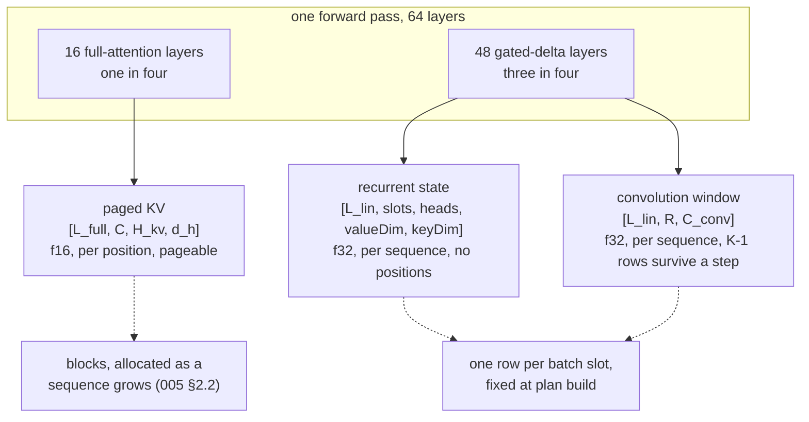

# A cache per layer kind

[005](005-kv-cache.md) has one shape for every layer:
`model/graph.go:229` declares `[L, C, H_kv, d_h]` once for the whole model and
`model/qwen3_graph.go:88` takes layer $\ell$'s window out of it. That holds for a
dense transformer, where every layer caches the same thing.

A Qwen3.8 hybrid holds **three** things at once, and one forward pass touches
all three. This spec designs the allocation, the addressing and the sizing
arithmetic for them. It is the first child of [018](018-hybrid-models.md) and
the one 024 and 025 wait on: nothing can parse the `qwen3_5` architecture into a
graph until the graph knows what to declare.

## 1. The three shapes

`full_attention_interval: 4` over `num_hidden_layers: 64` gives 16
softmax-attention layers and 48 gated-delta layers
([018 §1](018-hybrid-models.md)). Each gated-delta layer carries **two** states:
the recurrent matrix and the rolling window of the depthwise causal convolution
in front of it.

| kind | layers | shape | grows with $T$ | addressed by |
| --- | --- | --- | --- | --- |
| paged KV | 16 | $[L_\text{full}, C, H_{kv}, d_h]$ | yes | page table, per position |
| recurrent | 48 | $[L_\text{lin}, B, H_\text{lin}, d_v, d_k]$ | no | batch slot, compile-time layer, runtime nothing |
| convolution window | 48 | $[L_\text{lin}, R, C_\text{conv}]$ | no (only $K-1$ rows survive) | u32 index ports, per row |

The last column is the distinction [018-D3](018-hybrid-models.md) named and this
spec makes concrete: paged KV is **address-shaped**, the recurrent state is
**slot-shaped**, and the window is address-shaped over rows that are not
positions.

## 2. Three states, not one union

**[023-D1]** Three `tensor.State` objects, one per kind, each declared once for
the whole model with a leading axis over **its own kind's** layer count, and
sliced with `tensor.LayerState`.

A union — one state object carrying a tag and the widest shape — was rejected on
two grounds, and only the second is about taste. `tensor.LinearAttention` checks
the state's shape against `[slots, heads, valueDim, keyDim]` exactly
(`tensor/linear.go:136`) and its dtype against f32 (`tensor/linear.go:144`), so
a union would have to be reshaped and re-typed at every call site, which is
where [C25](010-conformance.md) already cost an hour. And a tag read at record
time is a branch the graph does not need: the layer schedule is known when the
graph is recorded, so the kind is a compile-time property of the layer index.

One state per layer was rejected for the reason [C12](010-conformance.md)
records: 2 states, not 72. Here it would be 32 + 48 + 48.

**The leading axis is the kind-local ordinal, not the model layer index.**
The $n$-th gated-delta layer is `LayerState(b, s, n)` with $n < 48$, not
`LayerState(b, s, m)` at its model layer index $m$.
Sizing the leading axis at 64 and indexing by the model layer would allocate
$64/16 = 4\times$ the KV and $64/48 = 1.33\times$ each recurrent state for rows
nothing reads. The layer-kind schedule that maps one to the other is 024's.

### 2.1 The slot count is not a free parameter

`tensor.LinearAttention` requires the state's leading extent to equal the number
of entries in `QueryExtents` (`tensor/linear.go:136-142`). So the recurrent
state's slot count **is** the plan's batch size $B$, exactly — not a pool that
$B$ sequences index into. §5 is what follows from that.

Two consequences for `model.Declare`:

- `PortExtents` is declared only when `batch > 1` today
  (`model/graph.go:225-227`), because softmax attention over one sequence does
  not need it. `LinearAttention` requires `QueryExtents` at every batch size, so
  a hybrid graph declares the port at $B = 1$ as well, holding `[T]`.
- The three states are declared from the layer schedule rather than from
  `c.NumLayers`, which is the one place `Declare` learns that a model is hybrid.

### 2.2 16 key heads against 48 value heads is one head count, not three

**[023-D7]** Qwen3.8's `linear_num_key_heads: 16` and
`linear_num_value_heads: 48` are recorded as $H_\text{lin} = 16$ heads with
$d_k = 128$ and $d_v = 3 \times 128 = 384$.

The recurrence is row-separable in the value dimension. With $S$ shaped
$[d_v, d_k]$ and $u = Sk$:

$$S[r,:] \leftarrow \alpha\,S[r,:] + \beta\,(v[r] - u[r])\,k[:], \qquad
o[r] = S[r,:]\cdot q$$

Row $r$ reads row $r$, $k$, $q$, $\alpha$ and $\beta$ and nothing else. Three
value heads sharing one key head are therefore three disjoint row bands of one
$[384, 128]$ state, and stacking them is an identity rather than an
approximation.

**Rejected:** replicating $q$ and $k$ to 48 heads with
`Reshape → Broadcast → Contiguous → Reshape`. It is expressible, it is the
familiar GQA repeat, and it costs three operators and a $[T, 6144]$ copy per
layer over 48 layers to compute the same numbers. The byte count is identical
either way — $16 \cdot 384 \cdot 128 = 48 \cdot 128 \cdot 128$ — so this buys
dispatches, not memory.

## 3. The slots axis on the convolution window

`nn.ConvState`'s comment says the window is `[slots, K-1+T, C]`
(`nn/linear.go:131`). **The code is one slot.** `nn/linear.go:220` slices axis 0
of the window to take tap $i$'s rows, and `nn/linear_test.go:213-215` builds the
state as `[K-1+T, C]` — two dimensions. The slots axis is work this spec owns,
and putting it in as a real tensor axis does not work:

`tensor.ScatterRows` computes one row's width as
`s.shape.Elements() / s.shape[0]` (`tensor/state.go:238`). On a
`[slots, K-1+T, C]` state that width is $(K-1+T) \cdot C$: a "row" is a whole
slot, and writing a token's $C$ values needs a state whose leading axis is what
you address. `tensor.Slice` takes compile-time bounds, so the per-tap read
cannot select a slot at runtime either.

**[023-D2]** The window is flat — $[R, C_\text{conv}]$ per gated-delta layer —
and the slot axis is **arithmetic in the u32 index ports**, exactly as paging is
arithmetic in `slots` ([005 §2.2](005-kv-cache.md), `plan.go:161`). The per-tap
read becomes `GatherRows` instead of `Slice` + `Contiguous`.

Layout, for a step of $T$ flat token rows over $B$ slots:

$$R = B\,(K-1) + T$$

Rows $0 \ldots B(K-1)-1$ are the carry: slot $j$ owns
$j(K-1) \ldots j(K-1)+K-2$, holding the $K-1$ inputs before this step. Rows
$B(K-1) \ldots R-1$ are this step's tokens, in the same flat order $q$ is in.
For output row $r$, which is local position $p$ of slot $j$, tap $i$ reads

$$\text{idx}_i(r) = \begin{cases}
j\,(K-1) + (K-1) + (p - K + 1 + i) & p - K + 1 + i < 0 \\[2pt]
B\,(K-1) + \text{start}_j + p - K + 1 + i & \text{otherwise}
\end{cases}$$

which the host computes from the same extents it already builds for
`PortExtents`. The composition becomes: one `ScatterRows` of $x$ into the token
region, one `ReadState`, $K$ `GatherRows` at the $K$ index ports, $K$ broadcast
taps, $K-1$ adds, and one `GatherRows` + `ScatterRows` for the carry.

**No accel operator tgo does not have.** `ScatterRows` (`tensor/state.go:205`),
`GatherRows` (`tensor/ops.go:50`), `Mul`, `Add`, `Broadcast` and `Contiguous`
all exist, and the carry path in `nn.DepthwiseCausalConv` already runs
`GatherRows` over a state read. So [000-D1](000-decisions.md)'s sequence does
not start here — there is nothing to file — and the register keeps
[C26](010-conformance.md) as it stands: one kernel to *want*, none to be blocked
on.

The cost against today's composition is a u32 read per gathered row. A
`Slice` + `Contiguous` already copies $[T, C_\text{conv}]$ per tap; a gather
copies the same bytes through an index. §10's dispatch-count assertion is what
keeps that claim honest.

**Two properties this layout inherits for free.** `GatherRows` writes zeros for
an index at or above the table's capacity (`tensor/ops.go:80-88`), and
`ScatterRows` drops a write at or above capacity — the rule
[007-D3](007-engine.md) already uses for a bucketed prefill's pad rows. So a pad
row's tap index is $R$ and its write index is $R$: it reads zeros, writes
nothing, and needs no mask. That is the same shape [C23](010-conformance.md)
gave the ragged step.

### 3.1 One probe before this is built

`GatherRows` over a **`LayerState` view** is not proven. [C12](010-conformance.md)
closed on `Attention` and `ScatterRows` binding a layer view; the gather in
`nn.DepthwiseCausalConv` runs over a whole state, not a slice of one. The first
work item is a value probe: gather known rows out of layer 3 of a
$[L_\text{lin}, R, C]$ state and check they are layer 3's. If it fails, that is
a register row and an issue under [000-D1](000-decisions.md), and §12's split
applies.

## 4. What a block reserves, and what admission counts

**[023-D3]** A block reserves KV for the **16 full-attention layers only**. The
recurrent state and the convolution window are reserved per plan slot when the
plan is built, and are not part of admission arithmetic at all.

Pricing a block over all 64 layers was rejected because it is simply wrong by
$4\times$: three layers in four write no KV, and a scheduler that reserved for
them would refuse admissions a device has room for. From
[005 §3](005-kv-cache.md)'s formula with $L \to L_\text{full}$:

$$M_\text{block} = 2 \cdot L_\text{full} \cdot B_\text{blk} \cdot H_{kv} \cdot d_h \cdot w$$

At $L_\text{full} = 16$, $H_{kv} = 4$, $d_h = 256$, $w = 2$ (f16) and
`CacheBlock = 32` (`blocks.go:28`), a block is **2 MiB** where the dense
equivalent over 64 layers would be 8 MiB.

**What replaces the arithmetic that a block no longer carries is a count.**
§2.1 fixes the recurrent state's slot count at the plan's $B$, so a hybrid's
concurrency ceiling is $B$ and not the pool: a sequence with blocks but no slot
cannot step its 48 recurrent layers at all. For a dense model
[008-D3](008-scheduler.md)'s reservation is the binding constraint and $B$ is a
ceiling reached only when the pool is large; for a hybrid the two swap places,
because the per-position cost fell $4\times$ and the per-slot cost did not fall
at all.

So admission for a hybrid is two checks rather than one:

1. a free scheduler slot — **and it is now the scarce one**;
2. blocks for the prompt plus [008-D3](008-scheduler.md)'s answer space, priced
   over $L_\text{full}$.

## 5. Width

**[023-D4]** The recurrent state is **f32** and the convolution window is
**f32**. The paged KV pool stays f16 (`blocks.go:88`).

For the recurrent state this is not a preference and not a choice:
`tensor.LinearAttention` refuses any other dtype (`tensor/linear.go:144`). The
numerical argument behind that refusal is the one the checkpoint also makes with
`mamba_ssm_dtype: "float32"` ([018 §1](018-hybrid-models.md)), and it is the
argument [C5](010-conformance.md) does **not** apply here. K and V are operands:
a score accumulates in f32 whatever they are stored as, so narrowing them costs
one rounding per element read. The recurrent state is an **accumulator**: it is
multiplied by $\alpha_t \in (0,1)$ and added to once per token, and at 262144
tokens that is a chain of 262144 roundings whose error compounds rather than
cancelling. f16 carries 11 significand bits; a state decayed and rewritten a
quarter of a million times has no bits left that describe the early prefix.

The convolution window is f32 because it holds **activations the graph
computed**, and an f16 window would round them on the way in. `ScatterRows`
requires the rows and the state to share a dtype (`tensor/state.go:224-229`), so
narrowing it puts a `Cast` on every gated-delta layer's projection, and what that
projection feeds is a recurrence accel will not run in anything but f32 — the
rounding would be taken and then immediately widened again.

The saving is not negligible: halving the window halves §6's $M_\text{conv}$,
which is 0.49 GiB at a 512-token chunk. It is refused because **the same bytes
are available without rounding anything**. Only $B(K-1)$ of $R$ rows persist —
45 MiB of 0.98 GiB — and the rest is scratch proportional to the chunk, so
halving the chunk buys what halving the width would have bought and costs
latency instead of precision. That is the trade [008 §5](008-scheduler.md)
already owns.

**Rejected for both:** f16, on the symmetry argument with the KV pool. The
symmetry does not hold — one is an operand read once per position, the other two
are values written and re-read every step.

## 6. The arithmetic

Per position, over the full-attention layers only:

$$M_{kv} = 2 \cdot L_\text{full} \cdot C \cdot H_{kv} \cdot d_h \cdot w$$

Per slot, per gated-delta layer, for the recurrent state:

$$M_\text{rec} = H_\text{lin} \cdot d_v \cdot d_k \cdot 4$$

For the whole convolution window, over all slots and all gated-delta layers:

$$M_\text{conv} = L_\text{lin} \cdot \big(B(K-1) + T\big) \cdot C_\text{conv} \cdot 4$$

For Qwen3.8-27B — $L_\text{full} = 16$, $L_\text{lin} = 48$, $H_{kv} = 4$,
$d_h = 256$, $H_\text{lin} = 16$, $d_k = 128$, $d_v = 384$, $K = 4$ — at $w = 2$:

| | per position | at $C = 32768$ | at $C = 262144$ |
| --- | --- | --- | --- |
| KV, f16, hybrid | 64 KiB | 2 GiB | 16 GiB |
| KV, f16, if all 64 layers cached | 256 KiB | 8 GiB | 64 GiB |

| | per slot | at $B = 8$ |
| --- | --- | --- |
| recurrent, f32, per layer | 3 MiB | 24 MiB |
| recurrent, f32, 48 layers | 144 MiB | **1.13 GiB** |
| convolution carry only, $K-1$ rows | 5.6 MiB | 45 MiB |
| convolution window, $T = 512$ chunk | — | **0.98 GiB** |
| convolution window, decode plan, $T = B$ | — | 60 MiB |

$C_\text{conv}$ is the width the convolution runs over. The numbers above assume
the concatenated $q$, $k$ and $v$ projections,
$2 \cdot 16 \cdot 128 + 48 \cdot 128 = 10240$; **024 reads it from the
checkpoint's conv weight** rather than deriving it, and every conv row of this
table scales linearly with it.

Three readings, in the order they matter:

1. **The two new states cost about 2 GiB and do not move with context.** At 262K
   the KV of one full-context session is 16 GiB. The hybrid's saving is the 48
   GiB the other three layers in four would have cost.
2. **The convolution window is dominated by the step, not by the carry.** 45 MiB
   persists and 0.94 GiB of it is scratch that exists because the token rows must
   sit in the same table the taps gather from (§3). It is proportional to the
   prefill chunk, so the chunk size in [008 §5](008-scheduler.md) is a memory
   parameter for a hybrid where it was a latency parameter for a dense model.
   024 picks the number; this spec only says which formula it lands in.
3. **1.13 GiB of recurrent state is charged whether the slots are busy or idle**,
   because §2.1 fixes the leading axis at $B$. That is the cost of the ceiling
   §4 describes.

## 7. Eviction and release

**[023-D5]** Evicting a slot destroys its recurrent state and its carry rows
outright, and **[008-D5](008-scheduler.md)'s victim choice does not change.**

There is nothing to release: the recurrent state is $B$ rows and the next tenant
of slot $j$ overwrites row $j$. There is also nothing partial to keep. A KV cache
evicted block by block still has a *prefix* that means something, which is what
[016](016-prefix-cache.md) sells. A recurrent state has no positions
([018 §2.1](018-hybrid-models.md)), so there is no prefix of it — a state is the
whole history or it is nothing, and half a state is not a state for a shorter
sequence.

[008-D2](008-scheduler.md) says recompute rather than swap, and re-admission
therefore replays the whole prompt. The question is whether that makes a
recurrent sequence a worse victim than a dense one. It does not, and the reason
is that D5's rule already selects for it:

- Recompute cost is the forward pass over the prefix, and it is the same forward
  pass for both kinds. The gated-delta layers are three quarters of it, so a
  hybrid's recompute is not cheaper either.
- D5 evicts **last-arrived-first**, which is the shortest prefix among the
  candidates and therefore the cheapest to replay. A rule that made recompute
  cost the criterion would land on the same victim.

**What does change is the value of a warm prefix cache, and that is 025's
argument rather than a change to D5.** A dense sequence re-admitted after
eviction can reuse shared blocks and skip most of the replay
([019](019-session-affinity.md) measures 23 of 32 positions skipped). A hybrid's
16 full-attention layers can do the same and its 48 gated-delta layers cannot,
so re-admission replays the whole prompt through three quarters of the model
however warm the block pool is. Snapshot and restore is the only mechanism that
recovers it, and [018 §4.2](018-hybrid-models.md) is why that is copy-shaped
work in a separate spec.

## 8. What `Info` reports

`Info.CacheBytesPerSession` is documented as [005 §3](005-kv-cache.md)'s
$M_{kv}$ (`model.go:68-70`), and `cacheBytes` computes it with `c.NumLayers` and
a hard-coded `f32` (`model.go:500-507`). Both are wrong for a hybrid, and the
second is already stale for a dense model — the pool is f16 (`blocks.go:88`).

**[023-D6]** `CacheBytesPerSession` keeps its meaning — $M_{kv}$, over the layers
that have a KV cache — and the two per-slot states are reported as their own
fields rather than folded into it.

Summing all three into one number was rejected because the number stops
dividing. `cacheWidth` recovers the stored width by dividing the reported bytes
by $2 \cdot L \cdot C \cdot H_{kv} \cdot d_h$ and prints
`unknown: ... is not 2 · L · C · ... elements of a whole number of bytes` when
there is a remainder (`cmd/tgo/info.go:335-341`). A summed number lands in that
branch every time, so `tgo info` would print a total and lose the label — which
is the failure `cacheWidth`'s comment says is worse than printing nothing. It
also conflates a per-position cost with a per-slot one, and a reader sizing a
context needs the first.

Three changes follow:

- `Info` gains `RecurrentBytesPerSlot` and `ConvWindowBytes`, both from §6's
  formulas, both independent of `Context`.
- `modelFacts` gains the full-attention layer count, and `kvBytesPerPosition`
  (`cmd/tgo/info.go:286`) and `cacheWidth` divide by it. Without that,
  `cacheWidth` reports `unknown` for every hybrid — verifiable today by handing
  it a byte count computed over 16 layers and a `Layers` of 64.
- The startup print (`model.go:208-215`) currently reads
  `"%d layers x %d positions x %d kv heads x %d head dim x 2 states x 4 bytes"`.
  Every term of that is wrong for a hybrid. It becomes three lines, one per kind,
  each naming the layer count of its own kind and its own width, with the
  recurrent and convolution lines naming $B$ rather than the context.

The rule the three share: **a breakdown that does not multiply out to the number
beside it is worse than no breakdown**, which is [005-D3](005-kv-cache.md)'s
"the number before the allocation" applied to a model with three of them.

## 9. Layer disjointness is now three claims

[005 §2.1](005-kv-cache.md) requires layer windows to be *proven* disjoint
rather than disjoint by construction, because a `LayerState` view is an offset
into one buffer. A hybrid has three buffers, two kind-local layer indexes, and a
model-layer-to-kind schedule between them — so the off-by-one that
[005 §7](005-kv-cache.md)'s test catches now has three places to live, and one
of them is the schedule itself. §10's second, third and fourth rows are that
proof.

## 10. Tests

| test | what it asserts |
| --- | --- |
| `TestGatherRowsReadsALayerViewOfAWindow` | §3.1's probe: rows gathered from layer $\ell$ of a $[L_\text{lin}, R, C]$ state are layer $\ell$'s. Runs before anything else is built |
| `TestKVLayerWindowsAreDisjoint` | writing a sentinel into full-attention layer $\ell$ leaves every other full-attention layer unchanged — [005 §7](005-kv-cache.md) over $L_\text{full}$ rather than $L$ |
| `TestRecurrentLayerStatesAreDisjoint` | stepping gated-delta layer $\ell$ leaves the other 47 recurrent states bit-identical |
| `TestConvWindowsAreDisjointAcrossLayersAndSlots` | slot $j$ of layer $\ell$ is untouched by a step that writes slot $j'$ of layer $\ell$ and slot $j$ of layer $\ell'$ — the two-index case §9 names |
| `TestThreeKindsInOneStep` | one batched step over a stack holding all three kinds: two decodes and one prefill chunk, each layer kind reading and writing its own state, matched against three single-sequence runs. The e2e row |
| `TestConvCarryAcrossStepsPerSlot` | `nn/linear_test.go:274`'s carry test at $B > 1$: a five-token step then a one-token step **on slot 1 while slot 0 steps too**, against a reference over all six. A carry indexed without the slot term passes the existing test and fails this one |
| `TestConvPadRowReadsZerosAndWritesNothing` | a pad row's tap index of $R$ gathers zeros and its write index of $R$ is dropped, so a bucketed step's window is what an exact step's window is |
| `TestRecurrentSlotCountMustEqualExtents` | a state with $B+1$ slots is refused by `tensor.LinearAttention`, named as the refusal §2.1 depends on rather than assumed |
| `TestHybridDeclareDeclaresExtentsAtBatchOne` | a hybrid graph at $B = 1$ declares `PortExtents`; a dense one does not |
| `TestKindLocalLayerIndexing` | the recurrent and window rows a gated-delta layer addresses are its kind-local ordinal, not its model layer index; a schedule that passed the model index reads another layer's state, and for the last layers of the stack reads past the allocation |
| `TestConvDispatchCountIsGatherNotSlice` | the recorded selection count for one convolution layer after §3's change, so the claim that a gather costs what a slice + contiguous costs is measured rather than argued ([010-D7](010-conformance.md)) |
| `TestHybridCacheBytesMultiplyOut` | §6's three formulas against what the engine allocated, and the startup print's breakdown against its own total |
| `TestCacheWidthKnowsAHybridsLayerCount` | `cacheWidth` returns a width and not `unknown` for a hybrid's reported bytes |

`TestThreeKindsInOneStep` is the row that must be checked by value rather than
structurally. A step that ran all three kinds and produced wrong numbers is
exactly [C25](010-conformance.md)'s class — correct shapes, no refusal, wrong
values — and the three-single-runs comparison is what separates "all three
executed" from "all three were correct".

## 11. What this spec does not own

- **The `qwen3_5` architecture** — config parsing, the weight map, the layer-type
  schedule, $C_\text{conv}$ read from the checkpoint, image-token tolerance. That
  is **024**. This spec says what the graph declares; 024 says which layer is
  which.
- **Snapshot and restore** of a recurrent state, and prefix reuse over the
  gated-delta layers. That is **025**, and §7 is the argument for why it exists.
- **Where $\alpha$ sits** in the recurrence. [018 §2](018-hybrid-models.md) owns
  it, the checkpoint answers it, and it is a tier-3 check against real weights.
- **The chunked parallel form** of the scan. accel records it as deliberately
  unbuilt; it is a performance row for [010](010-conformance.md) to measure.
- **Multimodal input.** Text-only is the coherent subset
  ([018 §1](018-hybrid-models.md)).

## 12. Scope check

**One person, one pass** — with one condition. The work is: declare three states
from a layer schedule, flatten the convolution window and move its addressing to
index ports, teach the host to build those ports from the extents it already
has, size and report the three, and the 13 tests in §10. That is one coherent
change with one seam, and splitting it would put the seam between "the state
exists" and "the state is addressed", which is where a bug is invisible in both
halves.

**The condition is §3.1's probe.** If `GatherRows` refuses a `LayerState` view,
the addressing half is blocked upstream and the split is:

- **023a, buildable now** — the three declarations, the kind-local layer
  indexing, §6's arithmetic, §8's reporting, and the disjointness tests.
- **023b, blocked** — the flat window and its index ports, with a register row
  and an issue under [000-D1](000-decisions.md).

Run the probe first. It is one graph and one comparison.

## Decision record

| id | decision | rejected | consequence |
| --- | --- | --- | --- |
| 023-D1 | three states, one per layer kind, each with a leading axis over its own kind's layer count | one union carrying a tag and the widest shape; one state per layer | `tensor.LinearAttention` checks the state's shape and dtype exactly, so a union reshapes at every call site — and the kind is known when the graph is recorded, so the tag would be a branch nothing needs. One state per layer is [C12](010-conformance.md) again at 128 states |
| 023-D2 | the convolution window is flat $[R, C_\text{conv}]$ and the slot is arithmetic in the u32 index ports; the tap read becomes `GatherRows` | a real `[slots, K-1+T, C]` axis; asking accel for a batched convolution kernel or a `Concat` | `ScatterRows` computes a row's width as `Elements()/shape[0]` (`tensor/state.go:238`), so a slots axis makes one row a whole slot and a token write inexpressible. The flat form needs no operator tgo lacks, so [C26](010-conformance.md) stands and nothing is filed |
| 023-D3 | a block reserves KV for the 16 full-attention layers only; slot-shaped state is reserved at plan build | price a block over all 64 layers | a block is 2 MiB rather than 8 MiB, and the scarce resource moves from blocks to slots: §2.1 fixes the recurrent state's leading axis at $B$, so $B$ is a hybrid's concurrency ceiling |
| 023-D4 | the recurrent state and the convolution window are f32; the KV pool stays f16 | f16 for both, on symmetry with [C5](010-conformance.md) | accel refuses a non-f32 recurrent state (`tensor/linear.go:144`), and the numeric reason is that K and V are operands while the recurrent state is an accumulator decayed and rewritten once per token — 262144 roundings at 11 significand bits. The window holds computed activations and an f16 store would round the layer input to save 45 MiB |
| 023-D5 | eviction destroys the recurrent state, and [008-D5](008-scheduler.md)'s victim choice is unchanged | make recompute cost the eviction criterion for hybrid layers | a recurrent state has no prefix, so there is nothing partial to keep — but recompute is the same forward pass for both kinds, and last-arrived-first already picks the shortest prefix. What changes is the value of a warm prefix cache, which is 025's argument |
| 023-D6 | `CacheBytesPerSession` keeps meaning $M_{kv}$ over $L_\text{full}$; the two per-slot states get their own fields | sum all three into one number | `cacheWidth` divides the reported bytes by $2 \cdot L \cdot C \cdot H_{kv} \cdot d_h$ and prints `unknown` on a remainder (`cmd/tgo/info.go:335-341`), so a summed number would lose the label every time — and a per-position cost and a per-slot cost do not add to anything a reader can size a context with |
| 023-D7 | 16 key heads against 48 value heads are recorded as 16 heads of $d_v = 384$ | replicate $q$ and $k$ to 48 heads with `Reshape → Broadcast → Contiguous → Reshape` | the recurrence is row-separable in the value dimension, so the stacking is an identity and not an approximation. Same bytes either way; it saves three operators and a $[T, 6144]$ copy per layer across 48 layers |
