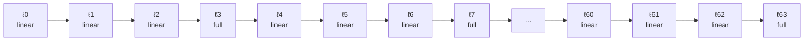
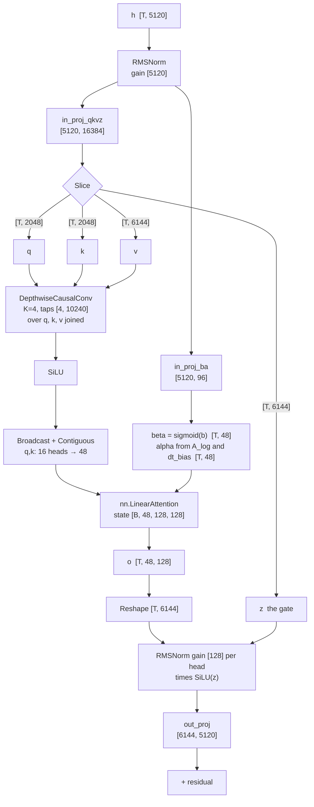

# The `qwen3_5` architecture

[018](018-hybrid-models.md) §6 lists five things that must be built before
Qwen3.8-27B runs. Two are built, one is [023](023-cache-kinds.md), one is
[025](025-recurrent-snapshot.md), and one is
[026](026-image-tokens.md). This spec is the sixth line of that table — *the
`qwen3_5` registry entry: config parsing, the weight map, the layer-type
schedule* — written end to end, in the shape `model/qwen3.go` and
`model/qwen3_graph.go` already established for the dense family.

**Read [§11](#11-scope-this-is-not-one-pass) first if you are about to build it.**
This spec is three sub-scopes and one of them is gated on an accel answer that
does not exist yet ([§4.4](#44-the-gate-is-per-head-and-accels-is-per-token)).

## 1. What is there today, checked

Nothing in `model/` knows this architecture, and the refusal is already correct.

| claim | where it is checked |
| --- | --- |
| `ParseConfig` reads twelve fields and no more | `model/config.go:95` — `rawConfig` has no `layer_types`, no `full_attention_interval`, no `linear_*`, no `attn_output_gate`, no `partial_rotary_factor` |
| an unknown `architectures[0]` is refused with the known list | `model/model.go:167` — `unknown`, reached from `New` at `model/model.go:145` |
| `Architectures()` returns one name today | `model/qwen3.go:28` is the only `Register` call in the tree |
| the rotary width is **hardcoded** to `HeadDim` | `nn/attention.go:207-208` — `tensor.RoPE(g.B, qh, cfg.HeadDim, …)` twice; `AttentionConfig` has no rotary-dim field |
| the gated delta recurrence exists | `nn/linear.go:67` `LinearAttention`, over `tensor.LinearAttention` |
| the depthwise convolution exists | `nn/linear.go:178` `DepthwiseCausalConv`, over `nn.ConvState` |

So a `Qwen3_5ForConditionalGeneration` checkpoint fails at `model.Open` with the
list of architectures tgo knows, which is [004-D2](004-model-graph.md) working.

**[018 §4](018-hybrid-models.md) is three-quarters right and one-quarter wrong.**
It says `partial_rotary_factor: 0.25` is "already expressible" because
`rotaryDim` was always a parameter. That is true of `tensor.RoPE` and false of
`nn.Attention`, which passes `cfg.HeadDim` and offers the caller no way to pass
anything else. Adding a rotary-dim field to `AttentionConfig` is therefore a
prerequisite this spec owns, not a thing already done
([§5.1](#51-partial_rotary_factor-needs-a-field-attentionconfig-does-not-have)).

## 2. The config, read from the checkpoint

**Confirmed 2026-08-29 against `Qwen/Qwen3.5-27B`'s `config.json` and its
safetensors headers**, both read over HTTP without downloading a weight. The
tables below were provisional and marked as guesses; they are now the file's.
What changed is recorded here rather than silently corrected, because the two
readings this spec could not choose between were both plausible and one of them
is wrong.

### 2.1 Everything the graph needs is under `text_config`

The top level holds the architecture, the model type, the multimodal token ids,
the tie flag and the vision tower. **Every field this graph parses is one level
down.**

```json
{
  "architectures": ["Qwen3_5ForConditionalGeneration"],
  "model_type": "qwen3_5",
  "image_token_id": 248056, "video_token_id": 248057,
  "vision_start_token_id": 248053, "vision_end_token_id": 248054,
  "tie_word_embeddings": false,
  "text_config": { ... },
  "vision_config": { ... }
}
```

`ParseConfig` reads the top level (`model/config.go:95`), so a parser built from
this spec's first draft would have read **zero** for `hidden_size`, `head_dim`
and every other field — and a config of zeros is not a refusal, it is a model
with no width. That is the failure §2's "confirmed?" column existed to prevent,
and it is the one it caught.

### 2.2 The fields, with the values the 27B ships

| field | where | symbol | value | note |
| --- | --- | --- | --- | --- |
| `architectures[0]` | top | — | `Qwen3_5ForConditionalGeneration` | the registry key |
| `model_type` | top | — | `qwen3_5` | not read; the architecture is the key |
| `tie_word_embeddings` | **top** | — | `false` | and `lm_head.weight` is in the file |
| `image_token_id`, `video_token_id`, `vision_start_token_id`, `vision_end_token_id` | top | — | 248056, 248057, 248053, 248054 | [026](026-image-tokens.md)'s; parsed and refused here |
| `num_hidden_layers` | text | $L$ | 64 | |
| `layer_types` | text | — | a **64-entry list** | §3.1's first reading |
| `full_attention_interval` | text | $I$ | 4 | and it agrees with the list |
| `hidden_size` | text | $d$ | 5120 | |
| `intermediate_size` | text | $f$ | 17408 | dense MLP, no experts |
| `head_dim`, `num_attention_heads`, `num_key_value_heads` | text | $d_h, H, H_{kv}$ | 256, 24, 4 | |
| `attn_output_gate` | text | — | `true` | and there is no gate tensor: §4.5 |
| `linear_conv_kernel_dim` | text | $K$ | 4 | |
| `linear_num_key_heads`, `linear_key_head_dim` | text | $H_k, d_k$ | 16, 128 | |
| `linear_num_value_heads`, `linear_value_head_dim` | text | $H_v, d_v$ | 48, 128 | |
| `mamba_ssm_dtype` | text | — | `"float32"` | refused unless this |
| `rms_norm_eps` | text | $\varepsilon$ | 1e-6 | |
| `vocab_size` | text | $V$ | **248320** | not 151936; that is Qwen3's |
| `max_position_embeddings` | text | — | 262144 | advisory (005-D2) |
| `rope_parameters.rope_theta` | text, **nested** | — | 1e7 | §2.3 |
| `rope_parameters.partial_rotary_factor` | text, **nested** | $\rho$ | 0.25 | $\rho d_h = 64$ |
| `rope_parameters.rope_type` | text, nested | — | `"default"` | no scaling |
| `rope_parameters.mrope_interleaved`, `mrope_section` | text, nested | — | `true`, `[11, 11, 10]` | §2.4 |
| `mlp_only_layers` | text | — | `[]` | empty; a non-empty one is refused |
| `mtp_num_hidden_layers`, `mtp_use_dedicated_embeddings` | text | — | 1, `false` | a head this graph does not build: §4.5 |
| `attention_bias`, `attention_dropout`, `hidden_act`, `dtype`, `eos_token_id`, `initializer_range`, `use_cache`, `model_type` | text | — | — | read and checked against what the graph assumes, or ignored by name |

### 2.3 `rope_theta` and `partial_rotary_factor` are nested

Both live in `rope_parameters`, which `ParseConfig` does not know. So
`qwen35Config` reads the rotary base from a different place than the dense
parser does, and [§5.1](#51-partial_rotary_factor-needs-a-field-attentionconfig-does-not-have)'s
field is read from `rope_parameters.partial_rotary_factor` and not from a
top-level key.

### 2.4 mRoPE is a no-op for text, and that is an argument rather than a hope

`rope_parameters` carries `"mrope_interleaved": true` and
`"mrope_section": [11, 11, 10]`. Multimodal RoPE gives a token **three**
position components — temporal, height, width — and partitions the rotary pairs
into three sections, each rotated by its own component.

$11 + 11 + 10 = 32$, and $\rho d_h / 2 = 64/2 = 32$: the sections partition the
rotary **pairs** exactly.

**For text-only input the three components are equal**, because a text token has
one position and mRoPE sets all three to it. Each rotary dimension keeps its own
inverse frequency under either layout — chunked or interleaved changes *which
component* multiplies a dimension's frequency, not which frequency the dimension
has — so with all three components equal, every section computes
$\text{pos} \cdot \omega_d$ and mRoPE reduces to standard RoPE over $\rho d_h$
dimensions, exactly.

**[024-D12]**: text-only `qwen3_5` uses ordinary RoPE at width $\rho d_h$, and
the reduction is stated as the argument above rather than assumed. A caller who
supplies position components that are not all equal is [026](026-image-tokens.md)'s
and is refused here, because the reduction is the whole of why this graph may
ignore `mrope_section`.

### 2.5 The MoE sibling is a different architecture key

`Qwen/Qwen3.5-397B-A17B` is `Qwen3_5MoeForConditionalGeneration`, `model_type`
`qwen3_5_moe`, with `num_experts: 512` and `moe_intermediate_size: 1024`. It is
therefore refused by the registry with the list of what tgo knows
([004-D2](004-model-graph.md)), and **not** mis-built by this entry — which is
worth stating because the two share every linear-attention field and differ in
the MLP. Had the family reused one key, one builder would have answered for a
dense MLP and a 512-expert one.

## 3. The layer schedule

64 layers, one full-attention layer every $I = 4$, 16 full and 48 linear.



The derived rule is $\ell$ is full attention iff $(\ell + 1) \bmod I = 0$, so
the full layers are $3, 7, \dots, 63$ and the *last* layer is full. The opposite
convention — $\ell \bmod I = 0$, so layer 0 is full and layer 63 is linear — is
equally plausible from the field name alone and produces a model with the same
shapes, the same parameter count, and different output. **The convention is not
derivable and is not guessed** ([024-D1](#decision-record)).

### 3.1 `layer_types` is a per-layer list, and it agrees with the interval

This section asked whether `layer_types` was a 64-entry list the quote in
[018 §1](018-hybrid-models.md) had abbreviated, or a repeating pattern — noting
that the second reading makes the quoted config self-contradictory, because a
period-2 pattern is one full layer in two and not one in four.

**It is the list.** `Qwen3.5-27B` ships 64 entries, and they are

```
linear, linear, linear, full,   linear, linear, linear, full,   …,   linear, linear, linear, full
```

so the full layers are $3, 7, \dots, 63$ and the last layer is full. That is
exactly $(\ell + 1) \bmod I = 0$ at $I = 4$, so **`full_attention_interval: 4`
and `layer_types` agree**, and [024-D1](#decision-record)'s derived convention is
the file's rather than a guess between two equally plausible ones. The opposite
convention — layer 0 full, layer 63 linear — produces a model with the same
shapes, the same parameter count and different output, which is why it was not
guessed.

Both fields being present makes §3.2's cross-check a **live** comparison rather
than a guard against a shape nobody has seen: this checkpoint exercises the
agree branch on every load, so a regression that broke the derivation would be
caught by the first hybrid a deployment opens.

### 3.2 The rule

```
schedule(cfg) -> []layerKind, error

  types  = cfg.LayerTypes            // present or absent
  I      = cfg.FullAttentionInterval // present or absent

  if types absent and I absent:      refuse: neither field says what the layers are
  if types present and len != L:     refuse: naming the length it has and L
  if I present and I <= 0:           refuse: naming the value
  derived = [ (ℓ+1) % I == 0 ? full : linear  for ℓ in 0..L-1 ]   // when I present
  if types present and I present and types != derived:
                                     refuse: naming the first ℓ they disagree at
  return types if present else derived
```

A checkpoint that says one thing in two places is **refused, not reconciled**.
[000 D6](000-decisions.md) is the authority: *"A model that the registry does not
know is refused at load with the list of what it does know, never guessed at"*,
and a schedule guessed from the field a reader happened to prefer is the same
failure one level in. [004 §7](004-model-graph.md)'s table is the precedent for
where the refusal goes and how it reads: at parse, naming the config field.

Refusing costs nothing if the two fields always agree. It costs everything if
they ever do not, because both schedules build, both run, and only one of them
is the model.

## 4. The gated delta block

One linear layer, end to end. $T$ tokens, $B$ sequences, one slot per sequence.



### 4.1 The recurrence, restated from the code and not from the diagram

[018 §2](018-hybrid-models.md) gives accel's form as

$$u = S k, \qquad S \leftarrow \alpha S + \beta\,k\,(v-u)^\top, \qquad o = S q$$

and `nn/linear_test.go:154`'s `linearReference` — written from that equation and
not from the block — settles the two things the display math does not say:

- $u = S_{t-1} k_t$ reads the state **before** the decay
  (`nn/linear_test.go:177`, "the state's reading of this key, before the decay");
- $o_t = S_t q_t$ reads the state **after** the update
  (`nn/linear_test.go:193`, the accumulation runs over the just-written `S`).

A host reference written from the display math alone gets one of those wrong
half the time, so any reference this spec's tests use is written against
`linearReference`'s ordering.

**Where $\alpha$ sits is not re-decided here.** [018 §2](018-hybrid-models.md)
records that Qwen3.5's published form places $\alpha$ outside the whole bracket
and accel's does not, that the two differ in whether the correction term is
decayed, and that only the checkpoint settles it. That is carried forward
unchanged as a tier-3 check against real weights
([§8](#8-verification-without-a-50-gib-download)).

### 4.2 The projections, with every shape

Symbols from [§2](#2-the-config-and-which-field-names-are-guesses): $d = 5120$,
$H_k = 16$, $d_k = 128$, $H_v = 48$, $d_v = 128$, $K = 4$. Write
$W_k = H_k d_k = 2048$ and $W_v = H_v d_v = 6144$.

| step | operator | in | out |
| --- | --- | --- | --- |
| norm | `nn.RMSNorm` | `[T, d]`, gain `[d]` | `[T, 5120]` |
| qkvz | `nn.Linear` | `[T, 5120] × [5120, 16384]` | `[T, 16384]` |
| ba | `nn.Linear` | `[T, 5120] × [5120, 96]` | `[T, 96]` |
| split q | `Slice` → `Contiguous` | `[T, 16384]`, cols `[0, 2048)` | `[T, 2048]` |
| split k | `Slice` → `Contiguous` | cols `[2048, 4096)` | `[T, 2048]` |
| split v | `Slice` → `Contiguous` | cols `[4096, 10240)` | `[T, 6144]` |
| split z | `Slice` → `Contiguous` | cols `[10240, 16384)` | `[T, 6144]` |
| conv | `nn.DepthwiseCausalConv` | `[T, 10240]`, taps `[4, 10240]`, `ConvState` | `[T, 10240]` |
| activation | `tensor.SiLU` | `[T, 10240]` | `[T, 10240]` |
| repeat q, k | `Reshape` → `Broadcast` → `Contiguous` → `Reshape` | `[T, 16, 1, 128]` → `[T, 16, 3, 128]` | `[T, 6144]` |
| β | `Slice` → `Sigmoid` | `[T, 96]`, cols `[0, 48)` | `[T, 48]` |
| α | `Slice` → softplus → scale → `Exp` | cols `[48, 96)`, with `A_log` `[48]` and `dt_bias` `[48]` | `[T, 48]` |
| recurrence | `nn.LinearAttention` | q, k `[T, 6144]`, v `[T, 6144]`, state `[B, 48, 128, 128]` | `[T, 48, 128]` |
| flatten | `Reshape` | `[T, 48, 128]` | `[T, 6144]` |
| gated norm | `RMSNorm` per head × `SiLU(z)` | `[T·48, 128]`, gain `[128]`; z `[T, 6144]` | `[T, 6144]` |
| out | `nn.Linear` | `[T, 6144] × [6144, 5120]` | `[T, 5120]` |
| residual | `tensor.Add` | two `[T, 5120]` | `[T, 5120]` |

Note the `Reshape` on the recurrence's output is at the **caller's** call site
and not inside `nn.LinearAttention`, which is `nn/linear.go:106`'s deliberate
choice: a `Reshape` in front of a graph *output* silently produces zeros
([C25](010-conformance.md)), so the block returns accel's unflattened
`[T, heads, ValueDim]` and every caller flattens where the value is an operand.
This block is a caller, so it flattens.

### 4.3 q and k are 16 heads and the state is 48

`tensor.LinearAttention` requires `k.shape.Equal(q.shape)` and `v.shape[1] ==
heads` (accel `tensor/linear.go:107` and `:110`), so **one head count serves all
three**. Qwen3.5 has $H_k = 16$ against $H_v = 48$: the recurrence is per value
head and three value heads share a key head, which is grouped-query attention
inside a linear layer.

The expression is `Broadcast` over a size-one axis
(accel `tensor/views.go:178`), which gives repeat-each-3-times ordering and maps
value head $h$ to key head $\lfloor h/3 \rfloor$. Whether the checkpoint's
convention is repeat-each (interleave) or tile is the one thing the shapes
cannot distinguish, and it is a checkpoint question
([§8](#8-verification-without-a-50-gib-download)).

The cost is four extra nodes and one `[T, 6144]` copy for each of q and k. It is
not a state cost: the state is per value head either way,
$48 \times 128 \times 128 \times 4$ bytes $= 3$ MiB per sequence per layer, 144
MiB per sequence over 48 layers.

The comment at `nn/linear.go:15` explains the non-square state as *"16 key heads
of 128 against 48 value heads of 128"*, which reads a head-count difference as a
width difference. The widths are both 128. The state is non-square because
`KeyDim` and `ValueDim` are independently configurable, and the head counts are
a separate problem this section owns.

### 4.4 The gate is per head and accel's is per token

**This is what decides whether the block is buildable, and the answer is that
it is not buildable today.**

`tensor.LinearOptions.Alpha` and `.Beta` hold *"one entry per token, in the flat
order q is in"* (accel `tensor/linear.go:21`); the operator refuses anything else
with *"a gate is per token, not per sequence"* (accel `tensor/linear.go:127`),
and the kernel reads `alpha[tok]` with no head axis
(accel `internal/testkernels/linear_test.go:51`).

The projection this spec reads as `in_proj_ba` produces $2 H_v = 96$ values per
token, which is **one α and one β per value head**. If Qwen3.5's gates are per
head, accel's operator cannot express the layer, and

- averaging the 48 gates into one runs, produces plausible numbers, and is a
  different model;
- running the operator 48 times with one head each is 48 dispatches per layer
  over 48 layers and a state sliced per head, which is a workaround
  [000 D1](000-decisions.md) forbids for exactly the reason it gives.

So this is a report before it is a build: a test that names it, a new row in
[010 §2](010-conformance.md), and an issue on accel citing this spec — which is
[000 D1](000-decisions.md)'s sequence, unchanged.

**Reported on 2026-08-27 as [C27](010-conformance.md), filed as
[accel#27](https://github.com/golang-design/accel/issues/27).** The probe is
`TestTheGatedDeltaGateHasNoHeadAxis` in `internal/conformance/linear_test.go`,
which binds α and β at `[tokens, heads]` and records what accel does with them.
It **refuses**, and that is the good answer: the alternative — reading the first
heads-worth of the tensor as though it were `[tokens]` — would be a wrong decay
on 47 heads in 48, computed silently, which is the class
[010 §5](010-conformance.md) exists for. The ask is one rank check, because
`[tokens]` keeps meaning every head shares a token's gate and nothing existing
moves.

**Settled on 2026-08-28: the gates are per head.** This section was open on
whether `in_proj_ba` is $2 H_v$ wide or 2 wide, and read the answer as a
safetensors header nobody had. It is answerable without one, from a public
implementation of this architecture:

- ollama's `qwen3_5` loader permutes `in_proj_ba` through a permutation of
  length $2 H_v$ and states the native layout as *"rows grouped per key head as
  `[beta(vPerK) | alpha(vPerK)]`"*, where `vPerK` is $H_v / H_k$
  (`x/models/qwen3_5/gdn_projections.go:64-77`, ollama/ollama at `bd3f22e2`);
- a split checkpoint reaches the same layout by concatenating `in_proj_b` and
  `in_proj_a`, each $H_v$ wide (`gdn_projections.go:18-38`);
- the forward pass hands the whole $[B, L, 2 H_v]$ result to its gated delta
  kernel rather than reducing it (`x/models/qwen3_5/qwen3_5.go:1091,1116`).

So β and α are one per value head per token, the width is 96 for this config,
and **[C27](010-conformance.md) blocks the block**. Stage **C** below is gated
on accel taking a `[tokens, heads]` gate, not on a download.

**Confirmed on 2026-08-29 from the checkpoint itself**, which is the header read
this section priced as one nobody had. `Qwen/Qwen3.5-27B` splits the projection
and both halves are $H_v$ wide:

| tensor | shape |
| --- | --- |
| `model.language_model.layers.0.linear_attn.in_proj_b.weight` | `[48, 5120]` |
| `model.language_model.layers.0.linear_attn.in_proj_a.weight` | `[48, 5120]` |
| `model.language_model.layers.0.linear_attn.A_log` | `[48]` f32 |
| `model.language_model.layers.0.linear_attn.dt_bias` | `[48]` |

$H_v = 48$, and every per-head tensor in the file is 48 wide. **β and α are one
scalar per value head**, read off the model in question rather than inferred
from a sibling's loader, so [C27](010-conformance.md) blocks the block and stage
**C** below waits on accel taking a `[tokens, heads]` gate.

**The ollama evidence described the wrong artifact.** There is no `in_proj_ba`
tensor in `qwen3_5`; the fused pair is Qwen3-Next's, and ollama's permutation of
length $2 H_v$ is what it applies after concatenating the split ones. The
conclusion was right and the citation was a sibling's. That is the difference
[010-D7](010-conformance.md) is about: an inference from an adjacent
implementation and a measurement of the thing itself are not the same evidence,
and only the second one closes a row.

### 4.5 The weight map, read from the checkpoint

**Confirmed 2026-08-29** against `Qwen/Qwen3.5-27B`'s index and safetensors
headers. The draft followed Qwen3-Next's names and marked them unconfirmed; four
of its readings were wrong and it named two of them as the alternatives to
expect. Both alternatives are what shipped.

**The prefix is `model.language_model.layers.ℓ.`** and not `model.layers.ℓ.`: a
multimodal checkpoint nests the text tower under `language_model` beside
`visual`. Every row below carries it.

Everything is `BF16` except `linear_attn.norm.weight` and `linear_attn.A_log`,
which are `F32`. `weights/convert.go:51` already reads BF16, so there is no
loader gap.

#### A gated-delta layer

$W_k = H_k d_k = 2048$, $W_v = H_v d_v = 6144$, $C_\text{conv} = 2W_k + W_v = 10240$.

| tensor | shape in file | port | transform | kind |
| --- | --- | --- | --- | --- |
| `input_layernorm.weight` | `[5120]` | `ℓ.attn_norm` | — | gain |
| `linear_attn.in_proj_qkv.weight` | `[10240, 5120]` | `ℓ.lin_qkv` | transpose | projection |
| `linear_attn.in_proj_z.weight` | `[6144, 5120]` | `ℓ.lin_z` | transpose | projection |
| `linear_attn.in_proj_b.weight` | `[48, 5120]` | `ℓ.lin_b` | transpose | projection |
| `linear_attn.in_proj_a.weight` | `[48, 5120]` | `ℓ.lin_a` | transpose | projection |
| `linear_attn.conv1d.weight` | `[10240, 1, 4]` | `ℓ.lin_taps` | squeeze then transpose | gain |
| `linear_attn.dt_bias` | `[48]` | `ℓ.lin_dt` | — | gain |
| `linear_attn.A_log` | `[48]` f32 | `ℓ.lin_alog` | — | gain |
| `linear_attn.norm.weight` | `[128]` f32 | `ℓ.lin_norm` | — | gain |
| `linear_attn.out_proj.weight` | `[5120, 6144]` | `ℓ.lin_out` | transpose | projection |
| `post_attention_layernorm.weight` | `[5120]` | `ℓ.mlp_norm` | — | gain |
| `mlp.{gate,up,down}_proj.weight` | 004 §4's | 004 §4's | transpose | projection |

**The projection is split into four, not fused into two.** The draft's
`in_proj_qkvz` and `in_proj_ba` are Qwen3-Next's; `qwen3_5` ships `in_proj_qkv`,
`in_proj_z`, `in_proj_b` and `in_proj_a`. The draft named this as "the
alternative a reader should expect if these are wrong", and it changes the
table's rows and none of its shapes — $10240 + 6144 = 2W_k + 2W_v$, which is the
fused width.

**`norm.weight` is `[128]` and not `[d_v]` as the draft said** — or rather,
$d_v = 128$ and the draft's `[d_v]` meant the 384-wide folded band
[023 §2.2](023-cache-kinds.md) records. It is **one gain per value head's
128 channels**, applied across 48 heads, not one per 16 folded bands of 384. A
graph that broadcast it over the folded geometry would scale three value heads
by one head's gain. §4.3's folding is sound for the *state* — the bytes and the
row separability are identical either way — and wrong for this norm, which is
why $H_v$ is carried explicitly rather than derived as $H_k \times 3$.

**`conv1d.weight` is `[10240, 1, 4]`**, exactly $[C_\text{conv}, 1, K]$, so
$C_\text{conv} = 10240$ — which is the number [023 §6](023-cache-kinds.md)'s
table assumed. That arithmetic is no longer provisional. It is a squeeze of the
middle axis and then a transpose of a rank-2 plane, and `WeightSpec.Transpose`
reverses a rank-2 shape while `weights.targetShape` refuses any other rank, so
this row still needs a reshape the map cannot express today.

**`A_log` and `dt_bias` are per-head constants inside an exponential** and are
routed through `KindGain` for the f32 buffer it gives them, which is the right
mechanism under a name that does not fit. Unchanged from the draft.

#### A full-attention layer

004 §4's rows, with one correction and no addition.

| tensor | shape in file | port | note |
| --- | --- | --- | --- |
| `self_attn.q_proj.weight` | **`[12288, 5120]`** | `ℓ.wq` | $2 H d_h$: **the gate is fused into it** |
| `self_attn.k_proj.weight` | `[1024, 5120]` | `ℓ.wk` | $H_{kv} d_h$ |
| `self_attn.v_proj.weight` | `[1024, 5120]` | `ℓ.wv` | $H_{kv} d_h$ |
| `self_attn.o_proj.weight` | `[5120, 6144]` | `ℓ.wo` | $[d, H d_h]$ |
| `self_attn.{q,k}_norm.weight` | `[256]` | 004 §4's | $d_h$ |

**There is no `self_attn.gate_proj` tensor**, and `attn_output_gate` is `true`.
The draft stated both readings and built neither, saying "the header settles it —
the width of `q_proj` says which". It does: $12288 = 2 \cdot 24 \cdot 256$, so
the gate is the second half of `q_proj`'s output and the row is a **wider `wq`
and a split**, not a tensor of its own. [024-D7](#decision-record)'s
gate-before-$O$ is confirmed by `o_proj`'s `[5120, 6144]`, which maps $H d_h$
and not $d$.

#### 348 tensors this map does not name

The file holds 1199 tensors: 850 under `model.language_model.`, **333 under
`model.visual.`** and 16 outside both — `lm_head.weight` and **15 `mtp.*`**, a
multi-token-prediction head with its own layer, norms and `fc`.

`model.Check` refuses a tensor the map does not name, so this checkpoint is
refused wholesale unless the two towers are handled. **[024-D13]**: they are an
**explicit, named ignore set** rather than a silent drop, and the refusal a
reader gets if the set stops matching says which tower it belongs to. Dropping
them silently is the failure [§7](#7-refusals)'s own general row warns about one
level up, and refusing them is refusing a checkpoint over weights this graph
does not need. `model.visual.*` is [026](026-image-tokens.md)'s and `mtp.*` is
unbuilt — speculative decoding is [README](README.md)'s "not specced" list, and
this is the head it would need.

## 5. What `nn` gains

Three changes, each defaulting to today's behaviour by zero value, so the dense
path is byte-identical.

### 5.1 `partial_rotary_factor` needs a field `AttentionConfig` does not have

```go
type AttentionConfig struct {
    QHeads, KVHeads, HeadDim int

    // RotaryDim is how many of a head's channels rotate, and zero is HeadDim.
    RotaryDim int
    …
}
```

and `nn/attention.go:207-208` becomes

```go
rot := cfg.RotaryDim
if rot == 0 {
    rot = cfg.HeadDim
}
qh = tensor.RoPE(g.B, qh, rot, cfg.RoPEBase, posQ)
kh = tensor.RoPE(g.B, kh, rot, cfg.RoPEBase, posK)
```

Zero rather than a `PartialRoPE` flag beside a width, for the reason `Step.Extents`
records at `nn/attention.go:44`: two fields that must agree are a pair a caller
can set half of. `qwen3` passes nothing and its graph does not change.

The refusal at `nn/attention.go:166` moves with it — the rotary dimension is what
must be even, not the head dimension — and it must also refuse `RotaryDim >
HeadDim`, which accel would refuse in its own terms one layer down.

`ParseConfig`'s odd-`head_dim` refusal (`model/config.go:171`) stays where it is;
`qwen35Config` adds the same check on $\rho d_h$, and refuses a $\rho$ that does
not produce an integer.

### 5.2 `attn_output_gate` is a fifth projection, and it multiplies before `O`

```go
type AttentionWeights struct {
    Q, K, V, O   Operand
    QNorm, KNorm *tensor.Tensor

    // Gate is attn_output_gate's projection, or the zero Operand.
    Gate Operand
}
```

`nn.Attention` ends with `Linear(g, Reshape(a, [T, H·d_h]), w.O)` at
`nn/attention.go:250` and `:261` — the ragged branch and the single-sequence
one. The gate multiplies the `[T, H·d_h]` value
**before** that projection:

$$\text{out} = \big(\,\mathrm{Attn}(q,k,v) \odot \sigma(xW_g)\,\big)\,W_O$$

Before, not after, because the gate's width is $H d_h$ and $W_O$ maps $H d_h \to
d$. A gate applied after $O$ would have to be $d$ wide, which is a different
projection shape and a different model. The width is what decides it, and the
zero `Operand` means no gate — `Operand.Form()` at `nn/nn.go:168` already
answers on a zero value, and `Operand.ok()` at `nn/nn.go:187` already refuses a
half-built one.

### 5.3 The gated delta block goes in `nn`

`nn.GatedDelta(g, x, w GatedDeltaWeights, st GatedDeltaStep, cfg LinearConfig)`,
composing `RMSNorm`, four `Linear`s, `DepthwiseCausalConv`, the gate arithmetic,
`LinearAttention` and the gated norm — [§4.2](#42-the-projections-with-every-shape)'s
table, one function.

In `nn` and not inline in `model/qwen3_5_graph.go` because
[004-D1](004-model-graph.md) puts composites in `nn` and because the block is
what [§9](#9-tests)'s per-block value test tests. A block inside a model file is
testable only through the whole graph, and a whole-graph test cannot say which of
sixteen nodes moved.

## 6. The graph, the registry, and the two ports that change

### 6.1 One `Register`, a second builder, and nothing else in `model/`

```go
// model/qwen3_5.go
const Qwen35Architecture = "Qwen3_5ForConditionalGeneration"

func init() { Register(Qwen35Architecture, newQwen35) }

type qwen35 struct {
    cfg   *qwen35Config
    kinds []layerKind // §3.2's schedule, computed once
}
```

`Register` (`model/model.go:95`), `Architectures` (`:114`), `New` (`:145`) and
`unknown` (`:167`) do not change. `Architectures()` returns two names and the
refusal message lists both, which is the only observable change to `model/` from
outside.

Two new files, `model/qwen3_5.go` and `model/qwen3_5_graph.go`, mirroring the
dense pair. `model/qwen3.go` is not touched: a second architecture is one file
and one `init` ([000 D6](000-decisions.md)), and threading a mode flag through
`qwen3` would make one builder answer for two weight maps and two forward passes,
which is the generic path [004-D2](004-model-graph.md) refuses in a different
costume.

`Template()` returns `chat.Qwen3()` until a `qwen3_5` chat template is read from
a checkpoint. That is [003](003-chat-template.md)'s and is not asserted here.

### 6.2 `Declare` must declare extents at batch one

`tensor.LinearAttention` refuses a nil `QueryExtents` unconditionally
(accel `tensor/linear.go:81`), and the state's slot count is read *from* the
extent count (accel `tensor/linear.go:116`, `:136`). `model.Declare` declares
`PortExtents` only when `batch > 1` (`model/graph.go:225`).

So a `qwen3_5` graph declares `extents` at every batch size, `[max(B,1)]` u32,
and a single sequence binds `[T]`. `GraphSpec` gains nothing: the architecture
decides, and `Declare` takes the config.

**The full-attention layers still get nil.** Passing the same extents into
`nn.Attention` sets `opts.BaseName = ""` and takes the ragged kernel
(`nn/attention.go:243`), and at batch 1 `Inputs.Validate` requires a non-empty
`Base` for $T > 1$ (`model/graph.go:402`). Those two are the same rule read from
both ends: a single-sequence prefill has a causal base and a ragged step does
not. A hybrid graph at batch 1 therefore hands `Step.Extents = nil` to the full
layers and the extents tensor to the linear ones, and at batch above one hands
the same tensor to both — which is what the dense batched path already does.

This is a wiring decision with no shape to catch it: extents into the full layers
compiles, runs, and masks the wrong keys. [§9](#9-tests) has the test.

### 6.3 The KV state is allocated at sixteen layers, not sixty-four

`Declare` allocates `[L, C, H_kv, d_h]` (`model/graph.go:230`) and
`Builder.Forward` takes layer $\ell$'s window with `tensor.LayerState(b, in.Keys,
l)` (`model/qwen3_graph.go:88`), indexed by **absolute** layer. With 16 full
layers of 64, an unchanged `Declare` reserves 48 layers of capacity nothing
writes: at $C = 8192$, $H_{kv} = 4$, $d_h = 256$, f16, that is 16 MiB per unused
layer per state, and **1.5 GiB per sequence** across the key and value states
together.

So the state is allocated at the *full-attention* count and the builder maps
absolute layer to dense index. The map is the schedule's prefix sum and is
computed once beside `kinds`.

[023](023-cache-kinds.md) owns the cache *kinds* — which state a layer type
carries. **The absolute-to-dense index is this spec's**, because it is a property
of the schedule and the schedule is here. If 023 lands with a different shape for
the same idea, 023 wins and this section is amended.

### 6.4 The convolution window is rank two, and a batch needs rank three

The block slices axis 0 of the window (`nn/linear.go:220`), which is the *time*
axis. The shipped test binds a rank-2 `[K-1+T, C]` state
(`nn/linear_test.go:214`), and that is the shape the block works over: on a
rank-3 state the slice would cut slots. `nn.ConvState`'s doc comment said
`[slots, K-1+T, C]` until 2026-08-27, which is what made this look done; it now
says what the block addresses, and so does [C26](010-conformance.md).

So the convolution is **single-sequence today**. A batched hybrid graph needs
either a slot axis the block slices past or one state per slot, and neither
exists. This is named here and owned by [023](023-cache-kinds.md), which is where
the per-slot state shapes are decided. Sub-scope C
([§11](#11-scope-this-is-not-one-pass)) is single-sequence for this reason.

## 7. Refusals

[004 §7](004-model-graph.md)'s table is the precedent: refuse at parse, name the
field, and refuse anything the graph cannot honour rather than approximating it.

| condition | why refusing beats approximating |
| --- | --- |
| `layer_types` and `full_attention_interval` disagree | two schedules build and run; only one is the model ([§3.2](#32-the-rule)) |
| both absent | nothing says which layers are which |
| `layer_types` has an unrecognised length | the list-or-pattern question is unanswerable from the file ([§3.1](#31-layer_types-may-be-a-list-or-a-pattern-and-that-decides-the-check)) |
| `layer_types` holds a string that is neither kind | a third layer type is a model this graph does not implement |
| `linear_num_value_heads` not a multiple of `linear_num_key_heads` | the heads do not group ([§4.3](#43-q-and-k-are-16-heads-and-the-state-is-48)) |
| $\rho \cdot d_h$ not an even integer | RoPE rotates pairs; `ParseConfig` already refuses this shape of mistake at `model/config.go:171` |
| `mamba_ssm_dtype` is not `float32` | accel's state is f32 (accel `tensor/linear.go:144`); a config asking for anything else asks for a precision that is not there |
| `attn_output_gate` true and no gate tensor in the checkpoint | `model.Check` already refuses it as a missing tensor, by name |
| **any `qwen3_5` field this graph does not implement** | see below |
| the per-head gate, until [§4.4](#44-the-gate-is-per-head-and-accels-is-per-token) resolves | a mean over 48 gates runs and is a different model |
| `rope_parameters.rope_type` is not `"default"` | [004 §7](004-model-graph.md) refuses a scaling it does not implement, and this is where `qwen3_5` states one |
| a non-empty `mlp_only_layers` | a third layer kind, and the schedule has two |
| position components that are not all equal | [§2.4](#24-mrope-is-a-no-op-for-text-and-that-is-an-argument-rather-than-a-hope)'s reduction is the whole of why `mrope_section` may be ignored |
| a tensor outside the map **and** outside [§4.5](#45-the-weight-map-read-from-the-checkpoint)'s named ignore set | the vision tower and the multi-token head are 348 tensors this graph does not need; dropping an unnamed one silently is the failure the row below is about |

The last general row is the one [004 §7](004-model-graph.md) does not have and
this architecture needs. `rawConfig` ignores unknown JSON keys, which is right
for a dense model whose extra fields are metadata. It is wrong here: a `qwen3_5`
config carries fields that change the arithmetic, this spec has read none of them
from a real file, and a field tgo silently ignores is a model tgo silently gets
wrong. So `qwen35Config` parses into a map as well as a struct and refuses any
key not on an explicit allow list, naming it — **at both levels**, with
different sets: the top level allows the architecture, the model type, the four
multimodal token ids, the tie flag, the transformers version and the two nested
objects; `text_config` allows [§2.2](#22-the-fields-with-the-values-the-27b-ships)'s
table. A field at the wrong level is then a named refusal rather than a zero,
which is what [§2.1](#21-everything-the-graph-needs-is-under-text_config) shows
the cost of.

That is stricter than `ParseConfig` and deliberately so. The dense parser earned
its tolerance by being run against real checkpoints; this one has not been run
against any.

## 8. Verification without a 50 GiB download

[000 D8](000-decisions.md): **no test downloads weights.** CI runs a synthetic
config, `TGO_MODEL` runs the real one by hand, and [011 §4](011-sequencing.md)
records the result.

The fixture is a **4-layer, $I=4$, $d=64$** hybrid — three linear layers and one
full — with $H_k = 2$, $d_k = 6$, $H_v = 6$, $d_v = 4$, $K = 3$, $H = 4$,
$H_{kv} = 2$, $d_h = 8$, $\rho = 0.5$, $V = 128$. Every pair of dimensions
differs, which is CONTRIBUTING's rule and `nn/linear_test.go:28`'s reason: at
$d_k = d_v$ a state with its last two axes transposed still runs, and at
$H_k = H_v$ [§4.3](#43-q-and-k-are-16-heads-and-the-state-is-48)'s replication is
the identity.

**What the fixture proves:** the schedule, every refusal, the weight map's
completeness against a synthetic checkpoint, each block against a host reference,
the wiring of extents to one layer kind and not the other, the residual stream's
shape through both kinds, decode equalling prefill's last row, and the state
carrying across steps.

**What only a real checkpoint proves:** every field name in
[§2](#2-the-config-and-which-field-names-are-guesses) and every tensor name in
[§4.5](#45-the-weight-map); the schedule's convention
([§3](#3-the-layer-schedule)); the head-replication
convention ([§4.3](#43-q-and-k-are-16-heads-and-the-state-is-48)); and where
$\alpha$ sits ([018 §2](018-hybrid-models.md)). Each is a value the fixture
supplies to itself and therefore cannot check.

That list is the honest statement of what a green CI run means here: **the graph
is self-consistent, and whether it is Qwen3.5 is unproven.**

## 9. Tests

| test | what it asserts |
| --- | --- |
| `TestTheScheduleReadsLayerTypesVerbatim` | a 4-entry `layer_types` produces exactly those kinds, whatever the interval implies |
| `TestTheScheduleDerivesFromTheIntervalWhenTypesAreAbsent` | $(\ell+1) \bmod I = 0$ over $L$ layers, last layer full |
| `TestASchedulesTwoFieldsAreRefusedWhenTheyDisagree` | the error names the first $\ell$ they differ at, and neither reading is chosen |
| `TestAConfigWithNeitherScheduleFieldIsRefused` | both absent is a refusal, not a dense fallback |
| `TestAnUnknownQwen35FieldIsRefusedByName` | §7's general row: an unimplemented field is named |
| `TestGatedDeltaMatchesAHostReference` | **per-block value test.** The whole block of §4.2 in float64, written from the equation and `linearReference`'s ordering, within a tolerance derived from the contraction lengths and the scan depth ([010 §5.1](010-conformance.md)) |
| `TestTheConvolutionCarriesAcrossTwoSteps` | a 3-token step then a 1-token step equals a reference over all four; a dropped carry cannot be seen in a prefill-only test |
| `TestKeyHeadsAreReplicatedNotTiled` | value head $h$ reads key head $\lfloor h/3\rfloor$; a tile ordering has the same shape |
| `TestAPartialRotaryLeavesTheUpperChannelsAlone` | `RotaryDim` $< $ `HeadDim` rotates the first $\rho d_h$ and leaves the rest bit-identical |
| `TestTheDensePathIsUnchangedByTheRotaryField` | `qwen3`'s graph at `RotaryDim: 0` selects the same kernels and produces the same logits as before |
| `TestTheOutputGateMultipliesBeforeTheOutputProjection` | a gate of all-zeros gives all-zero output; a gate applied after $O$ has the wrong width and would refuse |
| `TestTheFullLayersDoNotReceiveTheLinearExtents` | at batch 1 the full layers keep their `Base` scalar; a graph that passed extents to both compiles and masks wrong |
| `TestTheKVStateIsAllocatedAtTheFullAttentionCount` | 16 layers of KV for 64 layers of model, and layer $\ell$ reads its dense index |
| `TestTheWholeHybridGraphAtTheFixtureSize` | **whole-graph test.** 4 layers, three kinds of state bound, logits `[1, V]` f32, finite, and equal to a float64 reference of the full pass |
| `TestDecodeEqualsPrefillsLastRow` | §3.1 of 004 for a hybrid: the recurrent state after a 3-token prefill plus one decode equals a 4-token prefill's last row |
| `TestEveryWeightTheMapNamesIsInTheFixtureAndNoOther` | `model.Check` over the hybrid map; a missing or extra tensor is refused by name |
| `TestTheGateIsPerHeadAndAccelTakesPerToken` | the named, skipping conformance test [000 D1](000-decisions.md) requires, pointing at the new row in [010 §2](010-conformance.md) |

## 10. What this spec does not own

| | owner |
| --- | --- |
| which state a layer *kind* carries, and its shape per slot | [023](023-cache-kinds.md) |
| snapshot and restore of a recurrent state, and prefix reuse over it | [025](025-recurrent-snapshot.md) |
| image and video tokens through the tokenizer and template | [026](026-image-tokens.md) |
| where $\alpha$ sits in the recurrence | [018 §2](018-hybrid-models.md), decided by a checkpoint |
| the chunked parallel form of the scan, and its cost | accel, recorded as deliberately unbuilt |
| a `qwen3_5` chat template | [003](003-chat-template.md) |

## 11. Scope: this is not one pass

**One person cannot execute this spec completely in one pass**, and the reason is
not size — it is that sub-scope A ends in a question tgo cannot answer alone.

| | sub-scope | executable now? |
| --- | --- | --- |
| **A** | the `nn` prerequisites: `AttentionConfig.RotaryDim`, `AttentionWeights.Gate`, and reading a real `config.json` and safetensors header to settle [§2](#2-the-config-and-which-field-names-are-guesses) and [§4.5](#45-the-weight-map) | the `nn` half yes; the names are a download somebody does by hand. [§4.4](#44-the-gate-is-per-head-and-accels-is-per-token) is no longer on this list: it is settled, and against tgo |
| **B** | `qwen35Config`, the schedule, its refusals, the weight map, the registry entry, `Declare`'s extents and the dense KV index | **yes, today**, and it needs nothing from A except the field names |
| **C** | `nn.GatedDelta` and `model/qwen3_5_graph.go` wired end to end against the host reference | **gated on A**: a per-head gate makes the block inexpressible |

Build **B** first. It is the half that is testable with a synthetic fixture, it
makes the refusals real, and it is what turns "tgo does not know this
architecture" into "tgo knows this architecture and says what it cannot do yet" —
which is [000 D1](000-decisions.md)'s output.

## Decision record

| id | decision | rejected | consequence |
| --- | --- | --- | --- |
| 024-D1 | read `layer_types` verbatim, derive from `full_attention_interval`, and **refuse when both are present and disagree** | trust `layer_types` alone; derive always; take the first field found | two schedules build, run, and produce fluent different text. [000 D6](000-decisions.md) forbids guessing an architecture and a schedule is an architecture ([§3.2](#32-the-rule)) |
| 024-D2 | one `Register` call in a second file, `model/qwen3_5.go`, with its own builder | a mode flag on `qwen3`; a shared builder over two weight maps | [000 D6](000-decisions.md)'s "one file and one init". A builder answering for two weight maps is the generic path [004-D2](004-model-graph.md) refuses |
| 024-D3 | the gated delta block is `nn.GatedDelta`, in `nn` | compose it inline in `model/qwen3_5_graph.go` | [004-D1](004-model-graph.md); and a block inside a model file is testable only through the whole graph, which cannot say which of sixteen nodes moved |
| 024-D4 | the per-head gate is **filed before it is built** — a named skipping test, a row in [010 §2](010-conformance.md), an accel issue | mean the 48 gates into one; run the operator once per head | a mean runs and is a different model; 48 dispatches per layer is the private workaround [000 D1](000-decisions.md) exists to forbid ([§4.4](#44-the-gate-is-per-head-and-accels-is-per-token)) |
| 024-D5 | replicate q and k from $H_k$ to $H_v$ heads with `Broadcast` + `Contiguous` | ask accel for grouped heads inside `LinearAttention` | it composes today at eight nodes and two `[T, W_v]` copies per layer, and [018-D5](018-hybrid-models.md) is the rule: check what composes before asking for a kernel |
| 024-D6 | `AttentionConfig.RotaryDim`, **zero means `HeadDim`** | a `PartialRoPE` bool beside a width; a separate block; passing the width at every call site | the dense path passes nothing and is unchanged. A flag and a width are a pair a caller can set half of, which `Step.Extents` records at `nn/attention.go:44` |
| 024-D7 | the output gate multiplies **before** $W_O$ | after $W_O$, on the `[T, d]` result | the gate projection is $H d_h$ wide and $W_O$ maps $H d_h \to d$; after-$O$ needs a $d$-wide gate, which is a different tensor in the checkpoint ([§5.2](#52-attn_output_gate-is-a-fifth-projection-and-it-multiplies-before-o)) |
| 024-D8 | `extents` is declared at batch one for this architecture, and the **full layers still receive nil** | give both layer kinds the same extents tensor | accel refuses a nil extent on the recurrence and refuses a base on a ragged attention. Passing extents to both compiles and masks the wrong keys, with nothing in the output to say so ([§6.2](#62-declare-must-declare-extents-at-batch-one)) |
| 024-D9 | the KV state is allocated at the **full-attention layer count** with an absolute-to-dense index | allocate `[L, …]` and leave 48 layers unwritten | 768 MiB per sequence per state of capacity nothing writes, at $C=8192$ f16 ([§6.3](#63-the-kv-state-is-allocated-at-sixteen-layers-not-sixty-four)) |
| 024-D10 | a `qwen3_5` config key this graph does not implement is **refused by name** | ignore unknown keys, as `rawConfig` does | the dense parser earned its tolerance against real checkpoints; this one has read none. A field tgo ignores here changes the arithmetic ([§7](#7-refusals)) |
| 024-D11 | ship sub-scope B before A and C, and say the spec is not one pass | one branch that lands the architecture whole | C is gated on an accel answer that does not exist. B is testable today and converts an unknown architecture into a stated, named gap, which is [000 D1](000-decisions.md)'s output ([§11](#11-scope-this-is-not-one-pass)) |
| 024-D12 | text-only `qwen3_5` uses ordinary RoPE at width $\rho d_h$, and `mrope_section` is ignored because the reduction is proved rather than assumed | implement mRoPE's three sections; refuse the field | a text token has one position and mRoPE sets all three components to it, so every section computes $\text{pos}\cdot\omega_d$ and the interleaved and chunked layouts agree — $11+11+10 = \rho d_h/2$. A caller supplying unequal components is refused, which is what keeps the reduction the reason rather than a coincidence ([§2.4](#24-mrope-is-a-no-op-for-text-and-that-is-an-argument-rather-than-a-hope)) |
| 024-D13 | the vision tower and the multi-token-prediction head are an **explicit named ignore set**, and a tensor outside both the map and the set is refused | drop every unnamed tensor; refuse the checkpoint | 333 `model.visual.*` and 15 `mtp.*` tensors are weights this graph does not need, and `model.Check` refuses an unnamed tensor. Dropping silently is the failure [§7](#7-refusals)'s general row is about; refusing is refusing a checkpoint over weights it does not read ([§4.5](#45-the-weight-map-read-from-the-checkpoint)) |
| 024-D14 | the config is confirmed from `Qwen/Qwen3.5-27B` before the parser is written, over HTTP and without a weight | write the parser from [018 §1](018-hybrid-models.md)'s quote and confirm later | the quote omits the `text_config` nesting, so a parser built from it reads zero for every field — and a config of zeros is a model with no width rather than a refusal. Four of [§4.5](#45-the-weight-map-read-from-the-checkpoint)'s rows and the gate's location were also wrong, and both alternatives the draft named as "what to expect if these are wrong" are what shipped |
