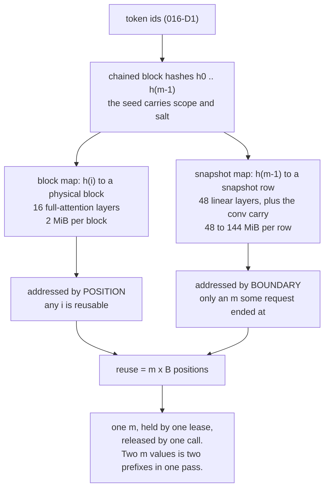

# Snapshot and restore

The third child of [018](018-hybrid-models.md). [016](016-prefix-cache.md)
reuses a prefix by *addressing* it: the key/value state of position $t$ lives in
a block, the block is found by hash, and a page table points a new sequence at
it. A gated delta layer has nothing to address. Its state is one matrix per
sequence per head that absorbed every token in order, so the only thing that
identifies it is **how many tokens it has absorbed**, and the only way to reuse
it is to copy a snapshot back.

Without this, [016](016-prefix-cache.md) covers 16 of Qwen3.8-27B's 64 layers
and the other 48 re-prefill from token zero on every request. That is not a
partial win. [§4](#4-a-partial-hit-and-why-the-two-halves-cannot-disagree)
shows the two halves must reuse the **same** number of positions, so a
prefix cache with no snapshot beside it reuses nothing at all on a hybrid model.

## 1. What is being copied, and it is two states

[018 §6](018-hybrid-models.md) names two per-layer states and both must be
restored together:

| state | shape | declared by |
| --- | --- | --- |
| the gated delta recurrence | `[slots, heads, valueDim, keyDim]` | `nn.LinearAttention`, `nn/linear.go:67` |
| the convolution's rolling window | `[slots, K−1+T, C]` | `nn.ConvState`, `nn/linear.go:123` |

Restoring the recurrence alone is wrong and is not visible in a prefill-only
test. `DepthwiseCausalConv` reads the $K-1$ rows *before* this step
(`nn/linear.go:206`, `nn/linear.go:240`), so a restored sequence whose window
holds zeros convolves its first token against zeros rather than against the last
$K-1$ tokens of the prefix. The output stays plausible. That is the failure
[018 §4.1.1](018-hybrid-models.md) already says a prefill-only test cannot see,
and [§7](#7-correctness-what-same-means) reuses its check shape: five tokens,
then one token, against a reference over all six.

Only the **carry** of the window has to be kept, $K-1$ rows and not $K-1+T$.
Rows $K-1{..}K-1+T-1$ are the next step's own and are overwritten before they
are read.

## 2. Where a snapshot is taken

$$
\text{snapshot bytes} \;=\; \underbrace{L_\text{lin} \cdot H \cdot d_k \cdot d_v \cdot s}_{\text{recurrence}}
\;+\; \underbrace{L_\text{lin} \cdot (K-1) \cdot C \cdot s}_{\text{carry}}
$$

with $s = 4$. The live state is f32 by refusal — accel's `tensor.LinearAttention`
rejects a state of any other dtype — and `mamba_ssm_dtype: float32`
([018 §1](018-hybrid-models.md)) says the checkpoint agrees. The *store* is a
separate buffer and could be narrower; [025-D10](#decision-record) says why it
is not.

For Qwen3.8-27B, $L_\text{lin} = 48$, $d_k = d_v = 128$, $K = 4$. accel's
`LinearConfig` carries one `Heads` where the config names 16 key heads and 48
value heads (`nn/linear.go:11`), so $H$ is read from the checkpoint rather than
asserted here, and the recurrence is **48 MiB per sequence at $H=16$ and 144 MiB
at $H=48$**. The carry adds $12C$ bytes per layer, which at a projection width of
order $10^4$ is about 120 KiB per layer against 1–3 MiB — a tenth of the
snapshot or less, and it must be carried anyway.

Against that, one KV block of the same model:

$$
\text{block bytes} = 2 \cdot L_\text{full} \cdot B \cdot H_{kv} \cdot d_h \cdot 2
= 2 \cdot 16 \cdot 32 \cdot 4 \cdot 256 \cdot 2 = 2\ \text{MiB}
$$

— two states, `blocks.go:90`, at `CacheBlock = 32` (`blocks.go:28`) and f16
(`blocks.go:61`, [C5](010-conformance.md)). **One snapshot at $H=16$ costs what
24 blocks cost**, which is 768 positions of key/value state.

Three candidate boundaries, and the arithmetic settles it:

| where | snapshots per $N$-token prefix | bytes, $N = 2000$, $H = 16$ | against the 125 MiB of KV for the same prefix |
| --- | --- | --- | --- |
| every step | $N$ | 94 GiB | 768× |
| every block boundary | $N/B$ | 2.9 GiB | 24× |
| one per request | 1 | 48 MiB | 0.4× |

The middle row is the one worth stating, because it looks affordable and is not.
Its ratio is $\frac{H d_k d_v s}{B \cdot 2 H_{kv} d_h \cdot 2} \cdot
\frac{L_\text{lin}}{L_\text{full}} = 24$ **independent of $N$**: snapshotting at
every block boundary costs 24 times the block pool it is meant to make useful,
at any prefix length, so it does not become affordable at a smaller context.

**A snapshot is taken once per request, at the last complete block boundary of
what that request computed** — the largest multiple of $B$ at or below the
request's total token count, prompt and generation together. Rounding down to a
block boundary is not a convenience. It is what makes the snapshot key an
existing hash rather than a new one
([§3](#3-one-key-for-both-caches)) and what lets the two halves agree on one
reuse length ([§4](#4-a-partial-hit-and-why-the-two-halves-cannot-disagree)).

The boundary is also the one that matters for the workload 016 §1 describes:
turn $n{+}1$'s prompt begins with turn $n$'s prompt, generation and all, so the
end of a request is exactly where the next request's match ends.

## 3. One key for both caches

The snapshot after the first $m$ complete blocks is keyed by $h_{m-1}$ — the
same chained hash `chainAll` already computes (`internal/prefix/hash.go:70`) and
`Lease.Publish` already inserts blocks under (`internal/prefix/lease.go:194`).
No second key exists.

That is not a saving. It is the enforcement of the invariant:

> **The pairing invariant.** A lease reporting `Reused() == m·B` holds a
> reference to KV blocks $0..m{-}1$ **and** to a snapshot keyed $h_{m-1}$. The
> two are taken under one mutex and given back by one call.

A separate map with its own key and its own lifetime would let a pass restore a
recurrent state taken at token 640 while attending to KV blocks covering 768
positions. Every layer runs, nothing refuses, and the model reads two different
prefixes at once.

**Enforced where 016 already enforces it.** `Pool.Acquire` holds `p.mu` across
lookup, cap, hold and allocate (`internal/prefix/prefix.go:301`) precisely
because a block matched under the lock and acquired after it could be evicted in
between. The snapshot lookup goes inside that same critical section, and the
handle goes on the `Lease` (`internal/prefix/lease.go:14`) so that
`Lease.Release` (`internal/prefix/lease.go:211`) drops both in one pass over one
owner.

**The order inside that section matters, and it is not the obvious one.** The
reuse length is decided *once, before anything is allocated*:

1. walk the block match loop as today, to `matched`
   (`internal/prefix/prefix.go:311`);
2. walk $m$ down from `matched` to the last boundary a resident snapshot names;
3. drop the references the match loop took on blocks $j \ge m$ and hold the
   snapshot;
4. `alloc(need - m)` — not `alloc(need - matched)`.

Deciding the snapshot after the allocation would leave the lease short by
`matched - m` blocks, and it cannot simply give them back: `Lease.Row` indexes
`l.blocks[t/block]` (`internal/prefix/lease.go:63`), so positions
$m{\cdot}B$ and above still need rows to be written into. The blocks above $m$
are **replaced** by fresh ones, not released. One number, computed once, is what
makes that a substitution rather than a repair.



## 4. A partial hit, and why the two halves cannot disagree

016 walks blocks from zero and stops at the first miss, capped at $\lfloor
(n-1)/B \rfloor$ blocks (`internal/prefix/prefix.go:310`), then prefills the
suffix. It reuses whatever whole blocks it found. A snapshot has no such
freedom: it is valid at the one token count it was taken at, and at no other.

So the reuse length is

$$
\text{reuse} = B \cdot \max\{\, m \le \text{matched} \;:\; h_{m-1} \text{ names a resident snapshot} \,\}
$$

and **0 when no such $m$ exists**, for both halves. The consequences are stated
rather than hidden:

- A longest match that ends inside a block loses up to $B-1$ tokens as it always
  did (016-D4), and then walks *down* from the last complete block to the last
  snapshotted one.
- Blocks between the snapshotted boundary and `matched` are matched and not
  usable. They are **replaced** with fresh blocks in the same critical section
  ([§3](#3-one-key-for-both-caches)), because the sequence still writes to those
  positions. Reporting them as reused would start the prefill at a position
  whose recurrent state does not exist.
- A prefix whose blocks are all resident and whose snapshot was evicted reuses
  **nothing**. On a dense model that request would have reused everything. This
  is the cost of the hybrid cache and it is why
  [§5](#5-eviction) gives snapshots their own budget rather than letting them
  compete for the block pool's.

## 5. Eviction

`prefix.Config` counts **blocks**, not bytes (`internal/prefix/prefix.go:96`),
and the LRU is an intrusive list over equal-sized blocks
(`internal/prefix/prefix.go:161`, `internal/prefix/prefix.go:434`). A snapshot is
24 to 72 blocks. Putting both in one list means one snapshot admission evicts
most of a modest pool, and the LRU order would stop being a statement about
recency and become a statement about size.

**Separate budgets, each with its own LRU, and the same lifetime rules within
each.** A snapshot store of $S$ rows is configured in rows, allocated once as a
`[S, layers, heads, valueDim, keyDim]` state beside the block pool, and reclaimed
least-recently-used first among rows no lease references — 016-D5's rule,
unchanged, applied to a second resource.

The two budgets are coupled by [§3](#3-one-key-for-both-caches)'s invariant and
by nothing else:

- A snapshot's entry is deleted **in the same step** as the row is reclaimed.
  That is 016-D5's invariant verbatim, and it is more dangerous here: a stale
  snapshot entry hands a request 48 layers of another conversation's state.
- Evicting a block below a snapshot's boundary does **not** need to evict the
  snapshot. 016's match loop stops at the first missing block, so `matched`
  already falls below that boundary and §4's walk-down declines the snapshot on
  its own. The snapshot then ages out of its own LRU.
- Evicting a snapshot does **not** free the blocks it was paired with. They are
  valid blocks; they are merely unreachable for reuse under §4 until another
  request ends at a boundary and publishes a snapshot there.

**Not a byte-weighted LRU over one list.** It would be the correct policy for
two resources of different sizes competing for one budget, and it is a new
mechanism — a heap keyed on bytes-times-recency, with a victim selection nobody
has measured — where two lists are the existing mechanism twice.

## 6. Isolation

A snapshot key **is** a block hash, so it inherits scope and salt by
construction. `seed` mixes the scope, the scope's domain and the request's salt
into $h_{-1}$ (`internal/prefix/hash.go:28`), the chain propagates it to every
$h_i$, and a snapshot keyed $h_{m-1}$ is therefore reachable only within one
`(scope, domain, salt)`. 016-D7 fails closed and this fails closed with it. No
second mechanism is added, and adding one would be the defect: two keys for one
question is two answers to it (016-D13).

**A shared recurrent state is the same side channel a shared KV block is, and a
larger one.** 016 §7's oracle is that a hit is faster than a miss and the
difference is measurable from the caller's own first-token latency. A restore
covers 48 of 64 layers where a block covers 16, so the timing difference a
restore hit produces is the larger of the two. Anything that would let a request
reach another tenant's snapshot is a membership oracle over that tenant's
prompts, on the same argument and with a stronger signal.

The empty salt is a key of its own and shares with nobody (`session.go:100`),
which is 019-D3's rule and needs no restatement for snapshots because it is the
same string in the same seed.

## 7. Correctness: what "same" means

Two claims, and only one of them is a measurement.

**The copy is exact.** A restore is a byte copy of f32 into f32. The restored
state is bit-identical to the snapshotted state, and the scan that continues
from it performs the same operations in the same order as a scan that never
stopped, because accel's kernel is the sequential form and not the chunked one
([018 §2](018-hybrid-models.md)) — the chunked form reassociates and accel
deliberately did not build it. So "restore then scan $T$ tokens" and "scan
$N{+}T$ tokens" differ only in what feeds the scan.

**What feeds the scan is shape-dependent.** $q$, $k$, $v$, $\alpha$ and $\beta$
come from projections, and a GEMM over 2000 rows may not reduce in the same order
as a GEMM over 800. This is 016 §6's divergence arriving one operator earlier,
and it is handled the same way: measured, not asserted. The bound is
[018 §2](018-hybrid-models.md)'s — a float64 host reference with a budget derived
from the scan length — rather than a fixed epsilon, because the error of a fold
grows with the number of steps folded.

So the parity claim this spec makes is: **a restored request's output
distribution matches a recomputed request's, within a budget derived from the
scan length, and its greedy completion is measured for a first differing token
rather than asserted identical.** [016 §6](016-prefix-cache.md)'s statement
stands unchanged — reuse is transparent in distribution and not bit for bit.

## 8. How the copy happens

**Device-side, composed, and verified by value rather than by reading the
operator list.** accel has no `Copy`, no `Clone` and no buffer-to-buffer copy on
`Queue` — `WriteBuffer` and `ReadBuffer` are host transfers, and
`accel.BufferCopySrc`/`accel.BufferCopyDst` reach nothing but an allocation
alignment. A snapshot is nonetheless one dispatch pair per state per layer,
with no host round trip, because accel's `tensor.ScatterRows` takes a row to be
everything after the leading axis, and `tensor.GatherRows` reads a rank-2
table:

```
ReadState(rec) -> Reshape [slots, W] -> GatherRows(slot) -> ScatterRows(snap, row)
ReadState(snap) -> Reshape [rows, W] -> GatherRows(row)  -> ScatterRows(rec, slot)
```

Probed on the CPU backend at accel HEAD, both directions in one graph:

```
COMPILES: 4 selections
  - GatherRows  - ScatterRows  - GatherRows  - ScatterRows
PASS: snapshot slot 1 -> store row 2 -> slot 0 reproduces slot 1's bytes;
      the other slots and the other store rows are unchanged;
      restoring store row 3 instead of row 2 moves the result
```

The negative control is the point. A probe asserting only that the graph
compiles is what [C13](010-conformance.md) passed for a week, and 010-D7 exists
because of it.

The convolution carry copies narrowly rather than as a whole window: reshape the
window to `[slots·(K−1+T), C]`, gather the $K-1$ carry rows by global index, and
scatter them into a `[rows, K−1, C]` store. Probed, 2 selections, passes with the
same neighbour checks.

**So there is no upstream row and no issue.** [018-D5](018-hybrid-models.md) —
check what composes before asking for a kernel — applies, and
[C26](010-conformance.md) is the precedent for how it is recorded: a
composition that runs, with its dispatch count stated, is one kernel to *want*
and none to be blocked on. Following 000-D1 here would file a gap that does not
exist.

**Where the nodes live, which decides whether 192 dispatches is a lot.** tgo
compiles a plan per shape and submits it every step (`session.go:70`,
`session.go:73`). A snapshot happens once per request and a restore at most once,
so copy nodes in the step graph would run on every step and 192 dispatches would
become 192 per token. They are nonetheless **unconditional nodes in the same
graph**, made inert by their index: `tensor.ScatterRows` documents that an index
at or above the state's capacity writes nothing, so a step that is not copying
binds an out-of-range slot id and the two nodes move nothing.

The restore's nodes go in the prefill graph, ahead of the first linear layer's
read. The snapshot's go in the same graph, after the last linear layer's write,
so the boundary a snapshot names is a boundary that graph has computed — and the
snapshot is therefore taken before `Stream.finish` releases the lease
(`session.go:89`), which is host-side and has no graph of its own.

**The inert path relies on documented silent behaviour**, and silence does not
distinguish an intentional no-op from a wrong id. §9 tests both directions: a
wrong id moves the result, and an inert id leaves both states untouched.

**What it costs, stated.** `tensor.LayerState` slices the leading axis, so a
per-layer view requires a layer-major state and one
slot's whole-model state is therefore strided across layers. A snapshot is
2 dispatches per layer per state: $48 \times 2 \times 2 = 192$ dispatches, in one
submission, moving 48 MiB. A single `StateCopy` operator would be one dispatch.
It is named here so that a later measurement has something to ask for.

**What to measure, and the decision it settles.** The choice between the composed
device copy and a host round trip is a number, not a preference:

| measurement | why |
| --- | --- |
| wall time of the 192-dispatch snapshot, one submission, both backends | the dispatch count is the suspected cost, not the bandwidth |
| wall time of `ReadBuffer` + `WriteBuffer` over the same 48 MiB | a round trip moves the bytes over the bus twice per snapshot-and-restore |
| wall time of the prefill both replace, at the same token count | the copy is only worth doing while it is cheaper than recomputing |

The composed copy is the design until a measurement says otherwise. The host
round trip is not merely slower; it also serialises against the step, because
`ReadBuffer` needs the queue flushed. It is kept in the table because ollama
pages snapshots to host deliberately ([016 §10.1](016-prefix-cache.md)) and that
is the right answer on a desktop, where host memory is plentiful and no second
request's latency pays for the transfer. Under concurrency it inverts, which is
016-D11's reasoning applied to the second cache.

## 9. Tests

| test | what it asserts |
| --- | --- |
| restore versus recompute, against a float64 host reference | the parity claim of §7: a restored request's output is within a budget derived from the scan length, and a *deliberately wrong* restore id moves it |
| a five-token step then a one-token step, against a reference over all six | §1's carry. A prefill-only test cannot distinguish a working carry from a dropped one ([018 §4.1.1](018-hybrid-models.md)) |
| an inert copy id leaves both states byte-identical | §8. `ScatterRows` writes nothing above capacity and says nothing, so the no-op and a wrong id are the same silence and both are tested |
| restore-then-scan is bit-identical to scan-without-stopping, same inputs | §7's exact half, separated from the shape-dependent half so a GEMM change cannot mask a broken copy |
| a partial hit whose match ends inside a block rounds down to whole blocks and then walks down to the last snapshotted boundary | §4 |
| a match whose snapshot was evicted reuses **zero**, not the blocks alone | §4's refusal. Reusing the blocks alone is the two-prefixes bug and it produces fluent output |
| `Reused()` never exceeds the snapshot's boundary, over randomised prefixes | §3's invariant, as a property rather than a case |
| salt isolation: two requests with the same ids and different salts share no snapshot | §6. Asserted at *publish*, because a match loop stops at the first miss and never looks the second one up (016 §8's lesson) |
| scope isolation: `ScopeSession`, two sessions, same prefix, no shared snapshot | §6 |
| an evicted snapshot's entry is gone: force eviction, request the prefix, assert a miss | §5, tested directly rather than through the paths that would produce it |
| eviction never reclaims a snapshot row a live lease holds | §5 |
| `Lease.Release` gives back the snapshot and the blocks, and is idempotent | §3's "one call" |
| concurrent identical-prefix requests keep one snapshot row, under `-race` | 016 §10.4, applied to the second resource |
| the snapshot budget is independent: filling the block pool evicts no snapshot | §5's separate budgets |

Every row above `restore versus recompute` is host-side bookkeeping and needs no
weights. The first three need a device and a small synthetic hybrid layer; none
needs a checkpoint.

## 10. What this spec does not own

- **The `qwen3_5` registry entry**, the weight map and the layer-type schedule.
  [018 §6](018-hybrid-models.md).
- **The block pool itself.** [016](016-prefix-cache.md) owns the hash, the
  refcount, the block LRU and the page table. This spec adds a second resource
  under the same lock and changes none of them.
- **The per-layer cache kinds.** [023](023-cache-kinds.md) owns the shapes and
  which layer gets which. This spec owns copying them.
- **The convolution layer's design.** [018 §4.1](018-hybrid-models.md) owns it;
  this spec owns its carry across a restore.
- **The chunked scan.** accel records it as deliberately unbuilt
  ([018 §2](018-hybrid-models.md)) and §7 depends on the sequential form.
- **Multimodal identity in the key.** [016 §10.3](016-prefix-cache.md) already
  records that whoever adds an adapter or an image must remember the key exists.
- **Session routing.** [019](019-session-affinity.md) decides which session a
  request reaches; this spec decides what that session may restore.

## 11. Scope

One person, one pass. The work is a snapshot store beside `blockPool`
(`blocks.go:38`), a lookup and a walk-down inside `Pool.Acquire`'s existing
critical section, a handle and a release on `Lease`, a publish path beside
`Lease.Publish`, four copy nodes per linear layer in the graph `nn` already
builds, the slot ids that make them inert at both call sites (`session.go:528`,
`batch.go:233`), and §9's table. It touches two files in `internal/prefix`, one
in the root package and one in `nn`, and it adds no new mechanism: the LRU, the
refcount, the hash and the lock all exist.

Two things are deliberately outside it and are **not** a split of this work,
because neither blocks it:

- the operator flag and the default for the snapshot budget, which belongs with
  whatever ships the hybrid model end to end;
- the measurement rows §8 names, which belong in
  [010](010-conformance.md) and [017](017-benchmarks.md) and are written against
  a running hybrid model rather than against this mechanism.

## Decision record

| id | decision | rejected | consequence |
| --- | --- | --- | --- |
| 025-D1 | one snapshot per request, at the last complete block boundary of what that request computed | every block boundary; every step; the request's exact end token | every-boundary costs 24× the block pool it exists to make useful, **at any prefix length**, because the ratio is independent of $N$ ([§2](#2-where-a-snapshot-is-taken)). The exact end token would need a key 016 does not compute and a reuse length the two halves could not agree on |
| 025-D2 | a device-side copy composed from `GatherRows` and `ScatterRows`; no upstream row | a host round trip; filing a `StateCopy` operator under 000-D1 | probed by value at accel HEAD with a negative control ([§8](#8-how-the-copy-happens)): 4 selections, no host transfer. 018-D5 applies and [C26](010-conformance.md) is the precedent — a composition that runs is a kernel to *want*, and filing it would name a gap that does not exist. The cost is 192 dispatches per snapshot, which §8 says how to measure |
| 025-D3 | a snapshot is keyed by 016's chained hash $h_{m-1}$, and its handle lives on the `Lease` | a second map with its own key and its own lifetime | two lifetimes is how a pass restores a state taken at token 640 while attending to 768 positions of KV. Nothing refuses and the model reads two prefixes. The lookup goes inside `Acquire`'s existing critical section (`internal/prefix/prefix.go:301`) |
| 025-D4 | one reuse length for both halves: walk down from the longest block match to the last snapshotted boundary, and reuse nothing if there is none | let the KV half reuse further than the recurrent half | a hybrid model's 16 attention layers reading a longer prefix than its 48 linear layers is a wrong answer with fluent output. The cost is that a resident block run with no snapshot beside it is worth zero ([§4](#4-a-partial-hit-and-why-the-two-halves-cannot-disagree)) |
| 025-D5 | separate budgets and separate LRUs for snapshots and blocks | one byte-weighted LRU over both | a snapshot is 24–72 blocks (`blocks.go:90`), so one list would let a single admission evict most of a pool and would make LRU order a statement about size. `prefix.Config` counts blocks and not bytes (`internal/prefix/prefix.go:96`); two lists reuse the existing mechanism where a weighted heap is a new one |
| 025-D6 | a snapshot inherits scope and salt by construction, because its key *is* a block hash | a salt of its own; no salt, on the grounds that a state is not a cache | `seed` puts the scope, domain and salt in $h_{-1}$ (`internal/prefix/hash.go:28`) and the chain carries it. A restore hit covers 48 of 64 layers where a block covers 16, so it is 016 §7's membership oracle with a stronger signal, not a weaker one. Two keys for one question is two answers to it (016-D13) |
| 025-D7 | the copy is bit-exact and is asserted so; the end-to-end result is measured against a float64 reference with a budget derived from the scan length | assert bit-exact reuse end to end; assert nothing and test the copy alone | the restore is f32 into f32 and the scan is sequential ([018 §2](018-hybrid-models.md)), so the mechanism is exact and a test may say so. What is not exact is the projection GEMM under a different row count, which is 016-D6's divergence one operator earlier. Testing them separately is what stops a GEMM change from masking a broken copy |
| 025-D8 | the recurrence and the convolution carry are snapshotted and restored as one unit | snapshot the recurrent state alone | restoring the recurrence without the $K-1$ carry rows convolves the first restored token against zeros ([§1](#1-what-is-being-copied-and-it-is-two-states)). It runs, it is plausible, and [018 §4.1.1](018-hybrid-models.md) already records that a prefill-only test cannot see it. The carry is a tenth of the snapshot's bytes or less |
| 025-D9 | the copy nodes are unconditional in the step graph, made inert by an out-of-range index | a second compiled plan; a separate submission around the step | a plan per shape is compiled once and submitted every step (`session.go:70`), so a second plan doubles the plan cache and a separate submission serialises against the step. An out-of-range `ScatterRows` index writes nothing by documented behaviour, which costs two idle dispatches per layer per step. The price is that the no-op is as silent as a wrong id, so [§9](#9-tests) tests both |
| 025-D10 | the snapshot store is f32, the same width as the live state | f16, halving 48 MiB to 24 and [§5](#5-eviction)'s budget with it | [C5](010-conformance.md)'s argument does not carry over. K and V are operands read once, so narrow storage costs one rounding at one position; a snapshot is the **initial condition** of a recurrence that then folds thousands more tokens, and rounding it makes [§7](#7-correctness-what-same-means)'s exact half untrue. It would also cost a `Cast` per layer in each direction, because `tensor.GatherRows` returns f32 whatever the table holds and `tensor.ScatterRows` refuses a width it did not expect |
