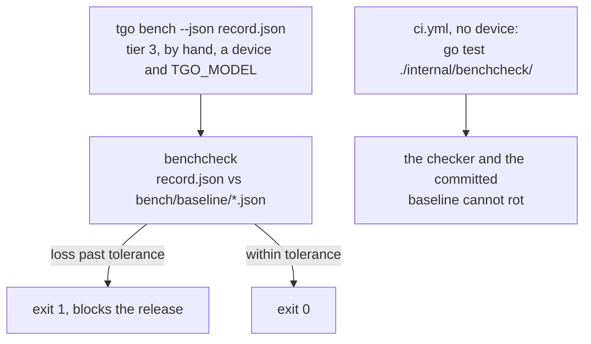

# A performance gate

[017-D6](017-benchmarks.md) says the JSON record gates regressions the way the
coverage gate works, and records that nothing reads it. This spec is the reader.

The residue is precise. `tgo bench` writes a versioned, byte-stable record
(`cmd/tgo/record.go:22`, `cmd/tgo/record.go:260`) whose own comment says it was
shaped for a checker that does not exist yet
(`cmd/tgo/record.go:206`). Neither `.github/workflows/ci.yml` nor
`.github/workflows/ci-metal.yml` runs `tgo bench`. A number nobody enforces
drifts, and this one has drifted since Wave 4.

## 1. The gate cannot run in CI, and that is a fact about the checkpoint

The obvious plan is a step on the Metal workflow. It does not work.
[010 §4](010-conformance.md) puts real weights in tier 3, which is never in CI,
and [000 §8](000-decisions.md) is why: the smallest Qwen3 is over a gigabyte,
and a CI that downloads one is a CI nobody runs locally. `ci-metal.yml` has a
device and no checkpoint. `ci.yml` has neither, and its CPU backend is
**108.8 seconds per decode step** on Qwen3-0.6B ([017 §4.1](017-benchmarks.md)),
so a 128-step run there is close to four hours.

A synthetic checkpoint does not rescue it. `cmd/tgo`'s fixture is two layers
over a vocabulary of 112 (`cmd/tgo/helpers_test.go:32`) and its bench test drives
a fake engine (`cmd/tgo/bench_test.go:180`). A benchmark of that measures the
harness.

So the gate goes where the checkpoint already is:



Tier 3 blocks a release ([010 §4](010-conformance.md)), so the gate blocks a
release. What CI gains is the half that needs no device: the checker's own
tests, which is where a checker actually rots, and a parse of the committed
baseline against this build's schema.

## 2. The checker

A `benchcheck` subcommand of `latere.ai/x/ci-gate`, not a program in this
repository.

**This section was rewritten on 2026-08-30.** It used to say
`internal/benchcheck`, modelled on `internal/covercheck` and citing it by line
number (both since deleted). Those files are gone: the gates left this repository, and a spec whose
plan is to copy something deleted is a plan nobody can follow. What the
original argued for survives, because it was never about where the code sat.

What is copied from the coverage gate, because it is what makes that one
readable:

- **thresholds carry the term that produced them**, next to the number rather
  than in a commit message;
- **exemptions are declared with a reason and printed on every run**, and the
  reason is the value, so an entry cannot exist without one;
- **one line per measured thing**, a leading `FAIL` on the ones that failed,
  and a summary naming the number that was missed;
- **a gate that measured nothing fails** rather than passing green.

Those four are `ci-gate`'s
[`specs/001-gate-principles.md`](https://github.com/latere-ai/ci-gate/blob/main/specs/001-gate-principles.md)
D3 and D4, so `benchcheck` inherits them rather than restating them, and the
thresholds and exemptions live in this repository's `.lateregate.yaml` the way
every other gate's do. That is D2, and it is the reason the checker can be
shared while the numbers stay tgo's.

What does not carry over is the old note about `main`. The question it settled
-- whether the checks live in `main` where a test cannot reach them, or in
functions the coverage gate measures -- is settled for every `ci-gate`
subcommand already: the logic is in a package, `main` is flag parsing, and
[`CONTRIBUTING.md`](../CONTRIBUTING.md)'s requirement that a checker be
negative-tested is met there rather than argued for here.

What is still tgo's, and is the reason this spec exists rather than an issue on
`ci-gate`: the axes, the baseline format, and the tolerances. A throughput
regression is a claim about this engine on a stated device, and no shared tool
can hold that.

Its failure message is the coverage gate's, with the axis in place of the package. The
shape is the point below and the numbers are not a measurement: some are
[017 §4.1](017-benchmarks.md)'s and the rest are invented to show the columns.

```
FAIL decode tokens/second      17.97 -> 15.10     -16.0%  (n=128, tolerance 10%)
FAIL decode step p50           54.2ms -> 63.9ms   +17.9%  (n=128, tolerance 10%)
ok   resident                  1.19 GiB -> 1.19 GiB  0.0%  (arithmetic, tolerance 0%)
     decode step p99           76.5ms -> 91.2ms   +19.2%  (n=128, report only)
     warm ttft p50             169ms -> 171ms      +1.2%  (n=1, below minSamples 20)
     decode share              host 0.6% submit 3.3% device 94.6% readback 1.4%
                            -> host 0.6% submit 3.2% device 94.8% readback 1.4%
     accel v0.4.1 -> v0.5.0, go1.27.0 -> go1.27.1

2 of 3 gated axes lost more than their tolerance
```

The `accel` line is there because `cmd/tgo/env.go:35-39` stamps the accel
revision precisely so a checker can tell "tgo got slower" from "accel changed",
and that distinction decides whether the next step is a commit here or an issue
upstream.

## 3. Where the baseline lives

**A committed JSON record under `bench/baseline/`,** named for the conditions it
was taken under, for example `bench/baseline/qwen3-0.6b-f16-metal.json`.

| where | failure mode |
| --- | --- |
| **a committed file** | it needs a deliberate update commit, and it drifts: the machine that produced it ages, and a baseline three months old measures a different macOS as much as a different tgo |
| a CI artifact from the last green run on main | the gate depends on artifact retention, so it starts failing on an infrastructure fact rather than on a regression. It is also unavailable to the person running the tier-3 gate on a laptop, which is the only place the gate runs |
| a released record | releases are cut rarely, so the baseline is a milestone old and the first run after one reports a wave of accumulated change as a single regression, with nothing to attribute it to |

The committed file wins because its failure mode is the only one that is
visible. A stale baseline shows as a date in a diff and a `git log` on one path.
A missing artifact shows as a red build with no cause.

Drift is contained rather than tolerated. The record carries
[017-D4](017-benchmarks.md)'s full conditions, so the checker can refuse a
comparison it should not make. See §7.

## 4. Which axes gate, and which only report

A regression in a number nobody can act on stops a build for nothing. Two rules
decide, and neither is a hand-written list of axes.

**Rule one: an axis gates only when its sample count clears `minSamples = 20`.**
`bench.Quantiles` carries `N` for exactly this reason: a p99 over four samples
is not a p99, and a reader cannot see that from the number
(`bench/report.go:25-30`). The percentile is a nearest-rank pick from the sorted
sample (`bench/report.go:184-189`), so at small `n` the reported value moves a
whole sample per observation added and is a property of the sample size.

Today this rule does real work. `measure` runs one `Generate` for the measured
window (`cmd/tgo/bench.go:221`), so the record holds one time to first token and
`report.ttft.n` is 1: its p50, p90 and p99 are the same single draw. At
`--tokens 128` the decode terms have 128 samples each. The floor is stated at 20
because it separates those two cases in code rather than in a reviewer's head,
and any value between them would do.

**Rule two: a share is reported and never gated.** The four terms of
`report.decode.share_of_step` are fractions of a step
(`bench/report.go:41-45`), so a share can move because the axis beside it
improved. Device share rising is the shape a decode step should have
([017 §4.1](017-benchmarks.md)), not a loss. The shares are printed beside every
gated axis because they are what attributes the change, which is
[017-D1](017-benchmarks.md)'s whole purpose.

**`resident_bytes` is the exception in the other direction.** It is
`weightBytes + kv` (`cmd/tgo/info.go:154`), computed from the config and the
context, not measured. A tolerance on arithmetic would be a tolerance on
nothing, so it gates at **zero**: any growth fails. This is the axis that catches
a precision resolution or a cache dtype quietly widening, which
`cmd/tgo/info.go:326-329` says is coming.

What that produces from today's record:

| axis | JSON path | a loss is | gates |
| --- | --- | --- | --- |
| decode throughput, wall clock | `batches[].tokens_per_second` | lower | **yes** |
| decode step, modelled p50 | sum of `batches[].report.decode.{host,submit,device,readback}.p50_ns` | higher | **yes**, `n=128` |
| resident | `batches[].resident_bytes` | higher | **yes**, at zero |
| decode step p90, p99 | the same four terms at `p90_ns`, `p99_ns` | higher | report |
| prefill terms | `batches[].report.prefill.*` | higher | by rule one, from `report.prefill.host.n` |
| warm time to first token | `batches[].report.ttft.p50_ns` | higher | report, `n=1` |
| cold open, cold first token | `batches[].cold.open_ns`, `.first_token_ns` | higher | report, one observation each |
| the four shares | `batches[].report.decode.share_of_step` | neither | report, by rule two |
| instrument throughput | `batches[].report.decode.tokens_per_second` | lower | report |

**Every comparison is one-sided, in that axis's own direction.** A throughput
that rose 40% and a step time that fell 40% are both wins, and a gate that
fired on either would be a check for equality with extra steps.

The modelled step p50 is the sum of the four terms at that percentile, which is
the definition `cmd/tgo/record.go:380` already renders and the reason it is a
modelled step rather than a step that happened. Gating it beside the wall-clock
throughput is deliberate: the two are correlated by construction, and they
disagree exactly when there is time in the run that the instrument does not
account for, which is a finding rather than a duplicate gate.

Rule one also means spec 027 changes what gates without changing this code. A
batched path that issues many requests per run raises `report.ttft.n` past 20,
and the time to first token starts gating on the day it becomes measurable.

## 5. The tolerance

A tolerance chosen so the current run passes is not a tolerance. This one is the
measured run-to-run spread of the machine the gate runs on, and it is produced
by the same command that produces the baseline.

For $R = 5$ runs of an axis with values $x_1 \dots x_R$, the tolerance is the
peak-to-peak spread as a fraction of the worst run, rounded up to a whole
percent and clamped:

$$s = \left\lceil 100 \cdot \frac{\max_i x_i - \min_i x_i}{\min_i x_i} \right\rceil, \qquad
\tau = \min(25,\ \max(3,\ s))\ \%$$

**Below the floor**, the tolerance claims a precision that five runs cannot
estimate. **Above the ceiling**, the band is more than half of the largest
effect this instrument has ever been used to report, which is the **43%**
throughput change one accel fix produced ([017 §4.1](017-benchmarks.md)). An
axis that noisy cannot see a change worth reporting, so it does not gate: past
the ceiling **an axis loses its gate rather than gaining a wider band**, and it
moves to report-only in the source with the measured spread in the comment.

That is [`CONTRIBUTING.md`](../CONTRIBUTING.md)'s rule and
[010-D3](010-conformance.md)'s applied to a gate instead of a test. A tolerance
raised to make a run pass is a finding, not a fix. When a run fails and the
answer looks like a wider band, the finding goes in
[011 §5](011-sequencing.md).

**The values shipped in the first commit are provisional and are stated as
such**, because no run-to-run spread has ever been measured in this repository.
Every number in [017 §4.1](017-benchmarks.md) and [011 §4](011-sequencing.md) is
a single run.

| axis | provisional | what replaces it |
| --- | ---: | --- |
| decode throughput, wall clock | 10% | the $R=5$ spread from the first baseline commit |
| decode step, modelled p50 | 10% | the same |
| resident | 0% | nothing. It is arithmetic |

10% is not evidence, it is a starting band chosen to sit well inside the
smallest effect the instrument has been used to report. The first baseline
commit replaces it with the measured number and records both in its message.

## 6. Accepting a deliberate loss

A trade recorded in a spec must not be blocked by a lint. The mechanism is
the coverage gate's: a map keyed by axis and valued by the reason, printed on
every run whether or not it fired. It lives in `.lateregate.yaml` rather than
in the checker's source, for the reason `ci-gate`'s D2 gives -- the numbers are
tgo's and the checker is shared.

```go
// accepted maps a gated axis to the decision that traded it away.
//
// Short on purpose, and every entry dies when the baseline is next updated:
// after the update the loss is in the baseline and the entry gates nothing.
var accepted = map[string]string{
	"decode_tokens_per_second": "018-D3: a hybrid cache is per layer type, and the recurrent scan costs decode throughput. 011 §5 has the number",
}
```

**The reason must name a decision id.** The checker refuses an entry whose
reason contains no `NNN-D<n>`, which is what turns "recorded in a spec" from a
convention into something a program checks. It is the same shape the spec linter's
`scoped_ids` rule uses on the decision tables themselves.

Rejected: a command-line flag such as `-allow=decode_tokens_per_second`. A flag
lives in a workflow file or in one person's shell history and leaves no record
of who decided or why. Rejected also: a field in the record. The record is
generated output, and a policy written into generated output is a policy that
the next run overwrites.

The vacuity guard comes across unchanged. If every gated axis is exempt or
absent, the run gated nothing and **that is a failure, not a green build**;
it is `ci-gate`'s D4. It is the shape this repository was in
at M0 and the shape a half-updated axis list produces.

## 7. What the checker refuses to compare

Two refusals, both stated by name rather than absorbed into a number.

**A schema mismatch.** The record's version is `tgo.bench/1`
(`cmd/tgo/record.go:22`), and its comment already states the requirement: a
checker that meets a record it does not understand has to be able to say so
rather than compare fields that moved. If either record's `schema` differs from
the `recordSchema` this build was compiled against, the checker exits with both
strings in the message and the command that regenerates the baseline:

```
benchcheck: the baseline is schema "tgo.bench/1" and this build writes
"tgo.bench/2". Fields moved between them, so a comparison would compare
different things. Regenerate: see specs/028-performance-gate.md §8
```

Rejected: compare the fields the two versions share. A field that moved reads as
a regression, or worse as a pass, and the pass is the one nobody investigates.

**A conditions mismatch.** [017-D4](017-benchmarks.md) makes every number
qualified by the conditions it was produced under, so a baseline from another
machine is not a baseline. The checker requires equality on
`conditions.hardware.accel_backend`, `conditions.hardware.device`,
`conditions.model.architecture`, `conditions.model.parameters`,
`conditions.precision.chosen`, `conditions.memory.context`,
`conditions.sampling_policy` and `conditions.prompt.measured_tokens`, and
refuses by naming the field that differs and both values.

`conditions.environment.go_version` and `conditions.environment.accel_version`
are the deliberate exceptions. They are expected to differ, and refusing on them
would refuse every upstream bump, which is the one comparison this gate exists
to make. They are printed instead, and a gated loss beside a changed
`accel_version` is what routes the report to
[accel](https://github.com/golang-design/accel) rather than to a commit here.
That is [C20](010-conformance.md) as a workflow: the submit cost was found by
comparing two runs that differed in exactly one accel revision.

## 8. Producing and updating the baseline

On a machine with a device and a checkpoint, five runs, then one commit.

```sh
export TGO_MODEL=/path/to/Qwen3-0.6B
for i in 1 2 3 4 5; do
  go run ./cmd/tgo bench \
    --device metal --precision f16 --context 4096 \
    --prompt-tokens 128 --tokens 128 --warmup 8 \
    --temp 0 --seed 0 \
    --json /tmp/bench-$i.json "$TGO_MODEL"
done
go run ./internal/benchcheck -spread /tmp/bench-1.json /tmp/bench-2.json \
  /tmp/bench-3.json /tmp/bench-4.json /tmp/bench-5.json
```

`-spread` prints the per-axis $\tau$ of §5, the clamp it hit, and which of the
five runs is the median on the gated axes. Copy that one to
`bench/baseline/qwen3-0.6b-f16-metal.json`. The tolerance in the source is then
transcribed from a measurement rather than guessed, and the baseline is a run
that happened rather than an average of runs that did not.

`--precision f16` is pinned rather than left at `auto`
(`cmd/tgo/bench.go:43`), because `auto` resolves against the machine and
`resident_bytes` gates at zero. `--temp 0` is greedy, which
[006-D3](006-sampling.md) makes bit-exact across runs on one device, so the
sampler contributes no variance to the five.

Checking a candidate, which is the tier-3 gate itself:

```sh
go run ./cmd/tgo bench --device metal --precision f16 --context 4096 \
  --prompt-tokens 128 --tokens 128 --warmup 8 --temp 0 --seed 0 \
  --json /tmp/candidate.json "$TGO_MODEL"
go run ./internal/benchcheck \
  -baseline bench/baseline/qwen3-0.6b-f16-metal.json /tmp/candidate.json
```

Read the exit status, not the output. [`CONTRIBUTING.md`](../CONTRIBUTING.md)
has the incident: a gate behind a pipe reports the pipe's result, and a run that
died before reaching the failing thing prints nothing and reads as green.

**Updating the baseline is how a deliberate loss lands for good.** Copy the new
record over the old one in the same commit as the change that produced it, say
in the message which axis moved and by how much, and delete the `accepted` entry
that covered it. The diff shows the numbers, because the record is indented for
exactly that reason (`cmd/tgo/record.go:253-259`).

## 9. What CI runs, and what it cannot

**No new workflow job, and no `tgo bench` step anywhere.** `ci-metal.yml` has the
device and cannot have the checkpoint, and `ci.yml` has neither, which is §1.

What CI does run is `-check-baseline`, reached as a test rather than as a step.
`TestCommittedBaselineParsesAtThisSchema` decodes every record in
`bench/baseline`, requires its `schema` to equal this build's `recordSchema`,
and requires every gated axis to be present and non-zero. It compares nothing,
so it needs neither a device nor a second record.

That test is reached by `go test ./...`, which `ci.yml`'s `test` job runs on
three operating systems, which its `coverage` job runs again with a profile, and
which [`CONTRIBUTING.md`](../CONTRIBUTING.md)'s local gate list already has. A
separate job would run the same assertion a fourth time on a runner that adds
nothing to it.

It belongs to `ci.yml` and not to `ci-metal.yml`. `ci-metal.yml` sets
`TGO_REQUIRE_METAL=1` so that a missing device is a failure rather than a skip
(`.github/workflows/ci-metal.yml:19`), and a check that opens no device would be
promising a backend it does not use.

**An empty `bench/baseline` fails.** Between the commit that lands the checker
and the commit that lands the first baseline, the directory has no records, and
a check over no records gated nothing. That is §6's vacuity guard at the
directory level and it is a failure rather than a green build,
which is `ci-gate`'s D4 again. It is also what keeps the two commits
close together, since the second one is what turns the build green.

What this catches is the failure §7 describes arriving silently: the record
shape changes, nobody regenerates the baseline, and the tier-3 gate finds out on
release day.

## 10. What this spec does not own

- **Instrumenting the batched path.** `report.ttft.n` is 1 because one request
  runs per measurement, and raising it is spec 027's work. This spec states the
  rule that makes those axes gate when they become measurable, and adds no code
  for them.
- **The vLLM and sglang comparison.** It stays in [017 §3](017-benchmarks.md)
  and [017 §4](017-benchmarks.md) rule 1, scheduled by
  [011](011-sequencing.md). This gate compares tgo against tgo. A row against
  another framework is a different claim, with a different set of conditions to
  hold equal.
- **The performance history.** The Markdown table still goes to
  [011 §5](011-sequencing.md) at each milestone
  ([017 §5](017-benchmarks.md)). This gate reads the JSON beside it.
- **Attributing a loss upstream.** The checker prints the four shares and the
  accel revision. Filing is [`CONTRIBUTING.md`](../CONTRIBUTING.md)'s sequence
  and a row in [010 §2](010-conformance.md).
- **The record's shape.** No field of `benchRecord` moves. If one has to, that
  is a `tgo.bench/2` and §7 is what happens next.

## 11. Scope

One person, one pass:

| artefact | size |
| --- | --- |
| `internal/benchcheck/benchcheck.go` | axis extraction, comparison, the refusals, the report. Takes a decoded record, returns findings |
| `internal/benchcheck/main.go` | flags `-baseline`, `-check-baseline`, `-spread`, and the exit status. Nothing else |
| `internal/benchcheck/benchcheck_test.go` | the table in §12, over fixture records built in the test |
| `bench/baseline/qwen3-0.6b-f16-metal.json` | produced by §8 on the release machine, in the commit after the checker |

No workflow file changes, and nothing in `bench`, `cmd/tgo` or the record
changes. The record is already
versioned, already byte-stable, and already carries its conditions, which is
what [017-D6](017-benchmarks.md) shaped it for.

## 12. Tests

A checker that passes vacuously is the failure it exists to catch, so it is
negative-tested ([`CONTRIBUTING.md`](../CONTRIBUTING.md)). Fixtures are built in
the test rather than read from disk, except the one that reads the committed
baseline.

| test | what it asserts |
| --- | --- |
| `TestRegressionPastToleranceFails` | a gated axis 16% below the baseline at a 10% tolerance exits non-zero and names the axis, both values and the tolerance |
| `TestRegressionInsideTolerancePasses` | the same axis 4% below passes, so the gate is not a check for equality |
| `TestGainOnAThroughputAxisPasses` | `tokens_per_second` 40% **above** the baseline exits zero |
| `TestGainOnALatencyAxisPasses` | the decode step p50 40% **below** the baseline exits zero. The pair catches a sign error, which passes one of them and fails the other |
| `TestIncompatibleBaselineVersionIsRefused` | a baseline whose `schema` is `tgo.bench/2` against a build writing `tgo.bench/1` exits non-zero with **both** version strings in the message and compares no field |
| `TestConditionsMismatchIsRefusedByField` | a baseline taken on a different `hardware.device` is refused, naming the field and both values, rather than compared with a wider band |
| `TestAccelVersionDifferenceIsPrintedNotRefused` | a record differing only in `environment.accel_version` is compared, and both revisions appear in the output |
| `TestResidentGrowthFails` | one byte more of `resident_bytes` fails. Zero tolerance on arithmetic |
| `TestReportOnlyAxisNeverFails` | a p99 four times the baseline's exits zero and still appears in the output |
| `TestLowSampleAxisDoesNotGate` | an axis with `n=1` is report-only however far it moved, and one with `n=20` gates |
| `TestShareMoveNeverFails` | `share_of_step` moving from 82% device to 95% exits zero. Rule two |
| `TestAcceptedLossPassesAndPrintsItsReason` | an axis in `accepted` past its tolerance exits zero, and the reason and the decision id are in the output |
| `TestAcceptedEntryWithoutADecisionIdIsRefused` | an `accepted` reason with no `NNN-D<n>` fails at startup, before any comparison |
| `TestEveryGatedAxisExemptFailsVacuously` | a run where every gated axis is exempt or absent exits non-zero, saying the gate would pass over nothing |
| `TestMissingBaselineNamesTheCommandThatWritesOne` | a baseline path that does not exist fails with §8's command in the message |
| `TestMalformedRecordIsRefused` | a truncated or non-JSON record fails with the path and the decode error, and never as a zero measurement |
| `TestSpreadReportsThePerAxisTolerance` | `-spread` over five fixture records prints $\tau$ per axis and names the clamp where the floor or the ceiling bound it |
| `TestCheckBaselineOverAnEmptyDirectoryFails` | `-check-baseline` over a directory with no records exits non-zero, saying it checked nothing. The state between the checker's commit and the first baseline's |
| `TestCommittedBaselineParsesAtThisSchema` | `-check-baseline` over `bench/baseline` passes. This is §9's whole CI surface, a test rather than a job so `go test ./...` carries it |

## Decision record

| id | decision | rejected | consequence |
| --- | --- | --- | --- |
| 028-D1 | `benchcheck` is a `ci-gate` subcommand whose comparisons are functions over a decoded record, which `main` only calls | a program in this repository, the way the coverage gate was before the gates moved out | the checker is measured by the 90% floor and negative-tested where it lives, and tgo's `.lateregate.yaml` holds the axes and tolerances. **Amended 2026-08-30:** the original said `internal/benchcheck`; that home no longer exists |
| 028-D2 | the baseline is a committed JSON record under `bench/baseline/` | a CI artifact from the last green run on main; a released record | the gate needs a deliberate update commit and the baseline drifts with the machine, and both are visible in a diff. The artifact's failure mode is a red build caused by retention, and the release's is a wave of change reported as one regression |
| 028-D3 | an axis gates only when its sample count clears `minSamples = 20`, and a share never gates | a hand-written list of gating axes | `report.ttft.n` is 1 today (`cmd/tgo/bench.go:221`), so a single draw cannot fail a build, and spec 027's batched path makes it gate with no code change |
| 028-D4 | the tolerance is the measured five-run spread on the release machine, clamped to [3%, 25%], and past the ceiling an axis loses its gate | a fixed number chosen so the current run passes; widening a band when a run fails | a tolerance is transcribed from `-spread` rather than argued, and the pressure when a gate fails goes to [011 §5](011-sequencing.md) as a finding, per [010-D3](010-conformance.md) |
| 028-D5 | the gate is tier 3, run by hand before a release, and CI runs only the checker's own tests, one of which parses the committed baseline | a `tgo bench` step on `ci-metal.yml`; benchmarking the synthetic fixture in CI; a dedicated CI job for the baseline parse | [000 §8](000-decisions.md) keeps the checkpoint out of CI and the runner has none, so a gate there would measure a two-layer fixture or nothing. What CI does gate is the part that rots silently: the checker and the committed baseline's schema |
| 028-D6 | a deliberate loss is accepted by an entry in an `accepted` map in the source whose reason names a decision id | a `-allow=<axis>` flag; a field in the generated record | the trade is reviewed in a diff beside the code that caused it, and "recorded in a spec" is checked rather than assumed. A flag leaves no record of who decided, and a record field is overwritten by the next run |
| 028-D7 | a schema mismatch refuses the comparison, naming both version strings and the command that regenerates the baseline | comparing the fields both versions carry | `cmd/tgo/record.go:17-22` already states this requirement and nothing acted on it. A moved field reads as a regression, or as a pass, and the pass is the one nobody investigates |
| 028-D8 | conditions that decide the numbers must match, and `go_version` and `accel_version` must not | refusing on any condition difference; comparing across machines with a wider band | a baseline from another device is refused by field name rather than absorbed, and an accel bump is still comparable, which is what `cmd/tgo/env.go:35-39` stamps the revision for and how [C20](010-conformance.md) was found |
