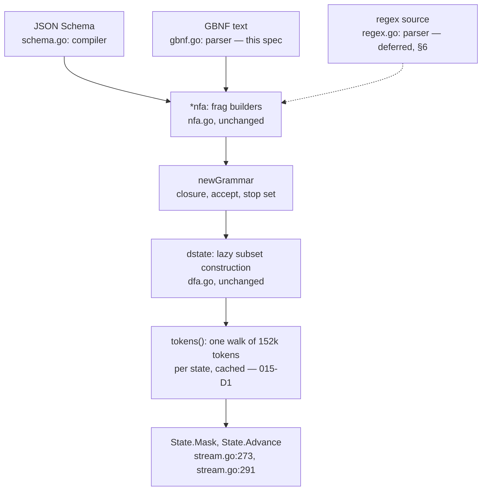

# Grammar front ends

[015-D3](015-structured-output.md) has two halves and one shipped. The JSON
Schema half is built: `internal/grammar` compiles a schema to a per-step token
mask at 97.8% statement coverage, `Model.CheckSchema` (root `schema.go:90`)
refuses one it cannot compile before a session exists, and `stream.go:273`
applies the mask before the draw. [015 §4](015-structured-output.md) scopes a
general EBNF surface and it is not built.

This spec owns that second half. The claim it rests on, and §3 is the proof, is
that the state machinery is **already front-end neutral**: the byte NFA, the
lazy subset construction, the per-state vocabulary walk and the mask are one
machine that never mentions JSON Schema. So this is a parser, not a second
engine.

It also owns one thing 015 does not answer. `response_format: {"type":
"json_object"}` is accepted, reaches no grammar, and is reported through
`X-Tgo-Loss` (`server/schema_test.go:137`). That is a third front end with no
grammar behind it. §7 gives it one or refuses it.

## 1. What is already there



Everything below `newGrammar` is written and tested. Everything above it is one
parser per dialect. The schema parser is the only one that exists.

## 2. The dialect

There is no single EBNF. Two candidates, and they are not close.

**GBNF**, llama.cpp's grammar format, is what the ecosystem writes and what a
caller is likely to paste. It has character classes (`[a-z]`, `[^"\\]`),
postfix repetition (`*`, `+`, `?`), alternation with `|`, grouping, and rules
written `name ::= body`.

**ISO 14977 / W3C EBNF** is what a spec author writes. ISO 14977 has **no
character-class syntax at all**: a terminal is a quoted string, and `[ ... ]`
means an optional group rather than a set of characters. A byte-level automaton
is nothing but character classes. `nfa.class` takes byte ranges
(internal/grammar/nfa.go:104), and `unescaped` spells well-formed UTF-8 as nine
`brange` alternatives (internal/grammar/json.go:87). In ISO 14977 that is 26
quoted literals for `[a-z]`, and one code point is an enumeration nobody writes
by hand: the two-byte UTF-8 alternative alone is 30 lead bytes against 64
continuation bytes. The dialect that cannot spell the machine's own alphabet is
the wrong dialect for this machine.

**029-D1: GBNF.** A grammar written in ISO or W3C EBNF is a **parse error**, not
a silent acceptance: `;` as a rule terminator, `,` as concatenation and `=` as
definition are all unexpected tokens, reported with line, column, and what was
expected. 015-D4's discipline is that a construct not consumed is refused rather
than dropped, and a dialect is the same rule one level up.

The subset this front end reads is **tgo's**, defined in this spec and in the
parser's tests, rather than "whatever llama.cpp accepts today". A grammar file
is caller input, and a definition that tracks another project's parser is a
definition nobody can check.

## 3. The boundary

The seam is exact and the code is already on the right side of it.

| in `internal/grammar` | what it is | changes? |
| --- | --- | --- |
| `brange`, `edge`, `nfa`, `frag`, and the builders `state`, `link`, `closure`, `empty`, `lit`, `class`, `cat`, `alt`, `opt`, `star`, `rep`, `size` (nfa.go) | the machine: a Thompson automaton over bytes | no |
| `dstate`, `encodeSet`, `intern`, `stepLocked`, `tokens`, `mergeStop` (dfa.go) | the machine: lazy determinization and 015-D1's per-state token cache | no |
| `Vocab`, `Pieces`, `Options`, `Grammar`, `State`, `Start`, `States`, `Builds`, `Accepting`, `Done`, `Allowed`, `Mask`, `Advance`, `ErrNoToken`, `ErrDone`, `NotAllowedError` (grammar.go) | the machine: the surface a decode loop uses | no |
| `compiler`, `annotations`, `unsupported`, `consumed`, `fields`, `value`, `checkKeywords`, `ref`, `anyOf`, `literals`, `lengths`, `object`, `property`, `array`, `unboundedItems`, `encodeString` (schema.go) | the JSON Schema front end | no |
| `ws`, `tok`, `digit`, `integer`, `number`, `jsonString`, `stringChar`, `escaped`, `hex4` (json.go) | the JSON lexical layer, a front end detail | no |
| `unescaped`, `cont` (internal/grammar/json.go:76, :87) | the UTF-8 rune spelling — an **alphabet** fact, not a JSON fact | splits, §3.2 |
| `Compile` (internal/grammar/grammar.go:144) | schema-specific, and it also builds the `Grammar` | splits, §3.1 |
| `maxStates` and its check (internal/grammar/schema.go:38, :191) | a bound on the machine, placed in the front end | moves, §4 |
| `UnsupportedError` (internal/grammar/grammar.go:62) | the refusal, rendered in schema words | generalises, §3.3 |

**029-D2: four small refactors, no new engine.** Nothing in nfa.go or dfa.go is
touched. The four are below and each is mechanical.

### 3.1 Split `Compile`

`Compile` (internal/grammar/grammar.go:144) builds a `compiler`, calls it, and
then builds the `Grammar` from the resulting `frag`. The second half is shared
by every front end. It becomes:

```go
func newGrammar(n *nfa, root frag, v Vocab, opt Options) (*Grammar, error)
```

carrying the vocabulary check, the stop-id validation, `closure`, `intern` and
the state bound. `Compile` keeps its signature and its meaning. `CompileGBNF`
and, later, `CompileRegex` sit beside it. No behaviour changes.

### 3.2 Move the UTF-8 spelling off `compiler`

`unescaped` (internal/grammar/json.go:87) is Unicode 15 table 3-7 as byte
ranges: the well-formed UTF-8 encodings of one code point. Eight of its nine
alternatives are the multi-byte ones and carry nothing JSON-specific. The ninth
is the ASCII line, and that one is JSON's, because it holes out the quote, the
backslash and the C0 controls (internal/grammar/json.go:89).

§6's `.` needs the nine with no holes at all, and a negated class needs them
with different holes. So the builder moves from a method on `*compiler` to a
builder on `*nfa` taking the ASCII ranges it should admit, and `unescaped`
becomes one call with JSON's three holes. That is where it belongs:
internal/grammar/nfa.go:8 already says the alphabet is the byte and well-formed
UTF-8 is spelled out rather than assumed.

### 3.3 Generalise `UnsupportedError`

`UnsupportedError.Path` is documented as a JSON Pointer and `Error()` renders an
empty `Path` as `"the root schema"` (internal/grammar/grammar.go:73). A GBNF
refusal reported through it would say "schema" about a grammar. `Path` becomes
"where in the input": a JSON Pointer from the schema front end, a rule name from
the GBNF one.
The empty-path rendering becomes the front end's word, supplied at construction.
`SchemaError` gains the same treatment or a sibling, on the same argument.

### 3.4 Move the state bound onto the `nfa`

§4.

## 4. Bounds

A schema is caller input arriving over HTTP. A grammar is the same input and
strictly more expressive, so the bounds matter more, not less.

Two constants exist today. **`maxRepeat = 1024`**
(internal/grammar/schema.go:22) bounds a count the caller wrote down, because
`nfa.rep` (`internal/grammar/nfa.go:165`) has no registers and spells "at most n
more" as n nested optionals — one copy of the sub-automaton per unit.
**`maxStates = 1 << 16`** (internal/grammar/schema.go:38) bounds the whole
automaton, because a count bound cannot see `$ref` fan-out: `compiler.seen` is a
cycle detector and not a memo, deliberately, so two siblings that both `$ref`
one `$defs` entry compile it twice and a chain doubles per level. The comment
records the measurement: **315,333 states at depth 12 from a schema of a few
hundred bytes**.

**029-D3: both constants stay, and the state check moves onto the `nfa`.** GBNF
has the identical fan-out with a different spelling — a rule referenced from n
places is inlined n times, and nested references multiply — so a bound written
into each parser would be the same argument made three times, wrong the third
time. `nfa.state()` (`internal/grammar/nfa.go:50`) refuses to grow past the
limit, returns a dead sink, and sets a sticky `over` flag. `link` and the
edge-appending builders no-op once it is set, which is the half that makes this
a memory bound and not only a refusal: without it a front end that kept walking
would keep appending to `eps[sink]` and `move[sink]` with no new state to trip
on. `newGrammar` reads the flag once and refuses. Every front end is then
bounded whether or not it knows the bound exists, which is what
internal/grammar/schema.go:34 already argues for `value()` being the single
recursion point. Each parser additionally reads `over` at its own recursion
point, one bool, to stop walking input it will refuse — the existing check at
internal/grammar/schema.go:191 becomes that read. `maxRepeat` stays where the
count is read, because only the parser that read the number can name the keyword
or the operator that carried it.

**Why the bound is where it is.** It is not a memory heuristic. The chain is
three links:

1. `maxStates` bounds NFA states.
2. NFA states bound how many distinct `dstate`s can be interned, because a
   `dstate` is a subset of them keyed on its sorted encoding
   (`internal/grammar/dfa.go:50`).
3. Each `dstate` reached for the first time costs **one walk of the entire
   vocabulary** — 152k tokens, each stepped byte by byte (`tokens`,
   `internal/grammar/dfa.go:109`).

So a caller who can drive many reachable states drives many full vocabulary
walks. The cost is CPU during decoding, not only memory at compile, and it is
paid on the request path. $2^{16}$ states is above every real grammar measured
and far below what a few hundred bytes of adversarial input reaches.

**The refusal names the shrink.** For a grammar it is the GBNF wording of
internal/grammar/schema.go:193: a rule referenced from more than one place is
compiled once per reference, so factoring the repeated ones is what shrinks it.
The message carries the constant as a number, so the caller reads a budget
rather than a crash.

## 5. Recursion and ambiguity

These are usually named together and only one of them is a problem.

**Recursion is refused.** GBNF is a context-free grammar format. This machine
has no stack: `dstate` is a set of NFA states and nothing else
(internal/grammar/dfa.go:22). So a rule that reaches itself, through any number
of intermediate rules and in any position, has no bound on nesting and its
language is not regular. It is refused, by the same house rule and for the same
reason as a recursive `$ref` (internal/grammar/schema.go:338).

**029-D4** keeps 015's rule that a refusal names the construct that stopped it.
The message carries, in this order: the rule the compilation entered, the cycle
as a rule path in the order it was walked (`expr -> term -> factor -> expr`),
and the obstruction — a rule that contains itself has no bound on nesting, so
its language is not regular and this automaton has no stack. Not "unsupported":
the caller's next move is to rewrite the recursion as a repetition where that is
possible, and to send a schema where it is not, and neither is guessable from
"unsupported".

**This is conservative and the spec says so.** A right-linear recursion
(`list ::= item "," list`) generates a regular language and is refused anyway. A
detector for it is real work — right-linear, left-linear and mixed are three
cases, and mixing them in one rule set is the non-regular one — so it is
deferred rather than done badly. The cost is concrete and belongs in the
decision row: arbitrarily-nested JSON is not a regular language, so every
grammar for it needs recursion and every one is refused — the same fact §7 turns
on, reached from the grammar side instead of the schema side.

**Ambiguity costs nothing and is not refused.** A determinized state is a *set*
of NFA states (`dstate.set`, `internal/grammar/dfa.go:22`), interned on the
sorted encoding of that set (`intern`, `internal/grammar/dfa.go:61`). Two
alternatives that both match a prefix are both live in the set, and the mask is
the union of what either can read. The subset construction is what handles
ambiguity, and it is already written. No grammar is refused for being ambiguous,
and no disambiguation rule is needed, because a mask asks which bytes may come
next and never asks which parse produced them.

## 6. Regex

**029-D5: its own parser over the same machine, not a translation into GBNF, and
not this scope.**

A regex is not an EBNF grammar text. Translating one into GBNF and then into the
NFA loses precisely the parts that matter here: `\d`, `\w`, `\p{L}` and a
negated class are byte-range sets, and GBNF's character-class syntax cannot
express a negated set over well-formed UTF-8 without enumerating it. The
translation would also make every refusal report a construct the caller did not
write. So the regex parser builds `frag`s directly, exactly as the schema
compiler does, and shares `nfa`, `dfa` and the mask with both other front ends.

**029-D6: fully anchored, and rune-counted.** Two rules, and both exist because
the machine is over bytes while a regex author thinks in runes.

- **Anchoring.** The pattern matches the **whole** output. There is no prefix
  and no suffix, so a leading `^` and a trailing `$` are accepted and are
  no-ops, and one appearing anywhere else is refused by name. The alternative —
  ECMA-262's unanchored `pattern` semantics, where `a` matches `xay` — has no
  meaning for a mask: an unanchored pattern admits any output at all, because
  every string is a prefix of one containing a match, and the mask would
  constrain nothing while appearing to.
- **Unicode.** `.` compiles to §3.2's UTF-8 builder, one code point as its
  well-formed byte encoding, and never to `[\x00-\xff]`. A negated class
  excludes its members and admits every other well-formed code point, so
  overlong encodings, encoded surrogates and code points above U+10FFFF stay
  inadmissible — the argument internal/grammar/json.go:82 already makes. A
  repetition `{m,n}`
  counts **runes**, because each repetition of the UTF-8 builder is exactly one
  code point, which is the same property internal/grammar/json.go:58 relies on
  for `minLength`.
  `maxRepeat` bounds `n`.

## 7. `json_object`

Today: `{"type": "json_object"}` sets no `Policy.Schema`, the request runs, and
`response_format.json_object` appears in `X-Tgo-Loss`
(`server/schema_test.go:144`).

**029-D7: it keeps the loss entry and gets no grammar.**

"Any JSON value" is not a regular language, which the schema front end already
says twice — a boolean schema and a schema with no `"type"` are both refused
with "it admits any JSON value, which may nest without bound and is therefore
not a regular language" (internal/grammar/schema.go:197, :248). The only regular
approximation is JSON nested at most $k$ deep, for a $k$ the caller never wrote
and cannot see. A document that stops at depth $k$ because tgo chose $k$ is a
wrong answer returned with a nil error, which is the failure 015 exists to make
impossible.

The stronger argument is [009 §4](009-server.md)'s own criterion: a field is
advisory if a request with it and a request without it produce the same tokens.
`json_object` satisfies that today. Giving it any grammar moves it from the
advisory row to the refuse row without the caller asking, and a caller who sent
the older spelling of "please emit JSON" did not ask to be refused.

Refusing it outright is the other rejected option and it is worse: it is a field
OpenAI clients send constantly, tgo would 400 a request it can serve, and 009 §4
puts a refusal in the "changes the answer" row, which this does not.

What the caller gets instead is the tool to say what they meant. With §2's front
end, "JSON to depth 8" is a grammar they can write and tgo can bound, rather
than a depth tgo guesses. The `X-Tgo-Loss` entry stays exactly as it is, and
`TestJSONObjectModeRunsAndIsReported` stays green unchanged.

## 8. The wire surface

None of the three dialects tgo serves defines a grammar member. `schemaField`
(`server/adapt.go:114`) enumerates what each one calls its schema —
`response_format`, `output_format`, `text.format` — and `honouredHere`
(`server/loss.go:104`) enumerates every wire name any route applies. Neither
list has a grammar in it, so any spelling tgo picks would be tgo's own.

**029-D8: library-only. `Policy.Grammar` and `Model.CheckGrammar`, no wire
field.** The shape mirrors 015-D5 exactly: one `Policy` field carrying the
grammar source and its dialect, and one `Model` method that performs the same
compilation early so a caller can refuse before allocating. `Model.grammar`
(root `schema.go:101`) and its bounded cache (root `schema.go:30`) take
the grammar keyed the same way, for the same reason — the key is caller-supplied
bytes, so the map is bounded.

Rejected: a `response_format: {"type": "grammar", ...}` extension, and a
top-level `grammar` member of the kind other servers have added.
[009 §4](009-server.md)'s contract is that a field tgo does not honour is
reported, and tgo cannot report on a field it invented and no caller sent. A spelling
chosen now is a compatibility promise made before one grammar has been compiled
from a request. 000-D10 keeps the surface small, and a wire field is the easy
half to add later.

**This is not free, and the consequence is checkable.** `honoured`
(`server/loss.go:40`) maps a `Policy` field to the wire names that set it, and
`TestEveryPolicyFieldIsHonoured` reflects over `Policy` and fails on a field the
map does not name. `Policy.Grammar` has no wire name. It gets an entry with an
empty wire list, and the test learns that an empty list means "library-only, no
route sets it" rather than "somebody forgot" — one named table, so the next
library-only field is one edit and not a puzzle. `Policy.check`
(`policy.go:182`) refuses `Grammar` with `Stop` on 015-D9's argument unchanged,
and refuses `Grammar` with `Schema`, because two masks over one logits row is
two languages and neither one is the answer.

`server/adapt.go` needs no change, and the reason is worth one clause because
015-D9 refuses a schema at **two** layers — `mapSchema`
(`server/adapt.go:86`) and `Policy.check` — while `Grammar` gets only the
second. Library-only means there is no wire path to refuse at. The first layer
arrives with the wire field, if it ever does.

## 9. Scope

**One person, one pass, for §2 through §5, §7 and §8.** That is: the GBNF
parser, the cycle detector, the four refactors of §3, the bound of §4,
`Policy.Grammar`, `Model.CheckGrammar`, and the tests below. `json_object` is a
decision plus a test that an existing behaviour did not change.

**§6 is a second scope and it should be a second spec.** The regex parser is a
parser, a class syntax, a negated-class construction over UTF-8, the anchoring
rule, and the rune-counting proof — comparable in size to §2 on its own. It also
carries work §2 does not: unlocking `pattern`, `patternProperties` and
`propertyNames` in the schema front end, each of which is a second front end
embedded inside the first. The decisions are made here because they constrain
§3.2's refactor. The build is not.

## Tests

Every test below lives in `internal/grammar` against a `Pieces` vocabulary
(`internal/grammar/grammar.go:38`) unless the row says otherwise. That is where
the machine is, and a fake engine cannot exercise a byte walk.

| test | asserts |
| --- | --- |
| `TestGBNFDocumentParsesUnderItsGrammar` | end to end: a grammar, a vocabulary, and a generation driven by `Mask`, `Advance` and a sampler that always picks the highest admissible id. Every generated byte string parses under the grammar it was constrained by, checked by an independent matcher rather than by the same automaton |
| `TestGBNFStopIsAdmissibleExactlyWhenComplete` | a stop id is admitted where the input is a complete sentence and refused everywhere else, so a grammar cannot end mid-sentence (`Options.Stop`, `mergeStop`, `internal/grammar/dfa.go:159`) |
| `TestGBNFAmbiguousGrammarMasksCorrectly` | a grammar whose alternatives share a prefix admits the union of both continuations at the shared prefix, and only the surviving one after they diverge. §5's claim that ambiguity costs nothing |
| `TestGBNFRecursionIsRefusedNamingTheCycle` | `UnsupportedError.Construct` names a recursive rule and `Why` contains the cycle as a rule path in walk order. Direct, indirect and right-linear recursion are three cases and all three refuse |
| `TestGBNFDialectMismatchIsAParseError` | an ISO 14977 grammar is refused with line, column and the unexpected token, and not partially accepted |
| `TestGBNFStateBoundRefuses` | a grammar of a few hundred bytes whose rule references fan out past `maxStates` is refused, the message carries the constant, and `Grammar.States()` never exceeds it. The sink and the no-op edges make both hold for a front end that ignores its own `over` read |
| `TestGBNFRepeatBoundRefuses` | `{0,100000}` is refused naming the operator and `maxRepeat`, before any copy is built |
| `TestSchemaFrontEndIsUnchanged` | the whole existing `internal/grammar` suite passes with no edits after §3's refactors. §3's claim is that the machine does not change, and a diff to a schema test would falsify it |
| `TestNFAStateBoundIsEnforcedByTheMachine` | a front end that allocates past the limit gets the sink and the `over` flag, and `newGrammar` refuses. Proves the bound is on the `nfa` and not on a parser's discipline (§4) |
| `TestGrammarWithStopOrSchemaIsRefused` | root package: `Policy.check` refuses `Grammar` beside `Stop`, and beside `Schema`, each naming both fields |
| `TestEveryPolicyFieldIsHonoured` | `server`, existing: extended so `Policy.Grammar`'s empty wire list is accepted as library-only and a missing entry still fails |
| `TestJSONObjectModeRunsAndIsReported` | `server`, existing, unchanged: `json_object` sets no schema, runs, and is reported. §7's decision is that this test does not change |

Property tests extend `property_test.go`'s existing shape: for a randomly
generated non-recursive grammar and a random admissible walk, every prefix the
mask admits extends to a complete sentence, and no sentence the mask produces
fails the independent matcher.

## What this spec does not own

- **The regex front end's implementation.** §6 decides its shape and defers its
  build (§9).
- **`pattern`, `patternProperties` and `propertyNames`.** All three are refused
  today with a message promising "the EBNF path, which comes second (015-D3)"
  (internal/grammar/schema.go:57, :72, :73). Under §9's split they stay refused
  after this spec lands, and their messages are **wrong the day it lands** —
  they point at a path that arrived and did not fix them. Re-pointing them at
  the regex scope is that scope's first edit, and until then this list is the
  record.
- **A pushdown machine.** Recursion is refused (§5), not approximated. A stack
  would change `dstate` and every claim in §3's table.
- **Tuple schemas.** `prefixItems` (internal/grammar/schema.go:80) is
  expressible in this machinery and unbuilt, and it is the schema front end's
  work, not a front end of its own.
- **The wire spelling for a grammar** (§8), and any `ir.Request` member for one.
- **Where the mask is applied.** `stream.go:273` and 015-D2 are unchanged: a
  grammar masks in the same place a schema does, before the penalties.
- **Device-side masking.** [015 §3](015-structured-output.md) keeps it on the
  host and says why, and nothing here is a conformance entry.

## Decision record

| id | decision | rejected | consequence |
| --- | --- | --- | --- |
| 029-D1 | GBNF is the dialect; another EBNF is a parse error with line and column | ISO 14977 / W3C EBNF | ISO has no character-class syntax and this machine's alphabet is the byte, so `[a-z]` is 26 quoted literals and one UTF-8 code point is several hundred. The subset read is tgo's own and is defined here, not by another project's parser |
| 029-D2 | four small refactors put a second parser on the existing machine | a second engine; a copy of nfa.go per front end | nfa.go and dfa.go are untouched, `Compile` keeps its signature, and `TestSchemaFrontEndIsUnchanged` fails if the machine moved |
| 029-D3 | `maxStates` moves onto `nfa.state()` as a hard sink plus a sticky flag; `maxRepeat` stays in whichever parser reads the count | a bound per front end; a byte-length bound on the grammar text | every front end is bounded whether or not it knows the bound exists. A length bound cannot see fan-out — 315,333 states from a few hundred bytes, measured (internal/grammar/schema.go:26) — and each reachable state costs one 152k-token vocabulary walk on the request path (internal/grammar/dfa.go:109), so this is a CPU bound as much as a memory one |
| 029-D4 | every rule cycle is refused, naming the cycle as a rule path | a right-linear recursion detector; a pushdown machine | conservative and stated as such: `list ::= item "," list` is regular and refused anyway. The cost is real and bounded: arbitrarily-nested JSON is not regular, so every grammar for it needs recursion and every one is refused. That is the same no-stack fact §7 turns on for `json_object`, reached from the grammar side |
| 029-D5 | regex is its own parser over the same machine | a regex-to-GBNF translation; regex as GBNF sugar | `\d`, `\w` and a negated class are byte-range sets GBNF cannot spell over well-formed UTF-8, and a translation would report constructs the caller never wrote |
| 029-D6 | a regex is fully anchored, `.` is one UTF-8 code point, and `{m,n}` counts runes | ECMA-262's unanchored `pattern` semantics; a byte-wise `.` | an unanchored pattern admits every output, because every string is a prefix of one containing a match, so it would constrain nothing while appearing to. Rune counting comes free from the UTF-8 builder, which internal/grammar/json.go:58 already relies on |
| 029-D7 | `json_object` keeps its `X-Tgo-Loss` entry and gets no grammar | a depth-bounded permissive JSON grammar; a 400 | "any JSON" is not regular, and a document cut at a depth tgo chose is a wrong answer with a nil error. By 009 §4's own criterion the mode is advisory today, and any grammar moves it to the refuse row without the caller asking. §2's front end is how a caller says "JSON to depth 8" themselves |
| 029-D8 | library-only: `Policy.Grammar` plus `Model.CheckGrammar`, no wire field | a `response_format: {"type": "grammar"}` extension; a top-level `grammar` member | neither `schemaField` (server/adapt.go:114) nor `honouredHere` (server/loss.go:104) has a grammar in it, so any spelling is tgo's own, and 009 §4 requires an unhonoured field to be reported — tgo cannot report a field it invented. 000-D10 keeps the surface small. The cost is checkable: `honoured` (server/loss.go:40) needs a library-only entry, and `Policy.check` refuses `Grammar` with `Stop` and with `Schema` |
