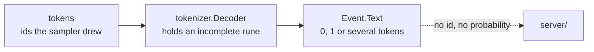

# Logprobs

`logprobs` and `top_logprobs` are accepted on all four routes, reported as an
advisory loss, and served by nothing. [009](009-server.md)'s Outcome carried
them as its own until 2026-08-28, when writing it out found they are not: the
obstruction is [007 §1](007-engine.md)'s surface, and this spec owns the change.

## 1. Why the server cannot do it alone

`sample.Sampler.Probs` already returns the post-policy distribution without
consuming a draw ([006-D7](006-sampling.md)). Nothing calls it, and the server
cannot: **a logprob is per token and a `tgo.Event` carries decoded text.**



A byte-level vocabulary splits most non-ASCII characters across several tokens
([002 §6](002-tokenizer.md)), so the decoder holds back a valid-but-incomplete
prefix. One `Event` can therefore be the tail of one token, one whole token, or
several — and it carries no id and no probability. `Policy` has no field to ask
for them either.

## 2. The shape: a side accessor, not a field on the event

**030-D1: `Stream.LogProbs()` returns what the last `Next` produced.**

```go
// TokenProb is one token and what the sampler's distribution gave it.
type TokenProb struct {
    ID      int         // the token id
    Text    string      // TextBytes(ID) as a string; empty for a control token
    LogProb float64     // ln p, and math.Inf(-1) for a token the policy masked
    Top     []TokenProb // the Policy.TopLogProbs most likely, descending; Top is nil in these
}

// Policy
LogProbs    bool  // report the drawn token's logprob
TopLogProbs int   // and this many alternatives per step; 0 for none

// Stream
func (s *Stream) LogProbs() []TokenProb
```

It reads like `Usage()` and `StopReason()`, which are already side accessors on
the stream, and it leaves two things alone that a field on `Event` would not:

| | why it matters |
| --- | --- |
| `Event` keeps its four fields | a `BlockStart` would otherwise carry an empty `[]TokenProb` that means something different from a text delta's empty one |
| the `EventKind` set does not grow | [009 §3.2](009-server.md) maps kinds one-to-one onto the blocks the wire dialects encode, and a kind that is not a block breaks that mapping for every consumer's switch |

**The slice is the tokens of the last step**, which is normally one. It is a
slice and not a value because a prefill emits no token and a future batched step
may emit more than one, and a caller reading a length is a caller that does not
have to change when either happens.

**It is valid until the next `Next`.** The stream reuses the backing array, for
the same reason [017-D3](017-benchmarks.md) gives about instruments: a
per-token allocation in the decode loop is a cost the measurement imposes on
what it measures. A caller keeping them appends.

## 3. Which distribution, and the answer that is not obvious

**030-D2: the post-policy distribution — the one the token was actually drawn
from.**

[006 §3](006-sampling.md) composes bias, penalties, temperature, then top-*k*
and top-*p*. `Probs` returns the distribution after all of it, normalized over
what survived. So for a policy with $\mathcal{K}$ the kept set:

$$
p(v) = \frac{\exp\!\left((\ell_v + b_v)'/\tau\right)}{\sum_{u \in \mathcal{K}} \exp\!\left((\ell_u + b_u)'/\tau\right)}
\quad v \in \mathcal{K},
\qquad p(v) = 0 \quad v \notin \mathcal{K}
$$

with $(\cdot)'$ the penalised logit. The alternative — reporting the raw softmax
over the untruncated vocabulary — describes a distribution **nothing sampled
from**, and would tell a caller a token had a 3% chance when top-*k* had already
given it zero.

**A masked token's logprob is $-\infty$**, and that is the honest value rather
than a floor. Three things reach it: a token outside the top-*k* or the nucleus,
a token a grammar masked ([015-D2](015-structured-output.md) adds $-\infty$
before the penalties), and every non-argmax token under `Temperature: 0`, where
the distribution is one at the argmax. It is never the *drawn* token's value,
because the draw walks the kept set.

**§4 says what the wire does with it**, since JSON has no infinity.

## 4. The wire, and the loss table

`logprobs` comes **off** the loss tables: `server/loss.go`'s `honoured` set
gains it, which `server/loss_test.go`'s reflect test pins against the `Policy`
field. A field that is served and still reported as a loss is worse than one
that was never claimed.

| route | shape |
| --- | --- |
| `/v1/chat/completions` | `choices[].logprobs.content[]`, one entry per token with `token`, `logprob`, `bytes`, `top_logprobs` |
| `/v1/completions` | `choices[].logprobs` with the parallel `tokens`, `token_logprobs`, `top_logprobs` arrays it has always declared and answered `null` for |
| `/v1/messages` | Anthropic's IR carries none, so it stays a loss **on that route only** — which is what [009-D12](009-server.md)'s per-dialect subtraction exists to express |
| `/api/chat`, `/api/generate` | ollama carries none; a loss on those routes for the same reason |

**$-\infty$ encodes as JSON `null`.** Not as a large negative number, which a
consumer would average; not as the string `"-Infinity"`, which is not JSON.
`null` is what "this token could not be drawn" means, and it is what the field
already answers today for every token.

## 5. The cost, and why it is off by default

`Probs` copies the logits and runs the whole policy a second time: a
vocabulary-length `exp` pass, over $V = 151936$, per step. That is real next to
a decode step and it buys nothing for a caller who did not ask, so
`Policy.LogProbs` is false by default and the work is skipped entirely.

`Top` costs one selection of `TopLogProbs` over the same weights, which is
[006](006-sampling.md)'s `topN` and is not a second sort.

**It runs on the same logits the draw used, before `Next` consumes them.** The
stages write in place, so the order in `Stream.advance` is: grammar mask, then
`Probs` on a copy, then `Next`. Taking it after the draw would read logits the
policy has already rewritten, and taking it before the mask would report a
distribution the grammar had not yet cut.

## 6. Tests

| test | what it catches |
| --- | --- |
| the drawn token's `LogProb` is $\ln$ of its post-policy probability, against a float64 oracle | §3, and the difference between the two distributions |
| a token top-*k* excluded reports $-\infty$, and the drawn token never does | §3's masked case |
| under `Temperature: 0` the argmax reports $\ln 1 = 0$ and any other token $-\infty$ | the greedy branch, which is where a raw-softmax implementation would disagree most visibly |
| a grammar-masked token reports $-\infty$ | §5's ordering: taking `Probs` before the mask would report a positive probability for a token the grammar forbids |
| `Top` is descending, has length `TopLogProbs`, and its entries have nil `Top` | §2 |
| `LogProbs()` is empty when `Policy.LogProbs` is false, and `Probs` is not called | §5 |
| the same seed produces the same completion with and without `LogProbs` | [006-D7](006-sampling.md): an observation that perturbed what it describes would not be describing it |
| `logprobs` is absent from `X-Tgo-Loss` on the two OpenAI routes and present on the other three | §4, and the per-dialect table |
| a $-\infty$ encodes as `null` on both OpenAI routes | §4 |

## Decision record

| id | decision | rejected | consequence |
| --- | --- | --- | --- |
| 030-D1 | a side accessor on `Stream` | a field on `Event`; a new `EventKind` | `Event` keeps meaning one thing, and 009 §3.2's kind-to-block mapping stays one-to-one |
| 030-D2 | report the **post-policy** distribution | the raw softmax over the untruncated vocabulary | the number describes the distribution the token was drawn from; a raw softmax describes one nothing sampled |
| 030-D3 | $-\infty$ for a masked token, `null` on the wire | a floor, or omitting the entry | a floor is a number a consumer averages; omitting breaks the per-token parallel arrays the legacy shape declares |
| 030-D4 | off by default, and the pass is skipped | always compute and let the caller ignore it | a whole-vocabulary `exp` per step is what [017-D3](017-benchmarks.md) calls an instrument that changes what it measures |
