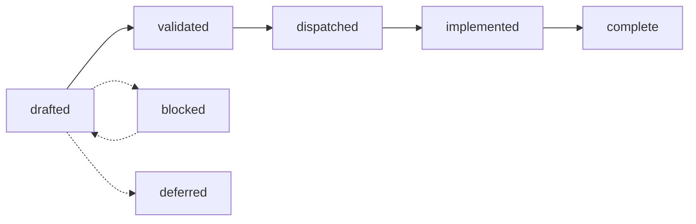

# tgo specs

**Audience: contributors.** These are design documents — decisions, the
alternatives that were rejected, and the reasoning — written before the code and
kept honest afterwards. Documentation for people *using* tgo lives in
[`../docs/`](../docs/) and is written for a different reader.

Start with [000-decisions.md](000-decisions.md). It is normative: a spec here
that contradicts it is wrong, and the fix is to change 000 first.

## How this works

Spec-driven, with decision records. Nothing is implemented before the spec that
owns it is written and the decision that shapes it is recorded.

### The lifecycle



| status | means |
| --- | --- |
| `drafted` | written; the decisions are stated; not yet reviewed against the code |
| `validated` | reviewed; the shapes it names exist or are agreed |
| `dispatched` | ready to build; dependencies are complete |
| `implemented` | code landed; outcome not yet recorded |
| `complete` | outcome recorded in [011](011-sequencing.md), deviations named |
| `blocked` | correct as written, unbuildable now; `blocked_on` says what by |
| `deferred` | deliberately not now; the trigger to revisit is stated |
| `living` | edited after its subject ships; only [011](011-sequencing.md) |
| `normative` | binds everything else; only [000](000-decisions.md) |

### Frontmatter

```yaml
title: "One line, stating the tension the spec resolves"
status: drafted
layer: load | text | graph | engine | api | all
depends_on: [ "000-decisions.md" ]
blocked_on: [ "accel specs/040-batch-scheduler.md" ]   # blocked only
```

### Decision records

Every spec ends with a **Decision record** table: an id (`004-D3`), the
decision, what was **rejected**, and the consequence. Cross-cutting decisions
that bind more than one spec live in [000](000-decisions.md) instead, numbered
`D1`–`D10`, with their reasoning inline.

A decision with no rejected alternative is not a decision; it is a description,
and it does not belong in the table. Decision ids are stable and are cited from
code comments and from other specs.

### Changing a decision

Amend the record in place with the new reasoning and a note of what changed. Do
not delete the old row: the value of a decision record is that a later reader
can see what was considered, and a table that only ever holds the current answer
teaches nobody why the obvious thing was not done.

## The tree

| spec | status | what it owns |
| --- | --- | --- |
| [000](000-decisions.md) | normative | the ten decisions everything is built on |
| [001](001-weights.md) | drafted | safetensors, dtype conversion, transposition, quantization policy |
| [002](002-tokenizer.md) | drafted | byte-level BPE, specials, streaming decode |
| [003](003-chat-template.md) | drafted | chat rendering, and why user text cannot forge a turn |
| [004](004-model-graph.md) | drafted | `nn` blocks, the registry, the Qwen3 forward pass |
| [005](005-kv-cache.md) | drafted | the contiguous KV cache, and what it costs |
| [006](006-sampling.md) | drafted | composition order, and reproducibility as a stream |
| [007](007-engine.md) | drafted | sessions, plans, buckets, the decode loop |
| [008](008-scheduler.md) | drafted | continuous batching: slots, admission, eviction |
| [009](009-server.md) | drafted | three wire dialects over one neutral request |
| [010](010-conformance.md) | drafted | **what tgo proves about accel**, and the register of gaps |
| [011](011-sequencing.md) | living | build order, and what actually landed |
| [012](012-gguf.md) | **blocked** | GGUF, and the kernel accel must register first |
| [013](013-distribution.md) | implemented | fetching checkpoints, and the cache |
| [014](014-jinja.md) | deferred | a Jinja subset, and when it becomes right |
| [015](015-structured-output.md) | implemented | schema-constrained decoding |
| [016](016-prefix-cache.md) | drafted | reusing the KV of a prompt somebody already paid for |
| [017](017-benchmarks.md) | drafted | measuring where a token's time goes, and comparing honestly |
| [018](018-hybrid-models.md) | drafted | Qwen3.8-27B's linear-attention layers, and the operator they now have |
| [019](019-session-affinity.md) | implemented | cross-request prefix reuse with no page table: pool the sessions |


## Where the work stands

**tgo serves.** Seventeen packages, a CLI, and three wire dialects over one
model: a checkpoint is fetched, loaded, rendered, tokenized, run, sampled and
streamed, with schema-constrained output and prefix reuse across the turns of a
conversation. [011 §2](011-sequencing.md) is the order,
[011 §2.1](011-sequencing.md) is what is gated upstream, and
[011 §4](011-sequencing.md) is where outcomes are recorded as they land.

What it is not yet is a server that batches: requests interleave rather than run
in one step, so total throughput is close to what one conversation gets. That is
[008](008-scheduler.md), and as of 2026-08-27 the page-table port it named as
its prerequisite is built — so what is left of it is §2 and §3, slots and
admission, which are pure policy over a graph that pages.
[008 §8](008-scheduler.md) is the order that work goes in.

The one thing to know before reading further: **no spec in this tree is blocked
upstream.** accel closed fifteen of the eighteen gaps tgo filed, including the
three that decided the shape of this tree — a KV cache capped at 128 positions,
a missing batch axis, and the ragged step that lets a prefill chunk share a
dispatch with decodes. [018](018-hybrid-models.md) was the last one blocked and
`tensor.LinearAttention` unblocked it.

What is still open is narrower: an f16 cache on the *ragged* path
([C22](010-conformance.md)), a bf16 GEMM ([C7](010-conformance.md), narrowed to
the GEMM alone), a decode step whose submit cost is amortised
([C20](010-conformance.md)), GGUF's K-quants ([C17](010-conformance.md), not
planned upstream), and **4-bit weights** ([C21](010-conformance.md)).

Two of those cost something specific rather than being gaps in the abstract.
C21 blocks a target: at int8 a 27B model is 25.1 GiB and does not fit a 24 GiB
device, which is a second blocker on Qwen3.8-27B independent of its linear
attention. C22 narrows a win: the operator that makes batching possible reads an
f32 cache, so a build that batches gives back the halving
[C5](010-conformance.md) closed for.
[010 §2](010-conformance.md) is the register and
[010 §2.2](010-conformance.md) is the audit behind those states.

## The one thing to understand before contributing

tgo does not write kernels. [000 D1](000-decisions.md) makes this project
accel's validating consumer, and a patch that works around a missing accel
operator with private device code will be rejected however good it is — because
the gap it hides is the output this project exists to produce.

The path for a missing operator is: a test that names it, a row in
[010 §2](010-conformance.md), and an issue on
[accel](https://github.com/golang-design/accel) citing the owning spec.
