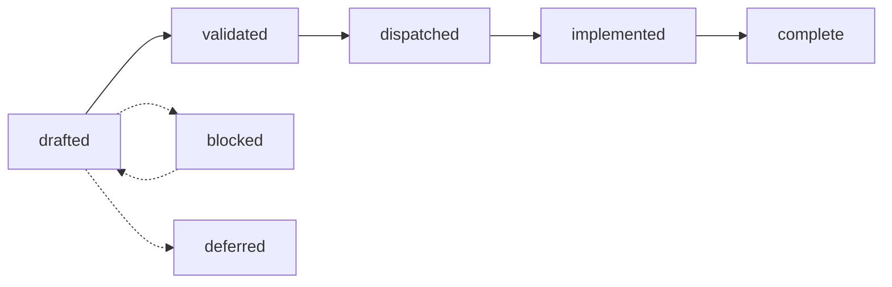
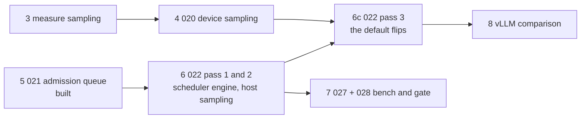
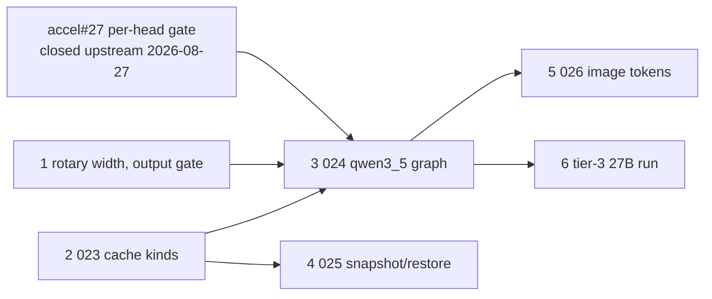

# tgo specs

**Audience: contributors.** These are design documents — decisions, the
alternatives that were rejected, and the reasoning — written before the code and
kept honest afterwards. Documentation for people *using* tgo lives in
[`../docs/`](../docs/) and is written for a different reader.

Start with [000-decisions.md](000-decisions.md). It is normative: a spec here
that contradicts it is wrong, and the fix is to change 000 first.

## How this works

Spec-driven, with decision records. Nothing is implemented before the spec that
owns it is written and the decision that shapes it is recorded.

### The lifecycle



| status | means |
| --- | --- |
| `drafted` | written; the decisions are stated; not yet reviewed against the code |
| `validated` | reviewed; the shapes it names exist or are agreed |
| `dispatched` | ready to build; dependencies are complete |
| `implemented` | code landed; the outcome is recorded and names work still open |
| `complete` | the same, and nothing in the spec's own scope is open |
| `blocked` | correct as written, unbuildable now; `blocked_on` says what by |
| `deferred` | deliberately not now; the trigger to revisit is stated |
| `record` | not a spec, so not on the lifecycle: [000](000-decisions.md) and [011](011-sequencing.md) |

`record` was two statuses until 2026-08-27 — `normative` for 000 and `living`
for 011 — which is two categories with one member each, both saying the same
thing: this file states no design, so the lifecycle does not apply to it. 000
records the decisions and 011 records what happened. The linter already
exempted both by name from the decision-record and Outcome rules; the status now
says why instead of leaving the reason in the configuration.

**A status past `dispatched` is checked, not asserted.** `make spec-lint`
requires an `## Outcome` section on every `implemented` or `complete` spec, and
requires 011 to link a `complete` one.

That rule exists because the lifecycle above was written and then not run.
Twelve specs sat at `drafted` while their subject shipped, three sat at
`implemented` with a body still describing the work in the future tense, and a
reader could not tell a spec waiting to be built from one built six waves ago.
A status nothing checks is a status nobody can trust, which is the same argument
[010-D6](010-conformance.md) makes about the register's table.

**What an Outcome section says**, in the order a reader wants it:

1. what shipped, section by section, and where the code is;
2. what **diverged** from the design, and why the code is right;
3. what is **not** built, named as work rather than left as silence.

The third part is written as a paragraph opening `**Not built.**`, and it is the
one the linter reads, because it is the one that decays. A spec whose Outcome
lists nothing open, for a subject that plainly has open work, is worse than one
still marked `drafted`.

### What separates `implemented` from `complete`

The `**Not built.**` paragraph. Under `complete` it opens with "Nothing"; under
`implemented` it does not, and `make spec-lint` fails either way round.

The first version of this rule checked the same two things of both statuses,
which made them indistinguishable — a spec passed at either. Four independent
readers auditing the same spec then split two against two on which it was, not
because the spec was ambiguous but because the tree offered them a preference
where it owed them a rule.

So a spec is `complete` when nothing it designs is unbuilt. Open work does not
disappear to earn that: it **moves to a spec that owns it**, which is why
[008](008-scheduler.md) is complete and [020](020-device-sampling.md),
[021](021-admission-queue.md) and [022](022-batched-serving.md) exist. A spec
that keeps growing an open list instead of shedding one was scoped too large,
and splitting it is the fix.

Description debt is not build debt. A shipped behaviour the spec never wrote
down is named in the Outcome and does not block `complete`; code the spec
designs and nobody wrote does.

### Frontmatter

```yaml
title: "One line, stating the tension the spec resolves"
status: drafted
layer: load | text | graph | engine | api | all
depends_on: [ "000-decisions.md" ]
blocked_on: [ "accel specs/040-batch-scheduler.md" ]   # blocked only
```

### Decision records

Every spec ends with a **Decision record** table: an id (`004-D3`), the
decision, what was **rejected**, and the consequence. Cross-cutting decisions
that bind more than one spec live in [000](000-decisions.md) instead, numbered
`D1`–`D10`, with their reasoning inline.

A decision with no rejected alternative is not a decision; it is a description,
and it does not belong in the table. Decision ids are stable and are cited from
code comments and from other specs.

### Changing a decision

Amend the record in place with the new reasoning and a note of what changed. Do
not delete the old row: the value of a decision record is that a later reader
can see what was considered, and a table that only ever holds the current answer
teaches nobody why the obvious thing was not done.

## The tree

Every status below was checked against the code on 2026-08-27, spec by spec and
section by section. The `what remains` column is the spec's own `**Not built.**`
paragraph in one line — so it has one source, not two, and a `complete` row has
nothing there by definition.

**What is built.** The subject of each has shipped; its Outcome section says
where the code is, what diverged, and what is open.

| spec | status | what it owns | what remains |
| --- | --- | --- | --- |
| [000](000-decisions.md) | record | the thirteen decisions everything is built on | — |
| [001](001-weights.md) | complete | safetensors, dtype conversion, transposition, quantization policy | — |
| [002](002-tokenizer.md) | implemented | byte-level BPE, specials, streaming decode | 002-D5's reference id vectors, which need a machine with huggingface `tokenizers` |
| [003](003-chat-template.md) | complete | chat rendering, and why user text cannot forge a turn | — |
| [004](004-model-graph.md) | complete | `nn` blocks, the registry, the Qwen3 forward pass | — |
| [005](005-kv-cache.md) | complete | the KV cache, contiguous and paged, and what each costs | — |
| [006](006-sampling.md) | complete | composition order, and reproducibility as a stream | — |
| [007](007-engine.md) | complete | sessions, plans, buckets, the decode loop | — |
| [008](008-scheduler.md) | complete | continuous batching: slots, admission, eviction, chunked prefill | — |
| [009](009-server.md) | complete | three wire dialects over one neutral request | — |
| [010](010-conformance.md) | implemented | **what tgo proves about accel**, and the register of gaps | §3's five measurements are named and none is run |
| [011](011-sequencing.md) | record | build order, what landed, and where a measurement goes | — |
| [013](013-distribution.md) | complete | fetching checkpoints, and the cache | — |
| [015](015-structured-output.md) | complete | schema-constrained decoding | — |
| [016](016-prefix-cache.md) | complete | reusing the KV of a prompt somebody already paid for | — |
| [017](017-benchmarks.md) | complete | measuring where a token's time goes, and comparing honestly | — |
| [018](018-hybrid-models.md) | complete | the two linear-attention blocks, and what a hybrid still needs | — |
| [019](019-session-affinity.md) | complete | cross-request prefix reuse with no page table: pool the sessions | — |
| [021](021-admission-queue.md) | complete | one queue in front of admission, so a full batch defers rather than refuses | — |
| [022](022-batched-serving.md) | implemented | the server drives a scheduler; batched serving becomes the default | §14's pass 3: the default flip, which waits on 020's checkpoint |
| [023](023-cache-kinds.md) | implemented | three state shapes in one forward pass, and what a block reserves | §10's six rows that need a stack running all three kinds, which is 024's graph |
| [024](024-qwen3-5-architecture.md) | implemented | the `qwen3_5` config, weight map and hybrid graph | §11's sub-scope A, small and unblocked, and sub-scope C, blocked on accel#27 |
| [030](030-logprobs.md) | complete | reporting the distribution a token was drawn from | — |

**What is next.** Six specs, each scoped to be finished in one pass. Two are the
residue of a spec above that was scoped too large: 008 shed three, of which
[021](021-admission-queue.md) is built and [022](022-batched-serving.md) is two
passes of three in; 018 shed four, of which [023](023-cache-kinds.md) is built
and [024](024-qwen3-5-architecture.md) is one sub-scope of three in; 017 shed
two, 015 shed one.

| spec | status | what it owns | from |
| --- | --- | --- | --- |
| [020](020-device-sampling.md) | drafted | the sampling policy on `tensor.Sample`, single and batched | 006, 008 |
| [025](025-recurrent-snapshot.md) | drafted | prefix reuse for a state that has no positions | 018 |
| [026](026-image-tokens.md) | drafted | a multimodal vocabulary a text-only path must not mis-embed | 018 |
| [027](027-batched-benchmarks.md) | drafted | the throughput curve 017-D5 designed and nothing measures | 017 |
| [028](028-performance-gate.md) | drafted | a build that loses throughput fails like one that loses a test | 017 |
| [029](029-grammar-front-ends.md) | drafted | EBNF and regex over the machine the schema path already built | 015 |

**Three of them judged themselves too large** and named their own passes:
[022](022-batched-serving.md) §14 and [024](024-qwen3-5-architecture.md) §11 each
cut into three, and [029](029-grammar-front-ends.md) defers regex to a spec after
it. Disclosed rather than split again, because the sub-scopes share one design.
Read those sections first: a *large* below is one spec, not one sitting.

**What is waiting.**

| spec | status | what it owns |
| --- | --- | --- |
| [012](012-gguf.md) | **blocked** | GGUF, and the kernel accel must register first |
| [014](014-jinja.md) | deferred | a Jinja subset, and when it becomes right |

## What to build next

Ordered, with what blocks what. Sizes are effort, not importance.

### Qwen3-4B dense

The code runs. What is left is two defects, proof, and throughput.

**Correctness.** All four defects the audit found are fixed, each with the test
that fails without it: an int4 load could not be staged onto a device without
unified memory; top-*k* selected on the logits where accel selects on the
softmax weights; 003-D2's warn-on-mismatch had no code path, so no checkpoint
could ever be found to disagree with the renderer; and `bench.Recorder` kept a
long completion's *first* steps while the server called them its most recent.

**Proof:**

1. **Tier-3 run on a real Qwen3-4B checkpoint**: [010](010-conformance.md) §3's
   five numbers, recorded in [011](011-sequencing.md) §4. *Large*, blocked on a
   4B checkpoint on disk. The one on hand is 0.6B, which proves the loader and
   the graph and not the footprint.
2. **CPU/Metal greedy divergence**: first differing token index and the logit
   gap. *Medium*, blocked on a Metal device in the loop;
   `internal/conformance/measure.go` is otherwise ready.

**Throughput.** This is the sequence that makes a busy server faster than an
idle one, and today `server/` imports no `Scheduler`:

3. **Measure the batched sampling path** and choose the design. *Medium*,
   **blocked on a Qwen3-0.6B f16 checkpoint on disk**: [020 §8](020-device-sampling.md)
   names that model on the machine [017 §4.1](017-benchmarks.md) already
   measured, and a curve over $B$ read off a synthetic fixture would answer a
   question about the fixture. C3 and C6 are closed, so the device path exists
   to measure against once there is something to measure it on.
4. **Device-side sampling** ([020](020-device-sampling.md)). *Large*, blocked on
   3. Its oracle is 006's host path, which is why the top-*k* fix came first.
5. **The admission queue** ([021](021-admission-queue.md)). **Built**, Wave 13.
6. **The server drives the scheduler** ([022](022-batched-serving.md)). Three
   passes ([022 §14](022-batched-serving.md)). **Passes 1 and 2 are built**,
   opt-in behind `--batched`: the scheduler engine, the driver goroutine, the
   channel-backed stream, per-slot host sampling, the per-request salt and
   reserve, `--slots`/`--kv`, and the 429 the engine's own queue raises.
   *Pass 3* flips the default and is where 4 lands, so it waits on 3's
   checkpoint.
7. **Instrument the batched path** ([027](027-batched-benchmarks.md)), then the
   **performance gate** ([028](028-performance-gate.md)), which needs a baseline
   worth committing.
8. **The vLLM and sglang comparison** under [010](010-conformance.md) §3.1's six
    rules. *Large*, blocked on 6 and on 017 §4.1's own argument that the row is
    not worth running before the served path batches.



### Qwen3.8-27B hybrid

int4 storage shipped, so the footprint is 13.4 GiB, and `nn.LinearAttention` and
`nn.DepthwiseCausalConv` both exist with value tests that pass. Most of what is
left is a graph tgo has not written.

**One upstream gap came first, was reported, and is closed.** Writing
[024](024-qwen3-5-architecture.md) found that accel's `tensor.LinearAttention`
took one gate per token with no head axis, while a gated delta network gives
each value head its own decay. Filed as [C27](010-conformance.md) /
[accel#27](https://github.com/golang-design/accel/issues/27) with a skipping
probe; accel shipped the `[tokens, heads]` gate on 2026-08-27 (its
`tensor/linear.go`), and this register was corrected on 2026-09-02, having
still called the row open. Item 3 of 024 is unblocked.

024 §4.4 left one half open — whether the gates are per head at all — and
priced it as a safetensors header read on a checkpoint nobody has. **The
checkpoint is public and the header was read on 2026-08-29**, over HTTP and
without a weight: `Qwen/Qwen3.5-27B` ships `in_proj_b` and `in_proj_a` at
`[48, 5120]` each, and $H_v = 48$. The gates are per head, so C27 was a real
block on item 3 rather than moot -- and it is lifted: nothing below waits on
accel.

An earlier note here cited ollama's `in_proj_ba` permutation as the evidence.
The conclusion was right and the artifact was a sibling's — `qwen3_5` has no
fused `in_proj_ba` — and [010-D7](010-conformance.md) is the difference: an
inference from an adjacent implementation and a measurement of the thing itself
do not close the same row.

1. **A rotary width below `head_dim`, and the output gate.** `nn.Attention`
   passes `cfg.HeadDim` as the rotary width, so `partial_rotary_factor` is
   inexpressible for the sixteen full-attention layers, and there is no
   `attn_output_gate`. Both are `nn` changes
   [024](024-qwen3-5-architecture.md) owns and does first. *Small.*
2. **Cache kinds per layer type** ([023](023-cache-kinds.md)). **Built.** §3.1's
   probe passed, so it stayed one pass: `GatherRows` over a `LayerState` view
   reads that layer, so the convolution window is flat and its slot axis is
   arithmetic in the index ports. What is left of it is the rows that need a
   stack running all three kinds, which is 3's graph.
3. **The `qwen3_5` architecture** ([024](024-qwen3-5-architecture.md)). Three
   sub-scopes ([024 §11](024-qwen3-5-architecture.md)). **B is built**: the
   config, the schedule, the refusals, the weight map and the registry entry,
   all read from `Qwen/Qwen3.5-27B`'s own `config.json` and safetensors headers.
   A is 1 above and is *small*. **C is blocked on accel#27**, and the evidence
   that it is blocked is now the target checkpoint's header rather than an
   inference from a sibling.
4. **Snapshot and restore** ([025](025-recurrent-snapshot.md)). *Medium*,
   blocked on 2. Without it a hybrid gets no prefix reuse on three layers in
   four.
5. **Image tokens on the text path** ([026](026-image-tokens.md)). *Medium*,
   blocked on 3.
6. **Tier-3 27B run.** *Large*, blocked on 3 and on a 50 GiB download: 001
   quantizes from full precision at load, so the 4-bit files the ecosystem
   publishes stay unreadable until the AWQ/GPTQ reader below exists.



### Not specced, and why

Each is a real gap with no spec. Writing one before something depends on it is
how a tree fills with `drafted` files nobody checks, which is the drift this
section exists to avoid repeating. They are listed so the absence is a decision.

**AWQ and GPTQ checkpoints.** Group 128 with a zero point, which is exactly the
shape `quant.Int4Group` and `Int4Quantize` have, so this is a reader and a plane
layout rather than a kernel. It removes "fetch 50 GiB to produce 13.4" for the
27B target, which makes it the first of these that should become a spec.
Distinct from [012](012-gguf.md), which stays blocked on a different shape: a
Q4_K super-block is two levels of scale over eight sub-blocks with a minimum
each.

**`rope_scaling`: YaRN.** [004](004-model-graph.md) §7 refuses any scaling it
does not implement, which is the right refusal and caps tgo at a checkpoint's
trained context.

**Speculative decoding.** The standard 2–3× decode win, and
[017](017-benchmarks.md) §4.1 measures decode at 94.62% device time, which is
the shape speculation attacks. Needs [020](020-device-sampling.md) and
[022](022-batched-serving.md) first: a rejected suffix unwinds both the KV cache
and the sampler's history.

**Embeddings and pooling.** `/v1/embeddings`, a pooling strategy, and an
encoder-shaped graph with no cache. A large share of what inference servers
serve, and tgo has none of it.

**LoRA adapters.** [016](016-prefix-cache.md) §10.3 records that an adapter must
reach the prefix cache key, which is what makes this more than a weight sum. It
should be written `deferred` with its trigger, the way [014](014-jinja.md) is.

**A second GPU backend.** [Issue #2](https://github.com/latere-ai/tgo/issues/2)
is the one open issue, and its design lives in accel, as
[060](https://github.com/golang-design/accel/blob/main/specs/060-cuda-bringup.md)
and [061](https://github.com/golang-design/accel/blob/main/specs/061-ptx-target.md),
because tgo authors no kernels. What is tgo's is three call sites that spell
"GPU" as Metal — `model.go:374`, `cmd/tgo/env.go:111` and
`internal/conformance/tier.go:164`, each `Prefer: []accel.Backend{accel.BackendMetal}` —
plus `tier.go:120`, which reads the backend back by name, and `options.go`'s
`Device` kind, whose `Metal` member is the value all three switch on. The fix
is not a CUDA arm in three switches: `Device` names a kind and the preference
is a list, so it becomes a spec once accel 060 has a device to open. It also
inherits one budget hazard 060 §6 measured: on a unified-memory part
`Limits.MaxPoolBytes` is host RAM, and `weights/device.go:55` picks the
precision and `cmd/tgo/serve.go:635` sizes KV admission from it.

**Multi-device.** A permanent scope boundary rather than unwritten work. It
belongs in [000](000-decisions.md) as a decision with its rejected alternative,
not as a spec that would never be built.

### One lesson worth carrying out of the register

**A capability claim over three operators is three claims.**
[C5](010-conformance.md) closed on "`ScatterRows`, prefill and paged decode all
take f16" — three true statements. The *combination* then failed twice more: at
the ragged kernel ([C22](010-conformance.md)) and at the paged prefill
([C24](010-conformance.md)), where the width and the paging selected separately
and the paging won. Closing a row on the conjunction is what a row is for.

The corollary is that **a closure can move work rather than finish it**.
[C21](010-conformance.md), 4-bit weights, closed because accel represents and
multiplies them — and `weights.Precision` named only f16 and int8, so a 27B
checkpoint was still 26.7 GiB here. That half was [001](001-weights.md)'s and
shipped the same day. [010 §2](010-conformance.md) is the register and
[010 §2.2](010-conformance.md) is the audit behind its states.


## The one thing to understand before contributing

tgo does not write kernels. [000 D1](000-decisions.md) makes this project
accel's validating consumer, and a patch that works around a missing accel
operator with private device code will be rejected however good it is — because
the gap it hides is the output this project exists to produce.

The path for a missing operator is: a test that names it, a row in
[010 §2](010-conformance.md), and an issue on
[accel](https://github.com/golang-design/accel) citing the owning spec.
