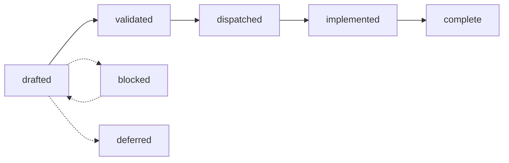

# tgo specs

**Audience: contributors.** These are design documents — decisions, the
alternatives that were rejected, and the reasoning — written before the code and
kept honest afterwards. Documentation for people *using* tgo lives in
[`../docs/`](../docs/) and is written for a different reader.

Start with [000-decisions.md](000-decisions.md). It is normative: a spec here
that contradicts it is wrong, and the fix is to change 000 first.

## How this works

Spec-driven, with decision records. Nothing is implemented before the spec that
owns it is written and the decision that shapes it is recorded.

### The lifecycle



| status | means |
| --- | --- |
| `drafted` | written; the decisions are stated; not yet reviewed against the code |
| `validated` | reviewed; the shapes it names exist or are agreed |
| `dispatched` | ready to build; dependencies are complete |
| `implemented` | code landed; the outcome is recorded and names work still open |
| `complete` | the same, and nothing in the spec's own scope is open |
| `blocked` | correct as written, unbuildable now; `blocked_on` says what by |
| `deferred` | deliberately not now; the trigger to revisit is stated |
| `living` | edited after its subject ships; only [011](011-sequencing.md) |
| `normative` | binds everything else; only [000](000-decisions.md) |

**A status past `dispatched` is checked, not asserted.** `internal/speclint`
requires an `## Outcome` section on every `implemented` or `complete` spec, and
requires 011 to link a `complete` one.

That rule exists because the lifecycle above was written and then not run.
Twelve specs sat at `drafted` while their subject shipped, three sat at
`implemented` with a body still describing the work in the future tense, and a
reader could not tell a spec waiting to be built from one built six waves ago.
A status nothing checks is a status nobody can trust, which is the same argument
[010-D6](010-conformance.md) makes about the register's table.

**What an Outcome section says**, in the order a reader wants it:

1. what shipped, section by section, and where the code is;
2. what **diverged** from the design, and why the code is right;
3. what is **not** built, named as work rather than left as silence.

The third part is written as a paragraph opening `**Not built.**`, and it is the
one the linter reads, because it is the one that decays. A spec whose Outcome
lists nothing open, for a subject that plainly has open work, is worse than one
still marked `drafted`.

### What separates `implemented` from `complete`

The `**Not built.**` paragraph. Under `complete` it opens with "Nothing"; under
`implemented` it does not, and `internal/speclint` fails either way round.

The first version of this rule checked the same two things of both statuses,
which made them indistinguishable — a spec passed at either. Four independent
readers auditing the same spec then split two against two on which it was, not
because the spec was ambiguous but because the tree offered them a preference
where it owed them a rule.

So a spec is `complete` when nothing it designs is unbuilt. Open work does not
disappear to earn that: it **moves to a spec that owns it**, which is why
[008](008-scheduler.md) is complete and [020](020-device-sampling.md),
[021](021-admission-queue.md) and [022](022-batched-serving.md) exist. A spec
that keeps growing an open list instead of shedding one was scoped too large,
and splitting it is the fix.

Description debt is not build debt. A shipped behaviour the spec never wrote
down is named in the Outcome and does not block `complete`; code the spec
designs and nobody wrote does.

### Frontmatter

```yaml
title: "One line, stating the tension the spec resolves"
status: drafted
layer: load | text | graph | engine | api | all
depends_on: [ "000-decisions.md" ]
blocked_on: [ "accel specs/040-batch-scheduler.md" ]   # blocked only
```

### Decision records

Every spec ends with a **Decision record** table: an id (`004-D3`), the
decision, what was **rejected**, and the consequence. Cross-cutting decisions
that bind more than one spec live in [000](000-decisions.md) instead, numbered
`D1`–`D10`, with their reasoning inline.

A decision with no rejected alternative is not a decision; it is a description,
and it does not belong in the table. Decision ids are stable and are cited from
code comments and from other specs.

### Changing a decision

Amend the record in place with the new reasoning and a note of what changed. Do
not delete the old row: the value of a decision record is that a later reader
can see what was considered, and a table that only ever holds the current answer
teaches nobody why the obvious thing was not done.

## The tree

Every status below was checked against the code on 2026-08-27, spec by spec and
section by section. [ROADMAP.md](ROADMAP.md) is what remains, in the order to do
it in.

**What is built.** The subject of each of these has shipped; the Outcome section
in each says where the code is, what diverged, and what is still open.

| spec | status | what it owns |
| --- | --- | --- |
| [000](000-decisions.md) | normative | the thirteen decisions everything is built on |
| [001](001-weights.md) | implemented | safetensors, dtype conversion, transposition, quantization policy |
| [002](002-tokenizer.md) | implemented | byte-level BPE, specials, streaming decode |
| [003](003-chat-template.md) | implemented | chat rendering, and why user text cannot forge a turn |
| [004](004-model-graph.md) | complete | `nn` blocks, the registry, the Qwen3 forward pass |
| [005](005-kv-cache.md) | implemented | the KV cache, contiguous and paged, and what each costs |
| [006](006-sampling.md) | implemented | composition order, and reproducibility as a stream |
| [007](007-engine.md) | complete | sessions, plans, buckets, the decode loop |
| [008](008-scheduler.md) | complete | continuous batching: slots, admission, eviction, chunked prefill |
| [009](009-server.md) | implemented | three wire dialects over one neutral request |
| [010](010-conformance.md) | implemented | **what tgo proves about accel**, and the register of gaps |
| [011](011-sequencing.md) | living | build order, what landed, and where a measurement is recorded |
| [013](013-distribution.md) | complete | fetching checkpoints, and the cache |
| [015](015-structured-output.md) | implemented | schema-constrained decoding |
| [016](016-prefix-cache.md) | implemented | reusing the KV of a prompt somebody already paid for |
| [017](017-benchmarks.md) | implemented | measuring where a token's time goes, and comparing honestly |
| [018](018-hybrid-models.md) | implemented | the two linear-attention blocks, and the index of what a hybrid still needs |
| [019](019-session-affinity.md) | complete | cross-request prefix reuse with no page table: pool the sessions |

**What is next.** Ten specs written on 2026-08-27, each scoped to be finished in
one pass. Six of them are the residue of a spec above that was scoped too large:
008 shed three, 018 shed four, 017 shed two, 015 shed one.

| spec | status | what it owns | from |
| --- | --- | --- | --- |
| [020](020-device-sampling.md) | drafted | the sampling policy on `tensor.Sample`, single and batched | 006, 008 |
| [021](021-admission-queue.md) | drafted | a queue in front of admission, so a full batch defers rather than refuses | 008 |
| [022](022-batched-serving.md) | drafted | the server drives a scheduler; batched serving becomes the default | 008 |
| [023](023-cache-kinds.md) | drafted | three state shapes in one forward pass, and what a block reserves | 018 |
| [024](024-qwen3-5-architecture.md) | drafted | the `qwen3_5` config, weight map and hybrid graph | 018 |
| [025](025-recurrent-snapshot.md) | drafted | prefix reuse for a state that has no positions | 018 |
| [026](026-image-tokens.md) | drafted | a multimodal vocabulary a text-only path must not mis-embed | 018 |
| [027](027-batched-benchmarks.md) | drafted | the throughput curve 017-D5 designed and nothing measures | 017 |
| [028](028-performance-gate.md) | drafted | a build that loses throughput fails like one that loses a test | 017 |
| [029](029-grammar-front-ends.md) | drafted | EBNF and regex over the machine the schema path already built | 015 |

**What is waiting.**

| spec | status | what it owns |
| --- | --- | --- |
| [012](012-gguf.md) | **blocked** | GGUF, and the kernel accel must register first |
| [014](014-jinja.md) | deferred | a Jinja subset, and when it becomes right |


## Where the work stands

**tgo serves.** Seventeen packages, a CLI, and three wire dialects over one
model: a checkpoint is fetched, loaded, rendered, tokenized, run, sampled and
streamed, with schema-constrained output and prefix reuse across the turns of a
conversation. [011 §2](011-sequencing.md) is the order,
[011 §2.1](011-sequencing.md) is what is gated upstream, and
[011 §4](011-sequencing.md) is where a measurement is recorded once it is taken.

**The engine batches.** `Model.NewScheduler` puts a chunked prefill and the
decodes beside it in one dispatch, so the weights are read once for all of them
— [008 §8](008-scheduler.md) is what shipped.

What is not yet true is that `tgo serve` uses it: the server pools sessions, and
a scheduler over a batch is what replaces them. Three specs now carry that,
in order: [020](020-device-sampling.md) is where sampling runs, which is a
measurement with a decision attached rather than a detail;
[021](021-admission-queue.md) is the queue in front of admission, which
[008-D9](008-scheduler.md) first assigned to [019](019-session-affinity.md)'s
`Pool` and 021-D1 relocates with the reason; [022](022-batched-serving.md) is
the server change itself.

**Twelve specs were `drafted` while their subject shipped**, and the tree said
so on 2026-08-27 rather than earlier because nothing checked it. Every status
above is now audited against the code and re-checked by `internal/speclint` on
each build, and the [lifecycle](#the-lifecycle) rule that separates the two
built statuses came out of that audit: four readers of one spec split two
against two on whether it was `implemented` or `complete`, because the tree
offered a preference where it owed them a rule.

**A spec that keeps accumulating open work was scoped too large.** Four of the
specs above shed theirs into the ten at 020 and higher rather than growing a
longer list, which is what makes `complete` reachable and what
[ROADMAP.md](ROADMAP.md) orders.

The one thing to know before reading further: **nothing in this tree is blocked
upstream, and one row of the register is open.** Every issue tgo filed is
closed, and [010 §2.2.0](010-conformance.md) is the re-audit that says which of
those closures are capabilities — because on 2026-08-24 accel closed ten issues
and four of the capabilities were still absent.

The one open row is GGUF's K-quant super-blocks
([C17](010-conformance.md)), which accel closed *as not planned* and recorded in
its kernel corpus instead. tgo accepted that: a corpus row carrying the layout
and both workarounds is a better record than an issue with no plan.

**A closure can move work rather than finish it, and the register does not
carry the half that moves.** [C21](010-conformance.md), 4-bit weights, closed
because accel represents and multiplies them — and `weights.Precision` named
only f16 and int8, so a 27B checkpoint was still 26.7 GiB here. That was
[001](001-weights.md)'s work and not accel's; it shipped the same day, and a
27B checkpoint is **13.4 GiB**. What is left of
[018](018-hybrid-models.md) is the same shape: unblocked upstream, and the graph
is 018's to write.

**Three rows closed on the same lesson**, which is the one worth carrying out of
this tree. [C5](010-conformance.md) closed on "`ScatterRows`, prefill and paged
decode all take f16" — three true statements. The *combination* then failed
twice more: at the ragged kernel ([C22](010-conformance.md)) and at the paged
prefill ([C24](010-conformance.md)), where the width and the paging selected
separately and the paging won. A capability claim over three operators is three
claims, and closing it on the conjunction is what a row is for.

[C7](010-conformance.md), the bf16 GEMM, turned out never to have been one. tgo
widens bf16 to f32 at load with a shift — exact, free, once — so a bf16 GEMM
would only let it hold bf16 on the device, which costs what f16 costs.
[010 §2](010-conformance.md) is the register and
[010 §2.2](010-conformance.md) is the audit behind those states.

## The one thing to understand before contributing

tgo does not write kernels. [000 D1](000-decisions.md) makes this project
accel's validating consumer, and a patch that works around a missing accel
operator with private device code will be rejected however good it is — because
the gap it hides is the output this project exists to produce.

The path for a missing operator is: a test that names it, a row in
[010 §2](010-conformance.md), and an issue on
[accel](https://github.com/golang-design/accel) citing the owning spec.
