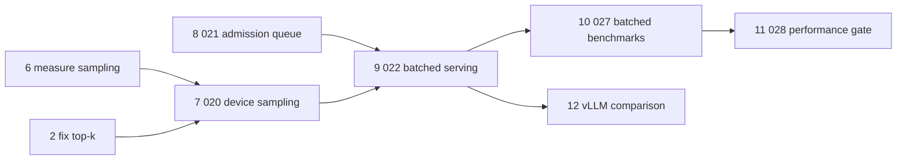
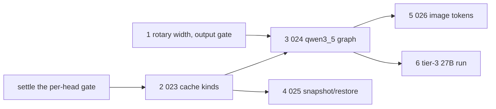

# Roadmap

**Audience: contributors.** What is left, and the order to do it in.
[README.md](README.md) is the index and the workflow; the specs own the design.
This file owns neither. It exists because an index sorted by number cannot say
what to pick up next.

Derived from a line-by-line audit of all twenty specs against the code on
2026-08-27, in which twelve specs turned out to be `drafted` while their subject
had shipped. Every claim below was checked against the code at that date. When
this file and a spec disagree, the spec is right and this file is stale.

## 1. What remains, spec by spec

Statuses are in [README.md](README.md). This is the residue each one names in
its own `## Outcome`, compressed. A spec at `complete` has none and is absent.

| spec | what remains |
| --- | --- |
| [000](000-decisions.md) decisions | nothing outstanding; thirteen decisions, four amended on 2026-08-27 against what shipped |
| [001](001-weights.md) weights | **a defect**: an int4 load fails on a device with no shared memory — `arena.stage` has no `U32` case; no `Auto`→`Int4` load test; §5.4's load-time bound check does not exist |
| [002](002-tokenizer.md) tokenizer | reference id vectors, which need a machine that has huggingface `tokenizers`; the `add_prefix_space` placement question |
| [003](003-chat-template.md) chat template | **003-D2 has no code path**: nothing reads a checkpoint's `chat_template`, so no mismatch can warn |
| [005](005-kv-cache.md) KV cache | `cacheBytes` ignores the width term, so `Info` reports f32 for an f16 pool; the layer-disjointness and stale-version tests |
| [006](006-sampling.md) sampling | **a divergence**: top-*k* selects on logits where accel selects on softmax weights; two missing tests |
| [009](009-server.md) server | `logprobs` reported as an advisory loss rather than served; 009-D14's dependency-footprint CI gate |
| [010](010-conformance.md) conformance | §3's five measurements are named and none has been run; §5.1 wants four more tolerance rows |
| [011](011-sequencing.md) sequencing | it is `living`; it is never done |
| [012](012-gguf.md) GGUF | blocked on `quant_matmul_superblock`; neither of §3's two deciding numbers has been produced, and neither needs a kernel |
| [014](014-jinja.md) Jinja | deferred; its trigger is unmet and one half of it is undetectable until 003's checksum path exists |
| [015](015-structured-output.md) structured output | `json_object` is accepted and reaches no grammar; the EBNF front end is [029](029-grammar-front-ends.md), which defers regex again to a spec after it |
| [016](016-prefix-cache.md) prefix cache | a partial hit's attention at a nonzero causal base is untested against the oracle |
| [017](017-benchmarks.md) benchmarks | the recorder drops its oldest steps and reports quantiles anyway |
| [018](018-hybrid-models.md) hybrid models | two blocks built; the graph is [023](023-cache-kinds.md)–[026](026-image-tokens.md) |

**Three of the ten new specs judged themselves too large.**
[022](022-batched-serving.md) §14 names three sub-scopes in order,
[024](024-qwen3-5-architecture.md) §11 names three, and
[029](029-grammar-front-ends.md) defers the regex front end to a spec after it.
Each is disclosed in the spec that owns it rather than split again, because the
sub-scopes share one design and splitting the design across three files costs
more than it saves. Read those sections before starting either spec: a *Large*
below is one spec, not one sitting.

## 2. Qwen3-4B dense

The code runs. What is left is proof, two defects, and throughput.

### 2.1 To call it correct

1. **Fix the int4 staging path.** `arena.stage` gains a `U32` case, or `planLoad`
   refuses `Int4` when the arena is unmapped. This is the only known correctness
   defect on the dense load path. Blocked by nothing. *Small.*
2. **Fix top-*k*.** Select on the softmax weights, matching accel's
   `(value, index)` tie rule. The case is reachable at the deep tail, which is
   where a *k* = 128 boundary over a 152k vocabulary sits. Blocked by nothing.
   *Small.* [020](020-device-sampling.md) needs the host path correct before it
   can be the oracle.
3. **Build 003-D2's warning.** Read `chat_template` from the checkpoint, hash it,
   warn naming both checksums, render anyway. *Small.* Also closes
   [014](014-jinja.md) §1's second trigger, which is undetectable without it.

### 2.2 To call it well tested

4. **Tier-3 run on a real Qwen3-4B checkpoint**: [010](010-conformance.md) §3's
   five numbers, including int8 and int4 error against `quant.Int8ErrorBound`
   and `Int4ErrorBound` on trained blocks. Recorded in
   [011](011-sequencing.md) §4. *Large.* Blocked on a 4B checkpoint on disk. The
   checkpoint on hand is 0.6B, which proves the loader and the graph and not the
   footprint.
5. **CPU/Metal greedy divergence**: the first differing token index and the logit
   gap. *Medium.* Blocked on a Metal device in the loop;
   `internal/conformance/measure.go` is otherwise ready.

### 2.3 To serve it at throughput

This is the sequence, and each step gates the next.

6. **Measure the batched sampling path** and choose the design
   ([020](020-device-sampling.md) §, the measurement gate). *Medium.* Blocked by
   nothing: conformance rows C3 and C6 are both closed, so the device path
   exists to measure against. 008 §9 wanted the number before the spec; the spec
   now states what to measure and what each answer decides.
7. **Device-side sampling** ([020](020-device-sampling.md)). *Large.* Blocked on
   6 and on step 2.
8. **The admission queue** ([021](021-admission-queue.md)). *Medium.* Blocked by
   nothing, and independent of 6 and 7 — it can run in parallel.
9. **The server drives the scheduler** ([022](022-batched-serving.md)). *Large*,
   and the spec cuts itself into three passes. Blocked on 7 and 8. This is the
   step that makes throughput scale with load; today `server/` imports no
   `Scheduler`, so a busy server is about as fast as an idle one.
10. **Instrument the batched path** ([027](027-batched-benchmarks.md)). *Medium.*
    Blocked on 9 for a serving curve, though the library-level curve can be
    measured as soon as 8 lands.
11. **The performance gate** ([028](028-performance-gate.md)). *Medium.* Blocked
    on 10 for a baseline worth committing.
12. **The vLLM and sglang comparison**, under [010](010-conformance.md) §3.1's
    six rules. *Large.* Blocked on 9, and on 017 §4.1's own argument that the
    row is not worth running before the served path batches.

## 3. Qwen3.8-27B hybrid

int4 storage shipped in Wave 10, so the footprint is already 13.4 GiB, and
`nn.LinearAttention` and `nn.DepthwiseCausalConv` both exist with value tests
that pass. Most of what is left is a graph tgo has not written.

**One upstream question is open, and it comes first.** Writing
[024](024-qwen3-5-architecture.md) turned up that accel's `tensor.LinearAttention`
takes one gate per token, with no head axis, while Qwen3.5 appears to give each
value head its own. If that reading of the checkpoint is right, the layer is not
expressible as the operator stands and 024-D4 is an upstream report rather than a
design. Settle it against a real `config.json` and `in_proj_ba`'s width before
starting item 2 — it is a day's difference at the start and a rewrite at the end.

1. **A rotary width below `head_dim`**, and the output gate.
   `nn.Attention` passes `cfg.HeadDim` as the rotary width, so
   `partial_rotary_factor` is inexpressible for the sixteen full-attention
   layers, and there is no `attn_output_gate`. Both are `nn` changes that
   [024](024-qwen3-5-architecture.md) owns and that its sub-scope A does first.
   *Small.* 011 §2.1's claim that the parameter was always there is true of
   accel's `tensor.RoPE` and false of `nn`, which is what made it look done.
2. **Cache kinds per layer type** ([023](023-cache-kinds.md)). *Large.* Blocks
   3, 4 and 5. It also carries the slots axis the convolution state does not
   have: what shipped is one slot, so single-sequence 27B does not need the axis
   and **serving** 27B does.
3. **The `qwen3_5` architecture** ([024](024-qwen3-5-architecture.md)). *Large*,
   and its §11 cuts itself into three passes: the `nn` prerequisites plus a
   checkpoint read that settles the field names and the gate question; then
   config, schedule, refusals, weight map and registry, which is executable
   today; then the block wired end to end. Blocked on 1 and 2. Nothing in
   `model/` reads `layer_types` or `full_attention_interval` today.
4. **Snapshot and restore** ([025](025-recurrent-snapshot.md)). *Medium.*
   Blocked on 2. Without it a hybrid gets no prefix reuse on three layers in
   four: a recurrent state has no positional addressing, so a prefix cannot be
   re-attended, only restored.
5. **Image tokens on the text path** ([026](026-image-tokens.md)). *Medium.*
   Blocked on 3.
6. **Tier-3 27B run.** *Large.* Blocked on 3, and on a 50 GiB download: 001
   quantizes from full precision at load, and the 4-bit files the ecosystem
   publishes are unreadable until §4's first item lands.

## 4. Not specced, and why

Each of these is a real gap. None has a spec, and writing one before something
depends on it is how a tree fills with `drafted` files nobody checks — which is
the drift this roadmap came out of. They are listed so the absence is a decision
rather than an oversight.

**AWQ and GPTQ checkpoints.** Both use group 128 with a zero point, which is
exactly the shape `quant.Int4Group` and `Int4Quantize` now have, so this is a
reader and a plane layout rather than a kernel or a representation. It is what
removes "fetch 50 GiB to produce 13.4" for the 27B target, which makes it the
first of these to become a spec. Distinct from [012](012-gguf.md), which stays
blocked on a different shape: a Q4_K super-block is two levels of scale over
eight sub-blocks with a minimum each.

**`rope_scaling`: YaRN.** [004](004-model-graph.md) §7 refuses any scaling it
does not implement, which is the right refusal and caps tgo at a checkpoint's
trained context. YaRN changes how the per-dimension frequency is computed, and
004 already binds the base as a scalar, so the change is narrow.

**Speculative decoding.** The standard 2–3× decode win, and
[017](017-benchmarks.md) §4.1 measures decode at 94.62% device time, which is the
shape speculation attacks. Needs [020](020-device-sampling.md) and
[022](022-batched-serving.md) first: a rejected suffix has to unwind both the KV
cache and the sampler's history.

**Embeddings and pooling.** `/v1/embeddings`, a pooling strategy, and an
encoder-shaped graph with no cache. A large share of what inference servers
actually serve, and tgo has none of it.

**LoRA adapters.** [016](016-prefix-cache.md) §10.3 already records that an
adapter must reach the prefix cache key, which is the interaction that makes
this more than a weight sum. It should be written `deferred` with its trigger
stated, the way [014](014-jinja.md) is, so the gap reads as a decision.

**Multi-device.** A permanent scope boundary rather than unwritten work. It
belongs in [000](000-decisions.md) as a decision with its rejected alternative,
not as a spec that would never be built.

## 5. Where to start

If you want the highest ratio of value to effort, take the three *small* items
in §2.1. Each is a defect with a known cause, each is one file plus one test, and
two of them are prerequisites of larger work.

If you want the thing that changes what tgo is, take §2.3. A server whose
throughput does not rise with load is the difference between a framework that
works and one somebody would deploy, and the four specs that close it are
written and waiting.
